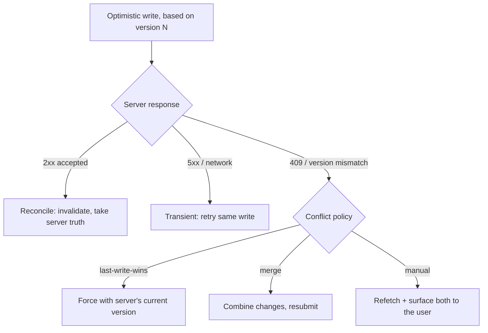

# Rollback & Conflict Resolution

> A snapshot restore undoes *your* failed write. It says nothing about the write that landed on the server between your read and your submit — and restoring a stale snapshot on top of a concurrent change is how optimistic UIs lose data.

**Part:** [03 · Application Architecture](../) · **Domain:** Data & Server State · **Priority:** Critical · **Difficulty:** Intermediate · **Reading time:** ~15 min

## TL;DR

The simple rollback from [optimistic updates](./optimistic-updates.md) — snapshot in `onMutate`, restore in `onError` — is correct only when writes don't overlap. Under concurrency it breaks two ways: two optimistic mutations on the same entity produce two snapshots, and restoring the older one silently reverts the newer one; and a value that changed on the server between your read and your write is a *conflict*, not a transient error, so blindly retrying or restoring corrupts state. Robust handling means serializing mutations that touch the same key, distinguishing a conflict (HTTP 409, or a version mismatch) from a retryable failure, and choosing a resolution — last-write-wins, merge, or ask the user — deliberately rather than by accident. Optimistic concurrency with a version or `ETag` is what lets the server *detect* the conflict in the first place.

> **Recommendation:** For overlapping writes to one entity, serialize them with a mutation `scope` and reconcile from server truth in `onSettled` rather than trusting a stale snapshot. Send a version/`If-Match` with every write so the server can reject conflicts with 409; on 409, resolve explicitly (refetch and re-apply, merge, or prompt) — never auto-retry a conflict as if it were a network blip.

## At a Glance

| | |
| --- | --- |
| **Use when** | Optimistic or concurrent writes hit the same record, or multiple clients can edit the same data. |
| **Avoid when** | Writes are serial, single-client, and can't collide — a plain snapshot rollback suffices. |
| **Alternatives** | [Optimistic Updates](#alternative-approaches) with simple rollback (correct only without overlap). |
| **Primary risk** | Restoring a stale snapshot over a newer change, or retrying a conflict and clobbering the server. |
| **Maturity** | Stable (patterns); the resolution policy is application-specific. |

## Prerequisites

- [Mutation Lifecycle](./mutation-lifecycle.md) — `onMutate`/`onError`/`onSettled` and mutation `scope` are the hook points.
- [Cache Keys & Query Identity](./cache-keys-and-query-identity.md) — rollback and reconciliation operate per exact key.

## Overview

*Rollback* is undoing a change the server didn't accept; *conflict resolution* is deciding what to do when the server rejects it because the data changed underneath you. The two are distinct. A rollback restores a known-previous state; conflict resolution reconciles two divergent states — yours and the server's — into one. The simple optimistic pattern conflates them by assuming every failure is "the write didn't happen, put it back." That assumption holds for a dropped connection. It fails when the write *did* touch a record another actor already changed.

The two hard cases are concurrency and staleness. **Concurrent client writes:** two mutations on the same entity run before either settles, each captured its own `previous` snapshot, and whichever errors last restores *its* snapshot — which predates the other mutation, reverting it. **Stale write / server conflict:** you loaded a record at version 3, edited it, and submitted; meanwhile it became version 4. A last-write-wins server silently overwrites version 4; a conflict-aware server rejects your write with `409 Conflict` because your `If-Match` no longer matches. Detecting that requires *optimistic concurrency* — sending the version you based your edit on — and resolving it requires an explicit choice, because "correct" depends on the data.

## The Problem

A shared kanban board lets two people drag cards. Alice moves card #7 to "Done" and, a second later before her request settles, moves card #12. Both mutations optimistically write the cache; each snapshots the board first. Card #7's request fails on a flaky connection and its `onError` restores *its* snapshot — the board as it was **before card #12 moved**. Card #12 jumps back to its old column on screen even though its own request succeeded. The user watched a change they made, that worked, get undone by an unrelated failure.

Now the multi-client case. Bob loads card #7's description (version 3) and starts editing. Alice edits the same description and saves (now version 4). Bob saves. A naive server takes Bob's write and overwrites Alice's — her paragraph vanishes with no error anywhere. Nobody did anything "wrong"; the system simply had no way to notice that Bob's edit was based on a version that no longer existed. Both failures come from the same root: rollback and retry logic that assumes writes are isolated, when they are not.

## Why It Matters

Optimistic UIs make concurrency visible. The moment you write to the cache before the server confirms, you have two sources of truth in flight, and the rules for merging them back are yours to define. Get them wrong and the bug class is the worst kind — silent data loss and phantom reverts that appear only under timing and only for some users, impossible to reproduce on a developer's fast, single-tab connection. These are the failures that erode trust in an app: "it lost my edit," "my change came back."

The stakes rise with every additional editor. A single-user app can often get away with last-write-wins because there is no one to conflict with. A collaborative tool cannot: without conflict detection, concurrent edits quietly destroy each other, and users learn not to trust the app with anything important. Optimistic concurrency (a version or `ETag` per record) is the cheapest mechanism that turns invisible data loss into a detectable, resolvable event — and detection is the prerequisite for any resolution policy at all. Deciding the policy deliberately, rather than defaulting to whichever write happens to land last, is what separates a robust mutation layer from one that works only in the demo.

## Mental Model

Think of each optimistic write as a bet placed against a specific prior state — the version you read. Resolving the bet has three possible outcomes, not two: it won (server accepted), it lost transiently (network/5xx — safe to retry the *same* bet), or the table changed (conflict — the bet is void and you must re-read before betting again). Treating outcome three as outcome two is the core error.



For concurrency *within* one client, the fix is to stop the overlap: give mutations that touch the same entity a shared `scope` so the cache runs them one at a time, and lean on `onSettled` invalidation — server truth — rather than a possibly-stale snapshot to land the final state. For conflicts *across* clients, the fix is detection first (send the version), then a policy. The snapshot is still useful for the transient case; it is simply not sufficient on its own.

## Best Practices

Serialize mutations that share an entity with `scope`. TanStack Query runs mutations with the same `scope.id` sequentially instead of in parallel, so two writes to card #7 don't interleave and their snapshots don't cross. This removes the "unrelated failure reverts my other change" class outright.

Reconcile from the server in `onSettled`, not only from the snapshot. The snapshot restores the transient case, but the authoritative final state is the server's. Invalidate the key on settle so the cache converges on server truth after either outcome — this also corrects a restored snapshot that has itself gone stale.

Send the version you edited with every write. Include a `version` field or an `If-Match: <etag>` header carrying the value you based the edit on. This is what lets the server return `409 Conflict` instead of silently overwriting. Without it, conflict *detection* is impossible and every resolution strategy is moot.

Distinguish a conflict from a transient failure before reacting. A 409 (or a typed conflict body) means the data moved — do not auto-retry it; that just re-submits a stale write. A network error or 5xx is retryable with backoff. Branch `onError` on the failure kind; never funnel both into "restore and retry."

Choose the resolution policy per data, and make manual resolution legible. Last-write-wins is fine for low-stakes fields (a toggle); merge suits additive data (tags, a comment list); genuinely conflicting prose needs the user. When you surface a conflict, refetch the current server value and present it — never discard the user's unsaved edit to make the conflict "go away."

## Trade-offs

Conflict-aware rollback costs a version field, sequential mutations, and a resolution policy you must design. In exchange you get correctness under concurrency that a plain snapshot rollback cannot provide. For single-client serial writes it is over-engineering; for anything collaborative it is the floor.

**Advantages**

- Concurrent writes to one entity stop reverting each other.
- Conflicts become detectable events instead of silent data loss.
- Reconciling from server truth self-heals stale snapshots.

**Disadvantages**

- Requires server support (a version/`ETag` and 409 semantics).
- Serializing mutations reduces write parallelism for the same entity.
- A real resolution policy — especially merge or manual — is genuine design work.

| Dimension | Conflict-aware rollback | Cost / caveat |
| --- | --- | --- |
| Performance | Same-entity writes serialize; unrelated ones stay parallel | A queued write waits for the one ahead |
| Complexity | Version field + branch on conflict vs transient | More states than snapshot-restore |
| Maintainability | Policy centralized per mutation | Merge/manual logic is application-specific |
| Failure behavior | Detects conflicts; reconciles to server truth | Needs a chosen policy or it degrades to last-write-wins |

## Alternative Approaches

The alternative is the plain optimistic pattern: snapshot and restore, no version, no conflict handling. It is correct and simpler — until writes overlap or multiple clients edit the same data, at which point it silently loses changes.

| Approach | Best when | Weakness | See |
| --- | --- | --- | --- |
| Conflict-aware rollback (this article) | Concurrent or multi-client writes to shared records | Needs server versioning + a resolution policy | (this article) |
| [Optimistic Updates](./optimistic-updates.md) with snapshot rollback | Serial, single-client writes that can't collide | Reverts concurrent changes; can't detect conflicts | `Optimistic Updates · Data & Server State` |
| Pessimistic write (wait, then invalidate) | Correctness dominates and latency is acceptable | User waits a full round trip | [Mutation Lifecycle](./mutation-lifecycle.md) |

## Bad Example

Two optimistic writes to the same entity, each with its own snapshot, running in parallel — the older snapshot reverts the newer change on any failure.

```tsx
import { useMutation, useQueryClient } from '@tanstack/react-query';
import { cardKeys } from './card-keys';

// ❌ No scope, so writes to the same board run in parallel. On error, this
// restores THIS mutation's snapshot — which predates any other in-flight
// write — silently reverting unrelated changes the user already made.
function useMoveCard() {
  const queryClient = useQueryClient();
  return useMutation({
    mutationFn: moveCard,
    onMutate: async (move: CardMove) => {
      await queryClient.cancelQueries({ queryKey: cardKeys.board() });
      const previous = queryClient.getQueryData<Board>(cardKeys.board());
      queryClient.setQueryData<Board>(cardKeys.board(), (b) => applyMove(b, move));
      return { previous };
    },
    onError: (_error, _move, context) => {
      // Restores the whole board to a stale snapshot, clobbering other moves.
      queryClient.setQueryData(cardKeys.board(), context?.previous);
    },
  });
}
```

**What goes wrong:** With no serialization, moving card #7 and card #12 in quick succession snapshots the board twice. If #7's request fails, its `onError` restores the board as it was before #12 moved, reverting a change that succeeded. And because the write carries no version, a stale edit from another client is accepted with no conflict at all.

## Good Example

Same-entity writes serialized with `scope`, the failure branched into conflict versus transient, and reconciliation from server truth on settle.

```tsx
import { useMutation, useQueryClient } from '@tanstack/react-query';
import { cardKeys } from './card-keys';

interface Board {
  id: string;
  version: number;
  cards: Card[];
}

class ConflictError extends Error {
  constructor(readonly serverVersion: number) {
    super('Board changed since it was loaded');
    this.name = 'ConflictError';
  }
}

async function moveCard(move: CardMove & { baseVersion: number }): Promise<Board> {
  const response = await fetch(`/api/boards/${move.boardId}/move`, {
    method: 'POST',
    headers: {
      'content-type': 'application/json',
      // Optimistic concurrency: the server rejects if this no longer matches.
      'if-match': `"${move.baseVersion}"`,
    },
    body: JSON.stringify(move),
  });
  if (response.status === 409) {
    const body = (await response.json()) as { version: number };
    throw new ConflictError(body.version);
  }
  if (!response.ok) {
    throw new Error(`Move failed (${response.status})`);
  }
  return (await response.json()) as Board;
}

function useMoveCard() {
  const queryClient = useQueryClient();

  return useMutation({
    mutationFn: moveCard,
    // ✅ Serialize every write to this board; snapshots can't cross.
    scope: { id: 'board-mutations' },
    onMutate: async (move) => {
      await queryClient.cancelQueries({ queryKey: cardKeys.board() });
      const previous = queryClient.getQueryData<Board>(cardKeys.board());
      queryClient.setQueryData<Board>(cardKeys.board(), (b) =>
        b ? applyMove(b, move) : b,
      );
      return { previous };
    },
    onError: (error, _move, context) => {
      // ✅ A conflict is NOT retryable: refetch server truth and let the user
      // re-apply, instead of restoring a snapshot that's now wrong.
      if (error instanceof ConflictError) {
        void queryClient.invalidateQueries({ queryKey: cardKeys.board() });
        return;
      }
      // Transient failure: the snapshot is the correct previous state.
      if (context?.previous) {
        queryClient.setQueryData(cardKeys.board(), context.previous);
      }
    },
    onSettled: () => {
      // ✅ Land on the server's authoritative version after either outcome.
      void queryClient.invalidateQueries({ queryKey: cardKeys.board() });
    },
  });
}
```

**Why it's better:** `scope` serializes writes so overlapping moves can't revert one another. The write sends `If-Match`, so the server detects a stale edit and returns 409, which `onError` treats as a conflict — refetch, don't retry — distinct from a transient failure where the snapshot is valid. `onSettled` reconciles to the server's real version regardless.

## Production Example

A field edit with a versioned write and a manual-merge resolution: on conflict, the current server value is fetched and both versions are handed to a resolver so the user's unsaved edit is never discarded.

```tsx
import { useMutation, useQueryClient } from '@tanstack/react-query';
import { docKeys } from './doc-keys';

interface Doc {
  id: string;
  version: number;
  body: string;
}

interface EditInput {
  id: string;
  body: string;
  baseVersion: number;
}

class DocConflict extends Error {
  constructor(readonly current: Doc, readonly attempted: string) {
    super('Document changed during edit');
    this.name = 'DocConflict';
  }
}

async function saveDoc(input: EditInput): Promise<Doc> {
  const response = await fetch(`/api/docs/${input.id}`, {
    method: 'PUT',
    headers: { 'content-type': 'application/json', 'if-match': `"${input.baseVersion}"` },
    body: JSON.stringify({ body: input.body }),
  });
  if (response.status === 409) {
    const current = (await response.json()) as Doc;
    throw new DocConflict(current, input.body);
  }
  if (!response.ok) {
    throw new Error(`Save failed (${response.status})`);
  }
  return (await response.json()) as Doc;
}

export function useSaveDoc(onConflict: (current: Doc, mine: string) => void) {
  const queryClient = useQueryClient();

  return useMutation({
    mutationFn: saveDoc,
    scope: { id: 'doc-save' },
    onError: (error) => {
      if (error instanceof DocConflict) {
        // Surface both sides; the user's text stays put until they choose.
        onConflict(error.current, error.attempted);
      }
      // Transient errors fall through to React Query's retry/backoff.
    },
    onSuccess: (saved) => {
      queryClient.setQueryData(docKeys.detail(saved.id), saved);
    },
  });
}
```

## Common Mistakes

See the [Data & Server State anti-patterns](../../../anti-patterns/README.md#data-server-state) for the domain catalog. Concept-specific:

### Mistake: One snapshot restoring over a concurrent write

- **Symptom:** An unrelated failed mutation reverts a change the user already made successfully.
- **Why it fails:** Parallel writes to one entity each snapshot independently; the older snapshot predates the newer change.
- **Fix:** Serialize same-entity mutations with a shared `scope`, and reconcile from server truth in `onSettled`.

### Mistake: Treating a conflict as a transient error

- **Symptom:** A 409 (or version mismatch) is auto-retried like a network failure.
- **Why it fails:** Retrying re-submits a write based on a version that no longer exists; it either fails again or forces a last-write-wins overwrite.
- **Fix:** Branch on the failure kind — refetch and resolve on conflict; retry only transient failures.

### Mistake: Writing without a version (no conflict detection)

- **Symptom:** Concurrent edits silently overwrite each other with no error surfaced.
- **Why it fails:** With no `If-Match`/version, the server can't tell a stale write from a fresh one.
- **Fix:** Send the base version with every write and have the server reject mismatches with 409.

## Checklist

- [ ] Mutations that touch the same entity share a `scope` so they can't interleave.
- [ ] Every write carries the version it was based on (`If-Match` or a `version` field).
- [ ] `onError` distinguishes a conflict (409/version mismatch) from a retryable failure.
- [ ] Conflicts refetch server truth; the user's unsaved edit is preserved, not discarded.
- [ ] `onSettled` invalidates so the cache converges on the server's authoritative value.

## Related Articles

- [Optimistic Updates](./optimistic-updates.md) — the snapshot-and-rollback this article hardens for concurrency.
- [Mutation Lifecycle](./mutation-lifecycle.md) — the `onMutate`/`onError`/`onSettled` and `scope` hooks used here.
- [Cache Invalidation](./cache-invalidation.md) — the reconciliation step that lands server truth after a conflict.

## Related Recipes

- [Optimistic list mutation with rollback](../../../recipes/optimistic-list-mutation.md) — the snapshot-and-rollback shape this article hardens for concurrency.

## Related Examples

- [Optimistic update with rollback](../../../examples/optimistic-update-with-rollback.tsx) — the cancel/snapshot/restore baseline the conflict branch extends.

## References

- [TanStack Query — Optimistic Updates](https://tanstack.com/query/latest/docs/framework/react/guides/optimistic-updates) — snapshot, rollback, and `onSettled` reconciliation.
- [MDN — 409 Conflict](https://developer.mozilla.org/en-US/docs/Web/HTTP/Status/409) — the status for a request that conflicts with the resource's current state.
- [MDN — If-Match](https://developer.mozilla.org/en-US/docs/Web/HTTP/Headers/If-Match) — conditional requests for optimistic concurrency.
