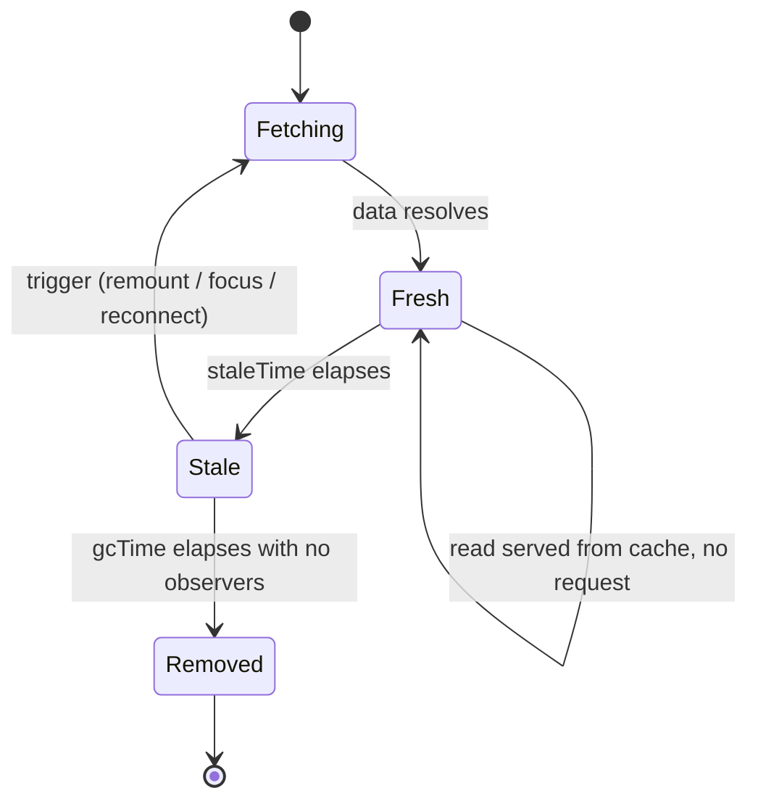

# Staleness & Revalidation

> `staleTime` is how long you trust cached data without checking; `gcTime` is how long you keep it after nobody's looking. The defaults are conservative on purpose — tune them.

**Part:** [03 · Application Architecture](../) · **Domain:** Data & Server State · **Priority:** Critical · **Difficulty:** Intermediate · **Reading time:** ~12 min

## TL;DR

A cached query is either *fresh* or *stale*. While fresh, reads are served from cache with no request. Once stale, the next trigger — a remount, a window refocus, a reconnect — fires a background refetch while still showing the cached value. `staleTime` sets the fresh window; it defaults to `0`, meaning "stale immediately," which is safe but chatty. `gcTime` (default five minutes) sets how long an unused entry lingers before garbage collection. These two numbers, set per query, are the difference between an app that refetches constantly and one that feels instant without going out of date.

> **Recommendation:** Set `staleTime` per query from how fast the data actually changes — seconds for a feed, minutes for a profile, effectively infinite for immutable reference data. Leave `gcTime` alone unless memory pressure or a specific offline requirement says otherwise.

## At a Glance

| | |
| --- | --- |
| **Use when** | Every query — the only question is what `staleTime` fits the data's real change rate. |
| **Avoid when** | Never skip the decision; the default `staleTime: 0` is itself a choice you should make on purpose. |
| **Alternatives** | [Cache Invalidation](#alternative-approaches) for event-driven freshness; background refetching for time-driven. |
| **Primary risk** | Either constant refetching (staleTime too low) or showing outdated data (too high). |
| **Maturity** | Stable. |

## Prerequisites

- [Cache Keys & Query Identity](./cache-keys-and-query-identity.md) — staleness is tracked per key.
- [Fetch-on-Render vs Render-as-You-Fetch](./fetch-on-render-vs-render-as-you-fetch.md) — a prefetched entry's freshness governs whether the read refetches.

## Overview

*Staleness* is a per-query flag: after data is fetched, it counts as fresh for `staleTime` milliseconds, then flips to stale. Freshness controls whether an access triggers a refetch. A fresh query never refetches on remount or focus; a stale one refetches in the background on the next such trigger, following the *stale-while-revalidate* pattern — serve the cached value immediately, refresh it behind the scenes, swap in the new value when it arrives.

*Revalidation* is that background refresh. It is distinct from *invalidation*, which is an explicit "this data is now wrong, mark it stale and refetch." Staleness is time-driven and automatic; invalidation is event-driven and manual. `gcTime` is a third, orthogonal timer: it controls memory, not correctness — how long an entry with no active observers stays in the cache before removal. A query can be stale but still cached (so a remount shows the old value instantly, then refetches); once `gcTime` elapses with no observers, the entry is gone and the next read starts cold.

## The Problem

With the default `staleTime: 0`, every query is stale the instant it resolves. That is correct — you never show provably outdated data past a trigger — but it is expensive: navigating back to a screen, refocusing the tab, or reconnecting all fire refetches, even for data that changes once a day. Users on metered or slow connections pay for requests that return identical bytes. The app feels busy: spinners and layout shifts on data that was already correct.

Overcorrecting is just as bad. A team sets `staleTime: Infinity` everywhere to stop the refetching, and now a price shown in the UI is the price from the user's first visit an hour ago, never refreshed. The failure is silent: no error, no spinner, just a number that is quietly wrong. Both failures come from treating `staleTime` as a global knob instead of a per-query statement about how fast that specific data goes out of date.

## Why It Matters

`staleTime` is where you encode a domain fact — the data's real rate of change — into the cache. That fact varies enormously across queries in the same app: a stock ticker is stale in a second, a user's display name in minutes, a list of country codes essentially never. Setting one global value cannot be right for all of them; setting each per query makes the cache match reality.

The consequences land on both cost and trust. Too low, and you waste requests and jank the UI with needless refetches, which on a large app is real bandwidth and server load. Too high, and you erode trust by showing stale numbers that users act on. Getting it right — per query, from the data's actual volatility — is what makes an app feel both fast and current, which are usually in tension only because the timers were left at their defaults.

## Mental Model

Think of each cached entry as milk with a "best before" time. `staleTime` is the shelf life: within it, you drink without checking. Past it, you still drink what's there (stale-while-revalidate) but you also go buy a fresh carton for next time. `gcTime` is how long you keep an unopened carton in the fridge after the last person stopped drinking it before you throw it out.



The triggers that turn a stale query back into a fetch are the automatic ones: mounting a new observer, `refetchOnWindowFocus`, `refetchOnReconnect`, and interval refetching if configured. Fresh data ignores all of them. So `staleTime` is not "how long to cache" — data stays cached until `gcTime` — it is "how long before those triggers are allowed to cause a refetch."

## Best Practices

Set `staleTime` from the data's change rate, per query. Reference data (currencies, categories) can be `Infinity` with explicit invalidation on the rare change. Slowly changing user data is comfortable at minutes. Fast, collaborative, or financial data wants seconds or event-driven invalidation instead.

Set sensible defaults on the `QueryClient`, then override per query. A global `staleTime` of, say, 30 seconds kills the worst of the default chattiness; individual queries raise or lower it. This keeps most of the app quiet without hand-tuning every query.

Leave `gcTime` at its default unless you have a reason. It is a memory timer, not a freshness one. Raise it only to keep data around for a longer offline window; lower it only under real memory pressure with large payloads.

Prefer invalidation over a low `staleTime` for event-driven freshness. If data changes because *the user did something* (a mutation), invalidate the affected keys precisely rather than polling with a short `staleTime`. Time-based staleness is for data that changes on its own; invalidation is for data that changes because of an action. See [Cache Invalidation](./cache-invalidation.md).

Do not use `staleTime: Infinity` to silence refetches you find annoying. That trades a UX nuisance for a correctness bug. If focus refetching is the problem, disable `refetchOnWindowFocus` for that query instead — it turns off the trigger without claiming the data is permanent.

## Trade-offs

Every `staleTime` value is a bet on how fast data changes, and the bet can be wrong in either direction. The tuning itself is the cost: it requires knowing the domain, and a value that was right can drift as the product changes.

**Advantages**

- Fresh reads are instant and request-free, so navigation and refocus feel immediate.
- Per-query tuning matches each cache entry to its real volatility.
- Stale-while-revalidate hides refetch latency behind the cached value.

**Disadvantages**

- A too-high value shows outdated data with no visible signal.
- A too-low value refetches needlessly, costing bandwidth and causing UI churn.
- The right value is domain knowledge that must be maintained as the product evolves.

| Dimension | Tuned `staleTime` | Cost / caveat |
| --- | --- | --- |
| Performance | Fewer requests; instant fresh reads | Wrong value wastes requests or shows stale data |
| Complexity | A number per query | Requires domain knowledge of change rate |
| Maintainability | Centralized defaults, local overrides | Values drift as the product changes |
| Failure behavior | Stale-while-revalidate degrades gracefully | Too-high value fails silently (no error) |

## Alternative Approaches

Staleness is the *time-driven* half of keeping data current; its true alternatives are the other ways to trigger a refresh, and the right design usually combines them.

| Approach | Best when | Weakness | See |
| --- | --- | --- | --- |
| `staleTime` (this article) | Data changes on its own at a knowable rate | Wrong value fails silently | (this article) |
| [Cache Invalidation](./cache-invalidation.md) | Data changes because of a user action | Requires knowing which keys a change affects | `Cache Invalidation` |
| [Background refetching (interval/focus)](./background-refetching.md) | Near-real-time freshness needed | Polling cost; battery and bandwidth | `Background Refetching` |

## Bad Example

Blanket `staleTime: Infinity` to stop refetches, applied to data that does change.

```tsx
import { useQuery } from '@tanstack/react-query';

// ❌ Infinity means this account balance is fetched once and never refreshed —
// the user sees the balance from their first visit for the rest of the session.
function AccountBalance({ accountId }: { accountId: string }) {
  const { data } = useQuery({
    queryKey: ['accounts', 'balance', accountId],
    queryFn: () => fetchBalance(accountId),
    staleTime: Infinity,
  });

  return <output>{data?.formatted ?? '—'}</output>;
}
```

**What goes wrong:** Silent staleness. A balance is exactly the kind of value that changes and that users act on, so pinning it to `Infinity` shows a wrong number with no spinner, no error, and no way for the user to know.

## Good Example

A `staleTime` chosen from the data's change rate, plus disabling the specific trigger that was actually unwanted.

```tsx
import { useQuery } from '@tanstack/react-query';

// ✅ 15s fresh window matches how often a balance realistically moves for this
// product; focus refetch stays on so returning to the tab shows current data.
function AccountBalance({ accountId }: { accountId: string }) {
  const { data, isStale } = useQuery({
    queryKey: ['accounts', 'balance', accountId],
    queryFn: ({ signal }) => fetchBalance(accountId, signal),
    staleTime: 15_000,
  });

  return (
    <output aria-busy={isStale}>
      {data?.formatted ?? '—'}
    </output>
  );
}
```

**Why it's better:** The 15-second window serves rapid re-reads from cache without refetching, but the data still revalidates on the next trigger after it goes stale, so a returning user sees a current balance. The value is a deliberate statement about this data, not a global default or a blanket silencer.

## Production Example

Global defaults on the client plus per-query overrides for three data classes — reference, user, and volatile — showing how one app carries several change rates at once.

```ts
import { QueryClient, queryOptions } from '@tanstack/react-query';

export const queryClient = new QueryClient({
  defaultOptions: {
    queries: {
      // A sane floor: most screens tolerate 30s of staleness, which removes
      // the default per-focus/ per-remount refetch storm.
      staleTime: 30_000,
      gcTime: 5 * 60_000,
      retry: 2,
    },
  },
});

// Reference data: changes a few times a year. Trust it for the session and
// invalidate explicitly on the rare admin edit.
export const currencyListQuery = () =>
  queryOptions({
    queryKey: ['reference', 'currencies'],
    queryFn: ({ signal }) => fetchCurrencies(signal),
    staleTime: Infinity,
  });

// User profile: changes occasionally; minutes of staleness is fine.
export const userProfileQuery = (userId: string) =>
  queryOptions({
    queryKey: ['users', 'profile', userId],
    queryFn: ({ signal }) => fetchProfile(userId, signal),
    staleTime: 5 * 60_000,
  });

// Live order book: near-real-time. Short window plus interval revalidation.
export const orderBookQuery = (symbol: string) =>
  queryOptions({
    queryKey: ['markets', 'order-book', symbol],
    queryFn: ({ signal }) => fetchOrderBook(symbol, signal),
    staleTime: 1_000,
    refetchInterval: 2_000,
  });
```

## Common Mistakes

See the [Data & Server State anti-patterns](../../../anti-patterns/#data-server-state) for the domain catalog. Concept-specific:

### Mistake: Using `staleTime: Infinity` as a refetch silencer

- **Symptom:** `Infinity` sprinkled on queries to stop focus/remount refetches.
- **Why it fails:** It claims the data never changes; changeable data then shows silently stale.
- **Fix:** Set a real `staleTime` and, if a specific trigger is unwanted, disable that trigger (`refetchOnWindowFocus: false`).

### Mistake: Confusing `gcTime` with `staleTime`

- **Symptom:** Someone raises `gcTime` to "cache longer" and is surprised data still refetches.
- **Why it fails:** `gcTime` governs memory retention, not freshness; a cached entry can be stale.
- **Fix:** Use `staleTime` for how long data is trusted; touch `gcTime` only for memory or offline reasons.

## Checklist

- [ ] Each query's `staleTime` reflects that data's real rate of change, not a global default.
- [ ] A client-level default `staleTime` removes the worst refetch chattiness.
- [ ] `Infinity` is used only for genuinely immutable data, paired with explicit invalidation.
- [ ] Unwanted refetch triggers are disabled by their own flag, not masked with `Infinity`.
- [ ] `gcTime` is left at default unless memory or offline needs justify a change.

## Related Articles

- [Cache Invalidation](./cache-invalidation.md) — the event-driven counterpart to time-driven staleness.
- [Cache Keys & Query Identity](./cache-keys-and-query-identity.md) — staleness is tracked per key.
- [Background Refetching](./background-refetching.md) — extends this to interval and focus revalidation.

## Related Recipes

- [Paginated query with prefetch on intent](../../../recipes/paginated-query-with-prefetch.md) — `staleTime` tuning so prefetched pages stay warm.

## Related Examples

- [Stale-time configuration](../../../examples/stale-time-configuration.ts) — defaults plus per-query overrides for three data classes.

## References

- [TanStack Query — Caching](https://tanstack.com/query/latest/docs/framework/react/guides/caching) — the fresh/stale/removed lifecycle.
- [TanStack Query — Important Defaults](https://tanstack.com/query/latest/docs/framework/react/guides/important-defaults) — why `staleTime` defaults to `0`.
