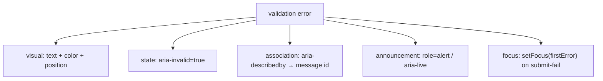

# Error Messaging

> A red border is not an error message. If the error isn't tied to the input, announced when it appears, and reachable by keyboard, a screen-reader user hits a wall they can't see.

**Part:** [03 · Application Architecture](../) · **Domain:** Forms & Validation · **Priority:** Critical · **Difficulty:** Intermediate · **Reading time:** ~12 min

## TL;DR

Validation only helps if the user can perceive and act on the error. That takes four things: mark the field invalid (`aria-invalid`), associate the message with the field (`aria-describedby` pointing at the message's `id`), announce errors that appear dynamically (an `aria-live` region or `role="alert"`), and move focus to the first error on a failed submit. Color and position alone reach sighted mouse users and no one else. React Hook Form gives you the error state and messages; wiring them to these ARIA relationships is what turns "the form knows it's invalid" into "every user knows, and knows what to fix."

> **Recommendation:** For every field, render the message with a stable `id`, point the input's `aria-describedby` at it when present, set `aria-invalid`, and on submit-fail focus the first invalid field. Announce async/submit errors in a live region.

## At a Glance

| | |
| --- | --- |
| **Use when** | Every form that shows validation errors — which is every form. |
| **Avoid when** | Never; accessible errors are a baseline, not an enhancement. |
| **Alternatives** | None — this is the correct way; color-only is simply broken for many users. |
| **Primary risk** | Errors invisible to assistive tech: unassociated, unannounced, or unfocusable. |
| **Maturity** | Stable (WCAG 2.1). |

## Prerequisites

- [Schema-Inferred Types](./schema-inferred-types.md) — where the error messages and paths come from.

## Overview

*Error messaging* is how a form communicates that input is invalid and what to do about it. The engineering content is mostly accessibility: a message that exists in the DOM but isn't programmatically connected to its field is invisible to anyone using a screen reader, and a red outline conveys nothing to someone who can't perceive color. Four mechanisms make an error perceivable by everyone: `aria-invalid` on the field (state), `aria-describedby` linking the field to the message's `id` (association), a live region or `role="alert"` for messages that appear after load (announcement), and focus management to the first error (navigation).

These map onto WCAG requirements — Error Identification (3.3.1) demands errors be identified in text, and the ARIA relationships make that identification programmatic. React Hook Form supplies the raw material: `formState.errors` keyed by field path, each with a `message`, plus `setFocus` for moving focus. The work is connecting that state to the ARIA attributes so the browser's accessibility tree exposes the error the same way it's shown visually. Do it once as a field component and every form inherits correct behavior; skip it and every form is inaccessible in the same way.

## The Problem

A form validates correctly and shows errors: invalid fields get a red border and a message appears below. It passes manual testing — the developer sees the errors. A screen-reader user submits the same form and hears "form, submit button"; they don't know a field is invalid, which field, or why, because the message is a plain `<span>` with no relationship to the input and nothing announced its appearance. The red border is meaningless to them, and focus stayed on the submit button, so they'd have to blindly tab back through the form hunting for a problem they can't perceive.

Nothing here is a validation bug — the validation is perfect. It's a *communication* bug: the error is rendered for one channel (sighted, visual) and absent from the others (assistive tech, keyboard). Because it looks fine to the person building it, this defect ships constantly and is only caught by an audit or a real user hitting the wall. The fix isn't more validation; it's connecting the already-correct error state to the accessibility tree so it's exposed through every channel, not just the visual one.

## Why It Matters

Forms are gates — signup, checkout, application, settings. An inaccessible error turns a gate into a dead end for the users who most need clear feedback: someone who can't see the red border has no other signal that anything is wrong. This is both an inclusion failure and, in many jurisdictions, a legal one, since WCAG conformance is a requirement for public-sector and increasingly private services. Error identification (3.3.1) is a Level A criterion — the floor, not the ceiling.

Beyond compliance, accessible error handling is better for everyone. Moving focus to the first error helps sighted keyboard users and reduces the hunt on long forms. A clear, associated message reduces the confusion that causes form abandonment across all users. And building it once, into a field component, means the whole app gets it for free — the cost is a single well-made abstraction, and the return is that no form in the codebase ships the invisible-error bug. Treating error messaging as an accessibility problem, not a styling one, is what makes forms actually usable at the moment they're most likely to fail.

## Mental Model

An error must be exposed on four channels at once, because different users receive it differently. Visual users get color and position; screen-reader users get state and association; users of dynamic content get announcement; keyboard users get focus. A correct error message hits all four; a red border hits one.



The association is the linchpin. `aria-describedby` on the input holds the `id` of the message element, so when focus lands on the field, assistive tech reads the field's label *and* its error together. This is why the message needs a stable `id` and the input needs to reference it conditionally — present when there's an error, absent when there isn't. Announcement (`role="alert"`) handles the case where the error appears while focus is elsewhere (after submit). Focus management ensures the user is taken to the problem rather than left to find it.

## Best Practices

Associate every message with its field via `aria-describedby`. Give the message element a stable `id` (derived from the field name) and set the input's `aria-describedby` to that `id` when an error is present. This is what makes the error part of the field's accessible description.

Set `aria-invalid` to reflect the real state. `aria-invalid="true"` when the field has an error, absent (or `"false"`) otherwise. It tells assistive tech the field is in an error state independent of the message text, and it's a clean styling hook (`[aria-invalid="true"]`) so your visual and programmatic state can't diverge.

Announce errors that appear dynamically. A message that renders after submit, while focus is on the button, won't be read unless it's in a live region. Use `role="alert"` on the message (assertive) for submit/async errors, or a single `aria-live="polite"` summary region. Don't make every keystroke-driven error assertive — that's noisy; reserve assertive for submit-time.

Move focus to the first error on submit failure. React Hook Form's `setFocus` (or focusing via a ref) sends the user straight to the first invalid field so they don't hunt. Determine "first" by field order, and do it in the failed-submit path.

Write messages that say how to fix it, in text. "Enter a valid email" beats "Invalid." The message must be text (not conveyed by color or an icon alone) and specific enough to act on. This is where the schema's per-field messages pay off — they're already written and associated by path.

Build it into a field component, not per form. A `<FormField>` that renders the label, input, message, and all four mechanisms means every form is accessible by construction. Two or more forms justify the abstraction immediately.

## Trade-offs

There's no real trade-off on whether to do this — inaccessible errors are a defect. The cost is the up-front work of a correct field component and the discipline to route all fields through it; the "disadvantage" is only that it's more than a bare `<span>`.

**Advantages**

- Errors reach every user: screen-reader, keyboard, and visual.
- Meets WCAG Error Identification (3.3.1); reduces legal and audit risk.
- Focus management and clear messages cut form abandonment for everyone.

**Disadvantages**

- More markup than an unassociated message; needs a shared component to stay DRY.
- Live-region behavior (assertive vs polite) requires thought to avoid noise.
- Focus management interacts with async validation timing and must be sequenced.

| Dimension | Accessible errors | Cost / caveat |
| --- | --- | --- |
| Performance | Negligible | None |
| Complexity | Four mechanisms per field | Best hidden in one field component |
| Maintainability | Built once, inherited everywhere | Requires routing all fields through it |
| Failure behavior | Errors perceivable on every channel | Wrong live-region politeness is noisy |

## Alternative Approaches

There is no legitimate alternative — the "other option" is color/position-only error display, which is inaccessible and fails WCAG. `alternatives: []`. Related decisions are *when* the error appears (*Inline vs Submit Validation*) and which state drives it (*Dirty, Touched & Submit State*), both planned; they change the timing, not the requirement to make the error perceivable.

## Bad Example

A message with no association, no state, no announcement, and no focus handling.

```tsx
import { useForm } from 'react-hook-form';

// ❌ The error is a plain span: not linked to the input (no aria-describedby),
// no aria-invalid, not announced, and focus stays on the button after submit.
function EmailForm() {
  const {
    register,
    handleSubmit,
    formState: { errors },
  } = useForm<{ email: string }>();

  return (
    <form onSubmit={handleSubmit((values) => submit(values))}>
      <label htmlFor="email">Email</label>
      <input id="email" {...register('email', { required: 'Required' })} />
      {errors.email && <span style={{ color: 'red' }}>{errors.email.message}</span>}
      <button type="submit">Continue</button>
    </form>
  );
}
```

**What goes wrong:** The error is visible only to sighted mouse users. A screen reader never learns the field is invalid (no `aria-invalid`, no `aria-describedby`), the message isn't announced when it appears, and focus doesn't move — so a non-visual user hits a submit that silently does nothing.

## Good Example

A field component wiring all four mechanisms, with focus moved to the first error on submit failure.

```tsx
import { useForm } from 'react-hook-form';
import type { FieldError, UseFormRegisterReturn } from 'react-hook-form';

// ✅ One accessible field: label, input, and message connected by id, with
// aria-invalid and role="alert". Every form that uses it is accessible.
function FormField({
  name,
  label,
  type = 'text',
  error,
  registration,
}: {
  name: string;
  label: string;
  type?: string;
  error?: FieldError;
  registration: UseFormRegisterReturn;
}) {
  const errorId = `${name}-error`;
  return (
    <div>
      <label htmlFor={name}>{label}</label>
      <input
        id={name}
        type={type}
        aria-invalid={error ? true : undefined}
        aria-describedby={error ? errorId : undefined}
        {...registration}
      />
      {error && (
        <span id={errorId} role="alert">
          {error.message}
        </span>
      )}
    </div>
  );
}

function EmailForm() {
  const {
    register,
    handleSubmit,
    setFocus,
    formState: { errors },
  } = useForm<{ email: string }>();

  return (
    <form
      onSubmit={handleSubmit(
        (values) => submit(values),
        // Failed-submit path: send the user straight to the first error.
        (fieldErrors) => {
          const first = Object.keys(fieldErrors)[0] as 'email' | undefined;
          if (first) setFocus(first);
        },
      )}
    >
      <FormField
        name="email"
        label="Email"
        type="email"
        error={errors.email}
        registration={register('email', { required: 'Enter your email' })}
      />
      <button type="submit">Continue</button>
    </form>
  );
}
```

**Why it's better:** The message has a stable `id` the input references via `aria-describedby`, `aria-invalid` reflects the state, `role="alert"` announces the error when it appears, and the failed-submit handler moves focus to the first invalid field. The error is now exposed on all four channels, and every form using `FormField` inherits that for free.

## Production Example

An accessible field component plus a submit-level error summary that lists all errors, links to each field, and receives focus — the pattern larger forms use so a user gets an overview and a way in.

```tsx
import { useForm } from 'react-hook-form';
import { zodResolver } from '@hookform/resolvers/zod';
import { useRef } from 'react';
import { z } from 'zod';

const schema = z.object({
  name: z.string().min(1, 'Enter your name'),
  email: z.string().email('Enter a valid email'),
});
type Values = z.infer<typeof schema>;

export function ContactForm({ onSend }: { onSend: (values: Values) => Promise<void> }) {
  const summaryRef = useRef<HTMLDivElement>(null);
  const {
    register,
    handleSubmit,
    formState: { errors, isSubmitting },
  } = useForm<Values>({ resolver: zodResolver(schema) });

  const errorEntries = Object.entries(errors);

  return (
    <form
      onSubmit={handleSubmit(onSend, () => {
        // Move focus to the summary so the count and links are announced.
        summaryRef.current?.focus();
      })}
      noValidate
    >
      {errorEntries.length > 0 && (
        <div ref={summaryRef} tabIndex={-1} role="alert" aria-labelledby="error-summary-heading">
          <h2 id="error-summary-heading">There are {errorEntries.length} problems</h2>
          <ul>
            {errorEntries.map(([field, error]) => (
              <li key={field}>
                <a href={`#${field}`}>{error?.message}</a>
              </li>
            ))}
          </ul>
        </div>
      )}

      <div>
        <label htmlFor="name">Name</label>
        <input
          id="name"
          aria-invalid={errors.name ? true : undefined}
          aria-describedby={errors.name ? 'name-error' : undefined}
          {...register('name')}
        />
        {errors.name && <span id="name-error">{errors.name.message}</span>}
      </div>

      <div>
        <label htmlFor="email">Email</label>
        <input
          id="email"
          type="email"
          aria-invalid={errors.email ? true : undefined}
          aria-describedby={errors.email ? 'email-error' : undefined}
          {...register('email')}
        />
        {errors.email && <span id="email-error">{errors.email.message}</span>}
      </div>

      <button type="submit" disabled={isSubmitting}>Send</button>
    </form>
  );
}
```

## Common Mistakes

See the [Forms & Validation anti-patterns](../../../anti-patterns/#forms-validation) for the domain catalog. Concept-specific:

### Mistake: Errors conveyed by color/position only

- **Symptom:** A red border and a loose message, no ARIA relationships.
- **Why it fails:** Invisible to screen readers and to anyone who can't perceive color; fails WCAG 3.3.1.
- **Fix:** Add `aria-invalid`, `aria-describedby`, an announcement, and focus management. See [Inaccessible error messaging](../../../anti-patterns/inaccessible-error-messaging.md).

### Mistake: No focus movement on failed submit

- **Symptom:** Submit fails, errors render, focus stays on the button.
- **Why it fails:** Keyboard and screen-reader users must hunt for the problem.
- **Fix:** `setFocus` the first invalid field, or focus an error summary.

## Checklist

- [ ] Each field sets `aria-invalid` when it has an error.
- [ ] Each message has a stable `id`; the input's `aria-describedby` references it when present.
- [ ] Errors that appear after load are announced (`role="alert"` / `aria-live`).
- [ ] Focus moves to the first error (or an error summary) on failed submit.
- [ ] Messages are actionable text, never color/icon alone.

## Related Articles

- [Schema Validation](./schema-validation.md) — the source of per-field messages and paths.
- [Accessibility](../../04-interface-engineering/accessibility/) (`· Accessibility`) — the broader ARIA and focus model.
- Alongside this: *Inline vs Submit Validation*, *Dirty, Touched & Submit State* (see the [Forms & Validation index](./)).

## Related Recipes

- [Type-safe form with server mutation](../../../recipes/type-safe-form-with-server-mutation.md) — accessible errors from schema and server issues.

## Related Examples

- [Accessible field error](../../../examples/accessible-field-error.tsx) — the four-mechanism field component.

## References

- [MDN — aria-describedby](https://developer.mozilla.org/en-US/docs/Web/Accessibility/ARIA/Attributes/aria-describedby) — associating a message with a field.
- [WCAG — Error Identification (3.3.1)](https://www.w3.org/WAI/WCAG21/Understanding/error-identification.html) — the Level A requirement.
- [React Hook Form — setFocus](https://react-hook-form.com/docs/useform/setfocus) — moving focus to a field.
