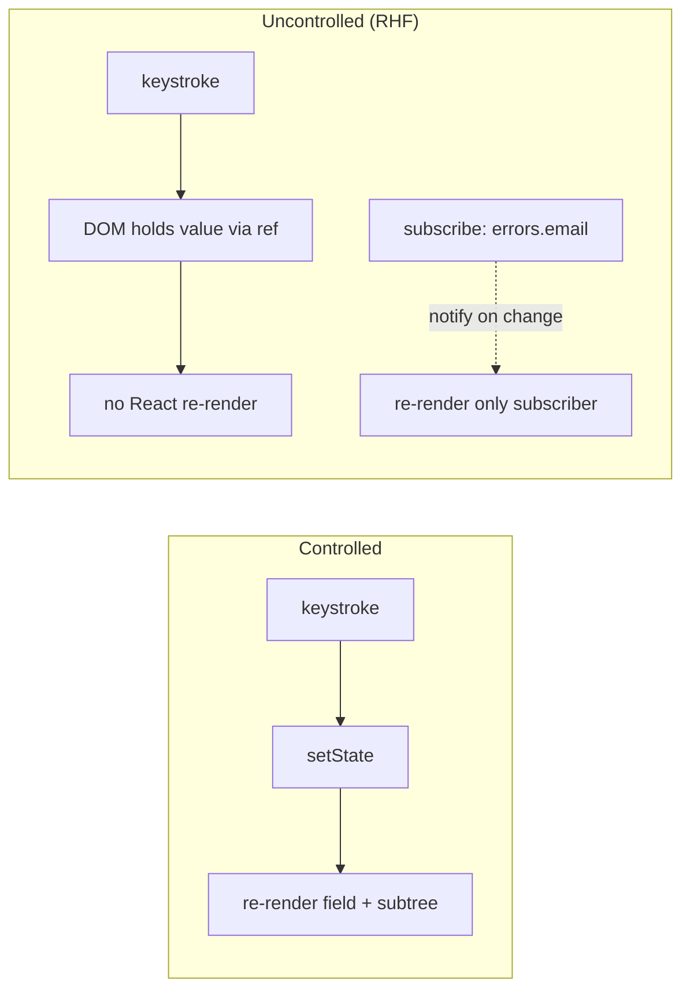

# Form Libraries & State Models

> Every form library is a state model in disguise. React Hook Form is fast because it keeps values in refs and doesn't re-render on every keystroke — that choice, not the API, is what you're adopting.

**Part:** [03 · Application Architecture](../) · **Domain:** Forms & Validation · **Priority:** Critical · **Difficulty:** Intermediate · **Reading time:** ~15 min

## TL;DR

A form library's core decision is where field values live and when the component re-renders. The controlled model keeps each value in React state, so every keystroke re-renders the field (and often the whole form). The uncontrolled model keeps values in the DOM via refs and subscribes only where needed, so typing doesn't re-render anything. React Hook Form is built on the uncontrolled model, which is why large forms stay fast and why its API centers on `register` (wire a ref) rather than `value`/`onChange`. Understanding the model tells you why the fast path is fast and when you must opt into controlled behavior with `Controller`.

> **Recommendation:** Default to React Hook Form's uncontrolled model with `register`. Reach for `Controller` only to bridge components that must be controlled (custom selects, masked inputs). Don't rebuild controlled-per-keystroke state on top of it.

## At a Glance

| | |
| --- | --- |
| **Use when** | Any non-trivial form — multiple fields, validation, submit handling. |
| **Avoid when** | A single input whose value you already need controlled for live UI elsewhere. |
| **Alternatives** | [Hand-rolled controlled state](#alternative-approaches); [uncontrolled + refs](#alternative-approaches) without a library. |
| **Primary risk** | Fighting the model — forcing controlled re-renders onto an uncontrolled library and losing its performance. |
| **Maturity** | Stable. |

## Prerequisites

- [Controlled inputs](./README.md) — the baseline model React Hook Form optimizes away (see the Forms & Validation index).

## Overview

A *state model* for forms answers two questions: where does a field's current value live, and what re-renders when it changes. The *controlled* model stores each value in React state (`useState`), making React the source of truth; every change calls `setState`, which re-renders. The *uncontrolled* model leaves the value in the DOM node and reads it through a ref when needed (typically at submit or on blur), so React is not involved on each keystroke.

React Hook Form (RHF) is an uncontrolled-first library. `register('email')` returns props — including a `ref` — that wire the native input to RHF's internal store without routing each keystroke through React state. The form re-renders only when something a component actually subscribes to changes (a specific error, the submit state), not on every character. This is the whole reason RHF forms with fifty fields stay responsive while a naive controlled form of the same size janks. When you do need a value in React (a controlled third-party component), `Controller` bridges it — deliberately opting one field back into controlled behavior. Knowing which model you're in explains every performance characteristic that follows.

## The Problem

A team builds a settings form the obvious React way: `useState` per field, `value`/`onChange` on each input. It works at five fields. At forty — with nested sections, a few `useEffect`s deriving values, and validation on change — typing in one field lags, because each keystroke re-renders the entire form subtree, re-runs the effects, and re-validates everything. The profiler shows hundreds of renders per second of typing. The instinct is to reach for `useMemo` and `React.memo` on every field, adding complexity to fight a problem the state model created.

The root cause is the model, not the field count. Controlled state makes React re-render on every keystroke by design; that is fine for one input and quadratically annoying for many. Bolting memoization onto controlled fields treats the symptom. The structural fix is to change the model — keep values out of React's per-keystroke path — which is exactly what an uncontrolled form library does. Reaching for a library without understanding this leads teams to adopt RHF and then immediately re-introduce controlled state on top of it, keeping the slowness they were trying to escape.

## Why It Matters

Forms are where users spend deliberate effort, so input latency is felt acutely — a laggy field reads as a broken app. The state model is the single biggest determinant of that latency, and it's a decision made once, at library-adoption time, that's expensive to reverse later. Choosing the uncontrolled model (via RHF) means large forms scale without per-field memoization gymnastics; choosing controlled means fighting re-renders as the form grows.

The model also shapes the code, not just the speed. An uncontrolled library centers on registration and submit; a controlled one centers on value/onChange wiring. Teams that adopt RHF but keep thinking in controlled terms write awkward, slow hybrids — `Controller` around everything, `watch` in render, values mirrored into `useState`. Understanding the model up front means the form code matches the library's grain, which is where both the performance and the simplicity come from.

## Mental Model

Picture two ways to track what's in a set of text boxes. Controlled: a clerk (React) writes down every character as you type it, and re-reads the whole ledger on each stroke. Uncontrolled: the boxes hold their own values, and the clerk only walks over to read them when you press submit. RHF is the second clerk — plus a subscription board where a component can ask to be notified about one specific thing (this field's error, the form's dirty state) without watching everything.



The practical consequence: in RHF, reading a value during render (`watch('field')`) opts that component back into re-rendering on change — useful, but it's the controlled cost re-entering. The default, `register` plus reading values at submit, keeps the fast path. `Controller` is the escape hatch for components that genuinely need a controlled `value`/`onChange` (a date picker, a masked input), and using it is a conscious, per-field decision to pay controlled cost where it's required.

## Best Practices

Default to `register`, not `Controller`. `register` wires the native input the uncontrolled way and is the fast path. Reach for `Controller` only when a component doesn't accept a ref and forwarded props — third-party selects, rich editors, masked inputs. Wrapping every field in `Controller` throws away the model's advantage.

Read values at submit, not in render. `handleSubmit` hands you the full, validated values object. Avoid `watch('field')` in the render path unless you specifically need to react to a value live (show/hide a section), and when you do, scope it to the smallest component so only that subtree re-renders.

Let the library own form state; don't mirror it into `useState`. Copying RHF values into React state to "use them" reintroduces controlled re-renders and creates two sources of truth that drift. If you need a value, get it from RHF (`getValues`, `watch` scoped) — don't shadow it.

Subscribe narrowly to `formState`. `formState` fields (`errors`, `isDirty`, `isSubmitting`) are tracked via proxy: you only re-render for the ones you read. Destructure exactly what a component needs so a change to `isDirty` doesn't re-render a component that only cares about `errors.email`.

Match validation timing to the model. Uncontrolled forms pair naturally with validate-on-blur/submit (read the value when it settles), which also avoids re-validating on every keystroke. Live-validation is possible but pulls you toward controlled cost — do it where the UX needs it, not by default.

## Trade-offs

The uncontrolled model buys performance and simpler large forms at the cost of a mental shift: values aren't in React state where you might reflexively look for them, and a few UI patterns (live-derived fields) require explicitly opting back into controlled behavior.

**Advantages**

- Typing doesn't re-render; large forms stay responsive without memoization.
- Less React state to manage; the DOM and the library hold the values.
- Narrow `formState` subscriptions keep re-renders proportional to what changed.

**Disadvantages**

- Values live outside React state, which is unintuitive if you think controlled-first.
- Live-derived UI needs `watch`/`Controller`, re-introducing controlled cost deliberately.
- Third-party controlled components require the `Controller` bridge.

| Dimension | Uncontrolled (RHF) | Cost / caveat |
| --- | --- | --- |
| Performance | No re-render per keystroke | `watch` in render opts back into re-renders |
| Complexity | Less state; submit-centric | Different mental model than plain React |
| Maintainability | One source of truth (the library) | Mirroring into `useState` breaks that |
| Failure behavior | Values read at settled points | Reading mid-type needs explicit subscription |

## Alternative Approaches

The alternatives are the two models without a library, and the controlled model in general.

| Approach | Best when | Weakness | See |
| --- | --- | --- | --- |
| Uncontrolled library (RHF) | Non-trivial forms; performance matters | Different mental model | (this article) |
| Hand-rolled controlled state | One or two fields; you need values live everywhere | Re-renders per keystroke; scales poorly | *Controlled Inputs* (see the [Forms & Validation index](./README.md)) |
| Hand-rolled uncontrolled + refs | Truly minimal forms, no validation | Reinvents registration, validation, submit | *Uncontrolled Inputs & Refs* (planned — see the index) |

## Bad Example

Adopting RHF but re-introducing controlled state on top of it — the slow hybrid.

```tsx
import { useForm } from 'react-hook-form';
import { useState } from 'react';

// ❌ Mirrors RHF values into useState via watch-in-render, so every keystroke
// re-renders the whole form. This is controlled cost with extra steps.
function SettingsForm() {
  const { register, handleSubmit, watch } = useForm();
  const [displayName, setDisplayName] = useState('');

  // watch() with no argument subscribes to ALL fields at the top level.
  const values = watch();

  return (
    <form onSubmit={handleSubmit((data) => save(data))}>
      <input
        {...register('displayName')}
        onChange={(event) => setDisplayName(event.target.value)}
      />
      <p>Preview: {displayName || values.displayName}</p>
      {/* ...forty more fields, all re-rendering on every keystroke */}
    </form>
  );
}
```

**What goes wrong:** Two sources of truth (RHF and `useState`) plus a top-level `watch()` mean every keystroke re-renders the entire form. The library's performance advantage is discarded; this is slower than plain controlled state, not faster.

## Good Example

RHF used with the grain: `register` for the fast path, a scoped `watch` only where a live preview is needed.

```tsx
import { useForm, useWatch, type Control } from 'react-hook-form';

interface SettingsValues {
  displayName: string;
  email: string;
  bio: string;
}

// ✅ The preview is isolated in its own component that subscribes to one field,
// so only the preview re-renders as you type — the rest of the form is static.
function NamePreview({ control }: { control: Control<SettingsValues> }) {
  const displayName = useWatch({ control, name: 'displayName' });
  return <p aria-live="polite">Preview: {displayName || '—'}</p>;
}

function SettingsForm() {
  const {
    register,
    handleSubmit,
    control,
    formState: { errors, isSubmitting },
  } = useForm<SettingsValues>({ defaultValues: { displayName: '', email: '', bio: '' } });

  return (
    <form onSubmit={handleSubmit((values) => save(values))}>
      <label htmlFor="displayName">Display name</label>
      <input id="displayName" {...register('displayName', { required: 'Required' })} />
      {errors.displayName && <span role="alert">{errors.displayName.message}</span>}

      <NamePreview control={control} />

      <label htmlFor="email">Email</label>
      <input id="email" type="email" {...register('email')} />

      <button type="submit" disabled={isSubmitting}>Save</button>
    </form>
  );
}
```

**Why it's better:** `register` keeps typing off React's render path for every field. The one place that needs a live value — the preview — is a separate component subscribing to a single field via `useWatch`, so only it re-renders. The form scales to dozens of fields without memoization, because nothing re-renders that doesn't need to.

## Production Example

A form hook that owns setup once (defaults, resolver, submit wiring) so feature forms stay declarative, and that exposes exactly the state a screen needs.

```tsx
import { useForm, type DefaultValues, type SubmitHandler } from 'react-hook-form';

// A thin, typed wrapper: it standardizes how forms are created across the app
// without hiding RHF. Two real call sites justify the abstraction.
export function useAppForm<TValues extends Record<string, unknown>>(options: {
  defaultValues: DefaultValues<TValues>;
  onSubmit: SubmitHandler<TValues>;
}) {
  const form = useForm<TValues>({
    defaultValues: options.defaultValues,
    mode: 'onBlur', // validate when a field settles, matching the uncontrolled model
  });

  const submit = form.handleSubmit(options.onSubmit);

  return { ...form, submit };
}

interface ProfileValues {
  displayName: string;
  email: string;
}

export function ProfileForm({ onSave }: { onSave: (values: ProfileValues) => Promise<void> }) {
  const {
    register,
    submit,
    formState: { errors, isSubmitting, isDirty },
  } = useAppForm<ProfileValues>({
    defaultValues: { displayName: '', email: '' },
    onSubmit: onSave,
  });

  return (
    <form onSubmit={submit}>
      <label htmlFor="displayName">Display name</label>
      <input id="displayName" {...register('displayName', { required: 'Required' })} />
      {errors.displayName && <span role="alert">{errors.displayName.message}</span>}

      <label htmlFor="email">Email</label>
      <input id="email" type="email" {...register('email', { required: 'Required' })} />
      {errors.email && <span role="alert">{errors.email.message}</span>}

      {/* isDirty and isSubmitting are proxy-tracked: reading them here subscribes
          only this button to their changes. */}
      <button type="submit" disabled={!isDirty || isSubmitting}>
        {isSubmitting ? 'Saving…' : 'Save'}
      </button>
    </form>
  );
}
```

## Common Mistakes

See the [Forms & Validation anti-patterns](../../../anti-patterns/README.md#forms-validation) for the domain catalog. Concept-specific:

### Mistake: Mirroring form values into `useState`

- **Symptom:** `onChange` handlers copying RHF fields into local `useState`.
- **Why it fails:** Re-introduces per-keystroke re-renders and creates two sources of truth that drift.
- **Fix:** Let RHF own values; read them with `getValues`/scoped `watch`. See [Validation re-render storms](../../../anti-patterns/validation-rerender-storm.md).

### Mistake: Top-level `watch()` in the form's render

- **Symptom:** `const values = watch()` at the top of a large form component.
- **Why it fails:** Subscribes to all fields, re-rendering the whole form on every keystroke.
- **Fix:** Scope subscriptions with `useWatch` in a small child, or read at submit.

## Checklist

- [ ] Fields use `register`; `Controller` is reserved for components that need a controlled value.
- [ ] Form values are not mirrored into separate `useState`.
- [ ] `watch`/`useWatch` is scoped to the smallest component that needs the live value.
- [ ] `formState` is destructured to exactly the fields a component reads.
- [ ] Validation timing (`mode`) matches the model — `onBlur`/`onSubmit` by default.

## Related Articles

- [Schema Validation](./schema-validation.md) — plugging Zod into the model via a resolver.
- [Mutation Lifecycle](../data-server-state/mutation-lifecycle.md) — where a submitted form's values go.
- Alongside this: *Controlled Inputs*, *Uncontrolled Inputs & Refs*, *Field Arrays & Dynamic Fields* (see the [Forms & Validation index](./README.md)).

## Related Recipes

- [Type-safe form with server mutation](../../../recipes/type-safe-form-with-server-mutation.md) — RHF's model end to end into a mutation.

## Related Examples

- [Register vs Controller](../../../examples/rhf-register-vs-controller.tsx) — the fast path and the controlled bridge side by side.

## References

- [React Hook Form — Get Started](https://react-hook-form.com/get-started) — `register`, `handleSubmit`, `formState`.
- [React Hook Form — Controller](https://react-hook-form.com/docs/usecontroller/controller) — bridging controlled components.
- [React — Sharing state between components](https://react.dev/learn/sharing-state-between-components) — the controlled model RHF optimizes away.
