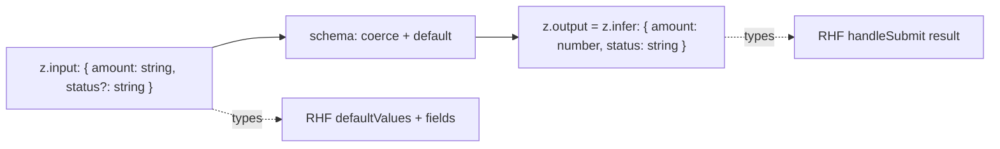

# Schema-Inferred Types

> Don't write the type and the validation separately — they'll drift. Derive the type *from* the schema with `z.infer`, and a rule change updates the type automatically.

**Part:** [03 · Application Architecture](../) · **Domain:** Forms & Validation · **Priority:** Critical · **Difficulty:** Intermediate · **Reading time:** ~12 min

## TL;DR

`z.infer<typeof schema>` extracts the TypeScript type of a schema's validated output, making the schema the single source of truth for both runtime rules and static types. Declare the type separately and it drifts from the rules the first time either changes; infer it and they cannot. The one subtlety is transforms: when a schema coerces or transforms (a string input becoming a number), the *input* type and the *output* type differ, and you need `z.input` and `z.output` to type each side correctly — for React Hook Form's default values versus its submitted result. Getting this right is what makes a form's types honest about what actually flows through it.

> **Recommendation:** Never hand-write a type that a schema already describes — use `z.infer`. When a schema transforms values, type React Hook Form with the three generics `useForm<z.input<...>, unknown, z.output<...>>` so the form values and the submit result are each typed correctly.

## At a Glance

| | |
| --- | --- |
| **Use when** | Any schema-validated form or payload — always prefer inference over a hand-written type. |
| **Avoid when** | Never; a hand-written duplicate of a schema's type is strictly worse. |
| **Alternatives** | None — the alternative is a hand-maintained type that drifts. |
| **Primary risk** | Ignoring input/output divergence under transforms, so the form types lie. |
| **Maturity** | Stable. |

## Prerequisites

- [Client-side validation strategies](./README.md) — where the schema comes from (see the Forms & Validation index).

## Overview

*Type inference* means deriving a TypeScript type from a runtime schema rather than declaring it by hand. `z.infer<typeof schema>` gives the type of the data a schema produces on success — the *output* type. Because it's computed from the schema, it updates automatically when the schema changes: add a field, tighten a type, make something optional, and the inferred type reflects it with no separate edit. This is the mechanism that makes [schema validation](./schema-validation.md) type-safe end to end, not just at runtime.

Most of the time `z.infer` is all you need, because input and output types coincide. They diverge when a schema *transforms* its input: `z.coerce.number()` accepts a `string | number` and yields a `number`; `z.string().transform((s) => s.trim())` accepts and returns a string but could change the shape in other cases; a field with a default is optional on input and required on output. For these, Zod exposes two types — `z.input<typeof schema>` (what you pass in) and `z.output<typeof schema>` (what comes out, identical to `z.infer`). In a form, the input type describes the raw field values and default values; the output type describes the validated result your submit handler receives. Typing both correctly is the difference between a form whose types match reality and one that quietly claims a field is a `number` while the input is a `string`.

## The Problem

A form has an `amount` field. The input is a text box, so the raw value is a string, but the schema uses `z.coerce.number()` to store a number. The developer types the form with a single hand-written `interface FormValues { amount: number }`. Now the default value `{ amount: 0 }` type-checks but is wrong at the input layer (the field renders a number where the DOM wants a string), and if they'd instead typed `amount: string` the submit handler would be lied to (it receives a `number`). One type can't be right for both ends of a transforming schema, so a single hand-written type is guaranteed to misdescribe one side.

The subtler version is silent for months. Someone adds `.default('draft')` to a `status` field. On input, `status` is now optional; on output, it's always present. The hand-written type says `status: string` — required on both. Default values omit it (fine at runtime, wrong per the type), or the submit handler treats it as possibly-undefined when it never is. The types and the schema have drifted, and TypeScript is now actively unhelpful, vouching for a shape that doesn't match the data. The root cause is maintaining a type in parallel with the schema instead of deriving it.

## Why It Matters

The entire value of validating with a schema is that one declaration governs the data. A hand-written type breaks that: it's a second declaration that TypeScript trusts completely and that has no link to the schema, so when they disagree, the type wins at compile time and the schema wins at runtime — and your code is written against a lie. Inferring the type restores the single source of truth, so the compiler's guarantees are about the *actual* validated shape.

The input/output distinction matters because forms are exactly the case where transforms are common — coercion for numbers and dates, trimming, defaults — and where both ends of the transform are typed surfaces. React Hook Form's `defaultValues` and field registration see the input type; its `handleSubmit` callback sees the output type. Get these crossed and you either fight the compiler with casts or, worse, satisfy it with wrong types. Typing them from `z.input`/`z.output` makes both surfaces honest, which is what lets the rest of the form — and the server that shares the schema — rely on the types instead of re-checking at runtime.

## Mental Model

A transforming schema is a pipe with a different type at each end. Data enters as the input type and leaves as the output type; `z.infer` is the output end. For a form, RHF holds the raw values (input end) and hands your handler the parsed values (output end), so the two RHF-facing types are the two ends of the pipe.



When there are no transforms, both ends are the same type and `z.infer` alone suffices — which is why simple forms never need to think about it. The moment a schema coerces, transforms, or defaults, the ends split, and the three-generic `useForm<Input, unknown, Output>` tells React Hook Form which type applies where. Reaching for a cast is the signal you've collapsed the pipe into one type and lost information.

## Best Practices

Infer, never hand-write, a schema's type. `type Values = z.infer<typeof schema>` is the default. A hand-written duplicate is strictly worse: it adds maintenance and can drift. If you catch yourself writing an `interface` that mirrors a schema, delete it and infer.

Use `z.input`/`z.output` when the schema transforms. For coercion, transforms, or defaults, type React Hook Form with all three generics: `useForm<z.input<typeof schema>, unknown, z.output<typeof schema>>`. This types `defaultValues` and fields as input, and the submit result as output. Skipping it forces casts that hide the mismatch.

Let `defaultValues` match the input type. Defaults are raw field values, so they're the input type — a text field's default is `''`, not `0`, even if the schema coerces to a number. Typing defaults as input catches wrong defaults at compile time.

Export the inferred type next to the schema. `export type InvoiceInput = z.infer<typeof invoiceSchema>` gives the rest of the app (and the server) a name to import, so consumers depend on the derived type, not their own copies. This keeps the client and server aligned — the topic of *Shared Client/Server Schemas*.

Prefer schema composition over type composition. If you need a variant type (a subset of fields, a partial), derive it with schema methods (`.pick`, `.partial`, `.extend`) and infer from the result, rather than manipulating the inferred TypeScript type. The schema stays the source; the types follow.

## Trade-offs

Inference has essentially no downside over a hand-written type — it's less code and strictly more correct. The only real cost is conceptual: you must understand input/output divergence, or a transforming schema's types will surprise you.

**Advantages**

- One source of truth; the type can't drift from the rules.
- Less code — no parallel `interface` to maintain.
- Input/output typing makes both ends of a transforming form honest.

**Disadvantages**

- The input/output distinction is a concept you must learn (and only matters with transforms).
- Deeply transformed schemas can produce types that are non-obvious to read.
- Editor "go to type" lands on the inferred type, not a named `interface` some developers expect.

| Dimension | Inferred types | Cost / caveat |
| --- | --- | --- |
| Performance | Compile-time only; zero runtime cost | None |
| Complexity | Less code than a duplicate type | Must grasp input vs output |
| Maintainability | Type follows the schema automatically | Complex transforms yield dense types |
| Failure behavior | Type matches validated data | Ignoring input/output split re-introduces lies |

## Alternative Approaches

There is no genuine alternative: the only other option is a hand-written type maintained in parallel with the schema, which is the very drift problem inference solves. `alternatives: []` reflects that this is the correct approach rather than one choice among equals. The related decision — how the inferred type is shared with the server — is covered in *Shared Client/Server Schemas* (planned).

## Bad Example

A hand-written type that misdescribes a transforming schema.

```tsx
import { useForm } from 'react-hook-form';
import { zodResolver } from '@hookform/resolvers/zod';
import { z } from 'zod';

const donationSchema = z.object({
  // Coerces the text input to a number, and defaults the tier.
  amount: z.coerce.number().positive(),
  tier: z.enum(['bronze', 'silver', 'gold']).default('bronze'),
});

// ❌ One hand-written type can't be right for both ends: `amount` is a string in
// the DOM but this says number, and `tier` is optional on input but says required.
interface DonationValues {
  amount: number;
  tier: 'bronze' | 'silver' | 'gold';
}

function DonationForm() {
  const { register, handleSubmit } = useForm<DonationValues>({
    resolver: zodResolver(donationSchema),
    // defaultValues must be the INPUT shape; `amount: 0` is a number where the
    // field renders text, and omitting `tier` fights this type.
    defaultValues: { amount: 0, tier: 'bronze' },
  });

  return <form onSubmit={handleSubmit((values) => donate(values))}>{/* … */}</form>;
}
```

**What goes wrong:** The single hand-written type describes neither end of the transforming schema correctly. It claims `amount` is a number at the input layer (it's a string) and `tier` is required on input (it's optional due to the default), so defaults and the submit result are mistyped and only casts make it compile.

## Good Example

Infer both ends and type React Hook Form with all three generics.

```tsx
import { useForm } from 'react-hook-form';
import { zodResolver } from '@hookform/resolvers/zod';
import { z } from 'zod';

const donationSchema = z.object({
  amount: z.coerce.number().positive('Enter an amount greater than zero'),
  tier: z.enum(['bronze', 'silver', 'gold']).default('bronze'),
});

// ✅ Two derived types, one per end of the transform. Nothing hand-written.
type DonationInput = z.input<typeof donationSchema>; // { amount: string|number; tier?: ... }
type DonationOutput = z.output<typeof donationSchema>; // { amount: number; tier: ... }

function DonationForm() {
  const {
    register,
    handleSubmit,
    formState: { errors },
  } = useForm<DonationInput, unknown, DonationOutput>({
    resolver: zodResolver(donationSchema),
    // Input-typed defaults: the raw field value is a string, tier can be omitted.
    defaultValues: { amount: '' },
  });

  // `values` is DonationOutput here: amount is a number, tier is present.
  return (
    <form onSubmit={handleSubmit((values) => donate(values))}>
      <label htmlFor="amount">Amount</label>
      <input id="amount" inputMode="decimal" {...register('amount')} />
      {errors.amount && <span role="alert">{errors.amount.message}</span>}
      <button type="submit">Donate</button>
    </form>
  );
}
```

**Why it's better:** The input type correctly allows a string default and an omitted `tier`; the output type gives the submit handler a real `number` and a present `tier`. No casts, and any schema change flows into both types automatically. The types finally match what actually moves through the form.

## Production Example

A schema module exporting both input and output types for reuse, plus a `.pick`ed variant derived from the same source for a partial-update form.

```ts
// profile-schema.ts
import { z } from 'zod';

export const profileSchema = z.object({
  displayName: z.string().min(1, 'Required').transform((value) => value.trim()),
  email: z.string().email('Enter a valid email'),
  age: z.coerce.number().int().min(13, 'Must be 13 or older').optional(),
  marketingOptIn: z.boolean().default(false),
});

// Both ends, named for import across the app and the server.
export type ProfileInput = z.input<typeof profileSchema>;
export type ProfileOutput = z.output<typeof profileSchema>;

// A partial-update variant derived from the SAME schema, not a hand-written type.
export const profilePatchSchema = profileSchema.partial();
export type ProfilePatchInput = z.input<typeof profilePatchSchema>;
export type ProfilePatchOutput = z.output<typeof profilePatchSchema>;
```

```tsx
// edit-profile-form.tsx
import { useForm } from 'react-hook-form';
import { zodResolver } from '@hookform/resolvers/zod';
import { profileSchema, type ProfileInput, type ProfileOutput } from './profile-schema';

export function EditProfileForm({ onSave }: { onSave: (values: ProfileOutput) => Promise<void> }) {
  const { register, handleSubmit } = useForm<ProfileInput, unknown, ProfileOutput>({
    resolver: zodResolver(profileSchema),
    defaultValues: { displayName: '', email: '', age: '' as unknown as ProfileInput['age'] },
  });

  return <form onSubmit={handleSubmit(onSave)}>{/* fields … */}</form>;
}
```

## Common Mistakes

See the [Forms & Validation anti-patterns](../../../anti-patterns/README.md#forms-validation) for the domain catalog. Concept-specific:

### Mistake: Hand-writing a type the schema already describes

- **Symptom:** An `interface` next to a schema that mirrors its fields.
- **Why it fails:** It's a second source of truth that drifts on the next schema change.
- **Fix:** `type Values = z.infer<typeof schema>` and delete the interface.

### Mistake: One type for a transforming schema

- **Symptom:** `useForm<z.infer<...>>` on a schema that coerces or defaults, then casts to make defaults compile.
- **Why it fails:** Input and output types differ; a single type misdescribes one end.
- **Fix:** Use `useForm<z.input<...>, unknown, z.output<...>>` and type defaults as input.

## Checklist

- [ ] Every schema-validated type is `z.infer`red, never hand-written.
- [ ] Transforming schemas type React Hook Form with `z.input`/`z.output` generics.
- [ ] `defaultValues` are typed and shaped as the input type.
- [ ] Variant types come from schema methods (`.pick`, `.partial`), then inference.
- [ ] The inferred type is exported for the app and server to import.

## Related Articles

- [Schema Validation](./schema-validation.md) — the schema these types are inferred from.
- *Shared Client/Server Schemas* extends the inferred type across the boundary (see the [Forms & Validation index](./README.md)).

## Related Recipes

- [Type-safe form with server mutation](../../../recipes/type-safe-form-with-server-mutation.md) — inferred types flowing from form to mutation.

## Related Examples

- [Schema-inferred types](../../../examples/schema-inferred-types.ts) — `z.infer`, `z.input`, `z.output`, and a derived variant.

## References

- [Zod — Type inference](https://zod.dev/?id=type-inference) — `z.infer`.
- [Zod — Input and output types](https://zod.dev/?id=inputoutput-types) — when the two diverge.
- [@hookform/resolvers — Zod](https://github.com/react-hook-form/resolvers#zod) — the three-generic `useForm` form.
