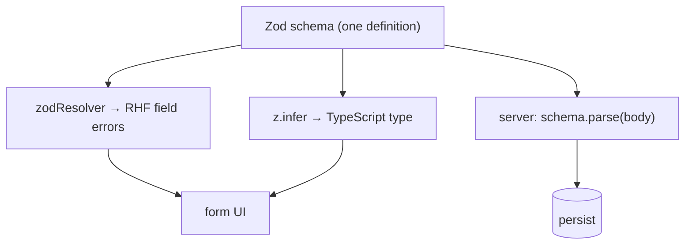

# Schema Validation

> Write the rules once, as a schema. It validates the input, infers the types, and — because it's just data — runs unchanged on the server. Hand-written per-field checks do none of that.

**Part:** [03 · Application Architecture](../) · **Domain:** Forms & Validation · **Priority:** Critical · **Difficulty:** Intermediate · **Reading time:** ~12 min

## TL;DR

Schema validation declares a form's shape and constraints as one object — a Zod schema — instead of scattering `required`, `minLength`, and regex checks across fields and handlers. The schema becomes the single source of truth: a resolver (`zodResolver`) plugs it into React Hook Form so every field validates against it, `z.infer` derives the TypeScript type from it, and the same schema validates the payload on the server. One declaration, three uses. The alternative — imperative per-field validation — duplicates rules, drifts from the types, and can't be reused across the client/server boundary.

> **Recommendation:** Define one Zod schema per form, wire it with `zodResolver`, and derive the form's type with `z.infer`. Validate the same schema on the server. Don't hand-write field-by-field validation for anything beyond a single trivial input.

## At a Glance

| | |
| --- | --- |
| **Use when** | Any form with more than a couple of fields or any non-trivial rule. |
| **Avoid when** | A single input with one rule where a schema is genuinely overkill. |
| **Alternatives** | [Imperative per-field validation](#alternative-approaches); built-in RHF validation rules. |
| **Primary risk** | Treating client-side schema validation as sufficient and skipping the server. |
| **Maturity** | Stable. |

## Prerequisites

- [Client-side validation strategies](./) — when validation runs (see the Forms & Validation index).
- [Controlled inputs](./) — how field values reach the validator (see the index).

## Overview

*Schema validation* expresses a form's rules as a declarative schema — a value that describes valid data — rather than as imperative code that checks each field. With Zod, `z.object({ email: z.string().email(), amount: z.number().positive() })` is a runtime validator and a type source at once. A *resolver* adapts that schema to a form library: `zodResolver(schema)` passed to `useForm` makes React Hook Form validate submitted values against the schema and surface any issues as field errors, keyed by path.

The leverage comes from the schema being ordinary data. Because it's a value, not a function buried in a component, it can be imported and reused. `z.infer<typeof schema>` produces the exact TypeScript type of valid output, so the form's value type and its runtime rules can't drift — change the schema and the type changes with it. The same schema imported on the server validates the request body, so the client and server enforce identical rules from one definition. Imperative validation gives you none of these: the rules, the types, and the server checks are three separate things you maintain by hand.

## The Problem

A signup form starts simple: a `required` here, a regex there, an `onChange` that checks password length. As rules accumulate — email format, password strength, matching confirmation, terms accepted — the validation spreads across `register` options, a couple of `useEffect`s, and the submit handler. The form's TypeScript type is declared separately and slowly diverges from what the checks actually enforce. Then the backend adds its own validation, written independently, and the two disagree: the client accepts a value the server rejects, so the user gets a generic 400 after a clean-looking submit.

Every one of these problems is duplication. The rules exist in multiple places, the type is a fourth copy, and the server is a fifth. Each is maintained separately, so they drift, and drift in validation is user-visible: accepted-then-rejected inputs, error messages that don't match the real constraint, types that lie about what's valid. The fix isn't more careful hand-maintenance — it's collapsing the copies into one schema that the client validation, the types, and the server all consume.

## Why It Matters

Validation is a contract about what data is acceptable, and a contract stated in five places is five contracts. Schema validation makes it one, which is the only way to keep the client rules, the TypeScript types, and the server checks genuinely in sync as the form evolves. That sync is what prevents the most confusing form bugs: a field that passes client validation and fails on the server, or a type that claims a field is a `number` while the input hands the server a string.

It also raises the quality of the errors. A schema attaches a message to each rule and a path to each issue, so a resolver can map errors precisely to fields without a lookup table. And because the schema is declarative, it's readable as documentation — a reviewer sees the entire contract in one object instead of reconstructing it from scattered checks. The payoff compounds on the server: importing the same schema means the trust boundary enforces exactly the client's rules, so validation logic is written and reviewed once. This is the foundation the [type inference](./schema-inferred-types.md) and shared-schema patterns build on.

## Mental Model

Think of the schema as a single stamped template that everything passes through. Input data goes in; either it comes out validated and correctly typed, or you get a list of issues, each tagged with the field path and a message. The form library, the type system, and the server each hold the same stamp.



`safeParse` is the schema's core operation: it returns `{ success: true, data }` with the parsed, typed value, or `{ success: false, error }` whose `issues` array lists each failure with its `path` and `message`. The resolver calls this under the hood and translates issues into RHF's error shape. On the server you call it directly. Same operation, same schema, two consumers — that identity is the entire point.

## Best Practices

Define one schema per form and keep it beside the form. The schema is the form's contract; colocate it (or in a shared module if the server imports it) so there's an obvious single place the rules live. Compose larger schemas from smaller ones (`z.object` nesting) rather than repeating field definitions.

Wire it with `zodResolver`, not parallel `register` rules. Once a schema owns validation, don't also put `required`/`pattern` in `register` — that's a second source of truth. Let the resolver be the only validator so errors and rules come from one place.

Attach a message to every constraint. `z.string().min(1, 'Name is required')` gives the resolver a human message to show. Unmessaged constraints fall back to Zod's default text, which is fine for developers but often wrong for users. The message is part of the contract.

Validate the same schema on the server. Client validation is a UX affordance, not a security boundary — it can be bypassed. Import the schema on the server and `parse`/`safeParse` the request body so the real enforcement uses identical rules. Skipping this is the domain's signature anti-pattern.

Coerce and transform at the schema, not in handlers. Number inputs arrive as strings; `z.coerce.number()` (or `valueAsNumber` on the input) converts at the boundary so the rest of your code sees the right type. Keep these conversions in the schema so the inferred type reflects them.

## Trade-offs

A schema adds a dependency and a declarative layer that a one-field form doesn't need. For anything larger, it removes far more code (and bugs) than it adds, and it's the enabler for typing and server reuse.

**Advantages**

- One declaration drives client validation, types, and server checks — no drift.
- Errors carry per-field paths and messages, mapping cleanly to inputs.
- The schema reads as documentation of the form's contract.

**Disadvantages**

- A dependency and a new concept for the smallest forms.
- Client validation can lull you into skipping the server (a real, common failure).
- Complex conditional rules can make a schema dense to read.

| Dimension | Schema validation | Cost / caveat |
| --- | --- | --- |
| Performance | Validation runs on submit/blur, not per keystroke | Large schemas add minor parse cost |
| Complexity | Rules centralized and declarative | Overkill for a single trivial field |
| Maintainability | Change one schema, everything follows | Conditional logic can get dense |
| Failure behavior | Precise, per-field, messaged errors | False sense of safety if server is skipped |

## Alternative Approaches

The alternatives are imperative validation and the form library's built-in rules — both viable for small cases, neither reusable across the boundary or tied to the types.

| Approach | Best when | Weakness | See |
| --- | --- | --- | --- |
| Schema validation (this article) | Non-trivial forms; client + server share rules | A dependency; overkill for one field | (this article) |
| RHF built-in rules (`register` options) | A couple of simple fields | Rules live in JSX; no server reuse or inferred type | *Client-Side Validation Strategies* (see the [index](./)) |
| Hand-written imperative checks | One rule, one field | Duplicated, drift-prone, untyped | *Client-Side Validation Strategies* (see the index) |

## Bad Example

Rules spread across `register`, an effect, and the submit handler, with a separately declared type.

```tsx
import { useForm } from 'react-hook-form';
import { useEffect } from 'react';

// ❌ The type is declared here and the rules live elsewhere; they drift. Server
// validation is a third, separate implementation not shown — guaranteed to differ.
interface SignupValues {
  email: string;
  password: string;
  confirm: string;
}

function SignupForm() {
  const { register, handleSubmit, watch, setError } = useForm<SignupValues>();
  const password = watch('password');

  // Cross-field rule hidden in an effect — runs on every keystroke, easy to miss.
  useEffect(() => {
    if (watch('confirm') && watch('confirm') !== password) {
      setError('confirm', { message: 'Passwords do not match' });
    }
  }, [password, watch, setError]);

  return (
    <form onSubmit={handleSubmit((data) => submit(data))}>
      <input {...register('email', { required: true, pattern: /^\S+@\S+$/ })} />
      <input type="password" {...register('password', { minLength: 8 })} />
      <input type="password" {...register('confirm', { required: true })} />
      <button type="submit">Sign up</button>
    </form>
  );
}
```

**What goes wrong:** Four sources of truth — `register` rules, the effect, the handler, and the hand-written type — that drift apart. The messages are inconsistent, the type doesn't reflect the real constraints, and none of this is reusable on the server.

## Good Example

One Zod schema, wired with `zodResolver`, driving validation and the type.

```tsx
import { useForm } from 'react-hook-form';
import { zodResolver } from '@hookform/resolvers/zod';
import { z } from 'zod';

// ✅ One declaration. Rules, messages, and the type all come from here.
const signupSchema = z
  .object({
    email: z.string().email('Enter a valid email'),
    password: z.string().min(8, 'At least 8 characters'),
    confirm: z.string(),
  })
  .refine((values) => values.password === values.confirm, {
    message: 'Passwords do not match',
    path: ['confirm'],
  });

type SignupValues = z.infer<typeof signupSchema>;

function SignupForm() {
  const {
    register,
    handleSubmit,
    formState: { errors, isSubmitting },
  } = useForm<SignupValues>({ resolver: zodResolver(signupSchema) });

  return (
    <form onSubmit={handleSubmit((values) => submit(values))}>
      <label htmlFor="email">Email</label>
      <input id="email" type="email" {...register('email')} />
      {errors.email && <span role="alert">{errors.email.message}</span>}

      <label htmlFor="password">Password</label>
      <input id="password" type="password" {...register('password')} />
      {errors.password && <span role="alert">{errors.password.message}</span>}

      <label htmlFor="confirm">Confirm password</label>
      <input id="confirm" type="password" {...register('confirm')} />
      {errors.confirm && <span role="alert">{errors.confirm.message}</span>}

      <button type="submit" disabled={isSubmitting}>Sign up</button>
    </form>
  );
}
```

**Why it's better:** The rules, messages, cross-field check, and type are one object. `zodResolver` maps each issue to its field by `path`, so errors render exactly where they belong. The type is `z.infer`red, so it can't lie about what's valid. And this schema is a plain value the server imports unchanged.

## Production Example

The schema extracted to a shared module and used on both sides — client resolver and server handler — so one definition enforces the contract everywhere.

```ts
// invoice-schema.ts — imported by both the form and the API route.
import { z } from 'zod';

export const invoiceSchema = z.object({
  customer: z.string().min(1, 'Customer is required'),
  // Number inputs arrive as strings; coerce at the boundary so the type is right.
  amountCents: z.coerce.number().int().positive('Amount must be greater than zero'),
  dueDate: z.string().date('Enter a valid date'),
  status: z.enum(['draft', 'sent', 'paid']),
});

export type InvoiceInput = z.infer<typeof invoiceSchema>;
```

```ts
// server route — the trust boundary uses the same schema.
import { invoiceSchema } from './invoice-schema';

export async function createInvoiceHandler(rawBody: unknown): Promise<Response> {
  const result = invoiceSchema.safeParse(rawBody);
  if (!result.success) {
    // Return the same shape of issues the client already understands.
    return Response.json(
      { message: 'Validation failed', issues: result.error.issues },
      { status: 422 },
    );
  }
  const invoice = await persistInvoice(result.data); // result.data is InvoiceInput
  return Response.json(invoice, { status: 201 });
}
```

## Common Mistakes

See the [Forms & Validation anti-patterns](../../../anti-patterns/#forms-validation) for the domain catalog. Concept-specific:

### Mistake: Client-only schema validation

- **Symptom:** The schema validates in the form but the server accepts the raw body unchecked.
- **Why it fails:** Client validation is bypassable; the server is the real trust boundary.
- **Fix:** Import and `parse` the same schema on the server. See [Client-only validation](../../../anti-patterns/client-only-validation.md).

### Mistake: Parallel `register` rules alongside the resolver

- **Symptom:** `required`/`pattern` in `register` *and* a `zodResolver`.
- **Why it fails:** Two validators, two sources of truth, inconsistent messages.
- **Fix:** Once a resolver owns validation, remove the `register` rules.

## Checklist

- [ ] One Zod schema per form owns all field rules and messages.
- [ ] The form uses `zodResolver`; no parallel `register` validation rules.
- [ ] The form's value type is `z.infer`red from the schema, not declared separately.
- [ ] The same schema validates the request body on the server.
- [ ] Coercions/transforms live in the schema so the inferred type is accurate.

## Related Articles

- [Schema-Inferred Types](./schema-inferred-types.md) — deriving the form's type from the schema.
- [Error Messaging](./error-messaging.md) — turning schema issues into accessible field errors.
- Alongside this: *Async & Server Validation*, *Cross-Field Validation* (see the [Forms & Validation index](./)).

## Related Recipes

- [Type-safe form with server mutation](../../../recipes/type-safe-form-with-server-mutation.md) — one schema across form, types, and server.

## Related Examples

- [Zod resolver form](../../../examples/zod-resolver-form.tsx) — the minimal schema-plus-resolver form.

## References

- [Zod — Basic usage](https://zod.dev/?id=basic-usage) — `z.object`, `safeParse`, `refine`.
- [React Hook Form — Schema validation](https://react-hook-form.com/get-started#SchemaValidation) — wiring a resolver.
- [@hookform/resolvers](https://github.com/react-hook-form/resolvers) — `zodResolver` and type inference.
