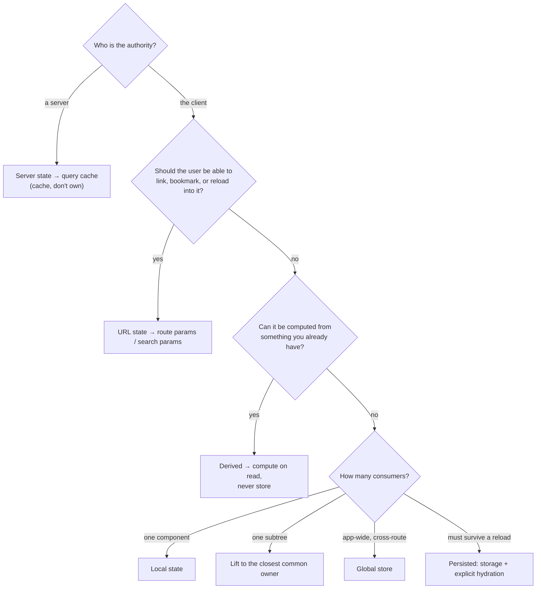

# Categories of State

> "How should I manage state?" is unanswerable until you say *which* state. A cached API response, a modal's open flag, an active filter, and a draft form are four different problems, and one tool cannot be right for all four.

**Part:** [03 · Application Architecture](../) · **Domain:** State Management · **Priority:** Critical · **Difficulty:** Intermediate · **Reading time:** ~12 min

## TL;DR

State in a frontend application divides along three axes: **who owns it** (the server, the client, the URL, the browser, the form), **how long it lives** (one render, one mount, one session, forever), and **how widely it is scoped** (one component, one subtree, one route, the whole app). Classify a piece of state on those axes and the right mechanism follows almost mechanically — server-owned data belongs in a query cache, shareable view state belongs in the URL, a modal flag belongs in the component that owns the modal. The pain teams attribute to "state management" is almost always a category error: server data copied into a store, view state hidden in a component, or a global store holding things that belong to one screen.

> **Recommendation:** Classify before choosing a tool. Server-owned data goes in a server-state cache; anything a user should be able to link or reload goes in the URL; everything else starts local and moves outward only when a second consumer actually appears. Never store what you can derive.

## At a Glance

| | |
| --- | --- |
| **Use when** | Always — before adding state, choosing a library, or debugging why state is hard to keep correct. |
| **Avoid when** | Never; the taxonomy is a thinking tool, not a runtime cost. |
| **Alternatives** | None as a category — this is the classification the rest of the domain builds on. |
| **Primary risk** | Category errors: server data in a store, view state outside the URL, derived values stored as state. |
| **Maturity** | Stable. |

## Prerequisites

- [Elements vs Components](../../02-rendering-frameworks/react/README.md) (`· React`) — what a component owns, and what "re-render" means for state.
- [Primitives & Wrappers](../../01-core-languages/javascript/README.md) (`· JavaScript`) — value versus reference identity, which decides when state changes are observable.

## Overview

*Categories of state* is a classification of everything an application remembers, along the axes that determine how it should be stored. The most useful cut is by **owner**:

- **Server state** — data whose authority lives on a server: invoices, users, permissions. The client holds a cache of it, stale from the moment it arrives.
- **URL state** — what the user is currently looking at: route parameters, filters, sort, page, the open tab, a selected record. Owned by the address bar so it can be linked, bookmarked, and restored.
- **Client state** — state the client is the authority for: a modal's visibility, a wizard's step, a selected row, an unsaved draft.
- **Browser/platform state** — persisted preferences and tokens in `localStorage`, `sessionStorage`, cookies, or IndexedDB, plus platform facts such as online status and viewport size.
- **Form state** — a special case of client state with its own vocabulary (values, dirty, touched, validity) and its own libraries.
- **Derived state** — not state at all: values computed from any of the above. Storing it creates a second source of truth.

Cross-cut those with **lifetime** (this render, this mount, this session, across sessions) and **scope** (component, subtree, route, application) and you have enough to make the mechanism decision without arguing about libraries. Most "state management" debates are really disagreements about which category something is in.

## The Problem

A team is three months into a project and state has become the hardest part of the codebase. The symptoms look unrelated.

The invoices list is copied from an API response into `useState` inside a provider so several screens can read it. Now two screens disagree after a mutation, nothing refetches when the user returns to the tab, and the provider has grown a loading flag, an error flag, a manual refresh function, and a race condition on unmount.

The filters panel keeps its state in a component. Users cannot share a filtered view, refreshing loses the filters, and the browser back button moves them off the page instead of undoing the last filter change — so the team adds a custom history stack.

A global store holds `isSidebarOpen`, `selectedRowId`, `currentTheme`, and `checkoutStep`. Every one of those is written by one screen and read by one screen, but each update re-renders subscribers across the app, so someone adds selectors and memoization to fix performance in code that never needed to be global.

And a `totalPrice` field is stored next to `items`, updated in three places, and occasionally disagrees with the items it summarizes.

Four problems, one cause: none of these pieces of state was classified before it was placed. The invoices are server state, the filters are URL state, the flags are local client state, and the total is derived. Each is in the wrong home, and each wrong home generates its own maintenance work.

## Why It Matters

The mechanism you choose for a piece of state determines which problems you get for free and which you hand-build. Put server data in a query cache and deduplication, staleness, background revalidation, retry, and cancellation come with it; put the same data in a store and you will reimplement all five, badly, one bug report at a time. Put view state in the URL and shareable links, reload survival, and back-button behavior are free; keep it in a component and you will write a history mechanism. The category *is* the requirement list.

Misclassification also has a compounding cost. A global store holding local flags spreads unrelated re-renders across the app, which teams then treat as a performance problem to be solved with selectors and memoization — complexity added to compensate for a placement mistake. Stored derived values need synchronization code, and every synchronization path is a chance to be stale. Each category error looks small and each generates permanent maintenance.

Finally, the taxonomy is what makes the decision *reviewable*. "Should this be in Zustand?" is a matter of taste; "is this server-owned, and can the user link to it?" has an answer that two engineers can agree on. That is why this article is the entry point to the domain: every later decision — local versus lifted versus global, colocated versus centralized, reducer versus atoms — presumes you already know which category you are placing.

## Mental Model

Ask three questions in order, and stop as soon as the answer places the state.



Two notes on using this. The order matters: authority beats scope. A piece of server data read by one component is still server state, and putting it in `useState` because "only one component needs it" is the most common category error. And the last question is deliberately about *actual* consumers, not anticipated ones — a second consumer that does not exist yet is not a reason to globalize, because moving state outward later is a small, local refactor while narrowing a global store is not.

Lifetime is the axis people forget. State that must survive a reload needs an explicit persistence and hydration story — including what happens when the stored shape is from an older version of your app. State that must survive only a mount is often better held outside React entirely (a ref) if it does not affect rendering.

## Best Practices

Classify before choosing. Name the owner, the lifetime, and the scope in one sentence. If you cannot, the state is probably two things that should be split.

Treat server data as a cache, never as owned state. It is stale on arrival, shared across components, and changes without the client knowing. Use a server-state cache and let it be the single source of truth — see [Server vs Client State](./server-vs-client-state.md).

Put anything shareable in the URL. Filters, sort, page, tab, selected ID, search query. The test is: would a user reasonably paste this link to a colleague, or expect a reload to preserve it? If yes, it belongs in search params or route params.

Start local and move outward on evidence. Local state is the cheapest to reason about and delete. Lift when a second component genuinely needs it; globalize only when the state crosses routes or has no natural common owner.

Never store what you can derive. A total, a filtered list, a count, an index, a "is form valid" flag — compute them. A stored derivation needs synchronization, and synchronization goes stale.

Keep one source of truth per fact. Two places that both claim to know the current user, the selected row, or the item count will eventually disagree. If a value must exist in two shapes, one of them is derived.

Model state so invalid combinations cannot exist. `isLoading`, `isError`, and `data` as three independent fields admits states that are nonsense; a single discriminated value does not. This is the state-machine instinct applied early.

Give persisted state a version and a fallback. Anything in `localStorage` will one day be read by a newer version of your app that expects a different shape. Validate on read, and fall back rather than crash.

Don't put platform facts in state you maintain. Online status, viewport size, media queries, and reduced-motion preferences have platform APIs and events; subscribe to them rather than snapshotting into a store that drifts.

Keep non-rendering values out of state. A timer ID, a scroll position you only read on unmount, or a latest-value cache belongs in a ref: state exists to trigger renders, and using it for values that shouldn't causes wasted work.

## Trade-offs

The taxonomy costs nothing at runtime; its cost is discipline. The trade-off is up front: a few minutes of classification against the maintenance a misplaced piece of state generates for as long as it lives.

**Advantages**

- The mechanism decision follows from the classification, so it is reviewable rather than a matter of taste.
- Each category comes with a tool that already solves its characteristic problems.
- Category errors become nameable in review ("that's server state in a store") instead of vague unease.
- Fewer sources of truth means fewer synchronization bugs.

**Disadvantages**

- More distinct mechanisms in one codebase than "everything in one store" — each with its own idioms.
- Boundary cases exist: a draft of server data, an optimistic value, a filter that is also a saved preference.
- Requires the team to share the vocabulary; half-adopted, it is just more opinions.

| Dimension | Classified state | One store for everything |
| --- | --- | --- |
| Correctness | Each category's failure modes handled by its tool | Server-state features hand-built and incomplete |
| Re-render scope | Naturally narrow: local stays local | Broad by default; needs selectors to claw back |
| Shareability | URL state gives links and reload survival free | View state lost on reload |
| Onboarding | Several mechanisms, each conventional | One mechanism, many bespoke conventions inside it |
| Refactoring | Moving state outward is a local change | Narrowing global state touches many consumers |

## Alternative Approaches

There is no alternative to *having* a taxonomy — state has an owner, a lifetime, and a scope whether or not you name them. The alternatives are different cuts of the same reality, and the useful ones are complementary.

| Approach | Best when | Weakness | See |
| --- | --- | --- | --- |
| By owner, lifetime, scope (this article) | Deciding where a new piece of state should live | Boundary cases need judgment | (this article) |
| Server vs client split only | The app is mostly a client for one API | Says nothing about URL, derived, or scope | [Server vs Client State](./server-vs-client-state.md) |
| UI vs domain split | Reasoning about what to test and what to persist | Orthogonal to ownership; not a placement rule by itself | [UI vs Domain State](./ui-vs-domain-state.md) |
| Ephemeral vs persistent split | Designing storage, hydration, and versioning | Ignores scope and authority | [Ephemeral vs Persistent State](./README.md) (planned) |

## Bad Example

One provider holding four categories at once — the shape that makes state feel unmanageable.

```tsx
import { createContext, useCallback, useContext, useEffect, useState } from 'react';

// ❌ Server state, URL state, local UI state, and derived state in one place.
const AppStateContext = createContext<AppState | null>(null);

function AppStateProvider({ children }: { children: React.ReactNode }) {
  // (1) Server state copied into client state: no dedupe, no staleness, no
  //     revalidation, no cancellation — all of it hand-built below, badly.
  const [invoices, setInvoices] = useState<Invoice[]>([]);
  const [loading, setLoading] = useState(true);
  const [error, setError] = useState<string | null>(null);

  // (2) URL state held in memory: filters can't be linked, don't survive a
  //     reload, and the back button leaves the page instead of undoing them.
  const [statusFilter, setStatusFilter] = useState<'all' | 'unpaid'>('all');
  const [page, setPage] = useState(1);

  // (3) Local UI flags promoted to app scope: every toggle re-renders every
  //     consumer of this context, across every route.
  const [isSidebarOpen, setSidebarOpen] = useState(false);
  const [selectedRowId, setSelectedRowId] = useState<string | null>(null);

  // (4) Derived value stored as state, with its own update path — so it can
  //     disagree with `invoices`.
  const [unpaidTotal, setUnpaidTotal] = useState(0);

  useEffect(() => {
    setLoading(true);
    fetch(`/api/invoices?status=${statusFilter}&page=${page}`)
      .then((r) => r.json())
      .then((data: Invoice[]) => {
        setInvoices(data);
        // Two writes for one fact: the list and its summary are now separate
        // sources of truth.
        setUnpaidTotal(data.filter((i) => !i.paid).reduce((s, i) => s + i.amount, 0));
        setLoading(false);
      })
      .catch((e: Error) => setError(e.message));
    // No cleanup: a fast filter change races and the loser can win.
  }, [statusFilter, page]);

  const refresh = useCallback(() => setPage((p) => p), []); // doesn't even refetch

  return (
    <AppStateContext.Provider
      value={{
        invoices, loading, error, refresh,
        statusFilter, setStatusFilter, page, setPage,
        isSidebarOpen, setSidebarOpen, selectedRowId, setSelectedRowId,
        unpaidTotal,
      }}
    >
      {children}
    </AppStateContext.Provider>
  );
}
```

**What goes wrong:** Every category is in the wrong home, and each one generates its own class of bug. The copied server data has no cache semantics, so screens disagree after a write and a stale response can overwrite a fresh one. The filters cannot be shared or restored. The sidebar flag re-renders the entire application because the context value is a new object on every state change. And `unpaidTotal` is a second source of truth for something the list already contains. None of this is fixed by switching context for a store — the placement is the problem.

## Good Example

The same feature with each category in its own home.

```tsx
import { useEffect, useState } from 'react';
import { useQuery } from '@tanstack/react-query';
import { useSearchParams } from 'react-router-dom';

interface Invoice {
  id: string;
  amount: number;
  paid: boolean;
}

type StatusFilter = 'all' | 'unpaid';

// ✅ Server state: owned by the server, cached by the client. Dedupe,
// staleness, revalidation, retry, and cancellation come from the cache.
function useInvoices(status: StatusFilter, page: number) {
  return useQuery({
    queryKey: ['invoices', 'list', { status, page }],
    queryFn: async ({ signal }): Promise<Invoice[]> => {
      const response = await fetch(`/api/invoices?status=${status}&page=${page}`, { signal });
      if (!response.ok) {
        throw new Error(`Failed to load invoices (${response.status})`);
      }
      return (await response.json()) as Invoice[];
    },
    staleTime: 30_000,
  });
}

export function InvoicesScreen() {
  // ✅ URL state: linkable, bookmarkable, survives reload, and the back
  // button undoes a filter change instead of leaving the page.
  const [params, setParams] = useSearchParams();
  const status = (params.get('status') as StatusFilter) ?? 'all';
  const page = Math.max(1, Number(params.get('page') ?? 1));

  const setStatus = (next: StatusFilter) =>
    setParams((current) => {
      const updated = new URLSearchParams(current);
      updated.set('status', next);
      updated.set('page', '1'); // a new filter starts at the first page
      return updated;
    });

  const { data, isLoading, isError, error } = useInvoices(status, page);

  // ✅ Local client state: one owner, one consumer, no reason to go further.
  const [selectedId, setSelectedId] = useState<string | null>(null);

  if (isLoading) return <InvoiceSkeleton />;
  if (isError) return <p role="alert">Couldn’t load invoices: {error.message}</p>;

  // ✅ Derived on read: cannot disagree with the list it summarizes.
  const unpaidTotal = data
    .filter((invoice) => !invoice.paid)
    .reduce((sum, invoice) => sum + invoice.amount, 0);

  return (
    <>
      <StatusTabs value={status} onChange={setStatus} />
      <p>Unpaid total: {formatCurrency(unpaidTotal)}</p>
      <InvoiceTable
        invoices={data}
        selectedId={selectedId}
        onSelect={setSelectedId}
      />
    </>
  );
}

// ✅ Platform/browser state: subscribed, not snapshotted, so it cannot drift.
export function useIsOnline(): boolean {
  const [online, setOnline] = useState(() => navigator.onLine);
  useEffect(() => {
    const update = () => setOnline(navigator.onLine);
    window.addEventListener('online', update);
    window.addEventListener('offline', update);
    return () => {
      window.removeEventListener('online', update);
      window.removeEventListener('offline', update);
    };
  }, []);
  return online;
}
```

**Why it's better:** Nothing is copied and nothing is duplicated. The invoice list has one home — the cache — so every screen sees the same value and a mutation updates all of them. Filters live in the URL, so links work and reload preserves the view. The selected row is local because exactly one component cares. The total is computed, so it cannot drift. And there is no application-wide provider re-rendering unrelated screens when a sidebar toggles.

## Production Example

Real applications have boundary cases, and the useful move is to split them rather than force one category. A "saved view" is URL state *and* persisted preference; an editable record is server state *and* a local draft.

```tsx
import { useEffect, useState } from 'react';
import { useMutation, useQuery, useQueryClient } from '@tanstack/react-query';
import { useSearchParams } from 'react-router-dom';
import { z } from 'zod';

/**
 * Boundary case 1 — a filter set that is both linkable and remembered.
 * Split it: the URL is authoritative for *this* visit; storage only supplies
 * a default when the URL says nothing.
 */
const savedViewSchema = z.object({
  version: z.literal(1), // ✅ persisted shapes need a version and a fallback
  status: z.enum(['all', 'unpaid']),
});

function readSavedView(): { status: 'all' | 'unpaid' } {
  try {
    const parsed = savedViewSchema.safeParse(
      JSON.parse(localStorage.getItem('invoices:view') ?? 'null'),
    );
    return parsed.success ? { status: parsed.data.status } : { status: 'all' };
  } catch {
    return { status: 'all' };
  }
}

export function useInvoiceView() {
  const [params, setParams] = useSearchParams();
  const fromUrl = params.get('status') as 'all' | 'unpaid' | null;
  const status = fromUrl ?? readSavedView().status;

  // Persist as a *default for next time*, never as the source of truth now.
  useEffect(() => {
    localStorage.setItem(
      'invoices:view',
      JSON.stringify({ version: 1, status } satisfies z.infer<typeof savedViewSchema>),
    );
  }, [status]);

  return {
    status,
    setStatus: (next: 'all' | 'unpaid') =>
      setParams((current) => {
        const updated = new URLSearchParams(current);
        updated.set('status', next);
        return updated;
      }),
  };
}

/**
 * Boundary case 2 — editing server data. The record is server state; the
 * user's unsaved edits are client state with a different lifetime. Keeping
 * them separate is what makes "discard changes" and "server changed while
 * you were editing" expressible.
 */
export function useInvoiceEditor(invoiceId: string) {
  const queryClient = useQueryClient();
  const record = useQuery({
    queryKey: ['invoices', 'detail', invoiceId],
    queryFn: () => fetchInvoice(invoiceId),
  });

  // ✅ The draft is not a copy of server state — it is the set of pending
  // changes, initialized empty and cleared on save.
  const [draft, setDraft] = useState<Partial<Invoice>>({});
  const isDirty = Object.keys(draft).length > 0;

  const save = useMutation({
    mutationFn: () => patchInvoice(invoiceId, draft),
    onSuccess: (updated) => {
      queryClient.setQueryData(['invoices', 'detail', invoiceId], updated);
      setDraft({}); // ✅ server value becomes the truth again
    },
  });

  return {
    // Reads are server value overlaid with pending edits — derived, not stored.
    value: record.data ? { ...record.data, ...draft } : undefined,
    isDirty,
    setField: <K extends keyof Invoice>(key: K, value: Invoice[K]) =>
      setDraft((current) => ({ ...current, [key]: value })),
    discard: () => setDraft({}),
    save,
    query: record,
  };
}
```

Both cases follow the same rule: when a piece of state seems to belong to two categories, it is usually two pieces of state with different owners and lifetimes. Splitting them makes the hard questions answerable — which value wins on reload, what "discard" means, and what happens when the server's copy changes while a draft exists — instead of hiding them inside one merged value.

## Common Mistakes

See the [State Management anti-patterns](../../../anti-patterns/README.md#state-management) for the domain catalog. Concept-specific:

### Mistake: Copying server data into client state

- **Symptom:** `useEffect` fetches, `useState` stores, and every cache feature is hand-rolled — usually incompletely.
- **Why it fails:** Server data is shared, stale on arrival, and changes without the client knowing; owning a copy means owning deduplication, staleness, retry, and cancellation too.
- **Fix:** Use a server-state cache as the source of truth; see [Treating server cache as client state](../../../anti-patterns/server-cache-as-client-state.md).

### Mistake: Keeping shareable view state out of the URL

- **Symptom:** Filters, tabs, and pagination vanish on reload; links don't reproduce what the sender saw; back exits the page.
- **Why it fails:** The URL is the platform's mechanism for "what am I looking at"; reimplementing it in memory discards linking, restoration, and history for free.
- **Fix:** Move filters, sort, page, tab, and selected ID into search or route params.

### Mistake: Global by default

- **Symptom:** A store holding modal flags, hover states, and per-screen selections; broad re-renders that then need selectors and memoization.
- **Why it fails:** Scope determines re-render breadth and coupling; globalizing local state pays those costs for no benefit.
- **Fix:** Start local; lift to the closest common owner when a second consumer appears.

### Mistake: Storing derived values

- **Symptom:** A total, count, or filtered list kept in state and updated alongside its inputs — and occasionally disagreeing with them.
- **Why it fails:** A stored derivation is a second source of truth that must be synchronized on every path that touches its inputs.
- **Fix:** Compute on read, memoized if expensive; see [Computed Values](./README.md) (planned).

### Mistake: Persisting without a version or validation

- **Symptom:** A crash or blank screen for returning users after a release that changed a stored shape.
- **Why it fails:** Storage outlives your code, so old shapes are read by new code that assumes the new shape.
- **Fix:** Version persisted state, validate on read, and fall back to a default instead of trusting it.

### Mistake: Using state for values that don't render

- **Symptom:** Timer IDs, previous values, and scroll offsets in `useState`, causing renders nobody observes.
- **Why it fails:** State exists to trigger rendering; storing non-visual values there does work for no output.
- **Fix:** Use a ref for values read imperatively and never rendered.

## Checklist

- [ ] Every piece of state can be described as owner + lifetime + scope in one sentence.
- [ ] Server-owned data lives in a server-state cache, not in component state or a store.
- [ ] Anything a user could link to or expect to survive reload is in the URL.
- [ ] Nothing stored can be derived from something else that is stored.
- [ ] Each fact has exactly one source of truth.
- [ ] State starts local and moves outward only when a second consumer exists.
- [ ] Persisted state is versioned, validated on read, and has a safe fallback.
- [ ] Platform facts are subscribed to, not snapshotted.
- [ ] Values that never render are refs, not state.
- [ ] Impossible combinations are unrepresentable rather than merely avoided.

## Related Articles

- [Server vs Client State](./server-vs-client-state.md) — the ownership boundary that decides the most consequential category.
- [UI vs Domain State](./ui-vs-domain-state.md) — separating presentation concerns from business meaning.
- [Local State](./local-state.md) — the default home for client state, and when it stops being enough.
- [Lifting State Up](./lifting-state-up.md) — the first move outward when a second consumer appears.
- [Cache Keys & Query Identity](../data-server-state/cache-keys-and-query-identity.md) — how server state is identified once it is cached (`· Data & Server State`).
- [Derived Server Data](../data-server-state/derived-server-data.md) — the "never store what you can derive" rule applied to cached responses.

## References

- [React — Choosing the State Structure](https://react.dev/learn/choosing-the-state-structure) — avoiding redundant, duplicated, and contradictory state.
- [MDN — URLSearchParams](https://developer.mozilla.org/en-US/docs/Web/API/URLSearchParams) — the platform mechanism for the URL-state category.
