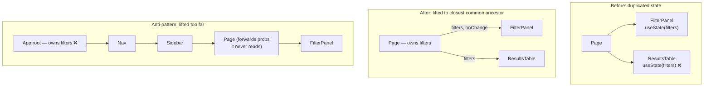

# Lifting State Up

> Two components need the same value, so ownership moves to the nearest ancestor that contains both. The discipline is in "nearest": lift one level too far and you have re-rendered a page to coordinate two siblings.

**Part:** [03 · Application Architecture](../) · **Domain:** State Management · **Priority:** Critical · **Difficulty:** Intermediate · **Reading time:** ~12 min

## TL;DR

When a second component genuinely needs a piece of state, move ownership up to the closest common ancestor of every component that reads or writes it, and pass the value down with callbacks for changes. That makes the ancestor the single source of truth and turns the children into controlled components — predictable, testable, and reusable. Two failure modes bracket the technique: lifting too far, which re-renders large subtrees and threads props through components that do not care, and refusing to lift, which produces duplicated state that silently disagrees. When the plumbing genuinely hurts, the first fix is usually composition — passing elements as props — rather than context or a store.

> **Recommendation:** Lift to the closest common ancestor, not to the top. Pass values down and intents up. If prop threading becomes painful, restructure with composition first; reach for context only when many layers of unrelated components sit in between, and for a store only when the value crosses routes.

## At a Glance

| | |
| --- | --- |
| **Use when** | Two or more components in the same subtree must read or write one value, and it must stay in sync. |
| **Avoid when** | Only one component needs it (keep it local), or consumers span routes (a store or the URL is the honest answer). |
| **Alternatives** | [Global State](#alternative-approaches) (cross-route); [Colocation vs Centralization](#alternative-approaches) (the wider placement question); composition. |
| **Primary risk** | Lifting too high — broad re-renders and props threaded through components that don't use them. |
| **Maturity** | Stable. |

## Prerequisites

- [Local State](./local-state.md) — the default this technique moves away from, and the skills that still apply after lifting.
- [Categories of State](./categories-of-state.md) — confirming the value is client-owned and not really URL or server state.

## Overview

*Lifting state up* means relocating a `useState` (or reducer) from a child to an ancestor that contains every component involved with the value, then passing the value down as a prop and changes back up as callbacks. The ancestor becomes the single owner; children become *controlled* — they render what they are given and report intent rather than deciding.

The rule is "closest common ancestor," and both words matter. *Common* guarantees the ancestor can reach every consumer; *closest* bounds the cost, because React re-renders from the owner downward, so every extra level of lift widens the subtree that re-renders on every change and adds a component that must accept and forward a prop it does not use.

It is worth separating the two problems that get conflated here. Lifting solves *shared truth* — two components agreeing on one value. Prop threading is a *delivery* problem, and it has its own solutions: restructuring with composition, passing elements as props, or (when the distance is genuinely large and the intermediate components genuinely unrelated) context. Reaching for context because two levels of props feel tedious usually trades a small annoyance for a wider re-render surface and a less obvious data flow.

## The Problem

A filter panel and a results table are siblings. Each keeps its own copy of the active filters, because each was built independently.

The first symptom is disagreement: the panel shows "Unpaid" while the table shows everything, because the panel's `setFilters` never reached the table. The quick fix is an event bus — the panel emits, the table listens — which works and makes the data flow invisible: nothing in either component's code says where the value comes from.

The second attempt lifts the filters, but to the application root, because that is where "shared things" live. Now every filter keystroke re-renders the entire page — navigation, sidebar, footer — and `filters` plus `setFilters` are threaded through five components that do not use them, each of which now has two extra props in its signature and its test fixtures.

The third attempt replaces the props with a context at the root, which removes the threading but not the re-render breadth: every consumer of that context re-renders on every filter change, including a header that only reads the user's name from the same provider.

Meanwhile a fourth problem appears in a form. A parent passes `defaultValue` to an input that keeps its own state, so the parent cannot read what the user typed and adds a `ref` plus an imperative getter to fetch it at submit time. The value has two owners and a hidden read path.

All four are the same question answered badly: who owns this value, and where is the nearest place that can.

## Why It Matters

Duplicated state is the most reliable source of "the UI contradicts itself" bugs, and it cannot be fixed by synchronization — every sync path is another chance to be stale, and event buses make the flow unreadable in the process. Lifting removes the class of bug by construction: there is one value, so there is nothing to keep in sync. That is a structural fix rather than a discipline fix, which is why it is the standard answer.

The cost of over-lifting is quieter but compounds. Ownership height determines re-render breadth: state at the root means every change re-renders the tree beneath it, and teams then reach for `memo` and selectors to recover performance they gave away by placement. It also determines coupling — a component that forwards props it never reads is now a dependency of a feature it has nothing to do with, and its signature and tests carry that weight indefinitely. Both costs are invisible on the day the state is lifted and obvious a year later.

Getting this right also makes components reusable in a way that local state does not. A controlled input can be driven by a form, a filter bar, or a test; an uncontrolled one that owns its value can only be observed through refs. "Lift the state, control the child" is what makes a component library possible — which is why the pattern shows up in every design system, not just in application code.

## Mental Model

Find the consumers, find their nearest shared ancestor, put the state there. Data flows down as props; intent flows up as callbacks. Nothing else changes.



Three things follow. The owner is the *nearest* ancestor containing all consumers — not the root, and not a convenient provider that happens to exist. Children become controlled: they take `value` and `onChange` and hold no copy, which is what makes them predictable and reusable. And the callback should express intent (`onFilterChange`, `onSelect`) rather than being a raw setter, so the set of possible writes stays small and every write is greppable in the owner.

When the distance between owner and consumer is uncomfortable, check the shape before changing the mechanism. Often the intermediate components are only in the path because of how the tree was assembled, and passing the consumer *as an element* to the intermediate component removes the plumbing entirely — the owner renders the child with the props it needs, and the middle layer just places it.

## Best Practices

Find the actual consumers first. List the components that read the value and the ones that write it; the owner is the nearest ancestor of that set. Anticipated consumers do not count.

Lift the minimum. If two siblings share the filter but only one needs the draft input value, lift the filter and leave the draft local. Lifting a whole state object because one field is shared widens re-renders unnecessarily.

Make children controlled, and complete. A controlled component takes `value` and an `onChange`; it should not also keep a copy "for responsiveness." Half-controlled components are the source of cursor jumps and lost keystrokes.

Pass intent, not setters. `onSelect(id)` documents what the child can do; `setState` lets it do anything and makes the owner's write paths untraceable.

Prefer composition over threading. If a prop passes through components that do not read it, consider passing the consuming element as a prop (`children`, `header`, `toolbar`) so the owner renders it directly. This removes the intermediate props without introducing context.

Use context for distance, not for sharing. Context solves "many unrelated layers in between," not "two components need this." When you do use it, scope the provider to the subtree that needs it and split providers by change frequency so a fast-changing value does not re-render consumers of a stable one.

Keep the owner's state minimal and derived values derived. Lifting does not change the "don't store what you can derive" rule; a lifted derived value is worse, because now more components depend on it.

Reset lifted state by identity. If the shared value should start fresh for a new record, key the owner or the subtree rather than clearing fields in an effect.

Watch the re-render surface after lifting. If the owner renders an expensive subtree that does not depend on the value, split the component or memoize the independent part — but treat that as a signal you may have lifted too far.

Don't use an event bus to avoid lifting. It hides the data flow, leaves two copies of the state, and makes the value's provenance unfindable by reading the components.

## Trade-offs

Lifting trades locality for shared truth. It removes duplication and makes children reusable, at the cost of a wider re-render surface and some prop plumbing — costs that grow with how far you lift, which is why "closest" is the whole discipline.

**Advantages**

- One source of truth: siblings cannot disagree.
- Children become controlled, so they are predictable, testable, and reusable.
- Data flow is explicit and readable from the component signatures.
- No library, no provider, no new concepts.

**Disadvantages**

- Re-renders the owner's subtree on every change.
- Props may pass through components that do not use them.
- The owner accumulates state and handlers that are not about its own rendering.
- Tempting to over-lift, which converts a local concern into a page-wide one.

| Dimension | Local | Lifted (closest ancestor) | Lifted to root / context | Global store |
| --- | --- | --- | --- | --- |
| Sources of truth | One, private | One, shared in a subtree | One, app-wide | One, app-wide |
| Re-render surface | Owning subtree | Ancestor's subtree | Whole tree / all consumers | All subscribers |
| Plumbing | None | Props, few levels | None (context) but implicit flow | Imports |
| Reusability of children | Low (owns its value) | High (controlled) | High | High, but coupled to the store |
| Cost to change later | Trivial | Small | Moderate | High |

## Alternative Approaches

Lifting answers "two components in one subtree need one value." When the consumers are further apart or the value outlives the subtree, other mechanisms are more honest.

| Approach | Best when | Weakness | See |
| --- | --- | --- | --- |
| Lifting to the closest ancestor (this article) | Consumers share a nearby ancestor | Re-renders the subtree; some prop passing | (this article) |
| Composition (elements as props) | Props pass through uninterested layers | Requires restructuring the tree | [React docs](https://react.dev/learn/passing-data-deeply-with-context) |
| Context in a scoped provider | Many unrelated layers between owner and consumers | Implicit flow; all consumers re-render | `Global State · State Management` (planned) |
| [Global State](./README.md) (planned) | The value crosses routes or has no common ancestor | App-wide coupling; broad re-renders | `Global State · State Management` |
| URL state | The value describes what the user is looking at | Serialisable values only | [Categories of State](./categories-of-state.md) |

## Bad Example

Duplicated sibling state, then over-correction: lifted to the root and threaded through uninterested components.

```tsx
import { useState } from 'react';

// ❌ Attempt 1: two owners of one value, kept in sync by an event bus.
function FilterPanel() {
  const [filters, setFilters] = useState<Filters>({ status: 'all' });
  const update = (next: Filters) => {
    setFilters(next);
    // The flow is now invisible: nothing in ResultsTable says where its
    // filters come from, and there are still two copies to disagree.
    eventBus.emit('filters:changed', next);
  };
  return <StatusSelect value={filters.status} onChange={(status) => update({ status })} />;
}

function ResultsTable() {
  const [filters, setFilters] = useState<Filters>({ status: 'all' });
  useEffect(() => {
    const off = eventBus.on('filters:changed', setFilters);
    return off;
  }, []);
  return <Table filters={filters} />;
}

// ❌ Attempt 2: lifted all the way to the root, "because it's shared".
function App() {
  const [filters, setFilters] = useState<Filters>({ status: 'all' });
  const [user, setUser] = useState<User | null>(null);
  // Every filter keystroke re-renders Nav, Sidebar, Footer — none of which
  // read `filters`.
  return (
    <Layout>
      <Nav filters={filters} setFilters={setFilters} />
      <Sidebar filters={filters} setFilters={setFilters} />
      <Footer />
    </Layout>
  );
}

// Threading through components that don't use the props at all.
function Nav({ filters, setFilters }: SharedProps) {
  return <NavInner filters={filters} setFilters={setFilters} />;
}
function NavInner({ filters, setFilters }: SharedProps) {
  // Two props in the signature, two more in every test fixture, zero uses.
  return <Breadcrumbs />;
}

// ❌ Attempt 3: half-controlled input — parent can't read it without a ref.
function NameField({ defaultValue }: { defaultValue: string }) {
  const [value, setValue] = useState(defaultValue);
  return <input value={value} onChange={(e) => setValue(e.target.value)} />;
}
function Form() {
  const inputRef = useRef<HTMLInputElement>(null);
  // A hidden read path: the value's owner is the child, but the parent needs
  // it, so it reaches into the DOM at submit time.
  const submit = () => save(inputRef.current?.value);
  return <NameField defaultValue="" />;
}
```

**What goes wrong:** Attempt 1 keeps two owners and adds an invisible coupling — a reader of `ResultsTable` cannot tell where its filters come from, and the copies can still drift. Attempt 2 fixes the duplication but pays for it with tree-wide re-renders on every keystroke and props threaded through four components that never read them; passing raw `setFilters` also means any of them could write anything. Attempt 3 leaves the value owned by the child, so the parent resorts to a DOM read — untestable, and wrong the moment the input is re-implemented.

## Good Example

Lifted exactly one level, children controlled, intents passed up, and composition used where the tree would otherwise force threading.

```tsx
import { useCallback, useState } from 'react';

interface Filters {
  status: 'all' | 'unpaid';
  search: string;
}

/**
 * ✅ Owner is the closest common ancestor of FilterPanel and ResultsTable —
 * the page, not the app. Re-renders are bounded to this subtree.
 */
export function InvoicesPage() {
  const [filters, setFilters] = useState<Filters>({ status: 'all', search: '' });

  // ✅ Intents, not a raw setter: the write paths are named and greppable.
  const setStatus = useCallback(
    (status: Filters['status']) => setFilters((current) => ({ ...current, status })),
    [],
  );
  const setSearch = useCallback(
    (search: string) => setFilters((current) => ({ ...current, search })),
    [],
  );

  return (
    <>
      <FilterPanel filters={filters} onStatusChange={setStatus} onSearchChange={setSearch} />
      <ResultsTable filters={filters} />
    </>
  );
}

/**
 * ✅ Fully controlled: takes the value, reports changes, keeps no copy.
 * Reusable in a page, a modal, or a test with no changes.
 */
function FilterPanel({
  filters,
  onStatusChange,
  onSearchChange,
}: {
  filters: Filters;
  onStatusChange: (status: Filters['status']) => void;
  onSearchChange: (search: string) => void;
}) {
  return (
    <div>
      <StatusSelect value={filters.status} onChange={onStatusChange} />
      <input
        value={filters.search}
        onChange={(event) => onSearchChange(event.target.value)}
        aria-label="Search invoices"
      />
      {/* ✅ Local state stays local: this panel's own disclosure isn't lifted. */}
      <AdvancedOptions />
    </div>
  );
}

function AdvancedOptions() {
  // Nobody outside needs this, so it never leaves.
  const [expanded, setExpanded] = useState(false);
  return (
    <>
      <button type="button" onClick={() => setExpanded((open) => !open)} aria-expanded={expanded}>
        Advanced
      </button>
      {expanded && <OptionsForm />}
    </>
  );
}

/**
 * ✅ Composition instead of threading: Layout places children without
 * knowing anything about filters, so no intermediate props exist at all.
 */
export function AppShell() {
  return (
    <Layout nav={<Nav />} sidebar={<Sidebar />}>
      <InvoicesPage />
    </Layout>
  );
}

function Layout({
  nav,
  sidebar,
  children,
}: {
  nav: React.ReactNode;
  sidebar: React.ReactNode;
  children: React.ReactNode;
}) {
  // Layout has no filter props to forward — it just positions elements.
  return (
    <div className="shell">
      <header>{nav}</header>
      <aside>{sidebar}</aside>
      <main>{children}</main>
    </div>
  );
}
```

**Why it's better:** There is one owner and one value, so the panel and the table cannot disagree, and the flow is readable from the signatures — no bus, no hidden subscription. Ownership sits at the page, so a keystroke re-renders the page's subtree rather than the application. The panel is fully controlled and therefore reusable and testable, while its own disclosure state stays local because nobody else needs it. And `Layout` takes elements rather than data, so the props never pass through components that do not care about them.

## Production Example

Lifting for a compound component: one owner coordinates several children, exposes intents, and stays useful either controlled or uncontrolled — the pattern design systems use.

```tsx
import { createContext, useCallback, useContext, useId, useMemo, useState } from 'react';

interface AccordionContextValue {
  openIds: ReadonlySet<string>;
  toggle: (id: string) => void;
  baseId: string;
}

/**
 * ✅ Context is used for DISTANCE within one component's own subtree — the
 * items may be nested arbitrarily by the consumer — not as app-wide state.
 * The provider is scoped to this accordion instance.
 */
const AccordionContext = createContext<AccordionContextValue | null>(null);

function useAccordion(): AccordionContextValue {
  const context = useContext(AccordionContext);
  if (!context) {
    throw new Error('Accordion.Item must be rendered inside <Accordion>');
  }
  return context;
}

interface AccordionProps {
  children: React.ReactNode;
  allowMultiple?: boolean;
  /** Controlled mode: the parent owns the open set. */
  openIds?: ReadonlySet<string>;
  onOpenChange?: (openIds: ReadonlySet<string>) => void;
  defaultOpenIds?: readonly string[];
}

export function Accordion({
  children,
  allowMultiple = false,
  openIds: controlledOpenIds,
  onOpenChange,
  defaultOpenIds = [],
}: AccordionProps) {
  const baseId = useId();

  // ✅ Uncontrolled fallback. The component supports BOTH modes without ever
  // holding a copy of a controlled value — the classic half-controlled bug.
  const [uncontrolled, setUncontrolled] = useState<ReadonlySet<string>>(
    () => new Set(defaultOpenIds),
  );
  const isControlled = controlledOpenIds !== undefined;
  const openIds = isControlled ? controlledOpenIds : uncontrolled;

  const toggle = useCallback(
    (id: string) => {
      const next = new Set(openIds);
      if (next.has(id)) {
        next.delete(id);
      } else {
        if (!allowMultiple) next.clear();
        next.add(id);
      }
      // ✅ In controlled mode the parent is the only writer; we just report.
      if (!isControlled) setUncontrolled(next);
      onOpenChange?.(next);
    },
    [openIds, allowMultiple, isControlled, onOpenChange],
  );

  const value = useMemo<AccordionContextValue>(
    () => ({ openIds, toggle, baseId }),
    [openIds, toggle, baseId],
  );

  return <AccordionContext.Provider value={value}>{children}</AccordionContext.Provider>;
}

Accordion.Item = function AccordionItem({
  id,
  title,
  children,
}: {
  id: string;
  title: string;
  children: React.ReactNode;
}) {
  const { openIds, toggle, baseId } = useAccordion();
  const isOpen = openIds.has(id);
  const headerId = `${baseId}-${id}-header`;
  const panelId = `${baseId}-${id}-panel`;

  return (
    <>
      <h3>
        <button
          type="button"
          id={headerId}
          aria-expanded={isOpen}
          aria-controls={panelId}
          onClick={() => toggle(id)}
        >
          {title}
        </button>
      </h3>
      <div id={panelId} role="region" aria-labelledby={headerId} hidden={!isOpen}>
        {children}
      </div>
    </>
  );
};
```

Two decisions are worth naming. The state is lifted to the `Accordion` root because "only one panel open at a time" is a rule about the *set*, which no individual item can enforce — a genuine shared-truth requirement rather than a convenience. And context appears here for distance inside one component's subtree, with the provider scoped to the instance; that is a different thing from an application-wide provider, and it does not carry the same re-render or coupling costs. Supporting both controlled and uncontrolled modes without ever copying a controlled value is what keeps the component usable in a form that owns the state and in a page that does not.

## Common Mistakes

See the [State Management anti-patterns](../../../anti-patterns/README.md#state-management) for the domain catalog. Concept-specific:

### Mistake: Duplicating instead of lifting

- **Symptom:** Two siblings each hold the value, kept in sync by an effect, an event bus, or a callback that sets both.
- **Why it fails:** Two owners mean two truths; every sync path is a chance to be stale, and the flow becomes unreadable.
- **Fix:** Move ownership to the closest common ancestor and pass the value down.

### Mistake: Lifting to the root

- **Symptom:** Page-level state in `App`, re-rendering navigation and layout on every keystroke, with props threaded through uninterested components.
- **Why it fails:** Ownership height determines re-render breadth and coupling; extra levels cost both for no benefit.
- **Fix:** Lift only to the nearest ancestor that contains all consumers.

### Mistake: Half-controlled children

- **Symptom:** A component takes `value` but also keeps a copy in state "for responsiveness" — cursor jumps, lost keystrokes, or values that diverge from the parent.
- **Why it fails:** Two owners of one value inside one interaction; the copy and the prop race.
- **Fix:** Render the prop directly and report changes upward; if the component must be usable both ways, support controlled and uncontrolled modes explicitly without copying a controlled value.

### Mistake: Passing raw setters down

- **Symptom:** `setState` handed to children several levels deep.
- **Why it fails:** Any descendant can write any value, so the owner's write paths are unbounded and untraceable.
- **Fix:** Pass named intents that encode the allowed transitions.

### Mistake: Reaching for context to avoid two props

- **Symptom:** A provider introduced because a value passes through two components.
- **Why it fails:** It trades explicit flow for implicit, and every consumer re-renders on every change.
- **Fix:** Restructure with composition — pass the consuming element as a prop — and keep context for genuine distance.

### Mistake: Lifting the whole state object for one shared field

- **Symptom:** An entire form or panel state moves upward because one value is shared.
- **Why it fails:** Unrelated fields now re-render the ancestor's subtree and appear in its API.
- **Fix:** Lift the shared field; leave the rest local.

### Mistake: Clearing lifted state with an effect

- **Symptom:** An effect in the owner resets several fields when a selected ID changes.
- **Why it fails:** Two renders, and one forgotten field leaves a mixed view.
- **Fix:** Key the owner or the subtree so a new identity produces fresh state.

## Checklist

- [ ] The consumers were listed before choosing an owner.
- [ ] State sits at the closest common ancestor, not higher.
- [ ] Only the shared value was lifted; unrelated state stayed local.
- [ ] Children are fully controlled and hold no copy of a controlled value.
- [ ] Children receive named intents rather than raw setters.
- [ ] Props passing through uninterested components were removed by composition where possible.
- [ ] Context, if used, is scoped to the subtree that needs it and split by change frequency.
- [ ] Reset happens by identity (`key`), not by an effect in the owner.
- [ ] No event bus or effect is synchronizing two copies of the same value.

## Related Articles

- [Local State](./local-state.md) — the default, and where to return anything that turned out not to be shared.
- [Categories of State](./categories-of-state.md) — checking the value isn't really URL or server state before lifting it.
- [UI vs Domain State](./ui-vs-domain-state.md) — why the shared value's category decides how far it should travel.
- [Server vs Client State](./server-vs-client-state.md) — the case where "sharing" is the cache's job, not an ancestor's.
- [Form Libraries & State Models](../forms-validation/form-libraries-and-state-models.md) — lifting applied to form fields (`· Forms & Validation`).

## Related Examples

- [React Hook Form: register vs Controller](../../../examples/rhf-register-vs-controller.tsx) — controlled versus uncontrolled children in a real form.

## References

- [React — Sharing State Between Components](https://react.dev/learn/sharing-state-between-components) — the lifting procedure and controlled children.
- [React — Passing Data Deeply with Context](https://react.dev/learn/passing-data-deeply-with-context) — when context is warranted, and the composition alternatives to try first.
