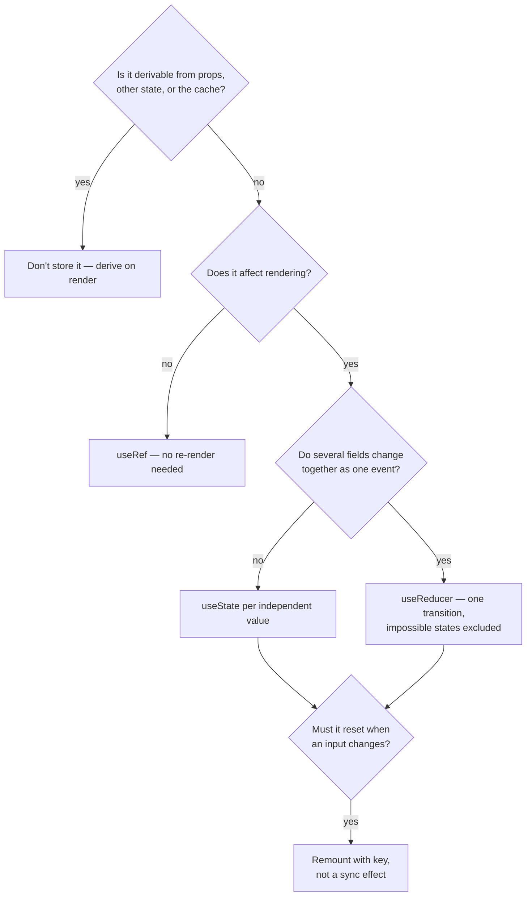

# Local State

> The cheapest state to reason about is state only one component can touch. It has no consumers to coordinate, no re-render blast radius, and deleting the component deletes the state — which is why it should be the default and why moving away from it needs a reason.

**Part:** [03 · Application Architecture](../) · **Domain:** State Management · **Priority:** Critical · **Difficulty:** Intermediate · **Reading time:** ~12 min

## TL;DR

Local state is state owned by a single component: `useState` or `useReducer` declared where it is used and invisible everywhere else. It should be the starting point for every piece of client state, because its scope bounds both the re-render surface and the reasoning surface — you can understand it by reading one file. The skills that make local state work are knowing what *not* to put in it (derived values, props, server data, non-rendering values), initializing it correctly (lazy initializers, and `key` rather than sync effects when it must reset), and updating it safely (functional updates to avoid stale reads). Move state out only when a second consumer genuinely exists, and move it exactly as far as the closest common owner.

> **Recommendation:** Default to local. Store the minimum and derive the rest; use functional updaters; reset with `key` instead of an effect; prefer `useReducer` once several fields change together; and lift only when a real second consumer appears.

## At a Glance

| | |
| --- | --- |
| **Use when** | One component authors and reads the value — flags, inputs, selections, transient interaction state. |
| **Avoid when** | A sibling or ancestor needs the same value, it must survive unmount, or it belongs in the URL or a cache. |
| **Alternatives** | [Lifting State Up](#alternative-approaches) (a second consumer); [Global State](#alternative-approaches) (cross-route); URL state (shareable). |
| **Primary risk** | Storing what should be derived, syncing props into state, and stale reads in async callbacks. |
| **Maturity** | Stable. |

## Prerequisites

- [Categories of State](./categories-of-state.md) — the classification that tells you whether a value is client-owned at all.

## Overview

*Local state* is state whose owner is one component instance. In React that means `useState` or `useReducer` called inside the component, with the value and its setter never leaving except as props to children that need them. Each instance gets its own copy, and the state's lifetime is the instance's lifetime: mount creates it, unmount discards it.

Two properties make it the default. First, the *reasoning* surface is one file: every write is visible in the component, so a wrong value has a small number of possible causes. Second, the *re-render* surface is the component and its subtree, so an update cannot cost anything elsewhere in the application. Both properties degrade the moment state moves outward — a lifted value can be written by more components, and a global value can re-render subscribers across routes.

The boundary is not "how much state" but "how many owners." A component with eight `useState` calls that nobody else reads is fine; a single boolean in a global store that two screens write is the thing to worry about. And because moving state outward is a small, local refactor while narrowing global state is not, starting local is also the cheaper bet under uncertainty.

## The Problem

A search panel starts simple: a query input, a debounce, and a results list. Over a few months it accumulates five separate problems, none of which is about "too much state."

It stores the filtered results. `results` is set from `allItems` and `query` in an effect, so there is a render where the list and the query disagree, and a second writer (a "clear" button) can leave them inconsistent.

It syncs a prop into state. `const [name, setName] = useState(props.name)` plus an effect that calls `setName(props.name)` when the prop changes. The value is now duplicated, updates one render late, and the effect fights the user's typing when both happen in the same tick.

It reads stale values in async callbacks. The debounced search closure captures `query` from the render it was created in, so a fast typist sees results for a query they have already replaced — the classic stale-closure bug, rooted in how [closures](../../01-core-languages/javascript/closures.md) capture bindings.

It resets by effect. When the selected record changes, an effect clears three fields. Each reset renders twice, and forgetting one field leaves the panel showing a mix of two records.

And it holds four booleans — `isOpen`, `isLoading`, `isError`, `isEmpty` — that admit sixteen combinations, of which four are meaningful. Bugs arrive as impossible states: loading and error simultaneously, or empty while loading.

Every one of these is a local-state skill problem, not an argument for a store. Moving this component's state into Redux would fix none of them.

## Why It Matters

Scope is the strongest lever on both correctness and performance in client state. A value that only one component can write has exactly one place to look when it is wrong; a value in shared scope has as many places as there are writers, and the debugging cost grows with that number rather than with the value's complexity. The same applies to rendering: React re-renders from the component that owns the state downward, so keeping ownership low keeps updates cheap by construction — a keystroke in a locally-owned input costs one subtree, while the same keystroke in a globally-owned field can cost the application.

Locality also makes code deletable, which matters more than it sounds. Removing a feature whose state is local means deleting a component; removing a feature whose state is in a shared store means auditing every reader, every selector, and every reducer branch. Codebases become hard to change less because of what they contain than because of how much of it is entangled, and premature globalization is one of the main entanglers.

Finally, most of what teams experience as "React state is hard" is the set of local-state mistakes above: storing derived values, mirroring props, stale closures, reset-by-effect, and boolean soup. These are learnable and fixable in place. Reaching for a state library to solve them relocates the same mistakes into a bigger scope, where they cost more.

## Mental Model

Local state is a value attached to a component instance, and everything else about it follows from three questions: what is the minimum you must store, when must it reset, and what does a write actually see.



Two mechanics are worth stating precisely. A state variable is a *snapshot per render*: the `query` a callback closes over is the value from the render that created the callback, not the latest one. That is why updates that depend on the current value must use the functional form — `setCount(c => c + 1)` — and why async callbacks that need the latest value must either receive it as an argument or read it from a ref.

And resetting state belongs to identity, not to effects. If a panel should start fresh when the selected record changes, give it `key={recordId}`: React discards the instance and its state, and the new instance initializes normally. An effect that clears fields does the same job in two renders, in more code, with one field easy to forget.

## Best Practices

Store the minimum; derive the rest. If a value can be computed from props, other state, or the cache during render, computing it is both shorter and impossible to desynchronize. `const visible = items.filter(matches(query))` needs no state at all.

Never mirror a prop into state. It duplicates the truth and lags by a render. If a component needs to *diverge* from a prop after an interaction, that is a draft — name it as such and make the divergence explicit.

Use functional updaters whenever the next value depends on the current one. `setSelected(current => toggle(current, id))` is correct regardless of batching, stale closures, or how many updates queue in one tick.

Reset with `key`, not with an effect. Remounting is one render, expresses intent ("this is a different thing now"), and cannot forget a field.

Reach for `useReducer` when fields change together. Several `useState` calls updated in the same handler are one transition pretending to be many; a reducer makes the transition atomic and testable as a pure function.

Model states, not booleans. One `status: 'idle' | 'loading' | 'error' | 'ready'` replaces four flags and removes every impossible combination from the type system.

Use lazy initializers for expensive setup. `useState(() => parse(raw))` runs once; `useState(parse(raw))` runs the parse on every render and throws the result away.

Keep non-rendering values in refs. Timer IDs, previous values, and imperative handles do not need renders; putting them in state does work that produces no output.

Keep the setter private where it should be. Expose an intent (`onSelect`, `onDismiss`) rather than passing a raw setter down, so children cannot write arbitrary values and the write path stays greppable.

Lift only for a real consumer, and only as far as needed. "A sibling might need this later" is not a consumer. When one appears, lift to the closest common owner — see [Lifting State Up](./lifting-state-up.md).

## Trade-offs

Local state trades sharing for locality. Everything good about it comes from the fact that nobody else can reach it, and the one thing it cannot do is be reached — which is exactly when to move it.

**Advantages**

- One file to read to understand every write.
- Re-renders bounded by the owning subtree.
- Lifetime tied to the component, so cleanup is automatic and features are deletable.
- No library, no wiring, no naming decisions.

**Disadvantages**

- Invisible to siblings, so a genuine second consumer forces a move.
- Lost on unmount, which is wrong for anything that must survive navigation.
- Not shareable via URL, so it cannot be linked or restored.
- Repeated in each instance, which is a bug if the value should be singular for the app.

| Dimension | Local state | Lifted state | Global store |
| --- | --- | --- | --- |
| Reasoning surface | One component | Owner plus consumers | Anywhere in the app |
| Re-render blast radius | Owning subtree | Owner's subtree | Every subscriber |
| Sharing | None | Within one subtree | Cross-route |
| Lifetime | Instance | Owner instance | Application |
| Cost to move later | Small, local refactor | Moderate | Large; narrowing is hard |

## Alternative Approaches

Local state has no substitute for its own job — one owner, one reader. The alternatives are what you move to when that stops being true, and the trigger for each is different.

| Approach | Best when | Weakness | See |
| --- | --- | --- | --- |
| Local state (this article) | One component authors and reads the value | Invisible to siblings; lost on unmount | (this article) |
| [Lifting State Up](./lifting-state-up.md) | A sibling or ancestor needs the same value | Re-renders the owner's subtree; prop plumbing | `Lifting State Up · State Management` |
| [Global State](./) (planned) | The value crosses routes or has no common owner | Broad re-renders; app-wide coupling | `Global State · State Management` |
| URL state | The user should be able to link or reload into it | Serialisable values only | [Categories of State](./categories-of-state.md) |
| Server-state cache | The value's authority is a server | Not for locally authored values | [Server vs Client State](./server-vs-client-state.md) |

## Bad Example

Every common local-state mistake in one component.

```tsx
import { useEffect, useState } from 'react';

// ❌ Five independent defects, all local-state skill problems.
function SearchPanel({ items, initialQuery }: { items: Item[]; initialQuery: string }) {
  // (1) A prop mirrored into state: two truths, and the copy lags by a render.
  const [query, setQuery] = useState(initialQuery);
  useEffect(() => {
    setQuery(initialQuery); // fights the user's typing when both change
  }, [initialQuery]);

  // (2) Derived data stored: `results` can disagree with `items` and `query`,
  //     and there is a render where it does.
  const [results, setResults] = useState<Item[]>([]);
  useEffect(() => {
    setResults(items.filter((item) => item.name.includes(query)));
  }, [items, query]);

  // (3) Boolean soup: 16 combinations, 4 of them meaningful.
  const [isLoading, setLoading] = useState(false);
  const [isError, setError] = useState(false);
  const [isEmpty, setEmpty] = useState(false);

  // (4) Expensive initializer runs on every render and is thrown away.
  const [config] = useState(parseSearchConfig(window.location.search));

  const search = () => {
    setLoading(true);
    // (5) Stale closure: `query` is the value from the render that created
    //     this callback, so a fast typist searches for the previous term.
    setTimeout(() => {
      fetchResults(query).then((data) => {
        setResults(data);
        setLoading(false);
        setEmpty(data.length === 0); // a third writer for `results`' summary
      });
    }, 300);
  };

  return (
    <>
      <input value={query} onChange={(e) => setQuery(e.target.value)} />
      <button onClick={search}>Search</button>
      {isLoading && <Spinner />}
      {isError && <p>Failed</p>}
      {isEmpty && <p>Nothing found</p>}
      <List items={results} />
    </>
  );
}
```

**What goes wrong:** `results` is a stored derivation with three writers, so it drifts from `items` and `query`; the prop-mirroring effect duplicates the query and can overwrite what the user just typed. The three booleans allow states that mean nothing (`isLoading && isEmpty`), which is how "empty results" flashes during a search. `parseSearchConfig` runs on every render for a value that never changes. And the debounced callback reads a stale `query`, so results lag the input by one term — a bug that only reproduces when typing quickly.

## Good Example

The same component with the minimum stored, everything else derived, and correct initialization, updates, and reset.

```tsx
import { useEffect, useMemo, useRef, useState } from 'react';

interface Item {
  id: string;
  name: string;
}

type SearchStatus =
  | { kind: 'idle' }
  | { kind: 'searching' }
  | { kind: 'failed'; message: string }
  | { kind: 'ready'; results: readonly Item[] };

function SearchPanel({ items, initialQuery }: { items: readonly Item[]; initialQuery: string }) {
  // ✅ One piece of state for what the user types. The prop is the initial
  // value only — no effect syncs it, because the component owns it after mount.
  const [query, setQuery] = useState(initialQuery);

  // ✅ Lazy initializer: runs once, not on every render.
  const [config] = useState(() => parseSearchConfig(window.location.search));

  // ✅ One status value instead of three booleans: impossible combinations
  // are unrepresentable rather than merely avoided.
  const [status, setStatus] = useState<SearchStatus>({ kind: 'idle' });

  // ✅ Derived on render: cannot disagree with its inputs, no effect needed.
  const localMatches = useMemo(
    () => items.filter((item) => item.name.toLowerCase().includes(query.toLowerCase())),
    [items, query],
  );

  // ✅ A ref for a value that must not trigger renders.
  const requestId = useRef(0);

  useEffect(() => {
    if (query.length < config.minLength) {
      setStatus({ kind: 'idle' });
      return;
    }

    const id = ++requestId.current;
    const controller = new AbortController();
    setStatus({ kind: 'searching' });

    const timer = window.setTimeout(async () => {
      try {
        // ✅ `query` here is this effect's own value — the effect re-runs per
        // query, so there is no stale capture to reason about.
        const results = await fetchResults(query, controller.signal);
        // Guard against an out-of-order response winning.
        if (id === requestId.current) {
          setStatus({ kind: 'ready', results });
        }
      } catch (error) {
        if (controller.signal.aborted) return;
        if (id === requestId.current) {
          setStatus({ kind: 'failed', message: (error as Error).message });
        }
      }
    }, config.debounceMs);

    return () => {
      clearTimeout(timer);
      controller.abort();
    };
  }, [query, config.minLength, config.debounceMs]);

  // ✅ Derived, not stored: which list to show is a function of status.
  const visible = status.kind === 'ready' ? status.results : localMatches;

  return (
    <>
      <input
        value={query}
        onChange={(event) => setQuery(event.target.value)}
        aria-label="Search items"
      />

      {status.kind === 'searching' && <Spinner />}
      {status.kind === 'failed' && <p role="alert">Search failed: {status.message}</p>}
      {status.kind === 'ready' && status.results.length === 0 && <p>Nothing found</p>}

      <List items={visible} />
    </>
  );
}

/**
 * ✅ Resetting by identity, not by effect: a different record is a different
 * panel, so the instance is replaced and its state initializes normally.
 */
export function RecordSearchPanel({ recordId, items }: { recordId: string; items: readonly Item[] }) {
  return <SearchPanel key={recordId} items={items} initialQuery="" />;
}
```

**Why it's better:** Only three things are stored — the query, the immutable config, and one status value — and everything else is derived, so nothing can drift. The status union removes impossible combinations, which is what fixes the "empty while loading" flash. The effect owns its own `query`, so there is no stale closure, and the request-id guard plus `AbortController` means an out-of-order response cannot overwrite a newer one. Reset happens via `key`, so a new record starts clean in one render without an effect that could miss a field.

## Production Example

`useReducer` is the local-state tool for transitions that touch several fields at once. It keeps the logic pure and testable while the state stays local to the component.

```tsx
import { useReducer } from 'react';

interface Selection {
  ids: ReadonlySet<string>;
  /** Anchor for shift-click range selection. */
  anchorId: string | null;
}

type SelectionAction =
  | { type: 'toggle'; id: string }
  | { type: 'select-range'; toId: string; orderedIds: readonly string[] }
  | { type: 'select-all'; orderedIds: readonly string[] }
  | { type: 'clear' };

const emptySelection: Selection = { ids: new Set(), anchorId: null };

/**
 * ✅ A pure transition function: unit-testable without rendering, and it makes
 * "several fields change together" one atomic event instead of three setState
 * calls that could interleave.
 */
export function selectionReducer(state: Selection, action: SelectionAction): Selection {
  switch (action.type) {
    case 'toggle': {
      const ids = new Set(state.ids);
      if (ids.has(action.id)) {
        ids.delete(action.id);
      } else {
        ids.add(action.id);
      }
      // The anchor moves with the last individually-toggled row.
      return { ids, anchorId: action.id };
    }

    case 'select-range': {
      if (!state.anchorId) {
        return selectionReducer(state, { type: 'toggle', id: action.toId });
      }
      const from = action.orderedIds.indexOf(state.anchorId);
      const to = action.orderedIds.indexOf(action.toId);
      if (from === -1 || to === -1) return state;

      const [start, end] = from <= to ? [from, to] : [to, from];
      const ids = new Set(state.ids);
      for (const id of action.orderedIds.slice(start, end + 1)) {
        ids.add(id);
      }
      // Anchor deliberately unchanged: successive shift-clicks extend from it.
      return { ids, anchorId: state.anchorId };
    }

    case 'select-all':
      return { ids: new Set(action.orderedIds), anchorId: null };

    case 'clear':
      return emptySelection;
  }
}

export function useSelection() {
  const [selection, dispatch] = useReducer(selectionReducer, emptySelection);
  return { selection, dispatch };
}

export function ItemTable({ items }: { items: readonly Item[] }) {
  const { selection, dispatch } = useSelection();
  const orderedIds = items.map((item) => item.id);

  return (
    <>
      <button type="button" onClick={() => dispatch({ type: 'select-all', orderedIds })}>
        Select all
      </button>
      <button
        type="button"
        onClick={() => dispatch({ type: 'clear' })}
        disabled={selection.ids.size === 0}
      >
        Clear ({selection.ids.size})
      </button>

      {items.map((item) => (
        <Row
          key={item.id}
          item={item}
          selected={selection.ids.has(item.id)}
          // ✅ Children receive intents, not the raw dispatch or a setter, so
          // the set of possible writes stays small and greppable.
          onClick={(event) =>
            event.shiftKey
              ? dispatch({ type: 'select-range', toId: item.id, orderedIds })
              : dispatch({ type: 'toggle', id: item.id })
          }
        />
      ))}
    </>
  );
}
```

Two things make this worth the reducer. Range selection needs the anchor and the set to change as one event, and expressing that as two `useState` calls invites an inconsistent intermediate state. And because `selectionReducer` is a pure function, shift-click semantics — the part users notice when it is wrong — can be tested exhaustively without mounting a table.

## Common Mistakes

See the [State Management anti-patterns](../../../anti-patterns/#state-management) for the domain catalog. Concept-specific:

### Mistake: Storing derived values

- **Symptom:** A filtered list, total, or count in state, kept current by an effect.
- **Why it fails:** It is a second source of truth that lags its inputs by a render and can be written by other paths.
- **Fix:** Compute during render, with `useMemo` only if the input is large.

### Mistake: Mirroring a prop into state

- **Symptom:** `useState(props.value)` plus an effect calling `setValue(props.value)`.
- **Why it fails:** The copy duplicates the truth, updates late, and can overwrite user input in the same tick.
- **Fix:** Read the prop directly; if the component must diverge after an interaction, model that as an explicit draft, and reset with `key`.

### Mistake: Resetting state with an effect

- **Symptom:** An effect that clears several fields when an ID prop changes, sometimes leaving one behind.
- **Why it fails:** It takes two renders and relies on remembering every field.
- **Fix:** Remount with `key={id}` so state initializes fresh by construction.

### Mistake: Stale reads in async callbacks

- **Symptom:** A debounced handler acts on the previous value; a counter increments once for two rapid clicks.
- **Why it fails:** State is a per-render snapshot, so a callback closes over the value from its own render.
- **Fix:** Use functional updaters for value-dependent writes, pass the value as an argument, or read it from a ref.

### Mistake: Boolean soup

- **Symptom:** `isLoading`, `isError`, `isEmpty`, `isOpen` as independent flags — and combinations that mean nothing.
- **Why it fails:** N booleans admit 2^N states, most of them invalid, and nothing prevents them.
- **Fix:** One discriminated status value that makes invalid combinations unrepresentable.

### Mistake: Eager initializers

- **Symptom:** Parsing, sorting, or reading storage inside `useState(...)` directly.
- **Why it fails:** The expression runs on every render, and the result is discarded after the first.
- **Fix:** Pass a function: `useState(() => expensive())`.

### Mistake: State for values that never render

- **Symptom:** Timer IDs, previous values, or scroll offsets in `useState`, causing renders nobody observes.
- **Why it fails:** State exists to trigger rendering; using it otherwise is pure overhead.
- **Fix:** Use `useRef`.

### Mistake: Globalizing early

- **Symptom:** A modal flag or hover target in an application store "in case something else needs it."
- **Why it fails:** It pays coupling and re-render costs for a consumer that does not exist, and narrowing later is expensive.
- **Fix:** Keep it local; lift when a real second consumer appears.

## Checklist

- [ ] Nothing in state can be derived from props, other state, or the cache.
- [ ] No prop is mirrored into state, and no effect syncs one.
- [ ] Value-dependent updates use the functional updater form.
- [ ] Reset-on-input-change is done with `key`, not an effect.
- [ ] Fields that change together live in one reducer transition.
- [ ] Statuses are modelled as a union, not as independent booleans.
- [ ] Expensive initial values use a lazy initializer.
- [ ] Values that don't affect rendering are refs.
- [ ] Children receive intents rather than raw setters.
- [ ] State has been lifted only where a real second consumer exists.

## Related Articles

- [Categories of State](./categories-of-state.md) — deciding whether a value is client-owned before placing it locally.
- [Lifting State Up](./lifting-state-up.md) — the first move outward, and how far to go.
- [UI vs Domain State](./ui-vs-domain-state.md) — why most local state is presentation state, and what that implies.
- [Server vs Client State](./server-vs-client-state.md) — why fetched data should never live in `useState`.
- [Closures](../../01-core-languages/javascript/closures.md) — the capture semantics behind stale reads in callbacks (`· JavaScript`).
- [Derived Server Data](../data-server-state/derived-server-data.md) — the same "derive, don't store" rule applied to cached data.

## References

- [React — useState](https://react.dev/reference/react/useState) — lazy initializers, functional updates, and resetting state with `key`.
- [React — You Might Not Need an Effect](https://react.dev/learn/you-might-not-need-an-effect) — removing effects that derive, mirror, or reset state.
