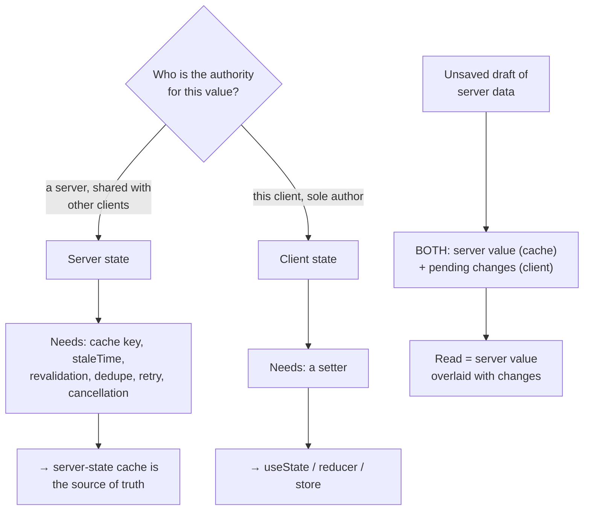

# Server vs Client State

> Server state is borrowed: another process can change it while you hold it, and your copy is a cache. Client state is yours: nobody else can change it, and the only copy that matters is the one in memory. Almost every state-management disaster starts by treating the first like the second.

**Part:** [03 · Application Architecture](../) · **Domain:** State Management · **Priority:** Critical · **Difficulty:** Intermediate · **Reading time:** ~12 min

## TL;DR

The boundary is authority. **Server state** has its authoritative copy somewhere else, is shared by other clients and processes, arrives stale, and can change without anyone telling you — so the client holds a *cache* with an identity, a freshness policy, and a revalidation story. **Client state** is authored on the client, has exactly one authoritative copy, and needs none of that machinery. Copying a server response into `useState` or a store converts the first into the second on paper while leaving all the first's properties intact, which is why it forces you to hand-build deduplication, staleness, retry, and cancellation. The interesting cases sit on the boundary — unsaved drafts, optimistic values, selections that reference server records — and the right move is always to split them rather than merge them.

> **Recommendation:** Cache server state in a server-state library and read from it directly; never copy it into `useState` or a store. Model a draft as the *pending changes*, not as a copy of the record, so the server value stays the single source of truth underneath it.

## At a Glance

| | |
| --- | --- |
| **Use when** | Deciding where any fetched value lives, or diagnosing why data disagrees between screens. |
| **Avoid when** | Never; every application with a network call has this boundary. |
| **Alternatives** | [UI vs Domain State](#alternative-approaches) and [Ephemeral vs Persistent State](#alternative-approaches) — orthogonal cuts, not substitutes. |
| **Primary risk** | Copying server data into client state, creating a second source of truth that goes stale silently. |
| **Maturity** | Stable. |

## Prerequisites

- [Categories of State](./categories-of-state.md) — the ownership/lifetime/scope classification this article drills into.

## Overview

*Server state* is state whose authority is remote. Invoices, users, permissions, prices, feature flags: the server decides what they are, several clients read them at once, and any of them can change between two of your renders. A client cannot *own* such a value; it can only hold a cached copy plus the metadata needed to reason about it — when it was fetched, whether it is fresh, whether a request is in flight, and what to do when the answer changes.

*Client state* is state whose authority is local: a modal's open flag, a wizard's current step, a chosen sort direction, an unsaved draft, a selected row. There is one copy, the client wrote it, and no other process can modify it. It needs no freshness policy because there is nothing to be fresh relative to.

The consequence is that the two categories need entirely different mechanisms. Server state needs identity (a cache key), a staleness policy, background revalidation, request deduplication, retry, and cancellation — a list that describes a cache, which is why server-state libraries exist and why they look nothing like `useState`. Client state needs a setter. Choosing the wrong mechanism does not remove the requirements; it just moves them into your code, one incident at a time. The [server-cache-as-client-state anti-pattern](../../../anti-patterns/server-cache-as-client-state.md) documents exactly what that migration looks like.

## The Problem

A team fetches invoices in an effect and stores them in a provider, because several screens need the list. It works on day one.

Day ten: the detail screen also needs invoices, so it fetches its own copy. Two requests, two arrays, two truths. Marking an invoice paid updates one of them.

Day twenty: someone notices the list never refreshes, so they add a manual refresh button. Then a "refresh on focus" effect, because users leave the tab open. Then a guard so the two don't fire together.

Day thirty: a fast filter change produces a race — the slower response lands last and overwrites the newer data — so they add an ignore flag in the effect cleanup. Then a mounted check, because a response arriving after unmount warns in the console.

Day forty: the mutation needs to update the list, so `setInvoices` is threaded through context, then a second setter for the detail copy. Optimistic updates require snapshotting the array manually, and rolling back requires remembering the previous one.

Day fifty: the provider is four hundred lines, contains a loading flag, an error flag, a refresh function, an in-flight guard, a race guard, and two setters — and the team describes their problem as "state management is hard." What they have actually built is a cache: incomplete, untested, and bespoke. Every one of those fifty days was spent reimplementing a feature that a server-state cache provides by default, and the trigger was one line on day one — `setInvoices(data)`.

## Why It Matters

The properties of server state do not go away when you store it in `useState`. It is still shared, still stale, still changeable by others — so every consequence of those properties still needs handling, and now *you* handle it. That is the whole argument: choosing the mechanism that matches the category means the mechanism has already solved the category's problems. Choosing the other one means a slow accumulation of hand-written cache features, each added in response to a bug report, none of them coordinated.

The failure mode is also particularly hard to see in review. A copied array looks like ordinary state; the missing deduplication, the absent staleness policy, and the unguarded race are absences, and absences do not appear in diffs. By the time the symptoms are undeniable — two screens disagreeing, data that never refreshes, a stale response winning — the copy is load-bearing across many components and removing it is a refactor rather than a fix.

Getting the boundary right also clarifies the genuinely hard question, which is what to do at the seam. Unsaved edits, optimistic values, and offline queues all involve local authorship of something the server owns. Those cases have real design decisions in them — which value wins on reload, what "discard" means, what happens when the server's copy changes mid-edit — and they are only answerable if the server value and the local changes are separate. Merged into one array, the questions have no place to be asked.

## Mental Model

Ask one question: *if the network vanished, would this value still be correct?* A modal flag would. An invoice list would not — it would be a snapshot of the past, and how stale it is would matter.



Two rules fall out of the diagram. First, *read from the cache, don't mirror it*: components should call the query hook wherever they need the data, relying on deduplication to make that cheap, rather than one component fetching and passing copies down. Second, *a draft is a diff, not a duplicate*. Modelling the draft as `Partial<Invoice>` of pending changes — rather than a full copy of the record — keeps the server value authoritative, makes `isDirty` a property of the diff, makes discard trivial, and makes a mid-edit server change something you can detect and merge rather than something that silently disappears.

The same logic covers optimistic updates: the optimistic value is a temporary local overlay on the cache, applied and then reconciled with the server's answer, which is exactly why the cache — not a separate store — is where it belongs.

## Best Practices

Read server state from the cache at the point of use. Call the query hook in each component that needs the data. Deduplication makes that one request, and it removes the entire class of "which component owns the fetch" coupling.

Never copy a query result into `useState`, a reducer, or a store. If you find yourself writing `useEffect(() => setX(data), [data])`, delete both — the value is already in the cache, and copying it creates a second truth that can lag.

Let the cache hold the metadata. `isLoading`, `isFetching`, `isError`, `dataUpdatedAt`, and staleness belong to the cache entry, not to component state you maintain in parallel.

Model drafts as pending changes over the cached value. Initialize the draft empty, write only edited fields into it, read the merge of server value and draft, and clear it on save. This makes dirty tracking, discard, and reset fall out for free.

Put optimistic values in the cache, not beside it. Patch the cache entry, keep the previous value for rollback, and reconcile with the server response. Anything else means two overlays that can disagree.

Keep selections as identifiers, not objects. Store `selectedId`, then read the record from the cache. Storing the object copies server data into client state through the back door and goes stale on the next refetch.

Don't persist server data as if it were client data. If a cached response is written to `localStorage` for offline use, that is a cache with a persistence layer — it needs versioning and a staleness policy on rehydration, not a plain restore.

Treat "the server changed while I was editing" as a designed case. With the server value and draft separate, you can detect it (`dataUpdatedAt` moved) and choose: warn, merge, or ask. With a merged copy, you cannot even detect it.

Keep client state out of the cache. A modal flag or hover state in a query cache gets staleness and garbage collection semantics that make no sense for it. The boundary runs both ways.

## Trade-offs

Using a server-state cache trades a dependency and its concepts for the removal of an entire category of hand-written infrastructure. The cost is learning the cache's model; the benefit is not writing — and not debugging — the fifty-day provider.

**Advantages**

- Deduplication, staleness, revalidation, retry, and cancellation come from the tool, not your code.
- One cache entry per identity means screens cannot disagree.
- Mutations update every reader at once, with a defined optimistic and rollback path.
- Loading and error metadata is per-query rather than per-component bookkeeping.

**Disadvantages**

- A library and its concepts (keys, `staleTime`, invalidation) to learn and standardise on.
- Boundary cases — drafts, optimistic values, offline queues — still require deliberate design.
- Cached data is not a plain value: reads go through hooks, which shapes component structure.
- Persisting a cache for offline use adds versioning and rehydration concerns.

| Dimension | Server state in a cache | Server data copied into client state |
| --- | --- | --- |
| Consistency across screens | One entry per key; all readers agree | One copy per fetcher; they drift |
| Freshness | Policy-driven revalidation | Manual refresh, or never |
| Races | Cancellation and ordering handled | Slower response can overwrite newer data |
| Mutation propagation | Patch or invalidate once | Thread setters to every copy |
| Code volume | Query options per resource | A bespoke cache, grown by incident |

## Alternative Approaches

Ownership is the primary cut. The other taxonomy articles cut the same state along different axes — they refine the decision rather than replace it.

| Approach | Best when | Weakness | See |
| --- | --- | --- | --- |
| Server vs client ownership (this article) | Deciding the mechanism for a fetched value | Says nothing about scope or persistence | (this article) |
| [UI vs Domain State](./ui-vs-domain-state.md) | Deciding what to test, persist, and share | Orthogonal to authority | `UI vs Domain State · State Management` |
| [Ephemeral vs Persistent State](./README.md) (planned) | Designing storage, hydration, and versioning | Ignores who may change the value | `Ephemeral vs Persistent State · State Management` |
| Server-driven UI | The server can own view state as well as data | Round trip per interaction; less client autonomy | `Rendering Architectures · Rendering & Frameworks` |

## Bad Example

The day-one line and the fifty days that follow it, compressed.

```tsx
import { useEffect, useState } from 'react';

// ❌ Server state copied into client state, plus the hand-built cache it forces.
function useInvoices(status: string) {
  const [invoices, setInvoices] = useState<Invoice[]>([]);
  const [loading, setLoading] = useState(true);
  const [error, setError] = useState<string | null>(null);

  useEffect(() => {
    let ignore = false; // (1) hand-written race guard
    setLoading(true);
    fetch(`/api/invoices?status=${status}`)
      .then((r) => r.json())
      .then((data: Invoice[]) => {
        if (ignore) return; // (2) …that still can't cancel the request
        setInvoices(data);
        setLoading(false);
      })
      .catch((e: Error) => !ignore && setError(e.message));
    return () => {
      ignore = true;
    };
    // (3) No dedupe: every component calling this hook fetches its own copy.
    // (4) No staleness policy: either never refreshed, or refetched blindly.
  }, [status]);

  return { invoices, loading, error, setInvoices };
}

function InvoiceRow({ invoice, setInvoices }: RowProps) {
  const markPaid = async () => {
    // (5) Optimistic update by hand, with no snapshot to roll back to.
    setInvoices((current) =>
      current.map((i) => (i.id === invoice.id ? { ...i, paid: true } : i)),
    );
    const response = await fetch(`/api/invoices/${invoice.id}/pay`, { method: 'POST' });
    if (!response.ok) {
      // (6) "Rollback" is a guess: the previous value is gone, and any
      //      concurrent update to the list has been lost.
      setInvoices((current) =>
        current.map((i) => (i.id === invoice.id ? { ...i, paid: false } : i)),
      );
    }
    // (7) The detail screen has its own copy and still shows unpaid.
  };

  return <button onClick={markPaid}>Mark paid</button>;
}

function InvoiceDetail({ id }: { id: string }) {
  const { invoices } = useInvoices('all');
  // (8) A second fetch of the same data, and a stale one — the list this
  //      component mounted with may be minutes old.
  const invoice = invoices.find((i) => i.id === id);
  return <Detail invoice={invoice} />;
}
```

**What goes wrong:** Every problem here is a property of server state that the chosen mechanism does not handle. Two components mean two requests and two arrays that disagree after a write. The race guard suppresses a stale response but cannot cancel it, so bandwidth is spent and the guard has to be repeated in every such hook. The optimistic update has no snapshot, so its rollback overwrites whatever else changed meanwhile. And the detail screen reads a copy that nothing revalidates.

## Good Example

Cache as the source of truth, read at the point of use, with a draft modelled as pending changes.

```tsx
import { useState } from 'react';
import { useMutation, useQuery, useQueryClient } from '@tanstack/react-query';

interface Invoice {
  id: string;
  reference: string;
  amount: number;
  paid: boolean;
  note: string;
}

export const invoiceKeys = {
  list: (status: string) => ['invoices', 'list', { status }] as const,
  detail: (id: string) => ['invoices', 'detail', id] as const,
};

// ✅ One place describes how this resource is fetched and how fresh it stays.
function invoiceListQuery(status: string) {
  return {
    queryKey: invoiceKeys.list(status),
    queryFn: async ({ signal }: { signal: AbortSignal }): Promise<Invoice[]> => {
      const response = await fetch(`/api/invoices?status=${status}`, { signal });
      if (!response.ok) {
        throw new Error(`Failed to load invoices (${response.status})`);
      }
      return (await response.json()) as Invoice[];
    },
    staleTime: 30_000,
  };
}

/** ✅ Called by as many components as need it: dedupe makes it one request. */
export function useInvoices(status: string) {
  return useQuery(invoiceListQuery(status));
}

export function useMarkPaid(status: string) {
  const queryClient = useQueryClient();

  return useMutation({
    mutationFn: async (id: string) => {
      const response = await fetch(`/api/invoices/${id}/pay`, { method: 'POST' });
      if (!response.ok) {
        throw new Error(`Couldn’t mark invoice paid (${response.status})`);
      }
      return (await response.json()) as Invoice;
    },

    // ✅ The optimistic value is an overlay on the cache, with a real snapshot.
    onMutate: async (id) => {
      await queryClient.cancelQueries({ queryKey: invoiceKeys.list(status) });
      const previous = queryClient.getQueryData<Invoice[]>(invoiceKeys.list(status));
      queryClient.setQueryData<Invoice[]>(invoiceKeys.list(status), (current) =>
        current?.map((invoice) =>
          invoice.id === id ? { ...invoice, paid: true } : invoice,
        ),
      );
      return { previous };
    },

    onError: (_error, _id, context) => {
      // ✅ Restore the exact prior value, not a guessed inverse.
      if (context?.previous) {
        queryClient.setQueryData(invoiceKeys.list(status), context.previous);
      }
    },

    onSuccess: (updated) => {
      // ✅ Every reader of either key sees the server's value — no setters
      // threaded through props, no second copy to update.
      queryClient.setQueryData(invoiceKeys.detail(updated.id), updated);
      queryClient.setQueryData<Invoice[]>(invoiceKeys.list(status), (current) =>
        current?.map((invoice) => (invoice.id === updated.id ? updated : invoice)),
      );
    },
  });
}

/** ✅ A draft is the set of pending changes — not a copy of the record. */
export function useInvoiceEditor(id: string) {
  const queryClient = useQueryClient();
  const query = useQuery({ queryKey: invoiceKeys.detail(id), queryFn: () => fetchInvoice(id) });
  const [changes, setChanges] = useState<Partial<Invoice>>({});

  const save = useMutation({
    mutationFn: () => patchInvoice(id, changes),
    onSuccess: (updated) => {
      queryClient.setQueryData(invoiceKeys.detail(id), updated);
      setChanges({}); // ✅ the server value is authoritative again
    },
  });

  return {
    // Reads are derived: server value overlaid with pending changes.
    value: query.data ? { ...query.data, ...changes } : undefined,
    isDirty: Object.keys(changes).length > 0,
    setField: <K extends keyof Invoice>(key: K, value: Invoice[K]) =>
      setChanges((current) => ({ ...current, [key]: value })),
    discard: () => setChanges({}),
    save,
    query,
  };
}
```

**Why it's better:** Nothing is copied, so nothing can disagree. The list and the detail read from one cache, and a mutation writes the server's value into both — no setters threaded through props. The optimistic path snapshots the real previous value, so rollback restores it exactly rather than applying a guessed inverse. And the editor's draft holds only pending changes, which makes `isDirty` and `discard` trivial and leaves the server value intact underneath.

## Production Example

The genuinely hard boundary case: the server's copy changes while the user is editing. Keeping the two separate is what makes this detectable and resolvable.

```tsx
import { useEffect, useRef, useState } from 'react';
import { useQuery } from '@tanstack/react-query';

interface Invoice {
  id: string;
  note: string;
  amount: number;
  updatedAt: string;
}

type Conflict = { serverValue: Invoice; fields: readonly (keyof Invoice)[] } | null;

export function useConflictAwareEditor(id: string) {
  const query = useQuery({
    queryKey: ['invoices', 'detail', id],
    queryFn: () => fetchInvoice(id),
    // Keep revalidating while editing — we WANT to know about server changes.
    staleTime: 10_000,
  });

  const [changes, setChanges] = useState<Partial<Invoice>>({});
  const [conflict, setConflict] = useState<Conflict>(null);

  // The server value the draft was started from.
  const baseRef = useRef<Invoice | undefined>(undefined);
  useEffect(() => {
    if (query.data && baseRef.current === undefined) {
      baseRef.current = query.data;
    }
  }, [query.data]);

  /**
   * ✅ Detectable only because the server value and the draft are separate:
   * if the server's copy moved on and it touched a field the user is editing,
   * that is a conflict to surface — not a silent overwrite.
   */
  useEffect(() => {
    const base = baseRef.current;
    const latest = query.data;
    if (!base || !latest || latest.updatedAt === base.updatedAt) return;

    const editedFields = Object.keys(changes) as (keyof Invoice)[];
    const collided = editedFields.filter((field) => latest[field] !== base[field]);

    if (collided.length > 0) {
      setConflict({ serverValue: latest, fields: collided });
    } else {
      // No overlap: silently rebase the draft onto the newer server value.
      baseRef.current = latest;
    }
  }, [query.data, changes]);

  return {
    value: query.data ? { ...query.data, ...changes } : undefined,
    isDirty: Object.keys(changes).length > 0,
    conflict,
    setField: <K extends keyof Invoice>(key: K, value: Invoice[K]) =>
      setChanges((current) => ({ ...current, [key]: value })),
    /** Keep the user's edits, acknowledging the newer server value as the base. */
    keepMine: () => {
      if (conflict) baseRef.current = conflict.serverValue;
      setConflict(null);
    },
    /** Drop the conflicting edits and take the server's values. */
    takeTheirs: () => {
      if (!conflict) return;
      setChanges((current) => {
        const next = { ...current };
        for (const field of conflict.fields) delete next[field];
        return next;
      });
      baseRef.current = conflict.serverValue;
      setConflict(null);
    },
  };
}
```

Note what makes this possible: because the draft holds only the user's changes and the cache holds only the server's value, "did the server change a field I'm editing?" is a comparison you can actually perform. In the copied-array design, the server's newer value either overwrites the user's typing or is discarded — and which one happens depends on effect ordering rather than on a decision anyone made.

## Common Mistakes

See the [State Management anti-patterns](../../../anti-patterns/README.md#state-management) for the domain catalog. Concept-specific:

### Mistake: `useEffect` copying query data into state

- **Symptom:** `useEffect(() => setItems(data), [data])`, and a render where `items` lags `data`.
- **Why it fails:** It creates a second source of truth that updates one render late and can be written by other code paths.
- **Fix:** Read from the query directly; delete the state and the effect. See [You Might Not Need an Effect](https://react.dev/learn/you-might-not-need-an-effect).

### Mistake: Hand-building the cache one incident at a time

- **Symptom:** A provider with a loading flag, an error flag, a refresh function, an in-flight guard, and a race guard.
- **Why it fails:** Those are cache features; implementing them per resource is duplicated, untested infrastructure.
- **Fix:** Adopt a server-state cache and delete the provider; see [Treating server cache as client state](../../../anti-patterns/server-cache-as-client-state.md).

### Mistake: Storing a selected server object instead of its ID

- **Symptom:** A selected record shows values that no longer match the list after a refetch.
- **Why it fails:** The stored object is a copy of server data frozen at selection time.
- **Fix:** Store the ID in client state and read the record from the cache.

### Mistake: A draft that duplicates the record

- **Symptom:** "Discard changes" is hard to implement, `isDirty` needs a deep comparison, and a server update mid-edit is silently lost.
- **Why it fails:** A full copy conflates the server's value with the user's changes, so neither can be reasoned about separately.
- **Fix:** Hold pending changes only; derive the displayed value by overlaying them on the cached record.

### Mistake: Client state in the query cache

- **Symptom:** A modal flag or hover state stored via `setQueryData`, then garbage-collected or marked stale.
- **Why it fails:** Cache semantics — staleness, revalidation, eviction — are meaningless for locally authored values.
- **Fix:** Keep client state in `useState`, a reducer, or a store.

## Checklist

- [ ] No query result is copied into `useState`, a reducer, or a store.
- [ ] No effect exists solely to mirror cached data into state.
- [ ] Components read server state from the cache at the point of use.
- [ ] Loading, error, and freshness metadata come from the query, not parallel state.
- [ ] Optimistic updates patch the cache and keep a real snapshot for rollback.
- [ ] Selections are stored as IDs; records are read from the cache.
- [ ] Drafts hold pending changes, not copies of the record.
- [ ] A server change during editing is detectable and has a defined resolution.
- [ ] Client-authored state is not stored in the query cache.

## Related Articles

- [Categories of State](./categories-of-state.md) — the wider classification this boundary sits inside.
- [UI vs Domain State](./ui-vs-domain-state.md) — the orthogonal cut: presentation versus business meaning.
- [Local State](./local-state.md) — where client state should start.
- [Cache Keys & Query Identity](../data-server-state/cache-keys-and-query-identity.md) — identity for cached server state (`· Data & Server State`).
- [Optimistic Updates](../data-server-state/optimistic-updates.md) — local overlays on cached values, done safely.
- [Rollback & Conflict Resolution](../data-server-state/rollback-and-conflict-resolution.md) — resolving the mid-edit conflict this article detects.

## Related Examples

- [Query key factory](../../../examples/query-key-factory.ts) — the identity every reader of a server value shares.
- [Optimistic update with rollback](../../../examples/optimistic-update-with-rollback.tsx) — snapshot and restore against the cache.

## References

- [TanStack Query — Overview](https://tanstack.com/query/latest/docs/framework/react/overview) — the argument that server state is a cache, and what the cache provides.
- [React — You Might Not Need an Effect](https://react.dev/learn/you-might-not-need-an-effect) — why mirroring data into state with an effect is the wrong shape.
