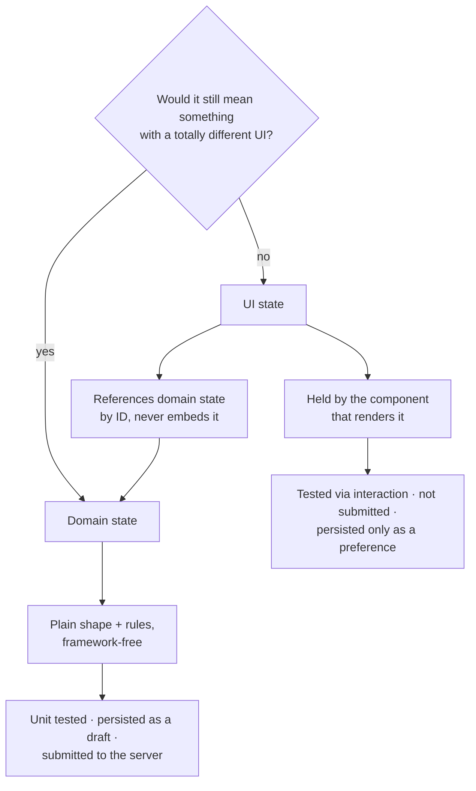

# UI vs Domain State

> "Which step is the wizard on" is a screen fact. "What the customer ordered" is a business fact. Redesigning the screen should not be able to break the order — and it will, every time, if both facts live in the same object.

**Part:** [03 · Application Architecture](../) · **Domain:** State Management · **Priority:** Critical · **Difficulty:** Intermediate · **Reading time:** ~12 min

## TL;DR

*Domain state* is what your application is about: the order, the document, the permissions, the selection a user has committed to. It would still be meaningful if you replaced the entire interface. *UI state* is what the current presentation needs to work: which accordion is open, whether a tooltip is showing, the scroll offset, the current wizard step. Separating them tells you what to test (domain logic, in isolation), what to persist (domain, not UI), what to send to the server (domain), and what you may freely change during a redesign (UI). Entangle them and the business rules become reachable only through the components that happen to render them.

> **Recommendation:** Keep domain state in a plain, framework-free shape with its own transitions, and keep UI state next to the component that renders it. Where they meet, let UI state reference domain state by ID rather than embedding it.

## At a Glance

| | |
| --- | --- |
| **Use when** | Structuring a feature, deciding what to unit test, or preparing a redesign that must not change behavior. |
| **Avoid when** | Never — but very small features may hold both in one component without ceremony. |
| **Alternatives** | [Server vs Client State](#alternative-approaches) and [Ephemeral vs Persistent State](#alternative-approaches) — orthogonal cuts of the same state. |
| **Primary risk** | Business rules embedded in components, and UI concerns leaking into persisted or transmitted data. |
| **Maturity** | Stable. |

## Prerequisites

- [Categories of State](./categories-of-state.md) — the ownership, lifetime, and scope framing this cut refines.

## Overview

*Domain state* carries business meaning. The line items on an invoice, whether a document is approved, which permissions a session grants, the quantity a customer chose. Its correctness is defined by rules that exist independently of any screen: an invoice total must equal the sum of its items, an approval requires a reviewer, a quantity cannot be negative. You could rewrite the entire frontend and these rules would be unchanged.

*UI state* carries presentation meaning. Which panel is expanded, whether a dropdown is open, the current tab, a hover target, the scroll position, the step a multi-step form is displaying, whether a tooltip has been dismissed. It exists to make one particular presentation work, and a redesign is entitled to delete it.

The distinction is orthogonal to the [server versus client](./server-vs-client-state.md) cut, which is about *authority*, not meaning. Domain state can be server-owned (an invoice) or client-owned (an unsaved draft's line items). UI state is almost always client-owned, but not always ephemeral — a remembered sidebar width is UI state that persists. Keeping both cuts in mind is what produces good placement: an invoice draft is client-owned domain state, so it belongs in a plain structure with validation rules, while the wizard step showing it is UI state that belongs in the component.

## The Problem

A checkout wizard keeps everything in one reducer: `currentStep`, `shippingAddress`, `items`, `isAddressPanelOpen`, `paymentMethod`, `showValidationErrors`, `hasDismissedBanner`, `couponCode`. It works, and then four things happen.

Design changes the wizard from four steps to two. The change should be presentational, but `currentStep` is baked into the validation logic — `if (state.currentStep >= 2) validatePayment()` — so collapsing the steps changes *when business rules run*. A refactor that should have touched layout touches correctness.

Someone writes a test for "an order with a coupon computes the right total." The rule lives inside the reducer alongside `isAddressPanelOpen` and `hasDismissedBanner`, so the test has to construct a state object full of presentation fields that have nothing to do with pricing, and it breaks when a new panel is added.

The team adds "resume your checkout" by persisting the reducer to `localStorage`. Now a returning user is restored with `showValidationErrors: true` and a stale `isAddressPanelOpen`, so the form opens covered in red before they have typed anything. Worse, a release renames a UI field and the stored shape no longer parses, so resume fails for everyone.

Finally, the submit payload is built by spreading the whole state, and `hasDismissedBanner` is now a field in the orders table — a UI concern that has become part of the API contract, and therefore permanent.

Every one of these is the same mistake: two kinds of fact with different lifetimes, different owners, and different rules, stored as one object.

## Why It Matters

Domain rules are the part of a frontend that must be *correct*, and correctness is much cheaper to establish for a plain function over a plain shape than for behavior reachable only by rendering components and firing events. When the total calculation lives in a module that takes items and a coupon and returns a total, a test is three lines and runs in milliseconds. When it lives in a reducer entangled with panel visibility, the same test needs a full state object and breaks whenever the layout changes. Separation is what makes the important logic testable, and testability is what keeps it correct through redesigns.

The persistence and transmission boundaries make the separation load-bearing rather than aesthetic. UI state should almost never be persisted or sent to a server: restoring "validation errors visible" produces a hostile first impression, and a UI field that reaches an API contract can never be removed. Domain state is the opposite — it is exactly what you persist as a draft and what you submit. If the two are one object, every persistence and transmission decision becomes a field-by-field judgment instead of a category rule, and someone will get it wrong.

There is also a redesign argument that matters over years. UI state is the volatile part of an application: tabs become accordions, wizards become single pages, modals become drawers. If domain rules depend on presentation state — a step index, an open panel, a visible tab — then every visual change risks a behavioral change, and teams become reluctant to redesign. Separating them means the interface stays cheap to change, which is usually what "our frontend is hard to work on" actually refers to.

## Mental Model

Apply one test: *would this value still mean something if the interface were completely different?* If yes, it is domain state. If it only makes sense in terms of the current layout, it is UI state.



The seam is the interesting part. UI state routinely needs to point at domain state — the expanded row, the item being edited, the selected tab that corresponds to a category. Point at it by identifier: `expandedItemId: string | null`, not `expandedItem: LineItem`. Embedding a copy makes the UI hold a snapshot of domain data that goes stale on the next update, which is the same duplication problem as copying server state, one layer in.

The second seam is derived values. "Is the continue button enabled" is not state at all — it is a function of domain validity and possibly UI state (has the user attempted submission yet). Deriving it keeps the enabling rule in one readable place instead of a flag that must be updated from every path that could change it.

## Best Practices

Keep domain state in a plain, framework-free shape. A module exporting types and transition functions — `addItem`, `applyCoupon`, `validate` — is testable without rendering anything and portable across a rewrite of the view layer.

Keep UI state next to what renders it. The open/closed flag belongs in the component that owns the panel. That keeps a redesign local and stops presentation details reaching shared scope.

Never branch domain rules on UI state. `if (step >= 2) validatePayment()` couples a rule to a layout. Validate the domain shape by what it contains, and let the UI decide *which* validation results to display.

Reference domain entities by ID from UI state. `editingItemId`, `expandedRowId`, `selectedTabCategoryId`. Reading the record from its source keeps one copy of the truth.

Derive presentational conclusions instead of storing them. `isSubmitEnabled`, `hasErrors`, `visibleItems` are functions of domain state and UI state, not fields to keep in sync.

Persist domain state, not UI state. A resumable draft is domain data. If a UI preference genuinely deserves persistence — a sidebar width, a preferred density — persist it separately, versioned, and with a safe fallback.

Build server payloads from an explicit mapping. Never spread whole state objects into a request body: name the fields the API takes, so no UI concern can silently become part of the contract.

Model UI behavior with explicit states rather than boolean soup. `'idle' | 'submitting' | 'submitted' | 'failed'` prevents combinations that mean nothing, and it keeps the UI's own logic reviewable — the state-machine approach, applied to presentation.

Let the two have different lifetimes. A draft survives navigation; the panel that displayed it does not. If a UI value must survive because the domain requires it, that is a signal it was domain state all along.

Don't push UI state into global scope to avoid prop passing. A modal flag in a store re-renders unrelated screens and makes a local concern application-wide; lift only as far as the closest common owner.

## Trade-offs

The separation trades a little indirection — a domain module plus component state, rather than one object — for testability, safe redesigns, and clean persistence and transmission boundaries. On small features the indirection can outweigh the benefit; on anything with business rules it pays back quickly.

**Advantages**

- Domain rules are unit-testable without rendering.
- Redesigns touch UI state only, so visual change carries no behavioral risk.
- Persistence and submission become category decisions, not field-by-field judgments.
- UI state stays narrow in scope, so re-renders stay local.

**Disadvantages**

- Two places to look instead of one, and a mapping between them.
- The seam needs discipline: UI state must reference rather than copy.
- Genuinely ambiguous cases exist (a wizard step that encodes a business stage; a filter that is also a saved report).
- Over-applied on a trivial component, it is ceremony.

| Dimension | Separated | One combined object |
| --- | --- | --- |
| Testing domain rules | Plain function, no rendering | Requires a full state object and interaction |
| Redesign risk | Presentational changes are safe | Layout changes can alter behavior |
| Persistence | Persist the domain shape only | Restores stale UI flags; brittle stored shape |
| API contract | Explicit mapping; UI fields cannot leak | UI fields drift into the payload permanently |
| Discoverability | Two locations, clear responsibilities | One location, mixed responsibilities |

## Alternative Approaches

This is one of three orthogonal cuts. They answer different questions about the same value, and a good placement decision usually uses all three.

| Approach | Best when | Weakness | See |
| --- | --- | --- | --- |
| UI vs domain meaning (this article) | Deciding what to test, persist, submit, and redesign freely | Says nothing about who may change the value | (this article) |
| [Server vs Client State](./server-vs-client-state.md) | Deciding the mechanism for a fetched value | Orthogonal to meaning | `Server vs Client State · State Management` |
| [Ephemeral vs Persistent State](./README.md) (planned) | Designing storage, hydration, and versioning | Ignores meaning and authority | `Ephemeral vs Persistent State · State Management` |
| Modeling UI with state machines | UI behavior itself is complex enough to need formalizing | Overhead for simple toggles | `Modeling UI with State Machines · State Management` (planned) |

## Bad Example

One reducer holding both categories, with rules branching on layout and the payload built by spreading state.

```tsx
import { useEffect, useReducer } from 'react';

// ❌ Domain facts and screen facts in one shape.
interface CheckoutState {
  // Domain
  items: LineItem[];
  couponCode: string | null;
  shippingAddress: Address | null;
  // UI
  currentStep: 1 | 2 | 3;
  isAddressPanelOpen: boolean;
  showValidationErrors: boolean;
  hasDismissedBanner: boolean;
  // Derived, stored
  total: number;
  isSubmitEnabled: boolean;
}

function reducer(state: CheckoutState, action: Action): CheckoutState {
  switch (action.type) {
    case 'ADD_ITEM': {
      const items = [...state.items, action.item];
      return {
        ...state,
        items,
        // (1) Derived values stored, and recomputed in every action that
        //     touches items — miss one and the total is wrong.
        total: items.reduce((sum, i) => sum + i.price * i.quantity, 0),
        isSubmitEnabled: items.length > 0 && state.shippingAddress !== null,
      };
    }
    case 'NEXT_STEP':
      // (2) A business rule branching on a layout fact. Collapsing four steps
      //     into two changes WHEN payment is validated.
      if (state.currentStep >= 2 && !validatePayment(state)) {
        return { ...state, showValidationErrors: true };
      }
      return { ...state, currentStep: (state.currentStep + 1) as 1 | 2 | 3 };
    default:
      return state;
  }
}

function useCheckout() {
  const [state, dispatch] = useReducer(reducer, initialState);

  const submit = () =>
    fetch('/api/orders', {
      method: 'POST',
      // (3) The whole state is spread into the payload, so `hasDismissedBanner`
      //     and `isAddressPanelOpen` become part of the API contract.
      body: JSON.stringify(state),
    });

  // (4) Persisting everything restores `showValidationErrors: true` and a
  //     stale panel state for a returning user.
  useEffect(() => {
    localStorage.setItem('checkout', JSON.stringify(state));
  }, [state]);

  return { state, dispatch, submit };
}
```

**What goes wrong:** The pricing rule is only reachable through a reducer full of presentation fields, so testing it means constructing a screen state. `NEXT_STEP` makes validation depend on the step index, which turns a design change into a behavioral change. The submit body carries UI fields that the server will now accept forever. And persisting the whole object restores a returning user into an error-covered form — a bad experience produced entirely by storing the wrong category.

## Good Example

A framework-free domain module, UI state in the component, derived values computed, and an explicit payload mapping.

```ts
// checkout/domain.ts — ✅ no React, no layout concepts, fully unit-testable.
export interface LineItem {
  id: string;
  sku: string;
  price: number;
  quantity: number;
}

export interface Address {
  line1: string;
  postcode: string;
  country: string;
}

export interface Checkout {
  items: readonly LineItem[];
  couponCode: string | null;
  shippingAddress: Address | null;
}

export const emptyCheckout: Checkout = {
  items: [],
  couponCode: null,
  shippingAddress: null,
};

export function addItem(checkout: Checkout, item: LineItem): Checkout {
  const existing = checkout.items.find((i) => i.sku === item.sku);
  return {
    ...checkout,
    items: existing
      ? checkout.items.map((i) =>
          i.sku === item.sku ? { ...i, quantity: i.quantity + item.quantity } : i,
        )
      : [...checkout.items, item],
  };
}

// ✅ Derived, not stored: cannot drift from the items it summarizes.
export function subtotal(checkout: Checkout): number {
  return checkout.items.reduce((sum, i) => sum + i.price * i.quantity, 0);
}

export function discount(checkout: Checkout): number {
  return checkout.couponCode === 'WELCOME10' ? subtotal(checkout) * 0.1 : 0;
}

export function total(checkout: Checkout): number {
  return subtotal(checkout) - discount(checkout);
}

/**
 * ✅ Validation describes the DOMAIN's requirements, with no notion of steps
 * or panels. The UI decides which of these to show, and when.
 */
export type CheckoutIssue =
  | { field: 'items'; code: 'empty' }
  | { field: 'shippingAddress'; code: 'missing' }
  | { field: 'items'; code: 'invalid-quantity'; itemId: string };

export function validate(checkout: Checkout): readonly CheckoutIssue[] {
  const issues: CheckoutIssue[] = [];
  if (checkout.items.length === 0) issues.push({ field: 'items', code: 'empty' });
  if (!checkout.shippingAddress) {
    issues.push({ field: 'shippingAddress', code: 'missing' });
  }
  for (const item of checkout.items) {
    if (item.quantity < 1) {
      issues.push({ field: 'items', code: 'invalid-quantity', itemId: item.id });
    }
  }
  return issues;
}

/** ✅ Explicit mapping: no UI field can leak into the API contract. */
export function toOrderPayload(checkout: Checkout) {
  return {
    items: checkout.items.map((i) => ({ sku: i.sku, quantity: i.quantity })),
    coupon: checkout.couponCode,
    shipping: checkout.shippingAddress,
  };
}
```

```tsx
// checkout/CheckoutWizard.tsx — ✅ UI state lives here and only here.
import { useMemo, useState } from 'react';
import { addItem, emptyCheckout, toOrderPayload, total, validate, type Checkout } from './domain';

type Step = 'cart' | 'address' | 'review';

export function CheckoutWizard() {
  // Domain state: one plain value, transitioned by domain functions.
  const [checkout, setCheckout] = useState<Checkout>(emptyCheckout);

  // UI state: meaningless outside this presentation, and free to change.
  const [step, setStep] = useState<Step>('cart');
  const [isAddressPanelOpen, setAddressPanelOpen] = useState(false);
  const [submitAttempted, setSubmitAttempted] = useState(false);
  // ✅ References domain state by ID rather than embedding a copy.
  const [editingItemId, setEditingItemId] = useState<string | null>(null);

  // ✅ Derived: the rule lives in one place instead of a synchronized flag.
  const issues = useMemo(() => validate(checkout), [checkout]);
  const canSubmit = issues.length === 0;
  // Whether to SHOW errors is a UI decision; whether they EXIST is a domain fact.
  const visibleIssues = submitAttempted ? issues : [];

  const submit = async () => {
    setSubmitAttempted(true);
    if (!canSubmit) return;
    await fetch('/api/orders', {
      method: 'POST',
      headers: { 'content-type': 'application/json' },
      body: JSON.stringify(toOrderPayload(checkout)),
    });
  };

  return (
    <>
      {step === 'cart' && (
        <Cart
          items={checkout.items}
          editingItemId={editingItemId}
          onEdit={setEditingItemId}
          onAdd={(item) => setCheckout((current) => addItem(current, item))}
        />
      )}

      {step === 'address' && (
        <AddressPanel
          open={isAddressPanelOpen}
          value={checkout.shippingAddress}
          onToggle={() => setAddressPanelOpen((open) => !open)}
          onChange={(shippingAddress) =>
            setCheckout((current) => ({ ...current, shippingAddress }))
          }
        />
      )}

      <IssueList issues={visibleIssues} />
      <p>Total: {formatCurrency(total(checkout))}</p>

      {/* Step transitions are pure navigation — they run no business rules. */}
      {step !== 'review' ? (
        <button onClick={() => setStep(step === 'cart' ? 'address' : 'review')}>
          Continue
        </button>
      ) : (
        <button onClick={submit} disabled={!canSubmit}>
          Place order
        </button>
      )}
    </>
  );
}
```

**Why it's better:** The pricing and validation rules are plain functions over a plain shape, so a test is `expect(total(cartWithCoupon)).toBe(90)` with no rendering. Collapsing three steps into one touches only `Step` and the JSX — validation is unaffected, because it never referred to steps. The payload is mapped explicitly, so no UI field can reach the API. And the distinction between "errors exist" (domain) and "errors are shown" (UI) is expressed directly rather than as a stored flag.

## Production Example

Persistence is where the separation earns its keep: a resumable draft should restore the domain and discard the presentation, and it needs a version because stored shapes outlive releases.

```ts
import { z } from 'zod';
import { emptyCheckout, type Checkout } from './domain';

/**
 * ✅ Only DOMAIN state is persisted, under a versioned envelope. UI state —
 * step, open panels, submit-attempted — is deliberately absent, so a
 * returning user resumes their order, not a half-open error-covered form.
 */
const persistedCheckoutSchema = z.object({
  version: z.literal(2),
  savedAt: z.string(),
  checkout: z.object({
    items: z.array(
      z.object({
        id: z.string(),
        sku: z.string(),
        price: z.number().nonnegative(),
        quantity: z.number().int().positive(),
      }),
    ),
    couponCode: z.string().nullable(),
    shippingAddress: z
      .object({ line1: z.string(), postcode: z.string(), country: z.string() })
      .nullable(),
  }),
});

const STORAGE_KEY = 'checkout:draft';
const MAX_AGE_MS = 7 * 24 * 60 * 60 * 1000;

export function saveDraft(checkout: Checkout): void {
  try {
    const payload: z.infer<typeof persistedCheckoutSchema> = {
      version: 2,
      savedAt: new Date().toISOString(),
      checkout: {
        items: [...checkout.items],
        couponCode: checkout.couponCode,
        shippingAddress: checkout.shippingAddress,
      },
    };
    localStorage.setItem(STORAGE_KEY, JSON.stringify(payload));
  } catch {
    // Quota or private-mode failures must never break checkout.
  }
}

export function loadDraft(): Checkout {
  try {
    const raw = localStorage.getItem(STORAGE_KEY);
    if (!raw) return emptyCheckout;

    // ✅ Validate on read: storage outlives the code that wrote it.
    const parsed = persistedCheckoutSchema.safeParse(JSON.parse(raw));
    if (!parsed.success) {
      localStorage.removeItem(STORAGE_KEY); // drop v1 and corrupt shapes
      return emptyCheckout;
    }

    // ✅ Stale drafts are worse than none: prices and stock have moved on.
    if (Date.now() - Date.parse(parsed.data.savedAt) > MAX_AGE_MS) {
      localStorage.removeItem(STORAGE_KEY);
      return emptyCheckout;
    }

    return parsed.data.checkout;
  } catch {
    return emptyCheckout;
  }
}
```

Two things are only possible because the categories are separate. The stored schema can be validated strictly — it describes domain data with real constraints (`quantity` positive, `price` non-negative) rather than a grab bag including booleans about panels. And restoring cannot resurrect presentation state, so "resume checkout" means resuming the *order*, which is what the feature was actually asking for. Note also that persisted prices are treated as provisional: the domain shape is restored, but a production checkout should reprice against the server before submitting.

## Common Mistakes

See the [State Management anti-patterns](../../../anti-patterns/README.md#state-management) for the domain catalog. Concept-specific:

### Mistake: Business rules branching on UI state

- **Symptom:** `if (step >= 2)`, `if (isPanelOpen)`, or `if (activeTab === 'payment')` inside validation or calculation logic.
- **Why it fails:** A layout change becomes a behavioral change, so redesigns carry correctness risk.
- **Fix:** Validate the domain shape by what it contains; let the UI choose which results to display and when.

### Mistake: Persisting UI state with domain state

- **Symptom:** A restored session opens with validation errors showing, panels expanded, or a stale step.
- **Why it fails:** Presentation state describes a moment in an interaction, not a fact worth restoring.
- **Fix:** Persist the domain shape under a versioned envelope; let the UI start fresh.

### Mistake: Spreading state into an API payload

- **Symptom:** UI fields such as `hasDismissedBanner` appear in request bodies and then in server schemas.
- **Why it fails:** Once an API accepts a field, removing it is a breaking change — a presentation detail becomes permanent.
- **Fix:** Map to an explicit payload type that names only domain fields.

### Mistake: Embedding domain objects in UI state

- **Symptom:** An expanded row or edited item shows values that no longer match the source after an update.
- **Why it fails:** The UI now holds a copy of domain data, frozen at the moment of selection.
- **Fix:** Store the identifier and read the record from its source.

### Mistake: Storing derived presentational conclusions

- **Symptom:** `isSubmitEnabled` or `hasErrors` as fields, updated from several actions and occasionally wrong.
- **Why it fails:** Each is a function of other state; storing it requires updating it from every path that changes its inputs.
- **Fix:** Compute during render, memoized if the input is large.

### Mistake: Globalizing UI state to avoid prop passing

- **Symptom:** Modal flags and hover targets in an application store, with broad re-renders.
- **Why it fails:** It gives a local presentation detail application-wide reach and cost.
- **Fix:** Keep it in the owning component; lift only to the closest common ancestor when genuinely shared.

## Checklist

- [ ] Domain state lives in a plain, framework-free shape with its own transition functions.
- [ ] Domain rules never reference steps, tabs, panels, or other layout facts.
- [ ] UI state lives in the component that renders it.
- [ ] UI state references domain entities by ID, never by embedded copy.
- [ ] Presentational conclusions (`canSubmit`, `hasErrors`) are derived, not stored.
- [ ] Only domain state is persisted, under a versioned and validated envelope.
- [ ] API payloads are built from an explicit mapping, never by spreading state.
- [ ] "Errors exist" and "errors are shown" are distinct concepts.
- [ ] Domain logic has unit tests that render nothing.

## Related Articles

- [Categories of State](./categories-of-state.md) — the classification this cut refines.
- [Server vs Client State](./server-vs-client-state.md) — the orthogonal question of who holds authority.
- [Local State](./local-state.md) — the default home for UI state.
- [Schema Validation](../forms-validation/schema-validation.md) — validating a domain shape independently of the form that edits it (`· Forms & Validation`).
- [Error Messaging](../forms-validation/error-messaging.md) — presenting domain issues without moving the rules into the view.

## Related Examples

- [Schema-inferred types](../../../examples/schema-inferred-types.ts) — a domain shape and its type derived from one schema.

## References

- [React — Reacting to Input with State](https://react.dev/learn/reacting-to-input-with-state) — modeling UI states explicitly instead of as scattered booleans.
- [Statecharts — Modeling UI behavior](https://statecharts.dev/) — the formal case for treating UI behavior as its own concern.
