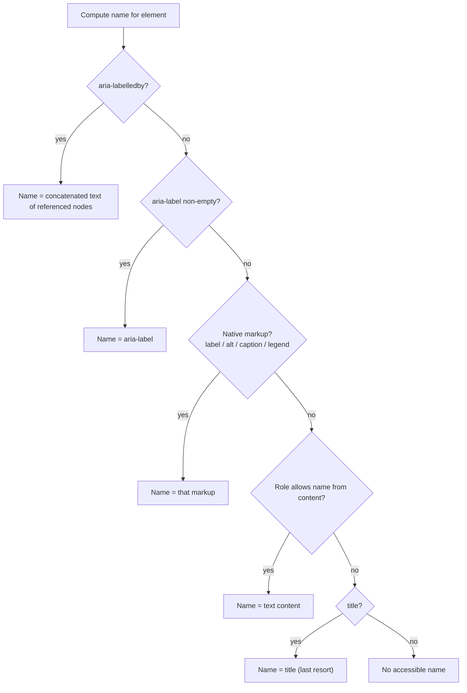

# Accessible Name Computation

> The accessible name is not "the text near the control". It is the first non-empty result of a fixed precedence order — and `aria-label` sits high enough in that order to silently erase the label the user can see.

**Part:** [04 · Interface Engineering](../) · **Domain:** Accessibility · **Priority:** High · **Difficulty:** Intermediate · **Reading time:** ~15 min

## TL;DR

Every element in the accessibility tree has an **accessible name** — the string a screen reader announces and a voice-control user speaks to activate it — computed by the browser using the **accname** algorithm. The order is fixed: `aria-labelledby` wins, then `aria-label`, then the native host-language mechanism (`<label for>`, `<caption>`, `alt`, `<legend>`, `<figcaption>`), then the element's own text content for roles that permit it, then `title` as a last resort. Each step stops at the first non-empty result, so an `aria-label` overrides visible text entirely. A separate **accessible description** (from `aria-describedby`, or `title` if it was not consumed for the name) is announced after a pause and is not a substitute for a name. WCAG 2.5.3 **Label in Name** requires that the accessible name contain the visible label text, which is what makes `aria-label="Save"` on a button reading "Save changes" a conformance failure and a voice-control breakage.

> **Recommendation:** Name controls with visible text — `<label for>`, or `aria-labelledby` referencing on-screen content. Reserve `aria-label` for controls with no visible text at all, and never use `title` as a naming strategy.

## At a Glance

| | |
| --- | --- |
| **Use when** | Every interactive control, image, landmark, table, and dialog needs a name — so, constantly. |
| **Avoid when** | Nothing to avoid; the decision is *which* mechanism, and visible text should win. |
| **Alternatives** | [`aria-label` for icon-only controls](#alternative-approaches), visually hidden text, `aria-describedby` for supplementary detail. |
| **Primary risk** | `aria-label` replacing visible text, breaking voice control and failing SC 2.5.3. |
| **Maturity** | Stable — accname 1.2 is implemented consistently across major browsers, with known edge cases. |

## Prerequisites

Naming is one of the three things assistive technology reports about a node.

- [WCAG Principles (POUR)](./wcag-principles-pour.md) — the Name, Role, Value criterion this mechanism satisfies.

## Overview

The computation runs top to bottom and stops at the first step producing a non-empty string:

| Step | Source | Notes |
| --- | --- | --- |
| 1 | `aria-labelledby` | Concatenates the text of every referenced element, in the order listed. Only followed one level deep. |
| 2 | `aria-label` | Used only if step 1 produced nothing. Replaces visible text entirely. |
| 3 | Host-language markup | `<label for>`/wrapping `<label>`, `alt`, `<caption>`, `<legend>`, `<figcaption>`, `<summary>`, SVG `<title>`. |
| 4 | Element content | Only for roles that support "name from content" — button, link, heading, cell, tab, option, menuitem. **Not** for textbox, region, or most containers. |
| 5 | `title` (and `placeholder` on inputs) | Fallback only; not announced by all AT, invisible to touch users. |

Several traversal details cause real bugs.

**`aria-labelledby` does not recurse into another `aria-labelledby`.** If the referenced element itself has an `aria-labelledby`, that indirection is not followed a second time — the referenced element's *content* is used instead.

**Hidden referenced text still counts.** `aria-labelledby` pointing at an element with `display: none` still contributes its text. This is a feature (a hidden span can name something) and a trap (removing "unused" hidden markup can silently unname a control).

**Multiple IDs concatenate with spaces, in the order written**, not document order. `aria-labelledby="verb noun"` and `aria-labelledby="noun verb"` produce different names.

**Empty is not the same as absent.** `aria-label=""` produces nothing and falls through to the next step; `alt=""` is different — it deliberately marks an image as decorative and stops the computation with an intentionally empty name.

The **accessible description** runs a parallel, lower-priority computation: `aria-describedby`, then `title` if it was not already consumed for the name. Screen readers typically announce it after the name, role, and state, often after a pause, and some verbosity settings suppress it — so essential information does not belong there.

## The Problem

The most common naming bug is invisible in the browser and obvious with a screen reader.

```html
<!-- ❌ Name becomes "Save"; the visible label is "Save changes". -->
<button aria-label="Save">Save changes</button>

<!-- ❌ Placeholder is not a label. -->
<input type="email" placeholder="Email address">

<!-- ❌ Label not associated: `for` points at nothing. -->
<label for="email">Email</label>
<input type="email" id="email-field">

<!-- ❌ Icon-only control with no name at all. -->
<button><svg><use href="#trash"/></svg></button>

<!-- ❌ Six controls with the same name in one list. -->
<a href="/posts/1">Read more</a>
<a href="/posts/2">Read more</a>
```

Each fails differently. The first breaks voice control: a user saying "click Save changes" gets no match, because the accessible name is now "Save" — and it fails SC 2.5.3, which requires the visible text to be contained in the name. The second relies on `placeholder`, which is a last-resort fallback that disappears the moment the user types and is not announced by every AT. The third looks associated but is not, so the input's name comes from nothing and is announced as an unlabelled edit field. The fourth has no text content and no label, so screen readers fall back to announcing "button" — or, worse, guess from the file name. The fifth produces a list of identically named links, which is unusable in the "list all links" mode screen-reader users navigate by.

The subtler failure is over-describing:

```html
<!-- ❌ Critical instruction placed where it may never be announced. -->
<input id="pw" aria-describedby="rules">
<span id="rules">Must include a number and a symbol</span>
```

Descriptions can be suppressed by verbosity settings and are announced after a pause; a requirement the user must know before typing should be part of the label or an associated, always-announced hint.

## Why It Matters

The accessible name is the primary handle for three different user groups. Screen-reader users hear it when focus lands and when browsing element lists. Voice-control users *speak* it — "click Save changes" matches against the accessible name, so a mismatch makes the control unreachable by voice even though it is perfectly visible. Switch-device and screen-magnifier users rely on it in element pickers. A wrong name breaks all three simultaneously.

Names also drive navigation, not just announcement. Screen readers offer "list all buttons", "list all links", "list all form fields", and "list all landmarks" — and each list shows only names. Six links named "Read more", four regions named "navigation", or three buttons named "Edit" turn those lists from a navigation aid into a guessing game.

For engineering teams there is a testing consequence: `getByRole("button", { name: "Save changes" })` in Testing Library queries the computed accessible name. Writing tests against roles and names means a broken name fails a test rather than reaching production — the cheapest accessibility feedback loop available.

## Mental Model

A waterfall with an early exit.



Four rules follow.

**First non-empty wins; later sources are never merged in.** There is no combining of `aria-label` with visible text.

**Name from content is role-dependent.** A `<button>` is named by its text; a `<div role="region">` or a text input is not.

**Descriptions are supplementary, never load-bearing.** If a user must know it to operate the control, it belongs in the name or in visible, associated text.

**Visible text should be the name whenever it exists.** That is the only way voice control, screen readers, and the screen agree.

## Best Practices

**Prefer native association.** `<label for="id">` for form controls, `alt` for images, `<figcaption>` for figures, `<caption>` for tables. These keep the name visible and in sync.

**Use `aria-labelledby` to reuse visible text.** Naming a dialog from its own heading (`aria-labelledby="dialog-title"`) is the canonical case.

**Reserve `aria-label` for controls with no visible text.** Icon-only buttons, close buttons, and landmark disambiguation.

**Include the visible words when both exist.** `aria-label="Save changes to profile"` is fine for a button reading "Save changes"; `aria-label="Save"` is not.

**Make names unique within their context.** "Read more about Q3 results" beats six identical "Read more" links; a visually hidden span can carry the distinguishing part.

**Name your landmarks when there is more than one of a type.** `<nav aria-label="Breadcrumb">` alongside `<nav aria-label="Main">`.

**Never rely on `title` or `placeholder`.** Both are fallbacks, both are invisible to touch users, and `placeholder` disappears on input.

**Assert names in tests.** Query by role and name so a renamed or unnamed control fails CI.

## Trade-offs

Each naming mechanism trades visibility against flexibility.

**Advantages of visible-text naming (`<label>`, content, `aria-labelledby`)**

- One string serves sighted users, screen-reader users, and voice control — they cannot disagree.
- Translation pipelines already handle visible copy; ARIA attributes are frequently missed.
- Satisfies SC 2.5.3 Label in Name automatically.
- Survives redesigns, because changing the visible text changes the name.

**Disadvantages**

- Requires the design to have visible text, which icon-only interfaces do not.
- `aria-labelledby` depends on IDs, which are fragile in component libraries and must be generated uniquely.
- Names built from concatenated references can read awkwardly out of context.
- Visually hidden text adds markup that is easy to delete during a cleanup.

| Dimension | `<label for>` | `aria-labelledby` | `aria-label` | `title` |
| --- | --- | --- | --- | --- |
| Visible to sighted users | Yes | Yes (references visible text) | No | On hover only |
| Localization risk | Low | Low | High — often missed | High |
| Matches voice-control target | Yes | Yes | Only if it includes visible words | No |
| Dependency | None | Stable unique IDs | None | None |
| Best for | Form controls | Dialogs, groups, reused text | Icon-only controls | Nothing |

## Alternative Approaches

| Approach | Best when | Weakness | See |
| --- | --- | --- | --- |
| Native `<label>` / `alt` / `<caption>` | Any control or image with a visible label | Requires markup association discipline | (this article) |
| `aria-labelledby` | Naming from existing visible text, e.g. a dialog heading | ID management in component systems | [The ARIA Model](./the-aria-model.md) |
| `aria-label` | Icon-only controls with no visible text | Invisible to translation review; must include visible words if any | (this article) |
| Visually hidden text | The name needs more words than the design shows | Extra markup; easy to remove accidentally | (this article) |
| `aria-describedby` | Supplementary hints, formats, error detail | Announced late; can be suppressed | (this article) |

## Bad Example

A form and a card grid where every name comes from the wrong place.

```html
<!-- ❌ Placeholder as label; disappears when typing, weakest source. -->
<input type="search" placeholder="Search products">

<!-- ❌ `for` and `id` do not match: no association at all. -->
<label for="qty">Quantity</label>
<input type="number" id="quantity">

<!-- ❌ aria-label replaces the visible text; voice control now fails. -->
<button aria-label="Delete">Delete this item permanently</button>

<!-- ❌ Icon-only button named by a title that AT may never announce. -->
<button title="Close"><svg aria-hidden="true"><use href="#x"/></svg></button>

<!-- ❌ Decorative image given a name; announced as noise. -->


<!-- ❌ Meaningful image given no name. -->


<!-- ❌ Identical names; useless in a links list. -->
<article><h3>Q3 results</h3><a href="/q3">Read more</a></article>
<article><h3>Hiring update</h3><a href="/hiring">Read more</a></article>

<!-- ❌ Two navigation landmarks with the same implicit name. -->
<nav>…</nav>
<nav>…</nav>

<!-- ❌ Essential requirement hidden in a description. -->
<input id="pw" type="password" aria-describedby="pw-rules">
<span id="pw-rules">Minimum 12 characters</span>
```

**What goes wrong:** The search input is named only by `placeholder`, the lowest-priority source — several screen readers do not announce it, and it vanishes as soon as the user types, leaving a field with no name mid-entry. The quantity input's label points at an ID that does not exist, so the association silently fails and the control is announced as an unlabelled spin button while looking perfectly labelled on screen. The delete button's `aria-label` truncates the name to "Delete", so a voice-control user saying the words they can read — "click Delete this item permanently" — gets no match, and the mismatch fails SC 2.5.3. The close button relies on `title`, which is not announced by every AT and is completely unavailable on touch. The divider image has alt text describing a graphic that carries no information, so it interrupts reading, while the Q3 chart — which does carry information — is marked decorative and is silently skipped. The two "Read more" links are indistinguishable in the links list that screen-reader users navigate by, even though the headings above them are distinct. The two `<nav>` landmarks are both announced simply as "navigation", so the landmarks list cannot tell them apart. And the password requirement lives in a description that is announced after a pause and can be suppressed entirely by verbosity settings — the user may start typing without ever hearing it.

## Good Example

The same interface with names that come from what is on screen.

```html
<!-- ✅ Real label, visually hidden where the design has no room. -->
<label for="site-search" class="visually-hidden">Search products</label>
<input id="site-search" type="search" placeholder="Search products">

<!-- ✅ Matching for/id — or wrap the control entirely. -->
<label>
  Quantity
  <input type="number" name="qty">
</label>

<!-- ✅ Visible text is the name; no override needed. -->
<button>Delete this item permanently</button>

<!-- ✅ Icon-only control named with aria-label; the icon itself is hidden. -->
<button aria-label="Close dialog">
  <svg aria-hidden="true" focusable="false"><use href="#x"/></svg>
</button>

<!-- ✅ Decorative image removed from the tree; informative one described. -->


```

```html
<!-- ✅ Unique link names built from visible text plus hidden context. -->
<article>
  <h3 id="post-q3">Q3 results</h3>
  <a href="/q3" aria-labelledby="post-q3 read-more-q3">
    <span id="read-more-q3">Read more</span>
  </a>
</article>
<!-- Name: "Q3 results Read more" — distinct in the links list. -->

<!-- ✅ Landmarks named, so the landmarks list is navigable. -->
<nav aria-label="Main">…</nav>
<nav aria-label="Breadcrumb">…</nav>
```

```html
<!-- ✅ Requirements visible and part of the label's group;
     the description carries only supplementary format detail. -->
<div class="field">
  <label for="pw">Password (minimum 12 characters)</label>
  <input id="pw" type="password" aria-describedby="pw-hint" required>
  <p id="pw-hint">Using a passphrase of three unrelated words is easiest to remember.</p>
</div>
```

```jsx
// ✅ Dialogs named by their own heading — one string, always in sync.
function Dialog({ titleId, title, children }) {
  return (
    <div role="dialog" aria-modal="true" aria-labelledby={titleId}>
      <h2 id={titleId}>{title}</h2>
      {children}
    </div>
  );
}

// ✅ Tests query by role and name, so a broken name fails CI.
test("close button is reachable by its name", () => {
  render(<Dialog titleId="d1" title="Delete account" />);
  expect(screen.getByRole("dialog", { name: "Delete account" })).toBeVisible();
  expect(screen.getByRole("button", { name: "Close dialog" })).toBeEnabled();
});
```

**Why it's better:** The search field has a real `<label>` that happens to be visually hidden, so the name comes from step 3 of the computation rather than the last-resort `placeholder`, and it survives the user typing. Wrapping the quantity input in its `<label>` removes the ID dependency entirely, so the association cannot break through a typo. Leaving the delete button's visible text as its name means the screen reader announcement, the voice-control target, and the pixels all say the same thing — SC 2.5.3 is satisfied by construction rather than by review. The close button uses `aria-label` for the one case it is designed for, an icon-only control, with the SVG marked `aria-hidden` and `focusable="false"` so it contributes nothing and cannot be tabbed to in older browsers. The two images swap their alt strategies to match their actual roles: the divider is removed from the tree, the chart carries the information a sighted reader gets from looking at it. `aria-labelledby="post-q3 read-more-q3"` concatenates the heading and the link text into a distinct name per card, which is what makes a links list usable, and it reuses text already on the page rather than duplicating a string that could drift. The named landmarks give the landmarks list something to distinguish. The password requirement moved into the visible label where it is always announced, leaving the description for genuinely optional advice. And the dialog names itself from its own heading while the tests query by role and name, so any regression in naming fails the build rather than reaching a user.

## Common Mistakes

See the [Accessibility anti-patterns](../../../anti-patterns/) for the domain catalog. Concept-specific:

### Mistake: `aria-label` shorter than the visible text

- **Symptom:** Voice-control users say the words on the button and nothing happens; screen-reader users hear a different label than they see.
- **Why it fails:** `aria-label` sits above content in the precedence order, so it replaces the visible text entirely rather than supplementing it — and SC 2.5.3 requires the visible label to be contained within the accessible name.
- **Fix:** Remove the `aria-label` and let the visible text name the control, or extend it so the visible words are included verbatim.

### Mistake: Using `placeholder` or `title` as the label

- **Symptom:** Fields announce as "edit, blank" once the user starts typing, or controls announce with no name at all on touch devices.
- **Why it fails:** Both are the lowest-priority sources in the computation, inconsistently announced across AT, invisible to touch users, and `placeholder` disappears on input.
- **Fix:** Add a real `<label for>` — visually hidden if the design requires — and keep the placeholder as an example value only.

### Mistake: Treating `aria-describedby` as a second label

- **Symptom:** Required formats, character limits, or constraints are never heard, and users hit validation errors they had no way to anticipate.
- **Why it fails:** Descriptions are announced after the name, role, and state, usually after a pause, and can be suppressed by verbosity settings. They are supplementary by design.
- **Fix:** Put anything the user must know to complete the field into the visible label or an always-announced hint; reserve descriptions for optional detail.

## Checklist

- [ ] Every interactive control, image, landmark, table, and dialog has a non-empty accessible name.
- [ ] Names come from visible text wherever visible text exists.
- [ ] Any `aria-label` contains the visible label words verbatim (SC 2.5.3).
- [ ] `aria-label` is used only on controls with no visible text.
- [ ] `<label for>` / `id` pairs are verified to match; wrapping labels are preferred where practical.
- [ ] Neither `placeholder` nor `title` is the only naming source anywhere.
- [ ] Decorative images use `alt=""`; informative images describe the information, not the file.
- [ ] Repeated link and button names are disambiguated with context.
- [ ] Duplicate landmark types carry distinguishing `aria-label` values.
- [ ] `aria-describedby` carries only supplementary information, never requirements.
- [ ] Tests query by role and accessible name so naming regressions fail CI.

## Related Articles

- [The ARIA Model](./the-aria-model.md) — where `aria-label` and `aria-labelledby` sit in the wider ARIA vocabulary.
- [WCAG Principles (POUR)](./wcag-principles-pour.md) — the Name, Role, Value criterion this computation serves.
- [Conformance Levels](./conformance-levels.md) — SC 2.5.3 Label in Name and the level it sits at.
- [Headings Hierarchy · HTML & Document Semantics](../../01-core-languages/html-semantics/headings-hierarchy.md) — headings frequently reused as `aria-labelledby` targets.
- [Sectioning & Landmarks · HTML & Document Semantics](../../01-core-languages/html-semantics/sectioning-and-landmarks.md) — landmarks that need names when repeated.
- [Error Messaging · Forms & Validation](../../03-application-architecture/forms-validation/error-messaging.md) — associating error text without overloading the description.

## References

- [W3C — Accessible Name and Description Computation 1.2](https://www.w3.org/TR/accname-1.2/) — the normative algorithm, including traversal and concatenation rules.
- [W3C — HTML Accessibility API Mappings](https://www.w3.org/TR/html-aam-1.0/) — which native markup supplies the name for each element.
- [W3C — Understanding SC 2.5.3 Label in Name](https://www.w3.org/WAI/WCAG22/Understanding/label-in-name.html) — why the visible label must be contained in the accessible name.
- [MDN — Accessible name](https://developer.mozilla.org/en-US/docs/Glossary/Accessible_name) — practical summary with per-element examples.
