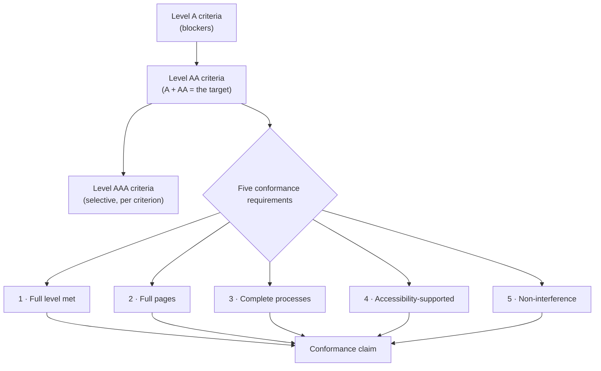

# Conformance Levels

> Conformance is binary and page-scoped. A page either meets every applicable criterion at a level, or it does not conform at that level — "90% AA" is a progress metric, not a claim you can make.

**Part:** [04 · Interface Engineering](../) · **Domain:** Accessibility · **Priority:** High · **Difficulty:** Intermediate · **Reading time:** ~12 min

## TL;DR

WCAG defines three levels — **A** (minimum), **AA** (the level nearly all law and procurement references), and **AAA** (enhanced, not required for whole sites). The levels are **cumulative**: AA means all A criteria *plus* all AA criteria. Conformance is also governed by **five requirements** that people forget exist: the level must be fully met, the unit is a **full page** (not a component), whole **processes** must conform end to end (a checkout is only accessible if every step is), only **accessibility-supported** technologies may be relied on, and technologies used **must not block** access even when unsupported. Because the unit is a page, a modal that traps focus makes the entire page non-conformant regardless of how good the rest is.

> **Recommendation:** Target WCAG 2.2 Level AA for everything, treat individual AAA criteria as opt-in improvements, and publish an honest accessibility statement listing known gaps rather than an unqualified conformance claim.

## At a Glance

| | |
| --- | --- |
| **Use when** | Setting an accessibility target, writing a statement or VPAT, or scoping an audit. |
| **Avoid when** | Never — some level is always the target; the choice is which, and how you evidence it. |
| **Alternatives** | [AAA for specific criteria](#alternative-approaches), organization-specific supplements, EN 301 549 / Section 508 mappings. |
| **Primary risk** | Claiming conformance from automated scans, which cover a minority of criteria. |
| **Maturity** | Stable — WCAG 2.2 is the current W3C Recommendation; 2.0 and 2.1 remain referenced in law. |

## Prerequisites

Levels label criteria that are organized by principle, so the principles come first.

- [WCAG Principles (POUR)](./wcag-principles-pour.md) — the four principles and the guideline/criterion structure levels apply to.

## Overview

Every WCAG success criterion carries exactly one level. The level reflects a combination of impact, feasibility across content types, and whether the requirement can be met without constraining design or function:

| Level | Meaning | Examples | Typical use |
| --- | --- | --- | --- |
| **A** | Minimum; failing these blocks whole groups of users outright | Keyboard operable, non-text content has alternatives, no keyboard trap, page has a language | Absolute floor; never a target on its own |
| **AA** | Addresses the most common and significant barriers | 4.5:1 text contrast, resize to 200%, visible focus, consistent navigation, dragging alternatives | The near-universal legal and contractual target |
| **AAA** | Enhanced; cannot be satisfied for all content types | 7:1 contrast, sign language for prerecorded audio, no timing at all, reading level | Applied selectively, per criterion |

The W3C explicitly states that AAA conformance is **not recommended as a general policy for entire sites**, because some AAA criteria cannot be met by some content.

The five **conformance requirements** are where most incorrect claims originate:

1. **Conformance level** — every applicable criterion at the chosen level and all lower levels is met.
2. **Full pages** — conformance is claimed for complete pages; you cannot exclude part of a page. A conforming alternate version may substitute.
3. **Complete processes** — if a page is part of a multi-step process, every page in that process must conform.
4. **Accessibility-supported ways of using technologies** — information conveyed via a technology feature must be handled reliably by assistive technologies and user agents your users have.
5. **Non-interference** — technologies not relied upon must not block access; anything on the page must still satisfy the criteria for keyboard traps, audio control, flashing, and pause/stop/hide.

WCAG 2.2 added criteria at each level (focus appearance, dragging movements, target size minimum, consistent help, redundant entry, accessible authentication) and removed 4.1.1 Parsing. Conformance to 2.2 AA implies conformance to 2.1 AA and 2.0 AA, since 2.x is backwards compatible.

## The Problem

Most conformance claims are wrong in one of three ways.

**Claiming a percentage.** "We are 94% AA compliant" is not a WCAG statement. Conformance is per-page and binary; a percentage is either a count of passed checks (which is not what conformance means) or a count of passing pages (which should be said explicitly).

**Claiming from a scanner.** Automated tools reliably detect a minority of WCAG criteria — missing alternative text, low contrast on solid backgrounds, missing form labels, some ARIA misuse. They cannot evaluate whether alt text is *meaningful*, whether focus order is *logical*, whether an error message is *helpful*, or whether a custom widget behaves like the role it claims. A zero-violation scan is a floor, not a result.

**Ignoring scope.** Auditing components in isolation misses everything that emerges when they are composed: duplicate landmark names, heading levels that skip once assembled, focus that escapes a dialog into content behind it, a skip link pointing at a removed target. Requirements 2 and 3 exist precisely because the page and the process are what users experience.

A fourth, subtler failure is relying on a technology that is not accessibility-supported — a custom element whose semantics only one browser exposes, or an ARIA pattern that a major screen reader ignores. Requirement 4 makes that a conformance failure even when the code matches the specification.

## Why It Matters

Legally, AA is the operative number. The EU's EN 301 549 (and therefore the Web Accessibility Directive and the European Accessibility Act) references WCAG AA; US Section 508 references WCAG 2.0 AA; the ADA's Title II rule adopts WCAG 2.1 AA for state and local government; procurement processes across sectors ask for a VPAT/ACR against AA. Choosing a target below AA means excluding yourself from those markets.

Practically, the level distinctions encode real user impact. Level A failures tend to be total blockers — a keyboard user who cannot reach a control simply cannot use the feature. AA failures are the frequent, cumulative barriers: contrast that fails in bright light, focus indicators invisible on a dark theme, no way to complete a drag interaction without a mouse. AAA criteria improve experiences that AA already makes possible.

The scoping rules matter for how teams organize work. Because conformance is page-scoped, an accessibility program that only reviews components will always over-report. Because processes must conform end to end, a checkout with an inaccessible payment step is non-conformant *as a whole*, no matter how good the cart page is.

## Mental Model

Levels stack; requirements gate the claim.



Four rules follow.

**Levels are cumulative, not alternative.** AA includes every A criterion.

**The unit is the page, and the process is the chain of pages.** Components conform only as part of one.

**Not applicable is not the same as passing.** A page with no video does not "pass" captions; that criterion simply does not apply, and the claim is unaffected.

**A single failure anywhere on the page defeats the claim for that page.** This is why "conformance" and "accessibility maturity" are different measurements, and why a statement listing known gaps is more useful than an unqualified claim.

## Best Practices

**Set AA as the organizational target and write it into the definition of done.** A target that lives only in a policy document is not a target.

**Adopt individual AAA criteria where they are cheap and high-impact.** 7:1 contrast, a visible focus indicator exceeding the minimum, and no timing limits are usually achievable and benefit everyone.

**Audit by page and by process, not only by component.** Component tests catch regressions; page and journey audits catch conformance.

**Combine automated, manual, and assistive-technology testing.** Scanners for regression coverage, keyboard-only passes for operability, and screen readers for name/role/state.

**Publish an accessibility statement with known issues and a contact route.** It is required by EU rules for public bodies and is good practice everywhere; honesty about gaps is more defensible than an unqualified claim.

**Record evidence per criterion.** A VPAT/ACR is only credible if each "Supports" has a test behind it.

**Re-test after design-system upgrades.** Conformance is a property of the shipped page, so a token change to focus colors can invalidate a previous result.

## Trade-offs

Choosing a level is choosing a cost and a coverage.

**Advantages of targeting AA**

- Matches essentially every legal, procurement, and contractual requirement.
- Achievable for all content types without constraining design.
- Well-supported by tooling, documentation, and established patterns.
- Provides a shared, external definition of done that survives team changes.

**Disadvantages**

- Binary and page-scoped, so partial progress is invisible in the claim — demoralizing without a separate internal metric.
- Verification is labor-intensive; the majority of criteria need human judgment.
- Conformance is not the same as usability: a page can meet AA and still be unpleasant with a screen reader.
- Claims decay — any deploy can break them, so evidence has a shelf life.

| Dimension | Level A | Level AA | Level AAA |
| --- | --- | --- | --- |
| User impact of failure | Total blocker | Significant barrier | Reduced quality |
| Legal referencing | Rarely on its own | Near-universal | Essentially never |
| Applicable to all content | Yes | Yes | No |
| Text contrast requirement | None | 4.5:1 (3:1 large) | 7:1 (4.5:1 large) |
| Typical effort | Low, mostly semantics | Moderate, design-affecting | High, content-affecting |
| Recommended as a site policy | No — insufficient | Yes | No — per criterion only |

## Alternative Approaches

| Approach | Best when | Weakness | See |
| --- | --- | --- | --- |
| WCAG 2.2 Level AA | The default for every product | Binary claim hides partial progress | (this article) |
| Selected AAA criteria | Specific, high-impact wins (contrast, focus, no timeouts) | Cannot be claimed as AAA conformance overall | (this article) |
| Conforming alternate version | Legacy content that genuinely cannot be fixed in place | Must be equally up to date and reachable; usually a maintenance trap | (this article) |
| EN 301 549 / Section 508 mapping | Public-sector procurement in the EU or US | Adds non-web requirements (documents, hardware, software) | (this article) |
| Internal accessibility maturity scoring | Tracking progress between audits | Not a conformance claim; must not be reported as one | [Automated Auditing](./) (planned) |

## Bad Example

An accessibility statement and process built on scanner output.

```markdown
<!-- ❌ statements/accessibility.md -->
# Accessibility

Our application is **94% WCAG 2.1 AAA compliant**, verified by automated
scanning on every pull request. All components in our design system pass
axe-core with zero violations.

Known issues: none.
```

```js
// ❌ CI gate that is treated as proof of conformance.
import { axe } from "vitest-axe";

test("button is accessible", async () => {
  const { container } = render(<Button>Save</Button>);
  expect(await axe(container)).toHaveNoViolations();   // component in isolation
});
```

```jsx
// ❌ A pattern that passes automated checks and fails conformance.
<div role="dialog" aria-label="Settings">
  {/* focus is never moved here, and Escape does nothing */}
  <div role="button" onClick={save}>Save</div>   {/* not keyboard operable */}
</div>
```

**What goes wrong:** The statement makes three claims that cannot be true at once. A percentage is not a WCAG conformance claim — conformance is binary per page — and AAA is not recommended as a site-wide policy, so citing it signals the number came from a tool's rule count rather than from the standard. "Verified by automated scanning" covers only the subset of criteria a scanner can evaluate, so "known issues: none" almost certainly means "unknown issues: unmeasured". The CI test renders a single component into an empty container, which cannot detect the failures that arise from composition — duplicate landmarks, broken heading order, focus escaping a dialog — yet it is being presented as page-level evidence. And the dialog demonstrates the gap precisely: `role="dialog"` with an `aria-label` satisfies the checks a scanner runs, while focus is never moved into it, Escape does not close it, focus is not trapped, and the `div role="button"` cannot be reached or activated by keyboard at all — three Level A failures on a page reported as conformant.

## Good Example

A target, a test strategy, and a statement that match the standard.

```markdown
<!-- ✅ statements/accessibility.md -->
# Accessibility statement

**Target:** WCAG 2.2 Level AA.
**Conformance status:** Partially conformant — the criteria below are not yet met.
**Last evaluated:** 2026-07-14, by manual audit (keyboard + NVDA/VoiceOver)
and automated scanning, covering the 12 page templates and the
sign-up → checkout → confirmation process.

## Known issues

| Page / flow | Criterion | Level | Issue | Planned fix |
| --- | --- | --- | --- | --- |
| Reports · data grid | 2.1.1 Keyboard | A | Column resize is pointer-only | Q4 2026 |
| Marketing · hero video | 1.2.5 Audio Description | AA | No audio description track | Q3 2026 |

**Feedback:** accessibility@example.com — we respond within 5 working days.
```

```js
// ✅ Automated checks scoped honestly: regression coverage, not conformance.
// Runs against fully composed pages, not isolated components.
import { injectAxe, checkA11y } from "axe-playwright";

for (const path of ["/", "/pricing", "/checkout/payment"]) {
  test(`no automated violations: ${path}`, async ({ page }) => {
    await page.goto(path);
    await injectAxe(page);
    // Catches ~a third of criteria; manual audit covers the rest.
    await checkA11y(page, undefined, { detailedReport: true });
  });
}
```

```js
// ✅ Keyboard-operability checks that scanners cannot perform.
test("dialog traps focus and closes on Escape", async ({ page }) => {
  await page.goto("/settings");
  await page.getByRole("button", { name: "Open settings" }).press("Enter");

  const dialog = page.getByRole("dialog", { name: "Settings" });
  await expect(dialog).toBeFocused();               // focus moved in

  await page.keyboard.press("Tab");                 // stays inside
  await expect(dialog.locator(":focus")).toHaveCount(1);

  await page.keyboard.press("Escape");
  await expect(dialog).toBeHidden();
  await expect(page.getByRole("button", { name: "Open settings" })).toBeFocused();
});
```

```markdown
<!-- ✅ Evidence per criterion, the unit a VPAT/ACR is built from. -->
| Criterion | Level | Status | Evidence |
| --- | --- | --- | --- |
| 1.4.3 Contrast (Minimum) | AA | Supports | Token audit 2026-07-02; all pairs ≥ 4.5:1 |
| 2.4.7 Focus Visible | AA | Supports | Manual pass, all 12 templates, 2026-07-14 |
| 2.5.7 Dragging Movements | AA | Partially supports | Data grid resize — see known issues |
```

**Why it's better:** The statement names a version and a level, reports "partially conformant" — the honest status the W3C provides for exactly this situation — and lists the specific criteria that fail with their levels and remediation dates, which is both more defensible and more useful than an unqualified claim. It records what was evaluated, how, and when, so a reader can judge the evidence's freshness. Automated checks run against fully composed pages rather than isolated components, which is the scope conformance actually uses, and the comment states plainly that they cover a fraction of criteria so nobody mistakes a green build for a result. The keyboard test verifies the three dialog behaviors no scanner can see — focus moved in, focus contained, focus restored on close — turning a Level A requirement into an executable check. And the per-criterion evidence table is the unit a VPAT is assembled from, so producing one for a procurement request becomes a matter of exporting existing records rather than a fresh audit.

## Common Mistakes

See the [Accessibility anti-patterns](../../../anti-patterns/) for the domain catalog. Concept-specific:

### Mistake: Reporting conformance as a percentage

- **Symptom:** Dashboards and statements say "92% WCAG compliant" or "AA score: 87".
- **Why it fails:** Conformance is binary and page-scoped: a page meets a level or it does not. A percentage usually counts automated rule passes, which is neither the criteria set nor the scope WCAG defines.
- **Fix:** Report conformance per page or per process as conformant / partially conformant / non-conformant, and keep any internal percentage clearly labelled as a progress metric.

### Mistake: Treating a clean automated scan as conformance

- **Symptom:** "Zero axe violations" is cited as evidence of AA, yet keyboard users cannot complete core flows.
- **Why it fails:** Automated tools evaluate a minority of success criteria and cannot judge meaning, order, or behavior — alt-text quality, focus order, error message usefulness, or whether a custom widget behaves like its role.
- **Fix:** Treat scanners as regression coverage. Add keyboard-only passes, screen-reader testing, and manual review against the criteria they cannot reach.

### Mistake: Auditing components instead of pages and processes

- **Symptom:** Every component is "accessible", but assembled pages have duplicate landmarks, skipped heading levels, or focus that escapes a dialog.
- **Why it fails:** Conformance requirements 2 and 3 define the unit as the full page and the complete process. Composition creates failures no component test can see.
- **Fix:** Keep component tests for regressions, and audit representative page templates plus every end-to-end process (sign-up, checkout, support request).

## Checklist

- [ ] A specific target is written down: WCAG version, level, and the pages and processes it covers.
- [ ] Level A and AA criteria are both tracked; AA is understood to include A.
- [ ] Any AAA criteria adopted are listed individually, not claimed as AAA conformance.
- [ ] Audits are scoped to full pages and complete processes, not isolated components.
- [ ] Automated results are labelled as partial coverage, never as a conformance claim.
- [ ] Keyboard-only and screen-reader passes are part of the release process.
- [ ] Technologies relied upon are verified as accessibility-supported in the browsers and AT combinations users have.
- [ ] An accessibility statement exists with status, evaluation date, known issues, and a feedback contact.
- [ ] Per-criterion evidence is recorded so a VPAT/ACR can be produced without a new audit.

## Related Articles

- [WCAG Principles (POUR)](./wcag-principles-pour.md) — the four principles the levelled criteria are organized under.
- [The ARIA Model](./the-aria-model.md) — the technology whose accessibility support requirement 4 governs.
- [Accessible Name Computation](./accessible-name-computation.md) — the mechanism behind several Level A and AA name criteria.
- [The Document Outline · HTML & Document Semantics](../../01-core-languages/html-semantics/the-document-outline.md) — structure that page-level conformance depends on.
- [What to Test & Coverage Goals · Testing & Quality](../../05-reliability-quality/testing/what-to-test-and-coverage-goals.md) — why a coverage number is not a quality claim, in the same shape as this argument.

## References

- [W3C — WCAG 2.2 Conformance](https://www.w3.org/TR/WCAG22/#conformance) — the normative five requirements and the definition of each level.
- [W3C — Understanding Conformance](https://www.w3.org/WAI/WCAG22/Understanding/conformance) — explanatory text on full pages, complete processes, and accessibility support.
- [W3C — WCAG 2 Overview](https://www.w3.org/WAI/standards-guidelines/wcag/) — version history and the relationship between 2.0, 2.1, and 2.2.
- [W3C — Developing an Accessibility Statement](https://www.w3.org/WAI/planning/statements/) — the structure of a statement, including known issues and feedback routes.
