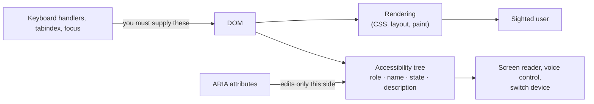

# The ARIA Model

> ARIA changes what assistive technology is *told*, never what the browser *does*. `role="button"` on a `<div>` announces a button and gives you nothing else — no focus, no Enter, no Space, no disabled state.

**Part:** [04 · Interface Engineering](../) · **Domain:** Accessibility · **Priority:** High · **Difficulty:** Intermediate · **Reading time:** ~12 min

## TL;DR

**WAI-ARIA** is a vocabulary of **roles** (what a thing is), **states** (what is currently true of it, e.g. `aria-expanded`), and **properties** (what is structurally true, e.g. `aria-labelledby`) that override the accessibility tree the browser derives from markup. It is **declarative annotation, not behavior**: no keyboard handling, no focus management, no styling, no event semantics come with it. That asymmetry is the source of nearly every ARIA bug, and it is why the **first rule of ARIA** is not to use ARIA — a native `<button>` already carries the role, the focusability, the key handling, the disabled state, and the form participation. Reach for ARIA when the platform has no element for the pattern (tabs, comboboxes, tree grids), when you must annotate relationships HTML cannot express, or when you need live-region announcements.

> **Recommendation:** Use native elements first. When ARIA is unavoidable, implement the full keyboard interaction from the ARIA Authoring Practices Guide alongside the attributes, and test with a real screen reader — no ARIA is better than wrong ARIA.

## At a Glance

| | |
| --- | --- |
| **Use when** | No native element expresses the pattern, or a relationship/live update must be announced. |
| **Avoid when** | A native element exists — buttons, links, checkboxes, dialogs, details/summary, form controls. |
| **Alternatives** | [Native HTML semantics](#alternative-approaches), the Popover API, `<dialog>`, `<details>`, visually hidden text. |
| **Primary risk** | Announcing a role whose behavior is not implemented, producing a control that lies about itself. |
| **Maturity** | Stable — ARIA 1.2 is a W3C Recommendation; support varies by role and screen reader. |

## Prerequisites

ARIA exists to satisfy criteria defined elsewhere.

- [WCAG Principles (POUR)](./wcag-principles-pour.md) — the requirements ARIA helps meet, particularly Name, Role, Value.

## Overview

The browser builds an **accessibility tree** from the DOM: a parallel structure where each exposed node carries a role, an accessible name, a description, and a set of states. Assistive technology reads that tree, not your CSS or your event handlers. ARIA attributes edit it.

| Category | Answers | Examples |
| --- | --- | --- |
| **Role** | What is this? | `role="tab"`, `role="dialog"`, `role="status"`, `role="none"` |
| **State** | What is true right now? | `aria-expanded`, `aria-checked`, `aria-selected`, `aria-disabled`, `aria-busy` |
| **Property** | What is structurally true? | `aria-label`, `aria-labelledby`, `aria-describedby`, `aria-controls`, `aria-required` |

Three behaviors are worth internalizing.

**Roles have required attributes and required children.** `role="tab"` requires `aria-selected` and must be inside `role="tablist"`; `role="checkbox"` requires `aria-checked`. Omitting them produces an incoherent node rather than a partially working one.

**`aria-hidden="true"` removes a subtree from the accessibility tree but leaves it focusable.** Hiding a container that holds a focusable element creates a control a keyboard user can reach and a screen reader cannot describe — one of the worst states to be in. Use `inert` (or remove the element) instead.

**Some ARIA is stronger than HTML, and some is ignored.** `role` overrides the native role, but ARIA states do not change behavior: `aria-disabled="true"` on a `<button>` announces disabled while the button still fires its click handler. HTML's `disabled` does both.

Live regions (`aria-live`, `role="status"`, `role="alert"`) are the one place ARIA does cause an *observable* effect: the AT announces changes to that region's content, with `polite` waiting for a pause and `assertive` interrupting.

## The Problem

The `div`-as-button remains the canonical failure because it looks complete.

```html
<!-- ❌ Announces "button". Does nothing a button does. -->
<div role="button" class="btn" onclick="save()">Save</div>
```

The screen reader says "Save, button", so the user expects to press Tab to reach it and Enter or Space to activate it. None of that works: the `<div>` is not focusable (no `tabindex`), so keyboard users never reach it; even with `tabindex="0"` added, Enter and Space do nothing without explicit key handlers; there is no `:disabled` state, no form submission, no default focus ring, and no forced-colors treatment. The role has made the situation *worse* than an unannotated `<div>`, because now the interface actively promises an interaction it cannot deliver.

The second failure is ARIA applied as decoration:

```html
<!-- ❌ Redundant, conflicting, and in one case actively harmful. -->
<button role="button" aria-label="Save">Save changes</button>
<nav role="navigation" aria-label="Main">…</nav>
<input type="checkbox" aria-checked="true">
```

The `aria-label` on the button *replaces* its visible text, so a voice-control user saying "click Save changes" no longer matches the accessible name. The `aria-checked` on a native checkbox is ignored by browsers that compute it from the DOM state, so it drifts out of sync the moment the user interacts.

The third is hiding things wrongly:

```html
<!-- ❌ Focusable but invisible to AT. -->
<div class="offscreen-menu" aria-hidden="true">
  <a href="/settings">Settings</a>
</div>
```

Tab reaches the link; the screen reader announces nothing; the user is stranded on a control that does not exist as far as their software is concerned.

## Why It Matters

Assistive technology has no other source of truth. Sighted users infer a control's nature from position, shape, cursor, and hover feedback; a screen reader user gets only the role, name, state, and description in the accessibility tree. When those are wrong, the interface is not degraded — it is misdescribed, which is harder to recover from than missing information.

The behavior gap also has a direct cost in code. Adopting `role="tablist"` commits you to implementing arrow-key navigation, `Home`/`End`, roving `tabindex`, and `aria-selected` synchronization; adopting `role="dialog"` commits you to focus movement, focus containment, `Escape`, and focus restoration. The attribute is one line; the contract behind it is a component. Teams that treat ARIA as annotation ship half-implemented widgets that test clean in scanners and fail in use.

Finally, ARIA is where the "accessibility-supported" conformance requirement bites. A role that a specification defines but a major screen reader does not announce cannot be relied on for conformance, which is why the Authoring Practices Guide's patterns — chosen partly for support — are safer than assembling roles from the specification alone.

## Mental Model

Two channels from one DOM: one to the screen, one to the accessibility tree.



Four rules follow.

**ARIA edits the description, never the behavior.** Focus, keys, and state changes remain your responsibility.

**Native elements write to both channels at once.** That is the entire argument for preferring them.

**A role is a promise.** Claiming it obliges you to the full interaction pattern for that role.

**Wrong ARIA is worse than none.** Missing semantics leave a user to explore; incorrect semantics send them somewhere that does not exist.

## Best Practices

**Follow the five rules of ARIA.** (1) Use native HTML if you can. (2) Do not change native semantics unless you must. (3) All interactive ARIA controls must be keyboard operable. (4) Do not use `role="presentation"` or `aria-hidden="true"` on focusable elements. (5) All interactive elements must have an accessible name.

**Implement the APG pattern in full, or not at all.** Copy the keyboard interaction table alongside the attributes.

**Prefer `aria-labelledby` to `aria-label`.** Referencing visible text keeps the accessible name in sync with what users see and say.

**Use `inert` to remove interactive regions.** It removes focusability and AT exposure together; `aria-hidden` removes only the latter.

**Keep states in sync with a single source of truth.** Derive `aria-expanded` from the same state that drives the class name, never as a separate imperative write.

**Announce with live regions that exist before the content does.** A region inserted at the same moment as its message is often not announced; render an empty `role="status"` up front and fill it.

**Test with a real screen reader.** NVDA + Firefox and VoiceOver + Safari cover most real usage; the difference between "valid ARIA" and "usable ARIA" only appears there.

## Trade-offs

ARIA buys expressiveness at the cost of hand-implemented behavior.

**Advantages**

- Expresses patterns HTML has no element for: tabs, comboboxes, tree grids, toolbars.
- Annotates relationships markup cannot: which control owns which panel, which message describes which field.
- Live regions provide dynamic announcements with no native equivalent.
- Lets an existing design system add semantics without a markup rewrite.

**Disadvantages**

- Supplies zero behavior, so every role is a component's worth of keyboard work.
- Support varies by role and screen reader; the specification is not a guarantee.
- Silent when wrong — no console error, no visual difference, no automated detection of a mismatch between claimed role and actual behavior.
- Easy to desynchronize: a state attribute updated in one code path and not another misdescribes the control from then on.

| Dimension | Native element | ARIA on a generic element |
| --- | --- | --- |
| Role in a11y tree | Automatic | Declared by you |
| Focusable | Automatic | `tabindex` required |
| Keyboard activation | Built in | Hand-written handlers |
| Disabled semantics + behavior | `disabled` does both | `aria-disabled` describes only |
| Forced-colors / high-contrast | Handled by the UA | Manual |
| Failure mode | Styling constraints | Misdescribed control |

## Alternative Approaches

| Approach | Best when | Weakness | See |
| --- | --- | --- | --- |
| Native HTML elements | Always the first choice | Styling constraints on some controls (`select`, `input[type=date]`) | [Sectioning & Landmarks · HTML](../../01-core-languages/html-semantics/sectioning-and-landmarks.md) |
| `<dialog>` + Popover API | Modals, popovers, menus | Newer APIs need fallbacks in older browsers | (this article) |
| ARIA + APG pattern | Tabs, combobox, tree, toolbar — no native equivalent | Full keyboard implementation required | [W3C APG](https://www.w3.org/WAI/ARIA/apg/) |
| Visually hidden text | A name or context is needed only for AT | Duplicates content; can drift from the visible label | [Accessible Name Computation](./accessible-name-computation.md) |
| `inert` | Removing a region from both focus and AT | Newer attribute; polyfill for older targets | (this article) |

## Bad Example

A tab interface assembled from roles without the behavior they imply.

```html
<!-- ❌ Roles claimed; nothing behind them. -->
<div class="tabs">
  <div role="tablist">
    <div role="tab" class="tab is-active" onclick="show(0)">Overview</div>
    <div role="tab" class="tab" onclick="show(1)">Billing</div>
  </div>

  <!-- ❌ Panels never linked to their tabs; no tabindex, no labelling. -->
  <div role="tabpanel" id="p0">…</div>
  <div role="tabpanel" id="p1" hidden>…</div>
</div>

<!-- ❌ aria-hidden on a container that still contains a focusable link. -->
<div class="drawer" aria-hidden="true">
  <a href="/settings">Settings</a>
</div>

<!-- ❌ Announces disabled; still fires the handler. -->
<button aria-disabled="true" onclick="submit()">Submit</button>

<!-- ❌ Live region created at the same moment as its message. -->
<script>
  function showError(msg) {
    const el = document.createElement("div");
    el.setAttribute("role", "alert");
    el.textContent = msg;
    document.body.append(el);
  }
</script>
```

**What goes wrong:** The tabs announce themselves as a tablist, which tells a screen reader user to expect arrow-key navigation between tabs and a single tab stop for the group — none of which exists, because the `<div role="tab">` elements have no `tabindex` and no key handlers, so a keyboard user cannot reach them at all. `aria-selected` is absent, so the AT cannot report which tab is current even though a CSS class marks it visually. The panels declare `role="tabpanel"` with no `aria-labelledby` back to their tab and no `aria-controls` forward from it, so the relationship the roles promise does not exist in the tree. The drawer is `aria-hidden` but its link is still in the tab order, producing the worst combination: reachable by keyboard, invisible to the screen reader, so the user's focus lands on nothing. The `aria-disabled` button announces "unavailable" and then submits the form anyway when clicked or activated with Enter. And the alert region is inserted into the DOM already containing its text, which many screen readers do not announce because there was no pre-existing region to observe a change in — the error is silent for the users who most need it.

## Good Example

Native elements where they exist, and a complete pattern where they do not.

```html
<!-- ✅ Native button: role, focus, keys, disabled, and forms — all included. -->
<button type="submit" disabled>Submit</button>

<!-- ✅ Native disclosure — no ARIA needed at all. -->
<details>
  <summary>Shipping details</summary>
  <p>Ships in 2–3 business days.</p>
</details>

<!-- ✅ Live region present before it has anything to say. -->
<div id="form-status" role="status" aria-live="polite"></div>

<!-- ✅ inert removes focusability and AT exposure together. -->
<div class="drawer" inert>
  <a href="/settings">Settings</a>
</div>
```

```jsx
// ✅ Tabs: no native element exists, so the APG pattern is implemented in full.
function Tabs({ tabs }) {
  const [active, setActive] = useState(0);
  const refs = useRef([]);

  function onKeyDown(e) {
    const last = tabs.length - 1;
    const next = { ArrowRight: active === last ? 0 : active + 1,
                   ArrowLeft: active === 0 ? last : active - 1,
                   Home: 0, End: last }[e.key];
    if (next === undefined) return;
    e.preventDefault();
    setActive(next);
    refs.current[next].focus();      // roving tabindex: move focus with selection
  }

  return (
    <>
      <div role="tablist" aria-label="Account sections" onKeyDown={onKeyDown}>
        {tabs.map((tab, i) => (
          <button
            key={tab.id}
            ref={(el) => (refs.current[i] = el)}
            role="tab"
            id={`tab-${tab.id}`}
            aria-selected={i === active}          // state derived from one source
            aria-controls={`panel-${tab.id}`}
            tabIndex={i === active ? 0 : -1}      // one tab stop for the group
          >
            {tab.label}
          </button>
        ))}
      </div>

      {tabs.map((tab, i) => (
        <div
          key={tab.id}
          role="tabpanel"
          id={`panel-${tab.id}`}
          aria-labelledby={`tab-${tab.id}`}       // named by its own tab
          hidden={i !== active}
          tabIndex={0}                            // panel itself is reachable
        >
          {tab.content}
        </div>
      ))}
    </>
  );
}
```

```jsx
// ✅ Announcing into a region that already exists.
function useStatus() {
  const [message, setMessage] = useState("");
  const node = <div role="status" aria-live="polite">{message}</div>;
  return [node, setMessage];
}
```

**Why it's better:** The submit button and the disclosure use native elements, so role, focusability, key handling, disabled semantics, and forced-colors rendering all arrive without a line of ARIA — and cannot drift out of sync, because there is no second source of truth to maintain. `inert` removes the drawer from the tab order *and* the accessibility tree in one attribute, eliminating the reachable-but-undescribed state that `aria-hidden` alone creates. The tabs use `<button>` elements as the tabs themselves, so activation by Enter and Space is native and only the group-level arrow-key behavior has to be written; the roving `tabIndex` gives the tablist one tab stop, `aria-selected` is derived from the same `active` state that drives rendering rather than written separately, and `aria-controls`/`aria-labelledby` establish the two-way relationship the roles promise. Because selection moves focus, the announced state and the focused element never disagree. And the status region is rendered on mount with empty content, so when a message is written into it the AT observes a change in an existing live region — the announcement that the create-and-insert approach silently loses.

## Common Mistakes

See the [Accessibility anti-patterns](../../../anti-patterns/) for the domain catalog. Concept-specific:

### Mistake: Adding a role without the behavior it implies

- **Symptom:** A control announces as a button, tab, or menu item but cannot be reached with Tab or activated with Enter, Space, or arrow keys.
- **Why it fails:** ARIA only edits the accessibility tree. Focusability, key handling, and state transitions are entirely the author's responsibility, and the role creates an expectation the implementation does not meet.
- **Fix:** Use the native element where one exists. Where none does, implement the full keyboard interaction from the ARIA Authoring Practices Guide pattern alongside the attributes.

### Mistake: `aria-hidden="true"` on a container with focusable content

- **Symptom:** Keyboard focus disappears — the ring lands somewhere the screen reader announces as nothing.
- **Why it fails:** `aria-hidden` removes the subtree from the accessibility tree but does not remove it from the tab order, so the element remains reachable while being undescribable.
- **Fix:** Use `inert` on the container, or remove the element from the DOM, or set `hidden`/`display: none`. If it must stay visible, manage `tabindex="-1"` on every focusable descendant.

### Mistake: `aria-label` overriding visible text

- **Symptom:** Voice-control users say the visible label and nothing happens; screen-reader users hear a name that does not match the screen.
- **Why it fails:** `aria-label` replaces the accessible name computed from content, so the visible text stops being the name. WCAG 2.5.3 Label in Name requires the visible label to be contained in the accessible name.
- **Fix:** Prefer `aria-labelledby` pointing at the visible text, or let the element's content supply the name. Use `aria-label` only where there is no visible text (icon-only controls), and include the visible words when there are any.

## Checklist

- [ ] Every interactive element is a native control unless no native element exists for the pattern.
- [ ] No `role` is present without the full keyboard interaction for that role.
- [ ] Required states and properties for each role are present and derived from one source of truth.
- [ ] `aria-hidden` is never applied to anything focusable; `inert` is used instead.
- [ ] Accessible names include the visible label text (`aria-labelledby` preferred over `aria-label`).
- [ ] Live regions exist in the DOM before messages are written into them.
- [ ] `aria-disabled` is accompanied by actual prevention of the action, or replaced by `disabled`.
- [ ] Redundant ARIA on native elements (`<nav role="navigation">`, `<button role="button">`) has been removed.
- [ ] Each custom widget was tested with at least one screen reader, keyboard-only.

## Related Articles

- [WCAG Principles (POUR)](./wcag-principles-pour.md) — the criteria ARIA is used to satisfy, especially Name, Role, Value.
- [Accessible Name Computation](./accessible-name-computation.md) — how `aria-label`, `aria-labelledby`, and content combine into a name.
- [Conformance Levels](./conformance-levels.md) — the accessibility-support requirement that constrains which ARIA you can rely on.
- [Sectioning & Landmarks · HTML & Document Semantics](../../01-core-languages/html-semantics/sectioning-and-landmarks.md) — native landmarks that make most landmark roles unnecessary.
- [The Document Outline · HTML & Document Semantics](../../01-core-languages/html-semantics/the-document-outline.md) — the structure ARIA annotates rather than replaces.

## References

- [W3C — WAI-ARIA 1.2](https://www.w3.org/TR/wai-aria-1.2/) — the normative roles, states, and properties, with required attributes and contexts.
- [W3C — Using ARIA](https://www.w3.org/TR/using-aria/) — the five rules and guidance on when ARIA is appropriate.
- [W3C — ARIA in HTML](https://www.w3.org/TR/html-aria/) — which roles and attributes are allowed on which HTML elements.
- [W3C — ARIA Authoring Practices Guide](https://www.w3.org/WAI/ARIA/apg/) — complete patterns including keyboard interaction tables.
