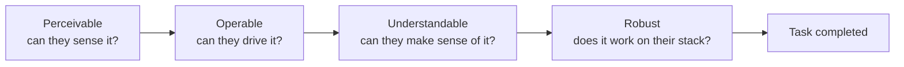

# WCAG Principles (POUR)

> WCAG organizes every accessibility requirement under four principles — Perceivable, Operable, Understandable, Robust. Learn the frame, and the individual rules stop feeling arbitrary.

**Part:** [04 · Interface Engineering](../) · **Domain:** Accessibility · **Priority:** High · **Difficulty:** Intermediate · **Reading time:** ~12 min

## TL;DR

The *WCAG principles*, remembered as **POUR**, are the top of a four-level hierarchy — principles, guidelines, success criteria, techniques — that the Web Content Accessibility Guidelines use to structure every requirement. Content must be **Perceivable** (users can sense it), **Operable** (users can drive it), **Understandable** (users can make sense of it), and **Robust** (it works across browsers and assistive technologies, now and later). The principles are not testable checks themselves; the *success criteria* under them are, and each criterion is tagged A, AA, or AAA. Treating POUR as a design lens — not an after-the-fact audit — catches whole classes of barrier early, because most real defects are a principle violated at the point a component was built. Use it to reason about *who* is excluded and *how*, then let the specific success criteria tell you the pass threshold.

> **Recommendation:** Design and review against the four principles from the start; target the AA success criteria as your default bar, and reach for automated tools only to confirm what principled design already got right.

## At a Glance

| | |
| --- | --- |
| **Use when** | Framing any accessibility decision, from a single component to an audit scope — POUR is the shared vocabulary. |
| **Avoid when** | You need a pass/fail gate — for that, drop to the specific success criteria and their A/AA/AAA level. |
| **Alternatives** | POUR is the organizing model of WCAG itself; there is no competing frame you'd substitute for it. |
| **Primary risk** | Treating the principles as slogans while skipping the concrete success criteria that actually define conformance. |
| **Maturity** | Stable — unchanged in structure across WCAG 2.0, 2.1, and 2.2. |

## Prerequisites

This article assumes you can read a document's semantic structure and reason about a component's public contract, since both are where the principles are won or lost.

- The Document Outline (planned, `· HTML & Document Semantics`) — headings and landmarks are how perceivable, operable structure is expressed.
- Prop Design & Contracts (planned, `· Component & Interaction Design`) — accessible state is part of a component's contract, not an add-on.

## Overview

The *WCAG principles* are the four foundations — Perceivable, Operable, Understandable, Robust — beneath which the entire Web Content Accessibility Guidelines are organized. Under each principle sit *guidelines* (broad goals), under those sit *success criteria* (the testable statements you actually conform to), and under those sit *techniques* (specific, non-binding ways to meet a criterion). POUR is the acronym for the four principles and the fastest way to hold the whole standard in your head.

The distinction that trips people up: the principles and guidelines are not themselves testable, and you never "pass POUR." What you conform to are the success criteria, each labeled Level A (must), AA (should, the common legal and organizational target), or AAA (enhanced, rarely required wholesale). The principles matter because they tell you *why* a criterion exists and *whom* it protects, which is exactly the reasoning an automated checker cannot supply. Think of POUR as the map and the success criteria as the coordinates.

## The Problem

Teams that approach accessibility as a checklist run it late, as an audit, and get a list of context-free failures: "image missing alt", "contrast 3.9:1", "button not focusable". Fixed one by one, these recur on the next feature because nobody internalized the underlying goal. The checklist tells you *what* failed but not *what class of user* was excluded or *why the rule exists*, so the team keeps learning the same lesson over again.

The deeper problem is that accessibility barriers are created at design and build time and are expensive to retrofit. A custom dropdown built as clickable `<div>`s has no keyboard operation, no role, and no state — three principle violations baked into its structure. Discovered in an audit, it is a rewrite; considered while building, it is just "use the right element and wire up the states." Without a frame that connects the concrete rule to the human it serves, the work stays reactive and the same defects keep shipping.

## Why It Matters

Roughly one in six people live with a disability, and accessible design reaches far past that group: captions help in noisy rooms, high contrast helps in sunlight, and keyboard operability helps power users and anyone whose pointer just broke. Building to the principles widens your usable audience and, in many jurisdictions, is a legal requirement rather than a nicety — public-sector and large-commercial sites are increasingly held to WCAG AA by law.

There is an engineering payoff too. The same semantics that make a page perceivable and operable for assistive technology also make it more robust for automated testing, better for SEO, and more resilient to browser change. Code that expresses real roles and states instead of faking them with generic elements is code that breaks less when the framework or the browser shifts underneath it. Accessibility done through the principles is not a tax on quality; it is a proxy for it.

## Mental Model

Read POUR as a chain that a user must complete to succeed, in order. Can they *perceive* the content? Then can they *operate* the controls? Then can they *understand* what happened? And will all of that keep working on their actual browser and assistive tech — is it *robust*? A break anywhere in the chain stops the user, no matter how well the other links hold.



Each link maps to concrete engineering. *Perceivable*: text alternatives for images, captions for media, sufficient color contrast, and content that does not rely on color alone. *Operable*: full keyboard access, visible focus, enough time, and no seizure-inducing motion. *Understandable*: predictable behavior, clear labels, and helpful error messages. *Robust*: valid, semantic markup with correct name/role/state so current and future assistive technologies can parse it. When a defect appears, naming which link it breaks points you straight at the class of fix.

## Best Practices

Start from native semantics. A real `<button>`, `<a>`, `<label>`, and heading structure satisfy large parts of all four principles for free — focusability, roles, keyboard behavior, and name computation come built in. This is the highest-leverage habit in the whole standard.

Target AA by default. Level A is the floor and rarely enough; AAA is often impractical across a whole product. AA is the pragmatic, widely mandated bar, so make it your definition of done and treat individual AAA criteria as opportunistic wins.

Design against the principles, audit against the criteria. Use POUR while building to ask "who can't perceive/operate/understand this?", then use the specific success criteria and their level to set the pass threshold and to communicate results.

Don't stop at automated checks. Automated tools reliably catch only a minority of issues — roughly a third — because perception, operability, and understandability need human judgment. Pair every automated pass with a keyboard walkthrough and a screen-reader spot check.

## Trade-offs

Adopting the principles as a working frame costs some upfront learning and design attention in exchange for fewer, cheaper defects and a genuinely wider audience. The balance is strongly positive for any product with real users, but the effort is real and worth naming.

**Advantages**

- One vocabulary that connects every concrete rule to the user it protects, so fixes generalize.
- Catches barriers at design time, when they are cheap, instead of in a late audit.
- The semantics it drives also improve robustness, testability, and SEO.

**Disadvantages**

- The principles alone are not testable; you still need the detailed success criteria to define "done".
- Full conformance, especially at AAA, can constrain visual and interaction choices.
- Judgment-heavy criteria resist automation, so manual testing time is unavoidable.

| Dimension | Designing to POUR | Cost / caveat |
| --- | --- | --- |
| Defect cost | Barriers caught early, at build time | Requires the team to learn the frame |
| Audience | Reaches disabled users and many situational cases | Some AAA criteria limit design freedom |
| Robustness | Semantic markup survives browser/AT change | More care per component up front |
| Verification | Principles guide manual review | Not directly testable; needs criteria + human passes |

## Alternative Approaches

POUR is the organizing structure of WCAG itself, so there is no competing framework you would swap in for the same job — other guidance (platform-specific accessibility rules, ARIA authoring practices) sits *beneath* or *alongside* the principles rather than replacing them. The only real "alternative" is the anti-pattern of skipping a frame entirely and chasing individual audit findings, which this article exists to argue against.

## Bad Example

A "button" built from a generic element, styled to look right but violating three of the four principles at once.

```html
<!-- ❌ Looks like a button, fails Operable, Understandable, and Robust. -->
<div class="btn" onclick="submitForm()">Submit</div>
```

```css
.btn {
  background: #7aa7ff; /* on white: ~2.3:1 contrast — fails Perceivable too */
  color: #ffffff;
  padding: 8px 16px;
  border-radius: 6px;
  cursor: pointer;
}
```

**What goes wrong:** The `<div>` is not focusable and has no keyboard handler, so it cannot be reached or activated without a mouse (**Operable** fails). It exposes no button role or accessible name to assistive tech, so a screen reader announces nothing meaningful (**Robust** and **Understandable** fail). And the low-contrast text falls under the AA threshold (**Perceivable** fails). One innocuous component breaks the chain at every link.

## Good Example

The same control as a native button with sufficient contrast — satisfying all four principles with less code.

```html
<!-- ✅ Native semantics give focusability, role, name, and keyboard activation. -->
<button type="submit" class="btn">Submit</button>
```

```css
.btn {
  background: #2f5fd0; /* on white: ~5.9:1 — passes AA for normal text */
  color: #ffffff;
  padding: 8px 16px;
  border-radius: 6px;
}

/* Operable: keep a visible focus indicator for keyboard users. */
.btn:focus-visible {
  outline: 3px solid #1b2a4a;
  outline-offset: 2px;
}
```

**Why it's better:** A real `<button>` is focusable, is announced with the button role and its text as the accessible name, and responds to both Enter and Space with no extra code — **Operable**, **Understandable**, and **Robust** handled by the platform. Raising the background to a ~5.9:1 ratio clears the AA contrast criterion, restoring **Perceivable**. The principled version is also simpler, because it stops fighting the element the browser already ships.

## Common Mistakes

See the [Accessibility anti-patterns](../../../anti-patterns/#accessibility) for the domain catalog. Concept-specific:

### Mistake: Treating POUR as the testable thing

- **Symptom:** A report claims the page "meets Perceivable" with no reference to specific success criteria or a conformance level.
- **Why it fails:** Principles and guidelines are not testable; only the success criteria are, and conformance is always stated at Level A, AA, or AAA.
- **Fix:** Map each principle to the concrete criteria you tested and record the level you met, so "accessible" has a defined meaning.

### Mistake: Equating an automated pass with conformance

- **Symptom:** A green automated scan is presented as proof the product is accessible.
- **Why it fails:** Automated tools detect only a fraction of issues; operability and understandability barriers routinely pass a machine check.
- **Fix:** Treat automated results as a floor, then add keyboard and screen-reader passes against the relevant criteria.

## Checklist

- [ ] Every interactive control uses a native element or a correct role, name, and state (Robust, Operable).
- [ ] All non-text content has a text alternative, and color is never the only signal (Perceivable).
- [ ] The whole interface is reachable and operable by keyboard with a visible focus indicator (Operable).
- [ ] Labels, instructions, and error messages are clear and behavior is predictable (Understandable).
- [ ] Text meets at least the AA contrast ratio for its size (Perceivable).
- [ ] Conformance is stated against specific success criteria and a target level, not "POUR".

## Related Articles

- [Conformance Levels](./conformance-levels.md) — what Level A, AA, and AAA mean and which to target.
- [The ARIA Model](./the-aria-model.md) — how roles, states, and properties fill gaps native HTML can't.
- [Accessible Name Computation](./accessible-name-computation.md) — how assistive tech derives the name that makes a control understandable.

## References

- [W3C — Web Content Accessibility Guidelines (WCAG) 2.2](https://www.w3.org/TR/WCAG22/) — the normative standard and its full set of success criteria.
- [W3C — WCAG 2 Overview](https://www.w3.org/WAI/standards-guidelines/wcag/) — the layered structure of principles, guidelines, criteria, and techniques.
- [MDN — Accessibility](https://developer.mozilla.org/en-US/docs/Web/Accessibility) — practical, implementation-focused guidance mapped to the principles.
