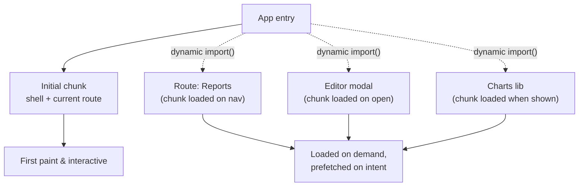

# Code Splitting

> Break one big bundle into chunks and load each only when it's needed. You trade a smaller first download for a request later — worth it for code most users never reach.

**Part:** [05 · Reliability & Quality](../) · **Domain:** Performance Engineering · **Priority:** Critical · **Difficulty:** Intermediate · **Reading time:** ~12 min

## TL;DR

*Code splitting* uses the dynamic `import()` expression to break a JavaScript bundle into separately loadable chunks, so the browser downloads and parses only the code a user's current route or interaction needs. The default alternative — one bundle for the whole app — makes every user pay the parse and execution cost of features they may never open, which is the JavaScript that most often hurts LCP and INP. The lever is real but not free: each split point is a potential network request and a loading state, and over-splitting trades a big download for a waterfall of tiny ones. Split at boundaries where the deferred code is both heavy and not needed for first paint — routes, modals, editors, charts — and prefetch the likely-next chunk so the request is already in flight when the user acts.

> **Recommendation:** Split at route boundaries first, then at heavy interaction-gated components (editors, charts, maps); prefetch the next chunk on intent so the split adds no perceived latency.

## At a Glance

| | |
| --- | --- |
| **Use when** | A meaningful share of your bundle serves routes or features most users don't reach on load. |
| **Avoid when** | The code is small, or needed for first paint — splitting then adds a request for no saving. |
| **Alternatives** | [Prefetch/preload](#alternative-approaches) to hide the request; [critical CSS](#alternative-approaches) for the render-blocking side. |
| **Primary risk** | Over-splitting into a request waterfall, or splitting code that first paint needs. |
| **Maturity** | Stable. |

## Prerequisites

- [The Critical Rendering Path](./the-critical-rendering-path.md) — code splitting shrinks the render-blocking JavaScript on that path.
- [Core Web Vitals (LCP, INP, CLS)](./core-web-vitals-lcp-inp-cls.md) — the metrics that oversized bundles degrade (LCP and INP).

## Overview

*Code splitting* is the practice of dividing an application's JavaScript into multiple bundles ("chunks") that load independently, rather than shipping one monolithic file. The mechanism is the dynamic `import()` expression: unlike a static `import` at the top of a module, which the bundler folds into the initial bundle, `import()` returns a promise and signals the bundler to emit the target as its own chunk fetched at runtime.

The decision is about *when* code is paid for, not *whether*. A single bundle front-loads the entire cost — download, parse, compile, execute — before the app is interactive, including code for the settings page, the admin panel, and the rich-text editor a user may never open. Splitting defers each of those costs to the moment the code is actually reached. It is commonly confused with lazy-loading images or with tree-shaking; tree-shaking removes code you never use, while code splitting defers code you use later. The two are complementary: shake first to delete dead code, then split what remains by when it's needed.

## The Problem

A dashboard app grows for a year. The main bundle now includes a charting library, a WYSIWYG editor, a date-picker, a PDF exporter, and a maps SDK — because each was added with a plain top-of-file `import`. On first load, every user downloads and parses all of it, even though the editor lives three clicks deep and most sessions never touch it. On a mid-tier phone, the extra megabyte of JavaScript adds seconds to LCP and leaves the main thread busy compiling scripts when the user makes their first tap, spiking INP.

The naive fix — "lazy-load everything" — creates the opposite failure. The team wraps dozens of small components in dynamic imports, and now navigating a single screen fires a cascade of tiny chunk requests, each waiting on the last, each with its own spinner. First paint got slower, not faster, because the app now round-trips for code it could have shipped in one modest chunk. The problem is not "split" versus "don't split"; it is choosing split points that match how the code is actually used.

## Why It Matters

JavaScript is the most expensive kind of byte on the web: unlike an image, every script must be downloaded, parsed, compiled, and executed on the main thread before it does anything, and that work competes directly with the user's first interaction. Shipping code a user doesn't need isn't a small waste — it is main-thread time stolen from LCP and INP, the two Vitals hardest to recover once a bundle is large.

The payoff of splitting compounds on the slow tail. The users on old devices and poor networks — the 75th percentile the Vitals target — are exactly the ones who feel a megabyte of unused JavaScript most, and exactly the ones a smaller initial chunk helps most. Done well, code splitting is often the single highest-leverage change for loading and interactivity, because it removes work entirely rather than merely making it faster. Done carelessly, it relocates the cost into a waterfall that can be worse than the monolith it replaced.

## Mental Model

Think of the bundle as luggage for a trip. A single bundle is packing everything you own into one enormous suitcase and hauling it through the airport whether or not you'll wear it. Code splitting is packing a small carry-on for what you need on arrival and shipping the rest to be delivered when you actually get to that part of the trip. The skill is knowing what belongs in the carry-on (first paint) versus what can arrive later (the editor, the export dialog).



The mechanism has two moving parts the model has to respect. First, a dynamic import is an async boundary: while the chunk loads there is nothing to render, so every split point needs a deliberate loading state (in React, a `Suspense` fallback) and an error state for a failed fetch. Second, the network cost of the split is only hidden if the request starts *before* the user waits for it — which is why prefetching the likely-next chunk on hover, focus, or route proximity turns a visible spinner into an instant transition. A split point without a plan for its loading, error, and prefetch is a split point that moved the cost rather than removing it.

## Best Practices

Split at route boundaries first. Routes are the natural unit: a user on the dashboard doesn't need the settings route's code. Route-based splitting gives the largest saving for the least complexity and rarely introduces a jarring waterfall, because the navigation already implies a transition.

Then split heavy, interaction-gated components. A rich-text editor, a charting library, a map, a PDF generator — code that is both large and reached by an explicit user action (open, expand, export) is an ideal second tier. The action gives you a moment to load the chunk under cover of a deliberate loading state.

Always pair a split with a loading and error boundary. Wrap lazily loaded UI in `Suspense` for the pending state and an error boundary for a failed chunk fetch (which happens on flaky networks and after a deploy invalidates old chunk URLs). A split with no error handling shows a blank region when the network hiccups.

Prefetch the next chunk on intent. Kick off the dynamic import on hover, focus, or when a route link scrolls into view, so the chunk is cached before the click. This is what makes a split feel free; see [Resource Prefetch & Preload](./resource-prefetch-and-preload.md). Recover gracefully from a stale-chunk error after a deploy — a full reload is an acceptable fallback.

Don't over-split. Bundlers merge and size chunks for a reason; dozens of sub-10 KB chunks cost more in request overhead than they save in bytes. Split where the deferred code is heavy and genuinely optional, and let small, always-used modules stay in the initial chunk.

## Trade-offs

Code splitting trades a smaller, faster initial load for added asynchrony: requests, loading states, and error paths that a single bundle doesn't have. For code that is heavy and not needed at first paint, the trade is strongly positive; for small or first-paint-critical code, it is negative.

**Advantages**

- Smaller initial download, parse, and execute — directly improves LCP and INP.
- Users pay for features only when they reach them, not on every load.
- The saving is largest exactly for the slow-tail users the Vitals measure.

**Disadvantages**

- Every split point adds a network request, a loading state, and an error case.
- Over-splitting creates a request waterfall that can be slower than the monolith.
- Chunk URLs change on deploy; in-flight or cached references can 404 without a recovery path.

| Dimension | Code splitting | Cost / caveat |
| --- | --- | --- |
| Performance | Less upfront JS; faster time-to-interactive | A request at each split; waterfall risk if overused |
| Complexity | Deferred loading of heavy features | Loading and error boundaries per split point |
| Maintainability | Bundle maps to how features are used | Split boundaries must track how the app actually navigates |
| Failure behavior | Isolated: one chunk failing doesn't break the shell | Needs error boundary + stale-chunk recovery on deploy |

## Alternative Approaches

Code splitting is one of several loading-performance levers, and the best result usually combines them rather than choosing one. Its true alternatives address adjacent parts of the same critical path.

| Approach | Best when | Weakness | See |
| --- | --- | --- | --- |
| Code splitting (this article) | Heavy JS most users don't need at first paint | Adds requests and loading states | (this article) |
| [Resource Prefetch & Preload](./resource-prefetch-and-preload.md) | You know the next resource and want to hide its request | Prefetching too much wastes bandwidth | `Resource Prefetch & Preload` |
| Critical CSS & Above-the-Fold | Render-blocking CSS, not JS, is delaying first paint | Inlining critical CSS complicates the build | `Critical CSS & Above-the-Fold` (planned) |
| Font & Asset Loading Strategy | Fonts and static assets dominate the loading budget | Doesn't address script cost | `Font & Asset Loading Strategy` (planned) |

## Bad Example

A heavy, rarely used feature imported statically into the app shell, so every user downloads and parses the charting library on first load.

```tsx
// ❌ Static import: the chart library (hundreds of KB) is folded into the main
// bundle and paid for on every page load, even though most sessions never open
// the analytics panel. It adds directly to LCP and to first-tap INP.
import { HeavyChart } from 'some-charts';

function Dashboard({ showAnalytics }: { showAnalytics: boolean }) {
  return (
    <main>
      <Summary />
      {showAnalytics && <HeavyChart />}
    </main>
  );
}
```

**What goes wrong:** The `showAnalytics` guard hides the component at runtime but does nothing for the bundle — a static `import` ships the code regardless of whether it renders. Every user pays the download, parse, and compile cost of a feature a minority reach, inflating the very metrics (LCP, INP) that oversized JavaScript degrades.

## Good Example

The same feature behind a dynamic import with `React.lazy`, a `Suspense` fallback for the loading state, and an error boundary for a failed chunk fetch.

```tsx
import { lazy, Suspense } from 'react';
import { ErrorBoundary } from './error-boundary';

// ✅ Dynamic import: the bundler emits the chart as its own chunk, fetched only
// when this component actually renders. First load never pays for it.
const HeavyChart = lazy(() => import('./heavy-chart'));

function Dashboard({ showAnalytics }: { showAnalytics: boolean }) {
  return (
    <main>
      <Summary />
      {showAnalytics && (
        <ErrorBoundary fallback={<p role="alert">Couldn’t load the chart.</p>}>
          <Suspense fallback={<ChartSkeleton />}>
            <HeavyChart />
          </Suspense>
        </ErrorBoundary>
      )}
    </main>
  );
}
```

**Why it's better:** The chart code leaves the initial bundle entirely and loads only when `showAnalytics` is true, so the common path is smaller and faster to interactive. The `Suspense` fallback handles the async gap with a skeleton instead of a blank region, and the error boundary keeps a failed chunk fetch — a real event on flaky networks and after deploys — from taking down the rest of the dashboard.

## Production Example

Route-based splitting with prefetch on intent: each route is its own chunk, and hovering or focusing a navigation link starts the import so the chunk is warm before the click, turning the split into an instant transition.

```tsx
import { lazy, Suspense } from 'react';
import { ErrorBoundary } from './error-boundary';

// Each route loader is a dynamic import, so routes ship as independent chunks.
const routeLoaders = {
  reports: () => import('./routes/reports'),
  settings: () => import('./routes/settings'),
  editor: () => import('./routes/editor'),
} as const;

type RouteKey = keyof typeof routeLoaders;

const Reports = lazy(routeLoaders.reports);
const Settings = lazy(routeLoaders.settings);
const Editor = lazy(routeLoaders.editor);

// Prefetch on hover/focus: start the chunk request before the user commits.
// The promise is cached by the module system, so a later navigation reuses it.
function prefetchRoute(key: RouteKey): void {
  void routeLoaders[key]();
}

function NavLink({ to, label }: { to: RouteKey; label: string }) {
  return (
    <a
      href={`/${to}`}
      onMouseEnter={() => prefetchRoute(to)}
      onFocus={() => prefetchRoute(to)}
    >
      {label}
    </a>
  );
}

function Router({ current }: { current: RouteKey }) {
  const View = { reports: Reports, settings: Settings, editor: Editor }[current];
  return (
    <ErrorBoundary
      // A stale chunk after a deploy 404s; a reload fetches the new manifest.
      fallback={<ReloadPrompt message="This page updated — reload to continue." />}
    >
      <Suspense fallback={<RouteSkeleton />}>
        <View />
      </Suspense>
    </ErrorBoundary>
  );
}
```

## Common Mistakes

See the [Performance Engineering anti-patterns](../../../anti-patterns/#performance-engineering) for the domain catalog. Concept-specific:

### Mistake: Guarding a static import at runtime

- **Symptom:** A heavy component is behind a conditional (`{show && <Heavy />}`) but still imported with a top-level `import`.
- **Why it fails:** Static imports are bundled unconditionally; the runtime guard hides the render, not the bytes. Every user still downloads and parses the code.
- **Fix:** Use a dynamic `import()` (via `React.lazy` or a framework loader) so the bundler emits a separate chunk.

### Mistake: Over-splitting into a request waterfall

- **Symptom:** Navigating one screen fires many small chunk requests in sequence, each with its own spinner; first paint is slower than before.
- **Why it fails:** Per-request overhead and sequential loading outweigh the byte savings of tiny chunks.
- **Fix:** Split at routes and heavy features, keep small always-used modules in the initial chunk, and prefetch the likely-next chunk instead of splitting deeper.

## Checklist

- [ ] Heavy, first-paint-optional code (routes, editors, charts, exporters) is behind a dynamic `import()`.
- [ ] No runtime-guarded component is still statically imported.
- [ ] Every split point has a `Suspense` (or equivalent) loading state and an error boundary.
- [ ] A stale-chunk fetch error after deploy is recovered (reload or retry), not left as a blank screen.
- [ ] Likely-next chunks are prefetched on hover, focus, or viewport intent.
- [ ] Split granularity is checked against the bundle report — no waterfall of tiny chunks.

## Related Articles

- [The Critical Rendering Path](./the-critical-rendering-path.md) — where render-blocking JavaScript sits and why shrinking it matters.
- [Resource Prefetch & Preload](./resource-prefetch-and-preload.md) — how to hide a split chunk's request behind user intent.
- Bundle Size Optimization (planned) — tree-shaking and dependency trimming that pair with splitting.
- [Core Web Vitals (LCP, INP, CLS)](./core-web-vitals-lcp-inp-cls.md) — the metrics oversized bundles degrade.

## References

- [MDN — Dynamic `import()`](https://developer.mozilla.org/en-US/docs/Web/JavaScript/Reference/Operators/import) — the language feature that creates a split point.
- [React — `lazy`](https://react.dev/reference/react/lazy) — deferring a component's code with Suspense.
- [web.dev — Reduce JavaScript payloads with code splitting](https://web.dev/articles/reduce-javascript-payloads-with-code-splitting) — the loading-performance rationale.
