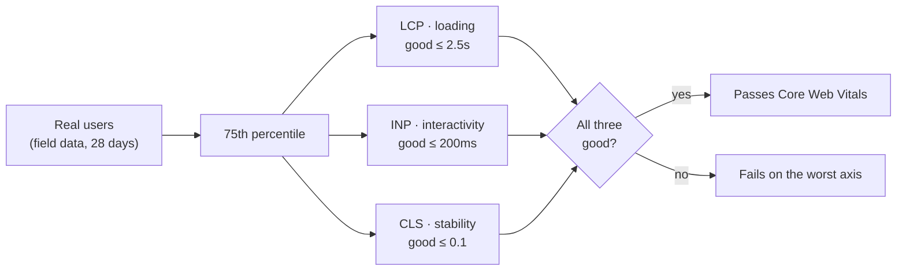

# Core Web Vitals (LCP, INP, CLS)

> Three field-measured metrics — loading (LCP), interactivity (INP), and visual stability (CLS) — scored at the 75th percentile of your real users, not a lab machine.

**Part:** [05 · Reliability & Quality](../) · **Domain:** Performance Engineering · **Priority:** Critical · **Difficulty:** Intermediate · **Reading time:** ~15 min

## TL;DR

Core Web Vitals are three metrics Google standardized to measure user-perceived performance: *Largest Contentful Paint* (LCP) for how fast the main content loads, *Interaction to Next Paint* (INP) for how responsive the page feels to input, and *Cumulative Layout Shift* (CLS) for how much the layout jumps around. Each has a "good" threshold — LCP ≤ 2.5 s, INP ≤ 200 ms, CLS ≤ 0.1 — and the score that counts is the **75th percentile of real page loads**, not a single lab run. They are orthogonal: a page can load fast and still feel janky, or be stable and slow. INP replaced First Input Delay as the responsiveness Vital in March 2024, which made responsiveness much harder to pass by accident. Optimize each against field data, because a perfect Lighthouse score on your laptop routinely coexists with a failing field metric on real phones.

> **Recommendation:** Treat the three Vitals as separate budgets, gate on the **75th-percentile field value** (CrUX or your own RUM), and only use lab tools to diagnose — never to certify — a metric.

## At a Glance

| | |
| --- | --- |
| **Use when** | You need a user-centered, comparable measure of loading, interactivity, and stability — which is every production web app. |
| **Avoid when** | Never skip them, but don't treat a lab score as the metric; the field 75th percentile is the number that matters. |
| **Alternatives** | None as the industry-standard field metric; complement with [custom metrics](#related-articles) for app-specific moments. |
| **Primary risk** | Optimizing a lab score to 100 while the field 75th percentile still fails. |
| **Maturity** | Stable (INP replaced FID in March 2024). |

## Prerequisites

- Process & Thread Architecture (`· The Web Platform`) — INP is about the main thread's ability to paint after input.
- Parsing & Bytecode (`· Runtime & Execution`) — script parse and compile time is a large part of LCP and INP.
- HTTP/1.1 Semantics (`· Networking & Protocols`) — resource delivery latency sets the floor for LCP.

## Overview

*Core Web Vitals* are a fixed subset of Google's Web Vitals initiative: the three metrics deemed important enough to apply to every page and to feed Google Search ranking. Each maps to one dimension of the experience a user actually feels. LCP asks "how long until the main thing I came for is on screen?" INP asks "when I tap or type, how long until the page visibly responds?" CLS asks "did the content stay put, or did it shove the button out from under my finger?"

The defining property is that the Vitals are **field metrics**. Their authoritative value comes from real users on real devices and networks, aggregated at the 75th percentile over a 28-day window (the Chrome User Experience Report, CrUX, is the public source; your own Real User Monitoring is the private one). A lab tool like Lighthouse *estimates* two of them under one simulated condition, which is useful for debugging but is not the score. Confusing the lab estimate with the field metric is the single most common mistake in the whole topic, so the boundary is worth drawing early: lab diagnoses, field certifies.

## The Problem

A team ships a landing page and runs Lighthouse in Chrome DevTools on their office fiber connection and an unthrottled laptop. Score: 98. They call it fast and move on. Six weeks later, Search Console reports the page is "Poor" on Core Web Vitals, and organic traffic has dipped. Nothing regressed — the page was never fast for the users who matter. Half of them are on mid-tier Android phones over cellular, where the hero image takes four seconds to paint and the first tap waits behind a long hydration task.

The second failure is subtler: chasing one number. The same team fixes LCP by preloading the hero image, watches LCP go green, and ships. INP stays red, because the problem was never loading — it was a 400 ms event handler that blocks the main thread on every click. Because the three Vitals measure orthogonal things, an improvement in one tells you nothing about the others. A single "performance score" hides exactly the information you need to act.

## Why It Matters

The Vitals convert a vague quality — "the site feels slow" — into three numbers a team can budget, track, and gate in CI. That is their real value: they make performance a reviewable engineering property instead of an opinion. And because they are user-weighted at the 75th percentile, they force attention onto the slow tail — the users on old phones and bad networks who churn silently — rather than the comfortable median the team experiences on their own machines.

The consequences are concrete on two fronts. First, they are a Google Search ranking signal, so a failing field score costs organic visibility directly. Second, and larger, each Vital tracks a documented driver of user behavior: slow LCP raises bounce rate, poor INP makes an app feel broken under the finger, and high CLS causes mis-taps and lost trust. Optimizing them is not SEO theater; it is optimizing the moments where users decide whether the product works.

## Mental Model

Picture the experience as three independent axes, each with its own villain. LCP is the **loading** axis; its villain is the byte budget and the critical path to the largest element (usually the hero image or a headline block). INP is the **interactivity** axis; its villain is main-thread work — long tasks, heavy event handlers, and hydration — that delays the next paint after input. CLS is the **stability** axis; its villain is unreserved space: images without dimensions, injected banners, late-loading fonts that reflow text. Fixing one villain does not touch the others.



The one number that ties them together is the **75th percentile**. It means "three out of four page loads are at least this good." Optimizing the average is the wrong target: a fast median with a slow tail still fails, because the assessment deliberately looks past the median to the users having a worse time. The thresholds are also banded, not binary — each metric is "Good," "Needs improvement," or "Poor" — so you always know which axis to spend your next hour on.

| Metric | Measures | Good (p75) | Needs improvement | Poor |
| --- | --- | --- | --- | --- |
| LCP | Time to render the largest content element | ≤ 2.5 s | 2.5–4.0 s | > 4.0 s |
| INP | Latency from interaction to next paint | ≤ 200 ms | 200–500 ms | > 500 ms |
| CLS | Sum of unexpected layout shift scores | ≤ 0.1 | 0.1–0.25 | > 0.25 |

## Best Practices

Measure in the field, not just the lab. Ship Real User Monitoring with the [`web-vitals`](https://github.com/GoogleChrome/web-vitals) library or a provider, and treat CrUX as the public backstop. LCP and CLS have lab estimates; **INP has no reliable lab number** because it depends on how real users interact, so field data is not optional for it.

Attribute every failing metric to a cause before optimizing. The `web-vitals` attribution build tells you the LCP element, the specific slow interaction and its target, and the DOM node responsible for a shift. Optimizing blind — preloading the wrong image, memoizing the wrong handler — wastes effort. Fix the element the metric actually blamed.

Budget and gate each Vital separately. Set a per-metric threshold in CI (a Lighthouse CI assertion for lab-observable regressions, a RUM alert for field), and never collapse them into one score. A green CLS must not be allowed to hide a red INP.

Reserve space to keep CLS near zero. Give images and video explicit `width`/`height` (or an aspect-ratio box), reserve space for ads and embeds, and load fonts with `font-display: optional` or `swap` plus a matched fallback so text doesn't reflow. Most CLS is space you forgot to reserve.

Cut main-thread work to win INP. Break up long tasks, keep event handlers cheap, defer non-urgent work with `scheduler.yield()` or `postTask`, and reduce hydration cost. INP is the hardest Vital to pass by accident and the one that most rewards shipping less JavaScript — see [Code Splitting](./code-splitting.md).

## Trade-offs

The Vitals are the best available user-centered proxy for performance, but they are a proxy: three numbers standing in for a whole experience. Their strength — comparability across the entire web — is also their limit, because they cannot capture what is fast or slow about *your specific* app.

**Advantages**

- Field-measured and user-weighted, so they reflect real experience, not a lab ideal.
- Orthogonal axes make the cause of a failure legible: you know whether to fix loading, interactivity, or stability.
- Standardized and public (CrUX), so scores are comparable and gate-able in CI.

**Disadvantages**

- Field data lags: the 28-day 75th-percentile window means a fix takes weeks to show fully.
- They miss app-specific moments (a chart finishing render, a search returning) that a custom metric would catch.
- The lab-versus-field gap misleads teams who certify on a Lighthouse score.

| Dimension | Core Web Vitals | Cost / caveat |
| --- | --- | --- |
| Performance | Directly track user-perceived speed and stability | Field measurement adds a RUM pipeline |
| Complexity | Three clear metrics with fixed thresholds | Each needs its own attribution and fix path |
| Maintainability | Standard, documented, tool-supported | Definitions evolve (FID → INP); revisit yearly |
| Failure behavior | Banded scoring points to the worst axis | 28-day window hides whether today's deploy helped |

## Alternative Approaches

There is no substitute for Core Web Vitals as *the* cross-web, field-measured, ranking-relevant metric set — `alternatives: []`. What exists are complements: metrics you add alongside them, not instead of them.

| Approach | Best when | Weakness | See |
| --- | --- | --- | --- |
| Core Web Vitals (this article) | A standardized, user-centered field score for any page | Can't measure app-specific moments | (this article) |
| Custom performance metrics | You need to time a domain-specific event (chart ready, results shown) | Not standardized or comparable across sites | `Custom Performance Metrics` (planned) |
| Perceived vs actual performance | The felt speed differs from the measured one (skeletons, optimistic UI) | Qualitative; harder to gate on | `Perceived vs Actual Performance` (planned) |

## Bad Example

Certifying performance from a single lab run in development — the most common way teams convince themselves a slow page is fast.

```js
// ❌ A one-off Lighthouse run on a fast laptop and fiber connection, treated
// as the verdict. This is a lab ESTIMATE under one condition, not the field
// metric — and it produces no INP number at all, because INP needs real
// interactions from real users to exist.
import lighthouse from 'lighthouse';
import * as chromeLauncher from 'chrome-launcher';

const chrome = await chromeLauncher.launch({ chromeFlags: ['--headless'] });
const result = await lighthouse('https://example.com', { port: chrome.port });

const lcp = result.lhr.audits['largest-contentful-paint'].numericValue;
console.log(`LCP ${Math.round(lcp)}ms — shipping it`); // ~1200ms on this machine
await chrome.kill();
```

**What goes wrong:** Lab-field confusion. The number reflects one fast device on one fast network, so it systematically understates what the 75th-percentile user sees on a mid-tier phone over cellular. Worse, INP is simply absent — there were no real interactions — so responsiveness ships completely unmeasured.

## Good Example

Measuring all three Vitals from real users with the `web-vitals` library, reporting each one as it becomes available so the field 75th percentile can be computed from actual traffic.

```ts
// ✅ Real User Monitoring: each Vital is reported from the real device once it
// settles, sent with sendBeacon so it survives the page unloading. The backend
// aggregates these into the 75th percentile — the number that actually counts.
import { onLCP, onINP, onCLS, type Metric } from 'web-vitals';

function report(metric: Metric): void {
  const body = JSON.stringify({
    name: metric.name, // 'LCP' | 'INP' | 'CLS'
    value: metric.value, // ms for LCP/INP, unitless for CLS
    rating: metric.rating, // 'good' | 'needs-improvement' | 'poor'
    id: metric.id, // stable per page load, for de-duping
    navigationType: metric.navigationType,
  });

  // sendBeacon delivers during unload; fetch keepalive is the fallback.
  if (!navigator.sendBeacon?.('/rum/vitals', body)) {
    void fetch('/rum/vitals', { body, method: 'POST', keepalive: true });
  }
}

// INP and CLS finalize at unload; LCP finalizes at the first interaction.
// Registering all three covers loading, interactivity, and stability.
onLCP(report);
onINP(report);
onCLS(report);
```

**Why it's better:** The metrics come from the devices and networks users actually have, so the aggregate reflects the slow tail the lab hides. All three axes are captured — including INP, which the lab could not produce — and `sendBeacon` guarantees the values survive navigation, so no fast-leaving user is silently dropped from the sample.

## Production Example

An attribution-aware RUM setup that captures *why* a metric was slow — the LCP element, the interaction target behind a slow INP, the node that shifted — so the number arrives with a cause attached and the fix is obvious.

```ts
import {
  onLCP,
  onINP,
  onCLS,
  type LCPMetricWithAttribution,
  type INPMetricWithAttribution,
  type CLSMetricWithAttribution,
} from 'web-vitals/attribution';

interface VitalSample {
  name: string;
  value: number;
  rating: string;
  target: string; // the element or selector to blame
  extra: Record<string, number>;
}

function send(sample: VitalSample): void {
  const body = JSON.stringify({ ...sample, url: location.pathname });
  if (!navigator.sendBeacon?.('/rum/vitals', body)) {
    void fetch('/rum/vitals', { body, method: 'POST', keepalive: true });
  }
}

onLCP((metric: LCPMetricWithAttribution) => {
  const a = metric.attribution;
  send({
    name: 'LCP',
    value: metric.value,
    rating: metric.rating,
    target: a.element ?? 'unknown', // which element was the LCP
    extra: { ttfb: a.timeToFirstByte, load: a.resourceLoadDuration },
  });
});

onINP((metric: INPMetricWithAttribution) => {
  const a = metric.attribution;
  send({
    name: 'INP',
    value: metric.value,
    rating: metric.rating,
    target: a.interactionTarget ?? 'unknown', // which element was tapped
    extra: { processing: a.processingDuration, presentation: a.presentationDelay },
  });
});

onCLS((metric: CLSMetricWithAttribution) => {
  const a = metric.attribution;
  send({
    name: 'CLS',
    value: metric.value,
    rating: metric.rating,
    target: a.largestShiftTarget ?? 'unknown', // which node shifted most
    extra: { shiftValue: a.largestShiftValue ?? 0 },
  });
});
```

## Common Mistakes

See the [Performance Engineering anti-patterns](../../../anti-patterns/README.md#performance-engineering) for the domain catalog. Concept-specific:

### Mistake: Certifying on a lab score instead of field data

- **Symptom:** "Lighthouse says 98, we're fine" while Search Console reports the page as Poor.
- **Why it fails:** The lab estimates two metrics under one fast condition and cannot produce INP at all; the assessment uses the field 75th percentile across real devices.
- **Fix:** Gate on CrUX or your own RUM at p75; use the lab only to reproduce and diagnose a field failure.

### Mistake: Chasing one metric and calling it done

- **Symptom:** LCP goes green after a preload, so the page is declared fast — but INP or CLS is still red.
- **Why it fails:** The three Vitals measure orthogonal dimensions; improving loading does nothing for interactivity or stability.
- **Fix:** Budget and track each Vital separately, and always confirm the other two didn't regress.

## Checklist

- [ ] All three Vitals are measured in the field (RUM or CrUX), not just the lab.
- [ ] INP is measured from real interactions — no attempt to certify it from a lab run.
- [ ] Each metric has its own budget and CI/RUM gate; there is no single collapsed "score."
- [ ] Failing metrics are attributed to a specific element or interaction before optimizing.
- [ ] Images, embeds, and late content reserve space so CLS stays ≤ 0.1.
- [ ] The target is the 75th percentile, not the average.

## Related Articles

- Lab vs Field Measurement (planned) — why the lab estimate and the field score diverge, and when each is right.
- Perceived vs Actual Performance (planned) — the gap between what the metrics say and what users feel.
- Custom Performance Metrics (planned) — measuring app-specific moments the Vitals can't see.
- [Code Splitting](./code-splitting.md) — the main lever for the JavaScript that hurts LCP and INP.

## References

- [web.dev — Core Web Vitals](https://web.dev/articles/vitals) — the canonical definition and the ranking rationale.
- [web.dev — Interaction to Next Paint (INP)](https://web.dev/articles/inp) — why INP replaced FID and how it's computed.
- [web.dev — Largest Contentful Paint (LCP)](https://web.dev/articles/lcp) — the loading metric and its element selection.
- [web.dev — Cumulative Layout Shift (CLS)](https://web.dev/articles/cls) — the stability metric and session-window scoring.
- [`web-vitals` library](https://github.com/GoogleChrome/web-vitals) — the reference implementation for field measurement and attribution.
