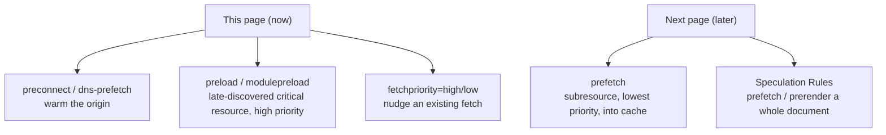

# Resource Prefetch & Preload

> Tell the browser to fetch something before it would find it on its own. `preload` for a resource this page needs now; `prefetch` for one the next navigation will need.

**Part:** [05 · Reliability & Quality](../) · **Domain:** Performance Engineering · **Priority:** Critical · **Difficulty:** Intermediate · **Reading time:** ~15 min

## TL;DR

*Resource hints* let you override the browser's default discovery order by declaring what to fetch and when. The two most important are opposites in intent: `rel="preload"` fetches a resource the **current** page needs but the parser discovers late (a font referenced inside CSS, the LCP image, a critical dynamic chunk), pulling it forward at high priority; `rel="prefetch"` fetches a resource a **future** navigation will likely need, at the lowest priority, into cache. Around them sit `preconnect` (warm the DNS + TCP + TLS handshake to a cross-origin), `modulepreload` (preload an ES module and its dependency graph), and the `fetchpriority` attribute (nudge any fetch's priority up or down). Each hint trades bandwidth and complexity for latency, so the failure mode is over-hinting: preloading resources that aren't used, or prefetching pages nobody visits, both of which steal bandwidth from what matters now.

> **Recommendation:** Preload only late-discovered, first-view-critical resources; preconnect to the one or two origins on the critical path; and reach for the Speculation Rules API, not `rel="prefetch"`, when you want to prefetch a whole next document.

## At a Glance

| | |
| --- | --- |
| **Use when** | A critical resource is discovered late (preload), a next navigation is predictable (prefetch), or a cross-origin sits on the critical path (preconnect). |
| **Avoid when** | The parser already finds the resource early, or the "likely next" page is a guess — the hint then just wastes bandwidth. |
| **Alternatives** | [Code splitting](#alternative-approaches) to shrink what must load; [critical CSS](#alternative-approaches) for render-blocking bytes. |
| **Primary risk** | Over-hinting: unused preloads and speculative prefetches contend with resources needed now. |
| **Maturity** | Stable (hints); Emerging (Speculation Rules for document prefetch/prerender). |

## Prerequisites

- [The Critical Rendering Path](./the-critical-rendering-path.md) — hints are how you fix a resource that's on the path but discovered too late.
- [Core Web Vitals (LCP, INP, CLS)](./core-web-vitals-lcp-inp-cls.md) — preloading the LCP element is a direct lever on the loading Vital.

## Overview

A browser discovers most resources by parsing: it reads the HTML, finds ``, `<link>`, and `<script>`, and fetches them in a priority order it infers from the markup. That default is good but not clairvoyant. Some critical resources are referenced indirectly — a font inside a CSS `@font-face`, a background image in a stylesheet, a module loaded by another module — so the parser finds them one or two round trips late. Other resources belong to the *next* page, which the parser cannot see at all. *Resource hints* are the declarative way to correct both cases.

The hints divide by *which page* the resource serves. `preload`, `preconnect`, `dns-prefetch`, and `modulepreload` optimize the **current** navigation: fetch this now, or warm this connection, because this page will use it. `prefetch` — and, for whole documents, the Speculation Rules API — optimizes a **future** navigation: fetch this idly into cache because the user will probably go there next. Confusing the two is the classic error: `preload` a next-page asset and you fight the current page for bandwidth; `prefetch` a current-page asset and it arrives at low priority, too late to help.

## The Problem

A marketing page uses a custom web font declared in a CSS `@font-face` rule. The browser downloads the HTML, then the stylesheet, then — only after parsing the CSS — discovers it needs the font file, and fetches it on a third round trip. For two seconds the page renders in a fallback font; when the real font finally arrives, the text reflows, spiking CLS and looking broken. Nothing is technically wrong, but the font was discovered a round trip too late, and the user watched the page rearrange itself.

Then the team overcorrects. They add `preload` tags for the font, three images, two scripts, and a stylesheet — "preload the important stuff." Now the browser front-loads all of them at high priority, and they contend with the resources needed for first paint; the LCP image actually arrives *later* than before, and the console fills with "preloaded but not used within a few seconds" warnings for the assets that weren't on the first view at all. The lesson is that a hint is a claim about priority, and claiming everything is urgent is the same as claiming nothing is.

## Why It Matters

Resource hints operate on latency, which is the part of loading that raw bandwidth can't fix. On a high-latency connection, the round trips to *discover* a resource can cost more than the transfer itself, and a well-placed `preload` or `preconnect` removes an entire round trip from the critical path. For the LCP element specifically, getting the fetch started a round trip earlier is often the single most effective change to the loading Vital.

But the same mechanism that removes latency can add it. Bandwidth on a mobile connection is finite and shared; every byte a speculative prefetch or an unused preload pulls down is a byte unavailable to the resource the user is waiting for right now. Hints have no built-in sense of "worth it" — they do exactly what you say, which means a careless hint is a de-optimization that's invisible in the lab (where bandwidth is plentiful) and costly in the field (where it isn't). Understanding each hint's intent and priority is what turns them from a foot-gun into the most surgical loading tool available.

## Mental Model

Sort the hints by *when* the resource is needed and *how much work* is being pulled forward. `dns-prefetch` and `preconnect` warm the *connection* to an origin — cheap insurance that the DNS lookup, TCP handshake, and TLS negotiation are done before the first byte is requested. `preload` and `modulepreload` pull forward a *specific resource on this page* that would otherwise be discovered late, at high priority. `prefetch` idly caches a *resource for the next page* at the lowest priority, yielding to everything the current page wants. The Speculation Rules API is the heavy end: it can prefetch or even fully *prerender* an entire next document.



Two rules keep the model honest. First, `preload` requires a correct `as` (and `type`/`crossorigin` for fonts) — it tells the browser the resource's type so it applies the right priority and reuses the fetch; a wrong or missing `as` causes a double fetch. Second, a `preload` is a promise that the resource *will* be used on this page within a couple of seconds; if it isn't, the browser warns and you've wasted the bandwidth. For a resource the parser already discovers early (an `` in the initial HTML), you rarely need `preload` at all — `fetchpriority="high"` on the element itself is the lighter tool.

## Best Practices

Preload only late-discovered, first-view-critical resources. The canonical cases are web fonts (referenced inside CSS), the LCP image when it's set via CSS or JavaScript, and a critical dynamically imported chunk. If the parser finds the resource early in the HTML, prefer `fetchpriority="high"` on the element over a separate preload.

Get the `as`, `type`, and `crossorigin` right. `<link rel="preload" as="font" type="font/woff2" crossorigin>` is mandatory for fonts — omit `crossorigin` and the font is fetched twice. A wrong `as` misprioritizes the fetch and can prevent reuse, turning an optimization into an extra request.

Preconnect to the critical cross-origins, sparingly. Warm the connection to the origin serving your LCP image or critical font (two to four origins at most). Each preconnect holds a connection open, so preconnecting to a dozen origins wastes resources; use `dns-prefetch` as the cheaper hint for less-certain origins.

Prefetch the *next* navigation, not the current page. Use `rel="prefetch"` for a subresource the next page needs, or — better for whole documents — the Speculation Rules API to prefetch or prerender the likely next page on hover or viewport proximity. Bound it: prefetching every link on a page trades the user's data plan for a guess.

Treat every hint as a bandwidth cost and verify it. An unused preload warns in the console; a speculative prefetch that's never navigated to is pure waste. Measure LCP and total transfer in the field after adding hints — a hint that doesn't move the metric is contention you added for nothing.

## Trade-offs

Resource hints trade bandwidth and a maintenance burden for lower latency. Applied to the few resources that are both critical and discovered late, they are among the highest-leverage loading tools; applied broadly, they degrade the very load they meant to speed up.

**Advantages**

- Remove discovery round trips from the critical path — the latency bandwidth can't fix.
- `preload` on the LCP element is often the single biggest LCP win available.
- `prefetch`/Speculation Rules can make the next navigation feel instant.

**Disadvantages**

- Over-hinting steals bandwidth from resources needed now, sometimes worsening LCP.
- Preloads are brittle: wrong `as`/`crossorigin` causes double fetches; unused ones waste data.
- Speculative prefetch/prerender spends users' bandwidth (and can run analytics) on pages never visited.

| Dimension | Resource hints | Cost / caveat |
| --- | --- | --- |
| Performance | Cuts discovery latency; can make next-nav instant | Contends for bandwidth if over-applied |
| Complexity | A few declarative tags | Correct `as`/`type`/`crossorigin` and upkeep as pages change |
| Maintainability | Hints live next to the markup they serve | Stale hints for removed resources linger silently |
| Failure behavior | Ignored safely by old browsers | Unused/mis-typed hints waste bandwidth invisibly in the lab |

## Alternative Approaches

Hints don't reduce how much has to load; they change *when*. Their alternatives address the size of the load itself, and the best loading strategy usually combines both.

| Approach | Best when | Weakness | See |
| --- | --- | --- | --- |
| Resource hints (this article) | A critical resource is discovered late, or a next nav is predictable | Adds bandwidth cost; brittle if mis-typed | (this article) |
| [Code Splitting](./code-splitting.md) | The problem is too much JavaScript, not its timing | Adds requests and loading states | `Code Splitting` |
| Critical CSS & Above-the-Fold | Render-blocking CSS delays first paint | Build complexity | `Critical CSS & Above-the-Fold` (planned) |
| Font & Asset Loading Strategy | Fonts/assets need a full loading policy, not one hint | Broader effort than a single tag | `Font & Asset Loading Strategy` (planned) |

## Bad Example

Preloading a pile of resources indiscriminately — including next-page and non-critical assets — so the hints fight the current page's first paint.

```html
<!-- ❌ "Preload the important stuff." These contend at high priority with the
     resources first paint actually needs. The next-page image and the deferred
     script aren't used on this view, so they warn and waste bandwidth; the font
     is missing crossorigin, so it's fetched twice. -->
<head>
  <link rel="preload" as="image" href="/img/hero.jpg" />
  <link rel="preload" as="image" href="/img/next-page-banner.jpg" />
  <link rel="preload" as="script" href="/js/settings-page.js" />
  <link rel="preload" as="font" href="/fonts/body.woff2" />           <!-- no crossorigin -->
  <link rel="preload" as="style" href="/styles/print.css" />
</head>
```

**What goes wrong:** Over-hinting plus a correctness bug. Five high-priority preloads contend for bandwidth with first-paint resources, delaying LCP rather than helping it; the next-page banner and settings script aren't used on this page (console warnings, wasted data); and the font preload without `crossorigin` triggers a second fetch of the same file.

## Good Example

Preloading only the two resources that are critical *and* discovered late — the LCP image and the body font — each with correct attributes, and warming the image origin.

```html
<!-- ✅ Warm the CDN connection, then pull forward exactly the two late-discovered
     resources first paint depends on. The font has the mandatory crossorigin;
     the image preload carries high priority. Nothing here is speculative. -->
<head>
  <link rel="preconnect" href="https://cdn.example.com" crossorigin />

  <link
    rel="preload"
    as="image"
    href="https://cdn.example.com/hero.avif"
    fetchpriority="high"
  />
  <link
    rel="preload"
    as="font"
    type="font/woff2"
    href="/fonts/body.woff2"
    crossorigin
  />
</head>
```

**Why it's better:** Only genuinely critical, late-discovered resources are preloaded, so the hints reinforce first paint instead of competing with it. The `preconnect` removes the handshake latency to the image origin, the font's `crossorigin` prevents the double fetch, and `fetchpriority="high"` marks the LCP image as the page's most urgent download.

## Production Example

Current-page preloads for the LCP path, plus the Speculation Rules API to prefetch the likely next document on hover — the modern replacement for `rel="prefetch"` on whole navigations.

```html
<head>
  <link rel="preconnect" href="https://cdn.example.com" crossorigin />

  <!-- Current page: late-discovered critical resources. -->
  <link rel="preload" as="image" href="https://cdn.example.com/hero.avif" fetchpriority="high" />
  <link rel="preload" as="font" type="font/woff2" href="/fonts/body.woff2" crossorigin />

  <!-- ES module entry: preload the dependency graph so it doesn't waterfall. -->
  <link rel="modulepreload" href="/js/app.js" />
  <script type="module" src="/js/app.js"></script>

  <!--
    Next navigation: prefetch the document the user is likely to open, but only
    when they show intent (hover/pointerdown) and only for same-origin links.
    "eagerness: moderate" defers to the current page's needs.
  -->
  <script type="speculationrules">
    {
      "prefetch": [
        {
          "source": "document",
          "where": { "and": [{ "href_matches": "/*" }] },
          "eagerness": "moderate"
        }
      ]
    }
  </script>
</head>
```

## Common Mistakes

See the [Performance Engineering anti-patterns](../../../anti-patterns/README.md#performance-engineering) for the domain catalog. Concept-specific:

### Mistake: Preloading everything

- **Symptom:** A stack of `rel="preload"` tags; console warnings that resources were "preloaded but not used within a few seconds"; LCP no better or worse.
- **Why it fails:** Every preload is high priority, so preloading many resources removes the prioritization the browser relies on and starves first-paint resources of bandwidth.
- **Fix:** Preload only late-discovered, first-view-critical resources; use `fetchpriority` on early-discovered elements instead.

### Mistake: Confusing `preload` with `prefetch`

- **Symptom:** `preload` used for a next-page asset, or `prefetch` used for something the current page needs now.
- **Why it fails:** `preload` is high priority for *this* page and contends with first paint; `prefetch` is lowest priority for the *next* page and arrives too late to help the current one.
- **Fix:** `preload` for the current navigation, `prefetch` (or Speculation Rules) for a future one — match the hint to which page needs the resource.

## Checklist

- [ ] Every `preload` targets a resource that's critical to the first view *and* discovered late.
- [ ] Font preloads include `as="font"`, `type`, and `crossorigin`; image preloads set `fetchpriority` where it's the LCP.
- [ ] `preconnect` is limited to the one or two critical cross-origins; others use `dns-prefetch`.
- [ ] No unused preloads (no "preloaded but not used" console warnings).
- [ ] Next-navigation prefetching uses `prefetch`/Speculation Rules with bounded eagerness, not every link.
- [ ] Hints are verified against field LCP and total transfer, not assumed to help.

## Related Articles

- [The Critical Rendering Path](./the-critical-rendering-path.md) — why late-discovered critical resources need a hint at all.
- [Code Splitting](./code-splitting.md) — pairs with `modulepreload`/prefetch to load chunks at the right time.
- Font & Asset Loading Strategy (planned) — the full policy that font preloading is one part of.
- [Core Web Vitals (LCP, INP, CLS)](./core-web-vitals-lcp-inp-cls.md) — preloading the LCP element is a direct lever on LCP.

## References

- [web.dev — Assist the browser with resource hints](https://web.dev/learn/performance/resource-hints) — when to use each hint.
- [MDN — `rel=preload`](https://developer.mozilla.org/en-US/docs/Web/HTML/Attributes/rel/preload) — syntax, `as` values, and the crossorigin rule.
- [MDN — Speculation Rules API](https://developer.mozilla.org/en-US/docs/Web/API/Speculation_Rules_API) — prefetching and prerendering whole documents.
- [MDN — `fetchPriority`](https://developer.mozilla.org/en-US/docs/Web/API/HTMLImageElement/fetchPriority) — nudging the priority of an existing fetch.
