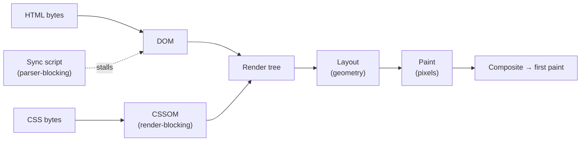

# The Critical Rendering Path

> The fixed sequence — bytes to DOM to CSSOM to render tree to layout to paint — that the browser runs before anything appears. Fewer blocking resources on it means faster first paint.

**Part:** [05 · Reliability & Quality](../) · **Domain:** Performance Engineering · **Priority:** Critical · **Difficulty:** Intermediate · **Reading time:** ~15 min

## TL;DR

The *critical rendering path* (CRP) is the ordered set of steps a browser must complete to render the initial view: parse HTML into the DOM, parse CSS into the CSSOM, run any parser-blocking JavaScript, combine DOM and CSSOM into the render tree, compute layout, and paint. Two resource types block this path by default — CSS is *render-blocking* (nothing paints until the CSSOM is built) and synchronous `<script>` is *parser-blocking* (DOM construction stops until the script downloads and runs). First paint is gated by the slowest chain of critical resources, so speeding it up means reducing three things: the number of critical resources, the bytes each carries, and the round trips to fetch them. The highest-leverage moves are `defer`/`async` on scripts and splitting CSS into a small critical set inlined for first paint and the rest loaded non-blocking.

> **Recommendation:** Keep the critical path to the minimum for above-the-fold content — inline critical CSS, `defer` scripts, and load everything else non-blocking; measure the result as LCP.

## At a Glance

| | |
| --- | --- |
| **Use when** | Always — every page has a critical path, and first paint is only as fast as it. |
| **Avoid when** | Never skip the analysis; the only question is which resources truly belong on the path. |
| **Alternatives** | None as a concept; the levers are [code splitting](#alternative-approaches), [critical CSS](#alternative-approaches), and [resource hints](#alternative-approaches). |
| **Primary risk** | A render-blocking resource (big CSS, sync script) holding the whole page blank. |
| **Maturity** | Stable. |

## Prerequisites

- [Core Web Vitals (LCP, INP, CLS)](./core-web-vitals-lcp-inp-cls.md) — LCP is the field metric the critical path most directly controls.

## Overview

The *critical rendering path* is the browser's rendering pipeline viewed as a dependency chain: the specific work that must finish before the first pixels reach the screen. When a document arrives, the browser tokenizes the HTML into the *DOM*, fetches and parses CSS into the *CSSOM*, executes scripts that the parser encounters, merges DOM and CSSOM into a *render tree* of visible nodes, runs *layout* to compute each node's geometry, and finally *paints* pixels (then composites layers). Each step depends on the ones before it, so a delay anywhere delays first paint.

What makes the path "critical" is that some resources are on it and some are not. CSS is on it: the browser will not paint with a partial CSSOM, because that would risk a flash of unstyled content, so all CSS in the `<head>` is render-blocking. Synchronous scripts are on it: because a script can call `document.write` or read styles, the parser stops at each `<script>` until it downloads and executes. Images and fonts, by contrast, are *not* render-blocking — the page paints around them. Optimizing the CRP is the work of getting everything off the path that doesn't need to be on it, and shrinking what remains.

## The Problem

A content site links a 180 KB stylesheet and three analytics and widget scripts in the `<head>`, all without `defer` or `async`. On a fast connection this is invisible; on a mid-tier phone over 4G, the result is two to three seconds of blank white screen. The browser cannot paint until the stylesheet arrives and the CSSOM is built, and DOM construction keeps stalling at each script while it downloads and runs. The HTML has been on the device for a second, but nothing is visible, because the render-blocking chain hasn't cleared.

The team's first instinct makes it worse: they add more `<link>` and `<script>` tags in the head for a font, an icon set, and a consent banner, reasoning that "loading early is good." Every one of those is another resource on the critical path, another round trip before first paint. The page now scores badly on LCP with no obvious single culprit — the cause is the *length* of the critical chain, not any one file. The problem is that "put it in the head" and "load it early" quietly mean "block first paint on it," and nobody decided that on purpose.

## Why It Matters

First paint is the moment a user learns the page is working rather than broken. Everything upstream of it — DNS, connection, HTML, the render-blocking CSS and scripts — is time the user spends looking at nothing. The critical rendering path is the exact list of what has to happen in that window, which makes it the most direct thing to optimize for perceived load speed and for LCP, the loading Core Web Vital measured in the field at the 75th percentile.

The cost compounds because the path is a chain, not a sum. A single render-blocking stylesheet on a high-latency connection can cost a full round trip; three parser-blocking scripts in series can cost three. Those latencies land hardest on the slow-tail users the Vitals target — the ones on old devices and congested networks — who are already the most likely to bounce. Reducing critical resources is therefore not a micro-optimization; it is often the difference between a page that appears instantly and one that appears to hang, for exactly the users a team is least able to see from their own machines.

## Mental Model

Picture an assembly line from bytes to pixels. HTML feeds the DOM builder; CSS feeds the CSSOM builder; the two outputs meet at the render tree; the render tree goes to layout, which measures where everything sits; layout feeds paint, which fills in pixels; paint feeds the compositor, which puts layers on screen. Two stations can halt the whole line: the CSSOM builder holds the render tree hostage until it has *all* the CSS, and a synchronous script freezes the DOM builder until it finishes running.



The model tells you where each lever acts. `defer` moves a script off the parser-blocking station — it downloads in parallel and runs after the DOM is built, in order. `async` also unblocks the parser but runs as soon as it arrives, in no guaranteed order (fine for independent analytics, wrong for anything the page depends on). Splitting CSS into a small inlined "critical" set plus a non-blocking rest shortens the CSSOM's blocking work to just what first paint needs. Every optimization on the critical path is one of three moves: remove a resource from the chain, shrink its bytes, or cut a round trip.

## Best Practices

Get scripts off the parser-blocking path. Add `defer` to scripts that touch the DOM (they run in order after parsing) and `async` to independent third-party scripts. A plain `<script>` in the `<head>` is the most common render-blocking mistake; there is almost always a better attribute for it.

Inline critical CSS and defer the rest. Extract the styles needed for above-the-fold content, inline them in a `<style>` in the head, and load the full stylesheet without blocking (for example with a `media`-swap `<link>` or an async loader). This cuts the render-blocking CSS to the minimum. See Critical CSS & Above-the-Fold (planned).

Minimize the number and size of critical resources. Every render- or parser-blocking file is a round trip before paint. Bundle where it reduces requests, drop `@import` (which serializes CSS fetches), and delete blocking resources that don't affect the first view. Fewer critical bytes and fewer critical files both shorten the path.

Preload late-discovered critical resources. The parser discovers most resources by reading the HTML, but a font referenced deep in CSS or a dynamically imported critical chunk is found late; a `rel="preload"` hint starts its fetch sooner. Use this precisely — see [Resource Prefetch & Preload](./resource-prefetch-and-preload.md).

Keep the DOM and CSSOM lean for first paint. Deeply nested markup and huge stylesheets slow tree construction and layout. Ship the structure the first view needs and stream or defer the rest; a smaller initial render tree paints faster and lays out cheaper.

## Trade-offs

Optimizing the critical path trades build-time and authoring complexity for a faster first paint. The trade is almost always worth it, but the techniques — inlining critical CSS, ordering deferred scripts, tuning what's blocking — add moving parts to the build and the head.

**Advantages**

- Directly shortens time to first paint and improves LCP.
- Helps the slow-tail users most, where blocking round trips cost the most.
- The levers are well-understood and supported by every bundler and framework.

**Disadvantages**

- Inlining critical CSS complicates the build and can duplicate bytes if mismanaged.
- `async` scripts run out of order, which breaks anything with dependencies.
- Aggressive splitting can move cost elsewhere (a later fetch, a reflow) if done blindly.

| Dimension | Optimized critical path | Cost / caveat |
| --- | --- | --- |
| Performance | Faster first paint and LCP | Requires measuring what's actually on the path |
| Complexity | Deliberate blocking vs non-blocking split | Critical-CSS tooling and script ordering to maintain |
| Maintainability | Head reflects first-paint needs | Critical set drifts as the page changes |
| Failure behavior | Non-blocking resources degrade gracefully | A wrong `async` or missing style causes FOUC |

## Alternative Approaches

The critical rendering path is a browser mechanism, not a choice — `alternatives: []`. What varies is which lever you reach for to shorten it; the "alternatives" below are complementary techniques, each owning one part of the path.

| Approach | Best when | Weakness | See |
| --- | --- | --- | --- |
| Critical-path analysis (this article) | Understanding *what* blocks first paint | Conceptual; needs the levers below to act | (this article) |
| [Code Splitting](./code-splitting.md) | Script bytes dominate the path | Adds requests and loading states | `Code Splitting` |
| Critical CSS & Above-the-Fold | Render-blocking CSS delays paint | Build complexity, byte duplication | `Critical CSS & Above-the-Fold` (planned) |
| [Resource Prefetch & Preload](./resource-prefetch-and-preload.md) | A critical resource is discovered too late | Over-hinting wastes bandwidth | `Resource Prefetch & Preload` |

## Bad Example

Render-blocking CSS and parser-blocking scripts in the head — the default that leaves the page blank until the whole chain clears.

```html
<!-- ❌ Every resource here is on the critical path. The full stylesheet blocks
     rendering, and each synchronous script stops HTML parsing until it downloads
     and runs. First paint waits for all of it, in series. -->
<head>
  <link rel="stylesheet" href="/styles/app.css" />        <!-- 180 KB, render-blocking -->
  <script src="/js/analytics.js"></script>                 <!-- parser-blocking -->
  <script src="/js/widget.js"></script>                    <!-- parser-blocking -->
  <script src="/js/app.js"></script>                       <!-- parser-blocking -->
</head>
```

**What goes wrong:** A long critical chain. The browser cannot build the render tree until the 180 KB stylesheet's CSSOM is ready, and DOM construction stalls at each `<script>` in turn. On a high-latency connection this serializes into multiple round trips of blank screen — a slow LCP with no single file to blame, because the *length* of the path is the problem.

## Good Example

The same page with the critical path minimized: critical CSS inlined, the full stylesheet loaded non-blocking, and scripts deferred so parsing never stalls.

```html
<!-- ✅ First paint depends only on the inlined critical CSS. The full stylesheet
     loads without blocking, and deferred scripts run in order after the DOM is
     built, so HTML parsing is never interrupted. -->
<head>
  <style>/* critical above-the-fold CSS, inlined */</style>

  <!-- Load the rest of the CSS without blocking render: applies once loaded. -->
  <link
    rel="stylesheet"
    href="/styles/app.css"
    media="print"
    onload="this.media='all'"
  />
  <noscript><link rel="stylesheet" href="/styles/app.css" /></noscript>

  <script src="/js/app.js" defer></script>       <!-- runs after DOM, in order -->
  <script src="/js/analytics.js" async></script>  <!-- independent, unordered -->
</head>
```

**Why it's better:** Only the small inlined critical CSS is on the render-blocking path, so first paint no longer waits for 180 KB or for three scripts. `defer` keeps `app.js` off the parser-blocking station while preserving execution order; `async` is correct for independent analytics. The `media`-swap trick loads the full stylesheet without blocking, with a `<noscript>` fallback for correctness.

## Production Example

A head that warms connections early, gets the LCP image discovered on time, and keeps only the minimum on the render-blocking path — the shape a performance-conscious framework emits.

```html
<head>
  <meta charset="utf-8" />
  <meta name="viewport" content="width=device-width, initial-scale=1" />

  <!-- Warm the connection to the image/CDN origin before we need it. -->
  <link rel="preconnect" href="https://cdn.example.com" crossorigin />

  <!-- Critical, above-the-fold styles inline: the only render-blocking CSS. -->
  <style>/* inlined critical CSS */</style>

  <!-- Fetch the LCP hero early and at high priority; it is not render-blocking,
       but discovering it late would delay LCP. -->
  <link
    rel="preload"
    as="image"
    href="https://cdn.example.com/hero.avif"
    fetchpriority="high"
  />

  <!-- Full stylesheet, non-blocking. -->
  <link rel="stylesheet" href="/styles/app.css" media="print" onload="this.media='all'" />

  <!-- App code off the parser-blocking path; module deps preloaded in parallel. -->
  <link rel="modulepreload" href="/js/app.js" />
  <script type="module" src="/js/app.js"></script>

  <!-- Independent third-party script, unordered and non-blocking. -->
  <script src="https://cdn.example.com/analytics.js" async></script>
</head>
```

## Common Mistakes

See the [Performance Engineering anti-patterns](../../../anti-patterns/#performance-engineering) for the domain catalog. Concept-specific:

### Mistake: Synchronous scripts in the head

- **Symptom:** `<script src>` tags in `<head>` with no `defer` or `async`; a blank page while they load.
- **Why it fails:** Each parser-blocking script stops DOM construction until it downloads and runs, serializing round trips before first paint.
- **Fix:** `defer` for scripts that need the DOM (ordered), `async` for independent ones; move truly optional scripts out of the critical path.

### Mistake: Treating "in the head" as free

- **Symptom:** Fonts, icon sets, widgets, and stylesheets all added to the head to "load early."
- **Why it fails:** Render- and parser-blocking resources in the head each lengthen the critical chain; "early" here means "before first paint."
- **Fix:** Put only first-paint-critical resources on the path; load the rest non-blocking or on demand.

## Checklist

- [ ] No synchronous `<script>` in the head that could be `defer` or `async`.
- [ ] Critical above-the-fold CSS is inlined; the full stylesheet loads non-blocking.
- [ ] No `@import` in CSS on the critical path (it serializes fetches).
- [ ] The number of render- and parser-blocking resources is minimized and measured.
- [ ] Late-discovered critical resources (fonts, LCP image, critical chunks) are preloaded.
- [ ] The result is verified as an LCP improvement in the field, not just in the lab.

## Related Articles

- [Code Splitting](./code-splitting.md) — cuts the JavaScript bytes that sit on the path.
- Critical CSS & Above-the-Fold (planned) — how to build the inlined critical set.
- [Resource Prefetch & Preload](./resource-prefetch-and-preload.md) — hints that fix late-discovered critical resources.
- [Core Web Vitals (LCP, INP, CLS)](./core-web-vitals-lcp-inp-cls.md) — LCP is the metric the path most directly moves.

## References

- [MDN — Critical rendering path](https://developer.mozilla.org/en-US/docs/Web/Performance/Guides/Critical_rendering_path) — the pipeline step by step.
- [web.dev — Understanding the critical path](https://web.dev/learn/performance/understanding-the-critical-path) — render-blocking resources and how to minimize them.
- [MDN — Render-blocking](https://developer.mozilla.org/en-US/docs/Glossary/Render_blocking) — precise definition of what blocks the first render.
