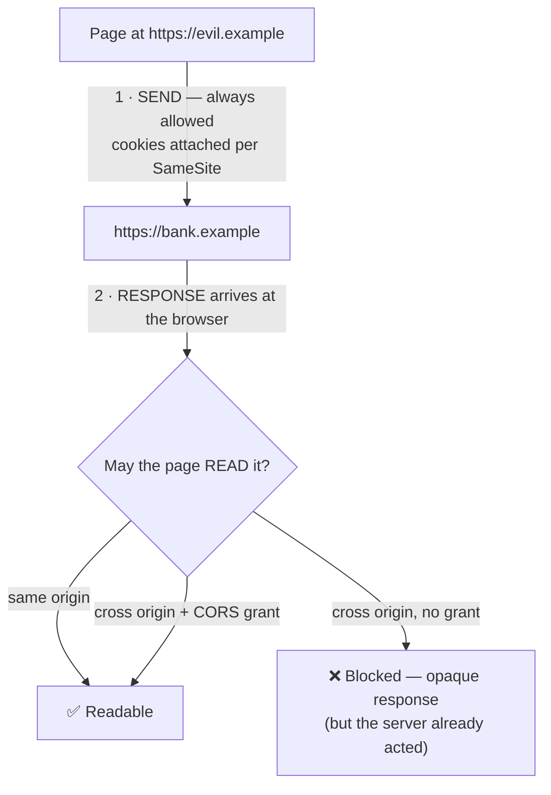

# Same-Origin Policy

> The same-origin policy is the reason a page on `evil.com` can't read your bank balance while you're logged in. It is also, crucially, *not* the reason it can't move your money — that requires a second mechanism, and confusing the two is how CSRF happens.

**Part:** [05 · Reliability & Quality](../) · **Domain:** Security · **Priority:** Critical · **Difficulty:** Advanced · **Reading time:** ~16 min

## TL;DR

The **same-origin policy (SOP)** is the browser's default isolation boundary. An **origin** is the triple **(scheme, host, port)** — `https://app.example.com:443` — and two origins match only if all three are identical. Under SOP, a document may not *read* another origin's DOM, responses, storage, or cookies. The critical asymmetry: **SOP restricts reading, not sending.** A cross-origin form post, image request, or `fetch` with `credentials: 'include'` still leaves the browser with cookies attached; the attacker simply can't see the response. That gap is CSRF, and it's closed by `SameSite` cookies and CSRF tokens, not by SOP. **CORS** is the mechanism a server uses to *relax* SOP for specific origins; it is a permission grant, never a security control on the client. And *origin* is not *site*: cookies and some newer isolation features key on the broader registrable-domain "site", which is why `SameSite` and `Access-Control-Allow-Origin` don't draw the same line.

> **Recommendation:** Assume every cross-origin request your users' browsers can make *will* be made by someone hostile. Defend reads with SOP and CORS; defend writes with `SameSite=Lax`/`Strict` cookies plus origin verification on the server.

## At a Glance

| | |
| --- | --- |
| **Use when** | Designing any authenticated web application, any embed, any cross-subdomain architecture, or any public API consumed from a browser. |
| **Avoid when** | Never — you can only relax it deliberately (CORS, `postMessage`) or tighten it (COOP/COEP, sandboxed frames). |
| **Alternatives** | [CORS](#alternative-approaches), [`postMessage`](#alternative-approaches), [same-site proxying](#alternative-approaches) for controlled relaxation. |
| **Primary risk** | Believing SOP prevents cross-origin *requests*. It doesn't — it prevents reading the response. |
| **Maturity** | Stable — formalized in RFC 6454 (2011); `document.domain` was removed from the platform in 2023. |

## Prerequisites

You need HTTP's request/response semantics and the storage model that origins partition, since SOP is a policy layered on both.

- [HTTP/1.1 Semantics](../../00-foundations/networking-protocols/http-1-1-semantics.md) (`· Networking & Protocols`) — what a request carries, and which methods are "simple" enough to skip a CORS preflight.
- [Web Storage](../../00-foundations/browser-apis/web-storage.md) (`· Browser APIs`) — origin-scoped storage, and why script-readable storage is the wrong place for tokens.

## Overview

An **origin** is the tuple **(scheme, host, port)**. Two URLs are same-origin when all three components are byte-identical:

| URL A | URL B | Same origin? | Why |
| --- | --- | --- | --- |
| `https://app.example.com/a` | `https://app.example.com/b` | ✅ | Path is irrelevant |
| `https://app.example.com` | `http://app.example.com` | ❌ | Different scheme |
| `https://app.example.com` | `https://api.example.com` | ❌ | Different host |
| `https://example.com` | `https://example.com:8443` | ❌ | Different port |
| `https://example.com` | `https://www.example.com` | ❌ | Different host — `www` counts |

The policy this triple gates is, in one sentence: **a document may not read data from another origin.** Concretely, that means no reading another origin's DOM through a frame or window reference, no reading a cross-origin `fetch`/`XHR` response body without permission, no reading its `localStorage`, `sessionStorage`, IndexedDB, or cookies, and no reading pixels out of a canvas tainted by a cross-origin image.

Equally important is what SOP explicitly does *not* block, because the web would break if it did. Cross-origin **embedding** is allowed and unrestricted: ``, `<script>`, `<link rel=stylesheet>`, `<video>`, `<iframe>`, `<form>` submissions, and top-level navigations all work across origins by default. The browser fetches the resource, sends any cookies that the cookie's own `SameSite` policy permits, and renders or executes it — your script just can't inspect the bytes. A `<script src>` from another origin executes *in your origin* with full access to your document, which is why supply-chain compromise of a CDN is catastrophic and why Subresource Integrity exists.

Then there is the **site** vs **origin** distinction, which is where most real confusion lives. A *site* is the scheme plus the registrable domain (eTLD+1): `https://app.example.com` and `https://api.example.com` are different **origins** but the same **site** (`https://example.com`). SOP works on origins. `SameSite` cookies work on sites. Site isolation and COOP/COEP mostly work on sites and origins respectively. Two mechanisms drawing different boundaries on the same architecture is precisely why "it's all our domain, so it's fine" is a dangerous sentence.

Finally, a historical correction: `document.domain` used to let two documents sharing a registrable domain relax into a common origin. It was a persistent security hole — it opted a page out of origin isolation entirely — and browsers removed it (Chrome 115, 2023). Any advice recommending it is dead. Use `postMessage`.

## The Problem

The intuition most engineers carry is "the browser blocks cross-origin requests." It doesn't. The browser **sends** cross-origin requests freely and blocks the *response* from being read. Everything hard about web security lives in that gap.

Consider a bank at `https://bank.example` with a session cookie and an endpoint `POST /transfer`. A user, logged in, visits `https://evil.example`, which contains:

```html
<form action="https://bank.example/transfer" method="POST" id="f">
  <input name="to" value="attacker-account"><input name="amount" value="5000">
</form>
<script>f.submit()</script>
```

SOP is fully in force and completely irrelevant. The request goes out, the browser attaches the session cookie because that's what cookies do, and the bank processes a transfer. The attacker never reads the response — and never needed to. This is **CSRF**, and it is a direct consequence of "SOP restricts reading, not sending."

The mirror-image confusion is CORS. Engineers hit `Access to fetch has been blocked by CORS policy`, conclude that CORS is a security barrier standing in their way, and "fix" it with `Access-Control-Allow-Origin: *`. But CORS is not a wall — it's a **doorway the server opens**. The error means "the server didn't grant your origin permission to read this," and setting `*` grants it to everyone. On a public, unauthenticated endpoint that's fine. On an authenticated one it is a data breach, which is why the spec forbids combining `*` with `credentials: 'include'` at all.

A third failure comes from architecture. Teams put the app on `app.example.com` and the API on `api.example.com`, assume "same domain means same origin," and are surprised by CORS preflights, cookie scoping problems, and `postMessage` requirements. Different subdomains are different origins, full stop.

## Why It Matters

SOP is the assumption every other web security mechanism builds on. Session cookies are safe to hold in a browser only because a hostile page can't read them. Storing anything in `localStorage` is meaningful only because another origin can't enumerate it. Authentication flows that pass tokens through redirects work only because the intermediate origins can't inspect each other's windows. Remove SOP and the entire model collapses — which is essentially what an XSS vulnerability does, since injected script runs *inside* your origin and inherits every permission SOP was granting you.

It also has direct architectural consequences. Whether your API is same-origin or cross-origin determines whether you pay a preflight round trip on every non-simple request, whether cookies flow by default, whether you need CORS configuration at all, and whether a compromised subdomain can reach your session. Same-origin API paths (`/api/*` behind the same host) avoid the entire category; the cost is a reverse proxy. That trade is worth making explicitly rather than discovering it during a CORS debugging session.

And in 2018, Spectre made process-level origin separation a hardware-level concern: because speculative execution could read across in-process boundaries, browsers moved to putting cross-site frames in separate processes and gated `SharedArrayBuffer` behind **cross-origin isolation** (COOP + COEP). Those headers are the modern extension of SOP — see [Process & Thread Architecture · The Web Platform](../../00-foundations/web-platform/process-and-thread-architecture.md) for the process model they rely on.

## Mental Model

Picture two gates, in sequence, in opposite directions.



**Gate 1 is not a gate.** The request leaves. Side effects happen server-side regardless of what the browser does with the response. This is the CSRF surface, and it is defended on the *cookie* (`SameSite`) and on the *server* (token, `Origin` header check), never by SOP.

**Gate 2 is the same-origin policy.** It decides readability. CORS is the server saying "this origin may pass".

Layer on the boundary each mechanism actually draws, because they differ:

| Mechanism | Keys on | `app.example.com` ↔ `api.example.com` |
| --- | --- | --- |
| Same-origin policy | Origin (scheme, host, port) | **Cross-origin** — needs CORS |
| `SameSite` cookies | Site (scheme + eTLD+1) | **Same-site** — cookies flow |
| Cookie `Domain=example.com` | Registrable domain | Shared |
| COOP / COEP | Origin | Cross-origin |
| Site isolation (process) | Site | Same site → may share a process |

That table is the whole reason "same domain" is not a security statement. Cookies scoped to `Domain=example.com` are readable by *every* subdomain, so one compromised marketing subdomain reaches the session of the app — a boundary SOP would have held but the cookie policy gave away.

Three sanctioned ways to communicate across the boundary, in preference order: **CORS** for HTTP data, `postMessage` for window-to-window messaging (always with an explicit `targetOrigin` and an `event.origin` check), and `Channel Messaging` for a persistent port between them. Everything else — JSONP, `document.domain`, wildcard `postMessage` — is a vulnerability with a friendly name.

## Best Practices

**Serve the API same-origin when you can.** Routing `/api/*` through the same host as the app removes CORS entirely, removes preflight latency, and lets you use `SameSite=Strict` cookies. A reverse proxy is cheap compared to the failure modes of a cross-origin authenticated API.

**Never pair `Access-Control-Allow-Origin: *` with credentials.** For authenticated endpoints, echo a specific origin from an allowlist and send `Vary: Origin` so caches don't serve one origin's grant to another.

**Validate the `Origin` header on state-changing requests, server-side.** Browsers set it on all CORS requests and on cross-origin `POST`s, and it can't be spoofed by page script. It's a cheap second layer behind `SameSite`.

**Set session cookies `HttpOnly; Secure; SameSite=Lax` at minimum.** `HttpOnly` puts them out of JavaScript's reach so XSS can't exfiltrate them; `SameSite=Lax` blocks the classic cross-site form-post CSRF while keeping top-level navigation logins working. Use `Strict` for high-value actions and scope with `Host-` / `__Secure-` prefixes.

**Don't scope cookies to the registrable domain unless every subdomain is trusted.** `Domain=example.com` hands your session to `blog.example.com`. Omit `Domain` to keep the cookie host-only.

**Always pass an explicit `targetOrigin` to `postMessage`, and always check `event.origin` on receipt.** `postMessage(data, '*')` broadcasts to whatever happens to be in the frame; an unchecked `event.origin` accepts instructions from anyone who can embed you.

**Pin third-party scripts with Subresource Integrity and `crossorigin`.** A cross-origin `<script>` runs with your origin's full privileges. SRI makes a swapped file fail closed.

**Sandbox untrusted embeds.** `<iframe sandbox>` without `allow-same-origin` gives the frame an opaque origin, so it can't reach storage or cookies for anything. Add capabilities back one at a time.

## Trade-offs

SOP buys a strong, universal default at the cost of friction for every legitimate cross-origin integration.

**Advantages**

- A safe default: new code is isolated without any developer action, which is the only security model that survives contact with real teams.
- Universally implemented and consistently specified, so behavior is predictable across browsers.
- Composable with narrower relaxations (CORS, `postMessage`, sandboxing) so you open exactly what you need.

**Disadvantages**

- Legitimate cross-origin architectures pay real cost: preflight round trips, cookie complexity, and CORS configuration drift.
- It protects *reads* only, so the send-side attack surface (CSRF, resource-timing leaks, cross-site tracking) needs separate mechanisms that are easy to forget.
- Origin granularity doesn't match cookie or process granularity, so three different boundaries coexist in one system.

| Dimension | Same-origin policy | Cost / caveat |
| --- | --- | --- |
| Read protection | Strong and default-on | Void inside your own origin — XSS bypasses it entirely |
| Write protection | **None** | Requires `SameSite`, CSRF tokens, `Origin` checks |
| Integration cost | Explicit opt-in via CORS | Preflight latency; config drift between environments |
| Granularity | Origin (scheme, host, port) | Cookies use *site*; process isolation uses *site* |
| Embedding | Cross-origin resources load freely | Third-party scripts run with your privileges |

## Alternative Approaches

You never turn SOP off. You choose how to cross it.

| Approach | Best when | Weakness | See |
| --- | --- | --- | --- |
| Same-origin (reverse proxy) | You control both app and API | Infrastructure work; couples deployment | (this article) |
| [CORS](./) (planned) | A browser must read a cross-origin HTTP response | Preflight latency; misconfiguration is a breach | `CORS · Security` |
| `postMessage` | Window-to-window messaging with an embed or opener | Requires explicit origin checks on both ends | `Isolation (COOP/COEP) · Security` |
| Server-side proxy / BFF | Third-party API with secrets the browser must not hold | Adds a hop; the server becomes the trust boundary | `API Design & Contracts` (planned) |
| Sandboxed iframe (opaque origin) | Rendering untrusted content | Loses storage and cookies by design | `Isolation (COOP/COEP) · Security` |
| ~~JSONP~~ | Never | Executes attacker-controlled script in your origin | — |

## Bad Example

A cross-origin API and a widget that relax every boundary they touch.

```js
// ❌ Server: a wildcard grant on an authenticated endpoint.
app.use((req, res, next) => {
  res.setHeader('Access-Control-Allow-Origin', '*');            // any site may read
  res.setHeader('Access-Control-Allow-Credentials', 'true');    // …with the user's cookies
  res.setHeader('Access-Control-Allow-Methods', 'GET,POST,PUT,DELETE');
  next();
});

// ❌ Reflecting the caller's Origin with no allowlist — same as '*', but sneakier.
app.use((req, res, next) => {
  res.setHeader('Access-Control-Allow-Origin', req.headers.origin ?? '*');
  res.setHeader('Access-Control-Allow-Credentials', 'true');
  next(); // and no `Vary: Origin`, so a CDN caches one origin's grant for everyone
});

// ❌ Session cookie readable by script and by every subdomain, with no SameSite.
res.cookie('session', token, { domain: '.example.com' });
```

```js
// ❌ Client: a widget that trusts any window that talks to it.
window.addEventListener('message', (event) => {
  // No origin check — any page that embeds this widget can drive it.
  const { action, payload } = event.data;
  if (action === 'setAuthToken') localStorage.setItem('token', payload);
  if (action === 'transfer') api.post('/transfer', payload);
});

// ❌ Broadcasting a token to whatever happens to be in the frame.
iframe.contentWindow.postMessage({ token: sessionToken }, '*');

// ❌ Third-party script with no integrity pin, running with full origin privileges.
const s = document.createElement('script');
s.src = 'https://cdn.thirdparty.example/widget.js';
document.head.append(s);
```

**What goes wrong:** The wildcard-plus-credentials combination is rejected by browsers precisely because it would be a total breach — but the *reflected* version achieves the same thing while appearing specific: any origin gets its own grant, so `evil.example` can read every authenticated response. The missing `Vary: Origin` means a shared cache can hand one origin's `Access-Control-Allow-Origin` header to another, breaking isolation even for correctly-configured callers. The cookie has no `HttpOnly` (so any XSS on any subdomain exfiltrates it), no `Secure` (so it leaks over plaintext), no `SameSite` (so it rides along on cross-site requests — full CSRF exposure), and `domain: '.example.com'` (so every subdomain, including third-party-hosted ones, can read it). On the client, the unchecked `message` listener lets any embedding page issue a transfer, `postMessage(…, '*')` leaks the session token to whatever origin currently occupies the frame, and the unpinned CDN script executes inside the origin with complete access to the DOM, cookies, and storage that SOP was protecting.

## Good Example

The same system with each boundary drawn deliberately.

```js
// ✅ Server: explicit allowlist, credentials only for known origins, Vary set.
const ALLOWED_ORIGINS = new Set([
  'https://app.example.com',
  'https://admin.example.com',
]);

app.use((req, res, next) => {
  const origin = req.headers.origin;
  // Vary on Origin ALWAYS — otherwise caches serve one origin's grant to another.
  res.setHeader('Vary', 'Origin');

  if (origin && ALLOWED_ORIGINS.has(origin)) {
    res.setHeader('Access-Control-Allow-Origin', origin);   // never '*' with credentials
    res.setHeader('Access-Control-Allow-Credentials', 'true');
    res.setHeader('Access-Control-Allow-Headers', 'Content-Type, X-CSRF-Token');
    res.setHeader('Access-Control-Max-Age', '600');          // cache the preflight
  }
  if (req.method === 'OPTIONS') return res.sendStatus(204);
  next();
});

// ✅ Defense in depth: SOP protects reads; this protects writes.
app.use((req, res, next) => {
  if (['GET', 'HEAD', 'OPTIONS'].includes(req.method)) return next(); // safe methods
  const origin = req.headers.origin;
  // Browsers set Origin on cross-origin writes and page script cannot forge it.
  if (!origin || !ALLOWED_ORIGINS.has(origin)) {
    return res.status(403).json({ error: 'cross_origin_write_rejected' });
  }
  next();
});

// ✅ Session cookie: unreachable by script, HTTPS-only, host-only, not cross-site.
res.cookie('__Host-session', token, {
  httpOnly: true,     // XSS cannot read it
  secure: true,       // never sent over plaintext
  sameSite: 'lax',    // blocks cross-site form-post CSRF; top-level login still works
  path: '/',
  // No `domain` → host-only. blog.example.com cannot see it.
});
```

```js
// ✅ Client: messages accepted only from a known origin, sent only to a known origin.
const WIDGET_ORIGIN = 'https://widget.example.com';
const ALLOWED_ACTIONS = new Set(['resize', 'ready', 'close']);

window.addEventListener('message', (event) => {
  if (event.origin !== WIDGET_ORIGIN) return;                  // 1 · who sent it
  if (event.source !== iframe.contentWindow) return;           // 2 · which window
  const { action, payload } = event.data ?? {};
  if (typeof action !== 'string' || !ALLOWED_ACTIONS.has(action)) return; // 3 · what
  handleWidgetAction(action, payload);
});

// Explicit targetOrigin: if the frame navigated elsewhere, the message is not delivered.
iframe.contentWindow.postMessage({ action: 'init', theme }, WIDGET_ORIGIN);
// Note: no token crosses this boundary at all — the widget authenticates server-side.
```

```html
<!-- ✅ Third-party script pinned by hash; a swapped file fails closed. -->
<script
  src="https://cdn.thirdparty.example/widget-4.2.1.js"
  integrity="sha384-oqVuAfXRKap7fdgcCY5uykM6+R9GqQ8K/uxy9rx7HNQlGYl1kPzQho1wx4JwY8wC"
  crossorigin="anonymous"
  defer
></script>

<!-- ✅ Untrusted embed gets an opaque origin: no storage, no cookies, no same-origin access. -->
<iframe
  src="https://untrusted.example/preview"
  sandbox="allow-scripts allow-popups"
  referrerpolicy="no-referrer"
  title="Content preview"
></iframe>
```

**Why it's better:** The allowlist means only origins you named can read authenticated responses, and `Vary: Origin` keeps a shared cache from leaking one origin's grant to another. The `Origin` check on non-safe methods closes the write-side gap SOP leaves open — a defense that costs three lines and doesn't depend on the client cooperating. The cookie flags each remove one attack: `HttpOnly` makes XSS unable to steal the session, `Secure` prevents plaintext leakage, `SameSite=Lax` blocks cross-site form-post CSRF, and dropping `Domain` (enforced by the `__Host-` prefix) confines the cookie to the exact host so a compromised sibling subdomain gains nothing. On the client, the three-part message check — origin, source window, action allowlist — means an embedding page can't drive the widget, and the explicit `targetOrigin` means a navigated frame silently receives nothing instead of receiving your data. SRI turns CDN compromise from a full origin takeover into a failed load, and the sandboxed frame runs untrusted content in an opaque origin where there is nothing for it to reach.

## Common Mistakes

See the [Security anti-patterns](../../../anti-patterns/) for the domain catalog. Concept-specific:

### Mistake: Treating CORS as a security control

- **Symptom:** A CORS error appears in the console and is resolved by widening `Access-Control-Allow-Origin` until it goes away, often to `*` or a reflected `req.headers.origin`.
- **Why it fails:** CORS is a *relaxation* of SOP, not an enforcement of it. It only constrains browsers — `curl`, a server, or a mobile client ignores it entirely. Widening it grants read access to authenticated data; reflecting the caller's origin grants it to everyone while looking specific.
- **Fix:** Treat CORS as an allowlist of origins you intend to serve, and put actual authorization on the server where every client is subject to it. Never combine a wildcard with credentials, and always send `Vary: Origin`.

### Mistake: Assuming SOP prevents cross-origin requests

- **Symptom:** No CSRF protection, on the theory that "the browser blocks other sites from calling our API".
- **Why it fails:** SOP blocks reading the response, not sending the request. A cross-site form post, `` GET, or `fetch` with `credentials: 'include'` all reach your server with the user's cookies attached. State changes happen even though the attacker sees nothing.
- **Fix:** Set `SameSite=Lax` or `Strict` on session cookies, verify the `Origin` header on all non-safe methods, and add CSRF tokens for flows that must work cross-site.

### Mistake: Trusting `postMessage` without checking `event.origin`

- **Symptom:** A widget or embed handles any incoming message; a page that frames it can invoke privileged actions.
- **Why it fails:** `message` events fire for *any* sender that has a reference to your window, including the opener, any frame you're embedded in, and any popup. Without an origin check the handler is an unauthenticated RPC endpoint.
- **Fix:** Compare `event.origin` against an exact expected origin (never `endsWith`, never a regex on a substring), verify `event.source` is the window you expect, and validate the message shape against an allowlist of actions.

### Mistake: Scoping cookies to the registrable domain

- **Symptom:** `Domain=.example.com` on a session cookie, so the app, the blog, the status page, and a vendor-hosted subdomain all receive it.
- **Why it fails:** Cookies key on *site*, not origin. A cookie set with a `Domain` attribute is sent to every subdomain — including one hosting third-party content or one that gets taken over. The origin boundary SOP maintains is bypassed by the cookie's own scope.
- **Fix:** Omit `Domain` so the cookie stays host-only, and use the `__Host-` prefix to make that enforceable by the browser. Share sessions across subdomains through an explicit SSO flow, not through cookie scope.

## Checklist

- [ ] `Access-Control-Allow-Origin` is an explicit allowlist; never `*` on credentialed endpoints, never a bare reflection of `Origin`.
- [ ] `Vary: Origin` is sent on every CORS response.
- [ ] Non-safe methods verify the `Origin` header server-side.
- [ ] Session cookies are `HttpOnly; Secure; SameSite=Lax` (or `Strict`) with no `Domain` attribute, ideally with a `__Host-` prefix.
- [ ] CSRF tokens exist for any flow that must legitimately work cross-site.
- [ ] Every `postMessage` send passes an explicit `targetOrigin`; every receiver checks `event.origin`, `event.source`, and the message shape.
- [ ] Third-party scripts carry Subresource Integrity hashes and `crossorigin`.
- [ ] Untrusted embeds use `<iframe sandbox>` without `allow-same-origin`.
- [ ] No use of `document.domain` (removed from the platform) and no JSONP anywhere.
- [ ] CORS configuration is identical across environments — no permissive development defaults reaching production.

## Related Articles

- [CORS](./) (planned) — the full preflight mechanism, simple vs non-simple requests, and configuration patterns.
- [Isolation (COOP/COEP)](./) (planned) — cross-origin isolation, the post-Spectre extension of this boundary.
- Cross-Site Scripting (XSS) (planned), DOM-Based XSS (planned), HTML/Template Injection (planned) — the attacks that defeat SOP from *inside* your origin.
- [HTTP/1.1 Semantics](../../00-foundations/networking-protocols/http-1-1-semantics.md) (`· Networking & Protocols`) — which methods and headers avoid a preflight.
- **Canonical home:** the process boundary that enforces isolation at the OS level is owned by [Process & Thread Architecture · The Web Platform](../../00-foundations/web-platform/process-and-thread-architecture.md).

## References

- [WHATWG — HTML Standard: Origin](https://html.spec.whatwg.org/multipage/browsers.html#origin) — the normative definition of origin, opaque origins, and site.
- [MDN — Same-origin policy](https://developer.mozilla.org/en-US/docs/Web/Security/Same-origin_policy) — what is and isn't restricted, with the full cross-origin embedding list.
- [RFC 6454 — The Web Origin Concept](https://www.rfc-editor.org/rfc/rfc6454) — the original formalization and its threat model.
- [MDN — Cross-Origin Resource Sharing (CORS)](https://developer.mozilla.org/en-US/docs/Web/HTTP/Guides/CORS) — the relaxation mechanism in full detail.
- [MDN — SameSite cookies](https://developer.mozilla.org/en-US/docs/Web/HTTP/Guides/Cookies#samesite_attribute) — the site-level boundary that closes the write-side gap.
