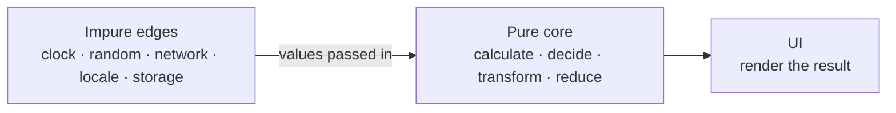

# Pure Logic Testing

> A pure function is the cheapest thing in a codebase to test exhaustively — which is a reason to move the rules that matter out of components and into one.

**Part:** [05 · Reliability & Quality](../) · **Domain:** Testing & Quality · **Priority:** High · **Difficulty:** Intermediate · **Reading time:** ~12 min

## TL;DR

**Pure logic** — a function whose output depends only on its arguments, with no I/O, no clock, no randomness, no mutation — needs no setup, no mocks, and no async handling to test. That makes exhaustive edge-case coverage nearly free, so the frontend's real rules (pricing, permissions, validation, sorting, parsing, reducers) belong in pure functions rather than inside components. The technique is **table-driven tests**: one parameterized case per interesting input, with the boundaries named. The prerequisite is **injecting impurity** — pass the clock, the locale, and the id generator as arguments instead of reaching for `Date.now()`, `navigator.language`, and `crypto.randomUUID()` inside the function.

> **Recommendation:** Extract any rule you would need three component tests to verify into a pure function, and cover it with a table that names each boundary case.

## At a Glance

| | |
| --- | --- |
| **Use when** | The behavior is a calculation, transformation, decision, or state transition rather than a rendering concern. |
| **Avoid when** | The behavior only exists in the wiring — then it belongs in an integration test, not a unit test. |
| **Alternatives** | [Property-based testing](#alternative-approaches), [integration tests](#alternative-approaches), [snapshot tests](#alternative-approaches). |
| **Primary risk** | Testing logic in isolation that is never wired up correctly — unit coverage without an integration test above it. |
| **Maturity** | Stable — table-driven testing predates JavaScript; `test.each` is standard in Vitest and Jest. |

## Prerequisites

Knowing which behaviors belong at the unit layer comes first.

- [The Testing Pyramid/Trophy](./the-testing-pyramid-trophy.md) — why this layer stays small and what belongs in it.
- [What to Test & Coverage Goals](./what-to-test-and-coverage-goals.md) — choosing which logic earns exhaustive treatment.

## Overview

A function is **pure** when the same arguments always produce the same result and calling it changes nothing observable. That definition has a direct testing consequence: the entire test is `expect(fn(input)).toEqual(output)`. No render, no provider tree, no fake server, no `await`, no cleanup. A hundred such cases run in single-digit milliseconds, which is what makes covering the boundaries — zero, one, empty, maximum, negative, malformed — practical rather than aspirational.

The distinction to keep clear is between logic that is *pure by nature* and logic that is *pure by construction*. A tax calculation is naturally pure. A "should this session be considered expired?" check reads the clock, and a "sort these by relevance to the user's locale" comparison reads the environment — both become pure when the clock and the locale are parameters. That transformation, not the test framework, is the actual work.

A **reducer** is the important special case: `(state, action) => newState` is pure by definition, which is why state machines expressed as reducers are so much easier to test than the same logic scattered across event handlers and effects.

## The Problem

Rules that live inside components can only be tested through them, and that is an order of magnitude more expensive per case.

```tsx
// The pricing rule is inside the component, so every case needs a render.
function OrderSummary({ order, user }: Props) {
  const discount =
    user.tier === 'gold' ? 0.15 : user.tier === 'silver' ? 0.1 : 0;
  const shipping = order.subtotal > 5000 || user.tier === 'gold' ? 0 : 499;
  const tax = Math.round((order.subtotal * (1 - discount) + shipping) * order.taxRate);
  const total = Math.round(order.subtotal * (1 - discount)) + shipping + tax;

  return <dl><dt>Total</dt><dd>{formatMoney(total)}</dd></dl>;
}
```

Verifying the free-shipping threshold at exactly 5000, the interaction between a gold tier and that threshold, and the rounding order now requires a render, a query, and a string comparison per case — so in practice one or two cases get tested and the rest are checked by hand once.

The second problem is hidden impurity. A function that reads `Date.now()` internally cannot be tested at a boundary without global timer mocking, and a function that calls `Intl.NumberFormat` with the ambient locale produces different output on a developer machine and in CI. Both show up as tests that pass locally and fail in the pipeline, or worse, tests that pass everywhere and encode the wrong behavior for half the users.

```ts
// Non-deterministic: passes in December, fails in January.
export function isExpiringSoon(subscription: Subscription): boolean {
  return subscription.renewsAt.getTime() - Date.now() < 30 * 24 * 60 * 60 * 1000;
}
```

The third is the copy-pasted test block: five nearly identical `it()` bodies differing by two values, where a sixth case is never added because adding one means duplicating fifteen lines.

## Why It Matters

The rules that cost money when they are wrong — pricing, entitlements, quotas, date arithmetic, validation — are logic, not rendering. Putting them in pure functions is what makes it affordable to test them at every boundary, and boundaries are where these defects live: the discount at exactly the threshold, the last day of the month, the empty cart, the item priced at zero.

Extraction also improves the code independently of the tests. A component whose body is a rendering expression is easier to read than one that opens with twelve lines of arithmetic, and the extracted function becomes reusable by the server, the worker, and the analytics job that need the same rule. The alternative — the rule reimplemented in three places — is a category of production bug that no amount of component testing catches.

There is a speed argument too. A pure-logic suite runs in milliseconds, so it can run on save. Fast feedback changes how tests are used: they become part of writing the function rather than a gate at the end, and cases get added while the reasoning is still in the author's head.

## Mental Model

Think of it as **pushing impurity to the edges** so the middle can be tested by table.



Three moves follow.

**Take the environment as a parameter.** `isExpiringSoon(subscription, now)` is testable at any date; `isExpiringSoon(subscription)` is testable only in the present. The same applies to locale, timezone, feature flags, and id generation. Default the parameter (`now = new Date()`) so callers stay convenient.

**Express state transitions as reducers.** `(state, action) => state` lets a test assert a whole sequence of transitions with no framework at all, including the transitions that are hard to reach through the UI.

**Enumerate cases as data, not as code.** `test.each` (or `it.each`) turns each case into a row with a name, so adding the sixth case is one line and the failure message says which row failed.

The boundary cases worth enumerating are consistent across domains: empty, one element, many; zero, negative, maximum; exactly at a threshold and one unit either side; missing and malformed input; and — for anything with dates — month ends, leap days, and daylight-saving transitions.

## Best Practices

**Extract a rule the moment it needs its own test.** If verifying a behavior means constructing a component just to reach it, the behavior wants to be a function.

**Inject the clock, locale, timezone, and randomness.** Parameters with defaults keep call sites clean and make tests deterministic without global mocking.

**Use integer minor units for money.** Store and compute in cents; format only at the edge. Floating-point sums produce off-by-a-cent totals that are painful to reproduce.

**Name every table row.** `it.each` supports a `$name` placeholder in the title, and a failing case that says "rounds half up at the threshold" is worth more than "case 4".

**Assert the whole result, not one field.** `toEqual` on the returned object catches the field you were not thinking about; asserting `result.total` alone misses a corrupted `breakdown`.

**Test the error path as a value or a typed error.** A rule that must reject something should be asserted with `toThrow(SpecificError)` or a discriminated result, not `toThrow()`, which passes on any error including a typo.

**Keep an integration test above the unit tests.** Pure logic proven correct and wired to the wrong field is still a broken feature; the layer above is what proves the wiring.

## Trade-offs

Unit-testing pure logic is the cheapest confidence available and the narrowest.

**Advantages**

- Exhaustive boundary coverage is affordable, which is where calculation defects actually live.
- Tests run in milliseconds with no setup, so they can run on save and stay useful during development.
- Extraction makes the rule reusable and keeps components focused on rendering.

**Disadvantages**

- Proves nothing about whether the rule is invoked correctly — that requires a test at a higher layer.
- Extraction adds indirection, and over-applied it produces a `utils/` directory of one-line functions.
- Injected dependencies (clock, locale) add parameters that every caller sees, even when only tests care.

| Dimension | Pure logic unit test | Component/integration test |
| --- | --- | --- |
| Cost per case | Microseconds, no setup | Milliseconds, render and query |
| What it proves | The rule is correct | The rule is reachable and wired |
| Edge coverage | Exhaustive is practical | A few cases at most |
| Refactor resilience | High, if the signature is stable | High, if driven through the UI |
| Failure diagnosis | Exact input and output | The behavior, not the line |

## Alternative Approaches

| Approach | Best when | Weakness | See |
| --- | --- | --- | --- |
| Table-driven unit tests | The input space is enumerable and boundaries are known | Only covers cases you thought of | (this article) |
| Property-based testing | Invariants hold across a wide input space | Expressing properties is a skill; failures need shrinking to read | Property-Based Testing (planned) |
| Integration test only | The logic is trivial or exists only as wiring | Edge cases become expensive, so they go untested | [The Testing Pyramid/Trophy](./the-testing-pyramid-trophy.md) |
| Snapshot of computed output | A large derived structure is checked as a whole | Hides which field changed; invites blind updates | [What to Test & Coverage Goals](./what-to-test-and-coverage-goals.md) |
| Type-level guarantees | The rule can be expressed as a type | Types cannot express arithmetic or thresholds | Literal & Unit Types · TypeScript (planned) |

## Bad Example

Logic embedded in a component, tested through renders, with hidden impurity.

```tsx
// ❌ The rules live in the component and read the environment directly.
export function SubscriptionBanner({ subscription }: { subscription: Subscription }) {
  const daysLeft = Math.floor(
    (subscription.renewsAt.getTime() - Date.now()) / 86_400_000,   // hidden clock
  );
  const price = new Intl.NumberFormat(navigator.language, {         // hidden locale
    style: 'currency',
    currency: subscription.currency,
  }).format(subscription.amount / 100);

  if (daysLeft < 0) return <Alert tone="error">Expired — renew for {price}</Alert>;
  if (daysLeft <= 30) return <Alert tone="warning">Renews in {daysLeft} days for {price}</Alert>;
  return null;
}
```

```tsx
// ❌ Five near-identical blocks; the boundary cases are the ones missing.
describe('SubscriptionBanner', () => {
  it('warns when renewing soon', () => {
    const renewsAt = new Date(Date.now() + 10 * 86_400_000);
    render(<SubscriptionBanner subscription={{ renewsAt, amount: 9900, currency: 'USD' }} />);
    expect(screen.getByText(/Renews in 10 days/)).toBeInTheDocument();
  });

  it('shows expired', () => {
    const renewsAt = new Date(Date.now() - 86_400_000);
    render(<SubscriptionBanner subscription={{ renewsAt, amount: 9900, currency: 'USD' }} />);
    expect(screen.getByText(/Expired/)).toBeInTheDocument();
  });

  // Missing: exactly 30 days, exactly 0 days, 31 days, a DST boundary,
  // a non-USD currency, and a locale that formats currency differently.
  // Adding each one means another 6-line block, so nobody does.
});
```

**What goes wrong:** The day calculation reads `Date.now()` inside the component, so the only way to test a specific date is to compute offsets from the present — which is why the tests are written as `Date.now() + 10 days` and why a case spanning a daylight-saving transition cannot be expressed at all. The `86_400_000` millisecond arithmetic silently produces 9 or 11 days across a DST change, and the test will only catch it twice a year, in the runs that happen to straddle one. `navigator.language` means the formatted price differs between a developer's machine and CI, so the assertion is either loosened to a regex or the test fails for reasons unrelated to the code. And each case costs a render plus a query, so the two cases that exist are the easy ones and every boundary — day 30, day 31, day 0 — is untested, which is precisely where the `<=` versus `<` bug will be.

## Good Example

The rule extracted, the environment injected, and the cases enumerated as data.

```ts
// subscription-status.ts — pure: same inputs, same result, no clock, no locale.
export type SubscriptionStatus =
  | { kind: 'active'; daysUntilRenewal: number }
  | { kind: 'renewing-soon'; daysUntilRenewal: number }
  | { kind: 'expired'; daysSinceExpiry: number };

const MS_PER_DAY = 86_400_000;
const RENEWAL_WARNING_DAYS = 30;

/** Whole days between two instants, computed in UTC so DST cannot shift the result. */
function wholeDaysBetween(from: Date, to: Date): number {
  const startOfDay = (d: Date) => Date.UTC(d.getUTCFullYear(), d.getUTCMonth(), d.getUTCDate());
  return Math.round((startOfDay(to) - startOfDay(from)) / MS_PER_DAY);
}

export function getSubscriptionStatus(
  subscription: Pick<Subscription, 'renewsAt'>,
  now: Date = new Date(),          // ✅ injected, with a convenient default
): SubscriptionStatus {
  const days = wholeDaysBetween(now, subscription.renewsAt);
  if (days < 0) return { kind: 'expired', daysSinceExpiry: -days };
  if (days <= RENEWAL_WARNING_DAYS) return { kind: 'renewing-soon', daysUntilRenewal: days };
  return { kind: 'active', daysUntilRenewal: days };
}
```

```ts
// subscription-status.test.ts — every boundary named, one line per case.
const at = (iso: string) => new Date(iso);

describe('getSubscriptionStatus', () => {
  const now = at('2026-03-15T12:00:00Z');

  it.each([
    { name: 'renews far in the future → active',        renewsAt: '2026-06-15T12:00:00Z', expected: { kind: 'active', daysUntilRenewal: 92 } },
    { name: '31 days out is still active (boundary+1)', renewsAt: '2026-04-15T12:00:00Z', expected: { kind: 'active', daysUntilRenewal: 31 } },
    { name: 'exactly 30 days out warns (boundary)',     renewsAt: '2026-04-14T12:00:00Z', expected: { kind: 'renewing-soon', daysUntilRenewal: 30 } },
    { name: 'renews today warns with zero days',        renewsAt: '2026-03-15T23:59:00Z', expected: { kind: 'renewing-soon', daysUntilRenewal: 0 } },
    { name: 'renewed yesterday is expired (boundary-1)',renewsAt: '2026-03-14T12:00:00Z', expected: { kind: 'expired', daysSinceExpiry: 1 } },
  ])('$name', ({ renewsAt, expected }) => {
    expect(getSubscriptionStatus({ renewsAt: at(renewsAt) }, now)).toEqual(expected);
  });

  it('counts calendar days across a DST transition', () => {
    // US DST began 2026-03-08; a naive ms division returns 6 or 8 here.
    expect(getSubscriptionStatus({ renewsAt: at('2026-03-11T12:00:00Z') }, at('2026-03-04T12:00:00Z')))
      .toEqual({ kind: 'renewing-soon', daysUntilRenewal: 7 });
  });
});
```

```ts
// ✅ Money in minor units, formatting with an explicit locale, and a reducer
//    whose transitions can be asserted as a sequence.
export function formatMoney(minorUnits: number, currency: string, locale: string): string {
  return new Intl.NumberFormat(locale, { style: 'currency', currency }).format(minorUnits / 100);
}

it.each([
  { minorUnits: 9900,  currency: 'USD', locale: 'en-US', expected: '$99.00' },
  { minorUnits: 0,     currency: 'USD', locale: 'en-US', expected: '$0.00' },
  { minorUnits: -1250, currency: 'USD', locale: 'en-US', expected: '-$12.50' },
])('formats $minorUnits as $expected', ({ minorUnits, currency, locale, expected }) => {
  expect(formatMoney(minorUnits, currency, locale)).toBe(expected);
});

describe('cartReducer', () => {
  it('merges a duplicate item instead of adding a second row', () => {
    const afterFirst = cartReducer(emptyCart, { type: 'add', item: keyboard, quantity: 1 });
    const afterSecond = cartReducer(afterFirst, { type: 'add', item: keyboard, quantity: 2 });
    expect(afterSecond.lines).toEqual([{ sku: 'kb-1', quantity: 3, unitPrice: 4999 }]);
    expect(afterFirst.lines[0].quantity).toBe(1);   // the previous state was not mutated
  });

  it('removes a line when its quantity reaches zero', () => {
    const cart = cartReducer(emptyCart, { type: 'add', item: keyboard, quantity: 1 });
    expect(cartReducer(cart, { type: 'setQuantity', sku: 'kb-1', quantity: 0 }).lines).toEqual([]);
  });
});
```

**Why it's better:** `getSubscriptionStatus` takes `now` as a parameter, so a test can place itself on any date — including the day before a DST transition, the case the millisecond arithmetic gets wrong and the component-level tests could not express. Computing in UTC day boundaries makes "whole days" mean calendar days rather than 86,400,000-millisecond intervals, and the DST test documents that decision so a future simplification fails loudly. The status is returned as a discriminated union rather than rendered text, so the test asserts the decision rather than a string that a copy change would break. The table names every boundary — 31, 30, 0, and −1 days — which is where the `<` versus `<=` mistake lives, and adding a case is one line. `formatMoney` takes an explicit locale, so the same test result holds on a developer machine and in CI. And the reducer tests assert a sequence of transitions, including that the previous state object was not mutated, which is the defect that produces "the cart updates only after clicking twice."

## Common Mistakes

See the [Testing & Quality anti-patterns](../../../anti-patterns/) for the domain catalog. Concept-specific:

### Mistake: Reading the clock, locale, or randomness inside the function

- **Symptom:** Tests that compute expectations from `Date.now()`, a suite that fails in a different timezone or on the first of the month, formatted output that differs between a laptop and CI.
- **Why it fails:** The function's result depends on ambient state, so it is not pure and cannot be tested at a boundary without mocking globals. Global timer mocking then leaks between tests and produces failures whose cause is another file.
- **Fix:** Accept `now`, `locale`, `timeZone`, or an id factory as parameters with sensible defaults. Where a legacy call site cannot be changed, `vi.setSystemTime` in a scoped `beforeEach`/`afterEach` is the fallback, not the first choice.

### Mistake: Duplicating test blocks instead of parameterizing

- **Symptom:** Six `it()` bodies differing by two literals; the boundary case is missing because adding it means another six lines.
- **Why it fails:** The friction of adding a case determines how many cases exist. Copy-paste also drifts — one block gets updated and the others silently assert the old behavior.
- **Fix:** Use `it.each` with a named row per case. The cost of a new boundary becomes one line, and the failure message names the case.

### Mistake: Unit-testing logic that is never wired up

- **Symptom:** A perfectly tested `calculateTotal` and a UI that displays the subtotal, because the component calls the wrong function.
- **Why it fails:** A unit test proves the function is correct in isolation, which is a claim about the function, not about the feature. Nothing in the unit layer can observe that a component imported the wrong export.
- **Fix:** Keep at least one integration test per user-visible outcome above the unit tests, asserting the value that actually reaches the screen.

## Checklist

- [ ] Rules worth testing are extracted into functions with no I/O, clock, locale, or randomness.
- [ ] Environment dependencies are parameters with defaults, not ambient reads.
- [ ] Money is computed in integer minor units and formatted only at the edge.
- [ ] Each function's boundaries are enumerated: empty, one, many, zero, negative, threshold ± 1.
- [ ] Date logic has cases for month ends, leap days, and daylight-saving transitions.
- [ ] Cases are written with `it.each` and every row has a descriptive name.
- [ ] Assertions compare the whole returned value, not a single field.
- [ ] Rejection paths assert a specific error type or a typed failure result.
- [ ] Reducer tests assert that the previous state object was not mutated.
- [ ] An integration test above the unit tests proves the logic is actually wired to the UI.

## Related Articles

- [The Testing Pyramid/Trophy](./the-testing-pyramid-trophy.md) — why this layer stays focused on logic.
- [What to Test & Coverage Goals](./what-to-test-and-coverage-goals.md) — deciding which logic earns exhaustive cases.
- Testing Hooks & Utilities (planned) and Property-Based Testing (planned) — the next steps from a pure-function baseline.
- Rendering & Querying (planned) — the component layer that proves the wiring.

## References

- [Vitest — `test.each`](https://vitest.dev/api/#test-each) — parameterized cases and title placeholders.
- [Vitest — Mocking timers](https://vitest.dev/guide/mocking.html#timers) — the fallback when a clock cannot be injected.
- [MDN — `Intl.NumberFormat`](https://developer.mozilla.org/en-US/docs/Web/JavaScript/Reference/Global_Objects/Intl/NumberFormat) — why an explicit locale argument matters.
- [React — Extracting State Logic into a Reducer](https://react.dev/learn/extracting-state-logic-into-a-reducer) — moving transitions into a pure function.
