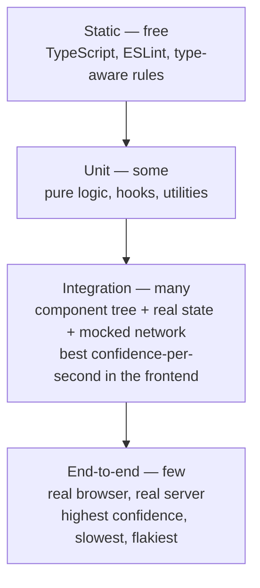

# The Testing Pyramid/Trophy

> The question is not how many tests to write but how to spend a fixed testing budget across layers with very different costs and very different amounts of confidence per test.

**Part:** [05 · Reliability & Quality](../) · **Domain:** Testing & Quality · **Priority:** High · **Difficulty:** Intermediate · **Reading time:** ~12 min

## TL;DR

The **testing pyramid** prescribes many fast unit tests, fewer service tests, and very few end-to-end tests, because cost and fragility rise with scope. The **testing trophy** is the frontend adaptation: a base of **static analysis** (types and lint), a modest unit layer, a **large integration layer** that renders components with their real collaborators, and a thin end-to-end layer over critical user journeys. The trophy shape follows from a frontend-specific fact — most bugs live in the *wiring* between components, state, and the network, and unit tests over individual components deliberately mock exactly that wiring away.

> **Recommendation:** Default to the trophy for product UI work; keep the pyramid's shape for pure logic, shared libraries, and design systems where units are the product.

## At a Glance

| | |
| --- | --- |
| **Use when** | Deciding how to distribute test effort for a new codebase, or diagnosing why an existing suite is slow, flaky, or missing real bugs. |
| **Avoid when** | Treating either shape as a quota — the distribution is a consequence of risk, not a target to hit. |
| **Alternatives** | [Risk-based testing](#alternative-approaches), [the ice-cream cone (anti-pattern)](#alternative-approaches), [contract testing](#alternative-approaches). |
| **Primary risk** | Mock-heavy unit tests that pass while the assembled application is broken. |
| **Maturity** | Stable — the pyramid dates to 2009 (Mike Cohn); the trophy is the established frontend variant. |

## Prerequisites

The layers are defined by what they render and what they replace, so the component and value models come first.

- [Elements vs Components · React](../../02-rendering-frameworks/react/elements-vs-components.md) — what a component test actually renders.
- Primitives & Wrappers (planned, `· JavaScript`) — the value semantics that make equality assertions behave the way they do.

## Overview

A **test layer** is defined by how much of the system it exercises. A *unit* test covers one function or component with its collaborators replaced. An *integration* test renders a meaningful slice — a form with its validation, its state, and a mocked network — and exercises it the way a user would. An *end-to-end* test drives a real browser against a running application. *Static analysis* is not usually called a test layer, but it catches a large class of defects at zero marginal cost per run, which is exactly what a layer is for.

Both shapes encode the same trade-off: as scope grows, a test gets slower, more fragile, and more expensive to diagnose — while the confidence each passing test provides also grows. The pyramid resolves that by putting weight at the bottom. The trophy resolves it by observing that in a typical frontend, the *unit* layer's confidence per test is unusually low, because a React component in isolation with mocked props and mocked hooks is nearly all wiring, and the wiring is what was mocked.

The boundary that matters is not the tool but the *replacement*. A test that renders a component tree with a real store, a real router, and an HTTP mock at the network boundary is an integration test even though it runs in Vitest in milliseconds. A test that renders one component with every hook mocked is a unit test even if it uses the same tooling.

## The Problem

Two failure shapes recur, and they are opposites.

The **ice-cream cone** inverts the pyramid: a large end-to-end suite, a thin middle, almost nothing below. It usually grows from the outside in, because early on the only automated coverage was a browser suite. The result is a CI pipeline that takes 40 minutes, fails on a quarter of runs for reasons unrelated to the change, and produces failures that take an afternoon to attribute. Teams respond by re-running until green, which removes what remained of the signal.

The **mock pyramid** is the other end: thousands of fast unit tests, each rendering one component with its data hooks and children mocked. Coverage looks excellent. Then a release ships with a form that never submits, because the component test asserted that `onSubmit` was called with the right arguments while the real `onSubmit` was wired to the wrong field. The suite verified the component's contract with mocks that the team wrote, not with the code it runs against.

```tsx
// Passes forever, including after the real integration breaks.
vi.mock('./useCreateOrder', () => ({ useCreateOrder: () => ({ mutate: vi.fn() }) }));

it('submits the order', async () => {
  render(<OrderForm onSubmit={onSubmit} />);
  await user.click(screen.getByRole('button', { name: 'Place order' }));
  expect(onSubmit).toHaveBeenCalled();   // asserts the mock, not the behavior
});
```

The third problem is treating the shape as a metric. "80% unit, 15% integration, 5% E2E" as a target produces tests written to satisfy the ratio, which is a different activity from testing.

## Why It Matters

Test distribution decides the two numbers a team feels every day: how long CI takes, and how much a green build is worth. A suite weighted toward slow, broad tests is expensive on both counts — the wait is long and the signal is noisy. A suite weighted toward narrow, mock-heavy tests is fast and cheap and tells you very little, which is worse, because the cost is paid in production rather than in CI.

It also determines what refactoring costs. Tests coupled to implementation details — internal state, function call counts, component internals — must be rewritten whenever the implementation changes, even when behavior is identical. That turns the suite from a safety net into a tax on improvement, and it is the reason teams stop refactoring. Tests written against user-visible behavior survive the same refactor untouched.

And it shapes where bugs are found. Static analysis catches type and reference errors before a test runs; integration tests catch wiring; end-to-end tests catch environment and deployment problems that nothing else can see. Skipping a layer does not remove its class of defects, it relocates them to production.

## Mental Model

Picture the layers on two axes: **confidence per test** and **cost per test**, with the frontend's curve producing a bulge in the middle.



Four rules follow.

**Push a test down until it stops being able to catch the bug.** The cheapest layer that can detect a given class of defect is the right home for it. A currency rounding rule belongs in a unit test; "the checkout button is disabled until terms are accepted" belongs in an integration test; "the payment provider redirect returns to the right URL" belongs in end-to-end.

**Mock at the boundary of your system, not inside it.** Replacing the network with an HTTP-level mock keeps every layer of your own code in the test. Replacing a hook or a child component removes your code from the test, which is where the confidence went.

**End-to-end tests cover journeys, not features.** Two to ten flows — sign in, core task, checkout — that must never break. Every additional one costs minutes of CI and a share of the flake budget.

**Static analysis is a layer with a real budget.** Strict TypeScript, type-aware lint rules, and a11y lint catch defects that would otherwise need tests, and they run in seconds against the whole codebase.

## Best Practices

**Write integration tests as the default for UI work.** Render the component with its providers, mock HTTP at the boundary, and drive it through the accessible interface.

**Query the way a user finds things.** Prefer role, label, and text queries over test ids; a test that finds a button by its accessible name also asserts that the button *has* one.

**Keep an end-to-end suite that fits in a coffee break.** Smoke-test the critical journeys on every pull request and run the broader suite on a schedule or before release.

**Mock the network, not your modules.** An HTTP interception layer (MSW or equivalent) gives realistic request/response behavior without coupling tests to implementation.

**Delete tests that only restate the implementation.** A test asserting that `useState` was called, or that a child component received a prop, costs maintenance and detects nothing a type checker misses.

**Track flakiness as a defect class.** A test that fails intermittently is worse than no test, because it trains the team to ignore red. Quarantine, fix, or delete — do not re-run.

## Trade-offs

The shape is a bet about where a codebase's defects live, and every bet has a cost.

**Advantages**

- Weighting integration matches where frontend defects actually cluster — in wiring, state transitions, and async behavior.
- Behavior-driven tests survive refactoring, so the suite stops taxing improvement.
- A small, deliberate end-to-end layer keeps CI fast enough that failures are read rather than re-run.

**Disadvantages**

- Integration tests are slower than unit tests and harder to pinpoint when they fail — the failure names a behavior, not a line.
- Realistic network mocking is real infrastructure to build and maintain, and it can drift from the actual API.
- The trophy under-tests exhaustive edge cases; pure logic still needs a unit layer, and forgetting that is a common overcorrection.

| Layer | Confidence | Speed | Failure diagnosis | Right share (typical product UI) |
| --- | --- | --- | --- | --- |
| Static | Low per defect, wide coverage | Instant | Precise (file and line) | Always on |
| Unit | Low for wiring, high for logic | Milliseconds | Precise | Pure logic and utilities |
| Integration | High for user-visible behavior | Tens of ms to seconds | Moderate | The bulk |
| End-to-end | Highest | Seconds to minutes | Poor | Critical journeys only |

## Alternative Approaches

| Approach | Best when | Weakness | See |
| --- | --- | --- | --- |
| Testing trophy | Product UI with meaningful wiring | Under-tests exhaustive logic branches | (this article) |
| Classic pyramid | Libraries, design systems, pure logic packages | Misses wiring defects in applications | [The Practical Test Pyramid](https://martinfowler.com/articles/practical-test-pyramid.html) |
| Risk-based selection | Regulated or high-stakes features | Requires an explicit risk model the team maintains | What to Test & Coverage Goals (planned) |
| Contract testing | Frontend and backend released independently | Extra infrastructure; needs both sides to participate | API Design & Contracts (planned) |
| Ice-cream cone | Never deliberately | Slow, flaky, expensive to diagnose | (this article) |

## Bad Example

A suite that is fast, green, and blind.

```tsx
// ❌ Every collaborator is mocked, so only the mocks are tested.
vi.mock('../hooks/useCart', () => ({
  useCart: () => ({ items: [{ id: '1', price: 10, qty: 2 }], total: 20 }),
}));
vi.mock('../components/CartRow', () => ({ CartRow: () => <div data-testid="row" /> }));
vi.mock('../api/checkout', () => ({ checkout: vi.fn().mockResolvedValue({ ok: true }) }));

describe('CartSummary', () => {
  it('renders the rows', () => {
    render(<CartSummary />);
    expect(screen.getAllByTestId('row')).toHaveLength(1);   // asserts a mock's output
  });

  it('calls checkout on submit', async () => {
    render(<CartSummary />);
    fireEvent.click(screen.getByTestId('checkout-btn'));    // bypasses disabled state
    expect(checkout).toHaveBeenCalled();
  });

  it('uses the right state', () => {
    const { result } = renderHook(() => useCartInternals());
    expect(result.current.setStep).toBeDefined();           // tests an internal API
  });
});
```

**What goes wrong:** `useCart` is mocked, so the calculation that produces `total` — the part most likely to be wrong — never runs; the test asserts the literal `20` that the test itself wrote. `CartRow` is mocked to an empty div, so the row's price formatting, its remove button, and its accessible labels are outside every test in the file. `fireEvent.click` dispatches a click regardless of whether the button is disabled, so the test passes even when a real user cannot submit; `userEvent` would have respected the disabled state. `getByTestId` means the button could have no accessible name at all and nothing would report it. And the third test reaches into an internal hook, so any refactor that renames `setStep` fails a test while the application behaves identically. The suite runs in 200 ms, reports high coverage, and would not catch a broken checkout.

## Good Example

The same feature tested where the defects actually are.

```tsx
// ✅ Network mocked at the boundary; everything inside the app is real.
import { setupServer } from 'msw/node';
import { http, HttpResponse } from 'msw';

const server = setupServer(
  http.get('/api/cart', () =>
    HttpResponse.json({
      items: [
        { id: '1', name: 'Keyboard', unitPrice: 4999, quantity: 2 },
        { id: '2', name: 'Cable', unitPrice: 999, quantity: 1 },
      ],
      currency: 'USD',
    }),
  ),
  http.post('/api/checkout', () => HttpResponse.json({ orderId: 'ord_123' }, { status: 201 })),
);

beforeAll(() => server.listen({ onUnhandledRequest: 'error' }));
afterEach(() => server.resetHandlers());
afterAll(() => server.close());

function renderCart() {
  return render(
    <QueryClientProvider client={new QueryClient({ defaultOptions: { queries: { retry: false } } })}>
      <CartPage />
    </QueryClientProvider>,
  );
}
```

```tsx
// ✅ Integration: real components, real state, driven through the accessible interface.
describe('CartPage', () => {
  it('totals the cart and enables checkout once terms are accepted', async () => {
    const user = userEvent.setup();
    renderCart();

    expect(await screen.findByText('$109.97')).toBeInTheDocument(); // real calculation

    const checkout = screen.getByRole('button', { name: /place order/i });
    expect(checkout).toBeDisabled();                                // real gating logic

    await user.click(screen.getByRole('checkbox', { name: /accept the terms/i }));
    await user.click(checkout);

    expect(await screen.findByText(/order ord_123 confirmed/i)).toBeInTheDocument();
  });

  it('keeps the cart intact and explains the failure when checkout fails', async () => {
    server.use(http.post('/api/checkout', () => HttpResponse.json({ message: 'Card declined' }, { status: 402 })));
    const user = userEvent.setup();
    renderCart();

    await user.click(await screen.findByRole('checkbox', { name: /accept the terms/i }));
    await user.click(screen.getByRole('button', { name: /place order/i }));

    expect(await screen.findByRole('alert')).toHaveTextContent('Card declined');
    expect(screen.getByText('Keyboard')).toBeInTheDocument();       // nothing was lost
  });
});
```

```ts
// ✅ Unit: the exhaustive edge cases, where they are cheapest to enumerate.
describe('cartTotal', () => {
  it.each([
    { items: [], expected: 0 },
    { items: [{ unitPrice: 4999, quantity: 2 }], expected: 9998 },
    { items: [{ unitPrice: 333, quantity: 3 }], expected: 999 },     // no float drift
    { items: [{ unitPrice: 4999, quantity: 0 }], expected: 0 },
  ])('sums $items to $expected minor units', ({ items, expected }) => {
    expect(cartTotal(items)).toBe(expected);
  });
});

// ✅ End-to-end: one journey, in a real browser, against a real server.
test('a signed-in customer can buy a product', async ({ page }) => {
  await page.goto('/products/keyboard');
  await page.getByRole('button', { name: 'Add to cart' }).click();
  await page.getByRole('link', { name: /cart/i }).click();
  await page.getByRole('checkbox', { name: /accept the terms/i }).check();
  await page.getByRole('button', { name: /place order/i }).click();
  await expect(page.getByRole('heading', { name: /order confirmed/i })).toBeVisible();
});
```

**Why it's better:** The integration tests mock only HTTP, so the total shown on screen is produced by the real calculation, the real formatter, and the real component tree — the wiring that the mocked suite deleted is now the thing under test. Querying by role and accessible name means a button without a name fails the test, which folds a category of accessibility defect into the ordinary suite. `userEvent` respects the disabled state, so "checkout is gated on the terms checkbox" is genuinely verified rather than bypassed. The failure test overrides one handler to produce a 402 and asserts both the message and that the cart survived, which is the behavior a customer actually experiences. The unit test carries the exhaustive arithmetic cases — including the rounding case that would be tedious to set up through the UI — at microsecond cost. And exactly one end-to-end test covers the journey end to end, which is where environment and deployment defects appear and nowhere else.

## Common Mistakes

See the [Testing & Quality anti-patterns](../../../anti-patterns/) for the domain catalog. Concept-specific:

### Mistake: Mocking your own modules to make a component "unit" testable

- **Symptom:** `vi.mock` at the top of nearly every component test file; coverage is high; integration defects reach production.
- **Why it fails:** Mocking a hook or a child replaces the code you own with a stub you wrote, so the test asserts your assumption about that code rather than the code. The assumption and the code drift, silently, in opposite directions.
- **Fix:** Mock at the system boundary — HTTP, time, storage, third-party SDKs — and render the real tree inside it.

### Mistake: Building the end-to-end suite as the primary safety net

- **Symptom:** Hundreds of browser tests, a 40-minute pipeline, a "re-run failed jobs" habit, and failures that take hours to attribute.
- **Why it fails:** End-to-end tests fail for many reasons unrelated to the change under test — timing, network, environment, test data — so the intermittent failure rate compounds with suite size until green stops meaning anything.
- **Fix:** Keep the critical journeys in the browser suite and move everything else down a layer. Treat a flaky test as a defect with an owner, not as noise.

### Mistake: Asserting implementation details

- **Symptom:** Tests that check state variable names, hook call counts, props passed to children, or snapshot files nobody reads.
- **Why it fails:** These assertions bind the test to how the code is written, so a behavior-preserving refactor turns the suite red. The team then either avoids refactoring or updates snapshots without reading them — both of which remove the suite's value.
- **Fix:** Assert what the user can observe: rendered text, roles and accessible names, navigation, and the requests that leave the application.

## Checklist

- [ ] Static analysis (strict TypeScript, type-aware ESLint, a11y lint) runs in CI before the test job.
- [ ] Integration tests are the default layer for UI features.
- [ ] Mocks exist only at system boundaries — HTTP, time, storage, third-party SDKs.
- [ ] Queries use role, label, and text; `data-testid` is a documented last resort.
- [ ] Interactions use `userEvent`, so disabled and hidden elements behave as they do for users.
- [ ] The end-to-end suite covers a named, short list of critical journeys and runs in minutes.
- [ ] Pure logic with many edge cases has table-driven unit tests.
- [ ] Flaky tests are tracked as defects, with an owner and a deadline, not re-run.

## Related Articles

- What to Test & Coverage Goals (planned) — choosing what deserves a test once the shape is settled.
- Test Doubles (mocks, stubs, fakes) (planned) — which kind of double belongs at which boundary.
- Pure Logic Testing (planned) — the unit layer this article deliberately keeps small.
- [Elements vs Components · React](../../02-rendering-frameworks/react/elements-vs-components.md) — what a component test renders.

## References

- [Martin Fowler — The Practical Test Pyramid](https://martinfowler.com/articles/practical-test-pyramid.html) — the original shape and the cost argument behind it.
- [Kent C. Dodds — The Testing Trophy](https://kentcdodds.com/blog/the-testing-trophy-and-testing-classifications) — the frontend adaptation and its reasoning.
- [Testing Library — Guiding Principles](https://testing-library.com/docs/guiding-principles/) — why tests should resemble how software is used.
- [Google Testing Blog — Test Sizes](https://testing.googleblog.com/2010/12/test-sizes.html) — defining layers by resources and scope rather than by tool.
