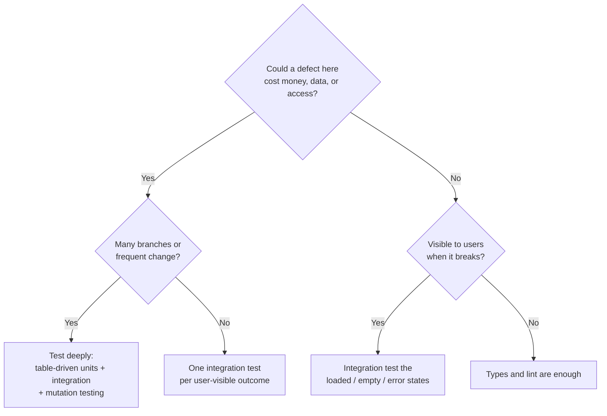

# What to Test & Coverage Goals

> Coverage tells you what the suite never executed; it cannot tell you whether what it executed was checked — so use it to find holes, never as the definition of done.

**Part:** [05 · Reliability & Quality](../) · **Domain:** Testing & Quality · **Priority:** High · **Difficulty:** Intermediate · **Reading time:** ~15 min

## TL;DR

Decide what to test by **risk**: the probability a piece of code is wrong multiplied by what it costs when it is. That puts money arithmetic, permissions, data-loss paths, and complex state machines at the top, and one-line presentational wrappers near the bottom. **Coverage** measures which lines and branches a suite executed; it says nothing about whether those lines were asserted, which is why a line-coverage target is easy to hit with tests that check nothing. Treat coverage as a diagnostic — read the uncovered report, not the percentage — and if you need a gate, gate on the **diff**, not on the whole repository.

> **Recommendation:** Set a coverage floor only on changed code, review the uncovered lines by hand for risk, and use mutation testing on the few modules where correctness genuinely matters.

## At a Glance

| | |
| --- | --- |
| **Use when** | Deciding what to test first, arguing about a coverage threshold, or triaging an existing suite that misses real bugs. |
| **Avoid when** | Using a single global percentage as a quality gate — it optimizes for the wrong behavior immediately. |
| **Alternatives** | [Mutation testing](#alternative-approaches), [diff coverage](#alternative-approaches), [risk registers](#alternative-approaches). |
| **Primary risk** | Goodhart's law: once coverage is the target, tests get written to execute code rather than to check it. |
| **Maturity** | Stable — coverage tooling and its critiques both date back decades. |

## Prerequisites

What to test depends on where the test will live, so the layer model comes first.

- [The Testing Pyramid/Trophy](./the-testing-pyramid-trophy.md) — the layers a test can occupy and what each one can detect.

## Overview

**What to test** is a prioritization problem, not a completeness problem. No suite covers every input, so the practical question is which behaviors, if broken, would hurt — and testing those first. The inputs to that judgment are ordinary: how often the code changes, how many branches it has, how many users touch it, whether a failure is visible or silent, and whether it can be undone.

**Coverage** is a family of metrics produced by instrumenting the code and recording what ran. *Line* and *statement* coverage record executed lines; *branch* coverage records which sides of each conditional were taken; *function* coverage records which functions were entered. Branch coverage is the most informative of the three, because untaken branches are where unhandled cases live.

The essential limitation is that coverage measures **execution**, not **verification**. A test that renders a component and asserts nothing covers every line it touched. This is why the metric is one-directional: low coverage reliably indicates untested code, while high coverage does not indicate tested code. Mutation testing exists to close that gap — it changes the code and checks whether any test notices — and is the only widely available metric that measures assertion strength.

## The Problem

The most common failure is a number in a config file doing the work of a judgment.

```jsonc
// vitest.config.ts — a global gate that shapes behavior immediately
coverage: { thresholds: { lines: 80, functions: 80, branches: 80, statements: 80 } }
```

Once merged, the fastest route to green is to cover cheap code. A developer with a deadline writes render-and-forget tests for presentational components — each adding several percent for a few minutes of work — while the pricing module's untested branch stays untested, because covering it requires understanding it. The number rises and the risk does not move.

```tsx
// Adds coverage. Detects nothing.
it('renders', () => {
  render(<InvoiceRow invoice={invoice} />);
  expect(true).toBe(true);
});
```

The second problem is the opposite: coverage collected and never read. A team publishes a report to CI artifacts, watches the percentage drift, and never opens the file view — where the uncovered lines are listed by name and the actual holes are visible in about ten minutes.

The third is testing everything at equal depth. Every utility gets the same treatment as the money math, so the suite grows, CI slows, and the marginal test is a `formatLabel` case that could not fail in a way anyone would notice. The budget is finite; spending it evenly is spending it badly.

## Why It Matters

Test selection is where a quality budget is actually allocated, and misallocation is expensive in both directions. Under-testing the risky code means defects reach users in the paths where they cost the most — a wrong total, a leaked record, a lost draft. Over-testing the trivial code means every refactor drags a tail of low-value tests, which slows the work that would have prevented the next defect.

Coverage matters because it is the most visible number in the pipeline, and visible numbers steer behavior. A badly chosen target produces a suite optimized for the target: high execution, weak assertions, and a green build that no one trusts but everyone must satisfy. A well-used report does the opposite — it points at the specific branches nobody exercised, which is a to-do list rather than a score.

There is also a communication dimension. "We are at 84%" tells a stakeholder nothing about whether checkout works. "Every payment path has an integration test, and the two uncovered branches are logging fallbacks" is a statement someone can act on, and it takes the same amount of time to produce if the report is being read.

## Mental Model

Rank code on **two axes — likelihood of being wrong and cost of being wrong** — and let the quadrant decide the depth of testing.



Four rules make it operational.

**Test behavior at its boundary, not at every layer it passes through.** One integration test through the form plus unit tests for the calculation beats the same assertion repeated in five component tests.

**Every production defect earns a regression test at the lowest layer that reproduces it.** This is the highest-value test in any suite: it is written against a bug that demonstrably happened.

**Read coverage as a set of names, not a number.** Open the file report, sort by uncovered branches, and ask of each: could this be wrong in a way a user would notice? That question, not the percentage, is the deliverable.

**Gate the diff, not the repository.** Requiring new and changed lines to be covered keeps pressure where the risk is — recently written code — without triggering a campaign to backfill tests for legacy files nobody is touching.

## Best Practices

**Start from the failure, not the file.** List what a defect in this feature would do to a user, then write the test that would catch it. Files with no plausible bad outcome do not need a test.

**Always test: money and units, permissions and visibility rules, destructive actions, state machines, date and timezone handling, and anything parsing external input.** These are the categories where defects are simultaneously likely and expensive.

**Test the error and empty paths, not only the happy one.** Most user-visible defects live in the branches that render when something is missing, denied, or slow.

**Use branch coverage, not line coverage, when you look at numbers at all.** Line coverage hides the untaken side of every conditional, which is exactly what you want to see.

**Apply mutation testing narrowly.** Run it on the handful of modules where correctness is critical; it is slow, and its value is concentrated.

**Exclude generated and configuration files from the report.** Coverage of a generated API client or a `vite.config.ts` is noise that moves the aggregate without meaning anything.

**Delete tests that no longer earn their maintenance.** A test asserting a requirement that has changed, or duplicating an assertion made three layers down, is cost without signal.

## Trade-offs

Coverage is cheap to collect, easy to game, and genuinely useful when read rather than scored.

**Advantages**

- Untested code is identified mechanically, which is faster and more complete than reading the suite.
- Diff coverage creates pressure exactly where new risk is introduced, at review time.
- The report is a shared artifact, so "is this tested?" stops being a matter of opinion.

**Disadvantages**

- The metric cannot see assertions, so it rewards execution and is trivially satisfied by tests that check nothing.
- A global target invites backfilling the easiest files, which raises the number and not the confidence.
- Instrumentation slows the test run, sometimes enough to discourage running the suite locally.

| Metric | What it detects | What it misses | Good use |
| --- | --- | --- | --- |
| Line/statement | Never-executed code | Untaken branches; missing assertions | A rough floor |
| Branch | Untaken conditional paths | Missing assertions | The default report to read |
| Function | Entirely untested functions | Everything inside them | Spotting dead or forgotten modules |
| Diff coverage | Newly added untested code | Pre-existing gaps | The one gate worth enforcing |
| Mutation score | Weak or absent assertions | Cost: slow to run | Critical modules only |

## Alternative Approaches

| Approach | Best when | Weakness | See |
| --- | --- | --- | --- |
| Risk-based selection | Always — the default framing | Requires judgment that must be re-applied as the system changes | (this article) |
| Diff coverage gate | A team wants an enforceable rule | Says nothing about assertion quality | (this article) |
| Mutation testing | Correctness-critical modules | Slow; noisy on UI code | [Stryker](https://stryker-mutator.io/docs/) |
| Global coverage threshold | Rarely — a very low floor to catch untested modules | Invites gaming as soon as it binds | [Fowler — Test Coverage](https://martinfowler.com/bliki/TestCoverage.html) |
| Property-based testing | Logic with a wide input space | Requires expressing invariants, which is a skill | Property-Based Testing (planned) |

## Bad Example

A suite built to satisfy a threshold.

```ts
// ❌ Global 80% gate on everything, including generated and config code.
export default defineConfig({
  test: {
    coverage: {
      provider: 'v8',
      all: true,
      thresholds: { lines: 80, functions: 80, branches: 80, statements: 80 },
    },
  },
});
```

```tsx
// ❌ Coverage-farming tests: they execute code and check nothing meaningful.
it('renders without crashing', () => {
  render(<InvoiceRow invoice={invoice} />);
});

it('formats a label', () => {
  expect(formatLabel('total')).toBe('Total');    // could not fail in a way users notice
});

it('calls the handler', () => {
  const spy = vi.fn();
  render(<Button onClick={spy} />);
  fireEvent.click(screen.getByRole('button'));
  expect(spy).toHaveBeenCalledTimes(1);          // tests React, not this codebase
});

// ❌ Snapshot of a whole page: 400 lines, updated with -u whenever it fails.
it('matches the snapshot', () => {
  expect(render(<InvoicePage invoice={invoice} />).container).toMatchSnapshot();
});
```

```ts
// ❌ Meanwhile, the module that actually matters has one happy-path test.
describe('calculateInvoiceTotal', () => {
  it('adds tax', () => {
    expect(calculateInvoiceTotal({ subtotal: 10000, taxRate: 0.2 })).toBe(12000);
  });
  // Untested: discounts, rounding, zero-rate regions, credit notes,
  // currency mismatch, and the "tax on discounted subtotal" branch.
});
```

**What goes wrong:** The threshold is global and includes generated clients and config files, so the fastest way to reach 80% is to render presentational components — which is what happened. `renders without crashing` asserts nothing; it turns green even if the row renders an error boundary fallback. `formatLabel` is a lookup that cannot plausibly fail in a way a user would report, and it costs a test to maintain forever. The click test verifies that React calls `onClick`, which is the framework's responsibility, not this codebase's. The page snapshot is 400 lines nobody reads, so the review habit becomes `-u`, and a regression that changes the total from `$120.00` to `$100.00` is committed as an accepted snapshot. And `calculateInvoiceTotal` — money arithmetic, the single highest-risk function in the file list — has one test, so the rounding branch that will produce an off-by-one-cent invoice is uncovered while the aggregate number reads healthy.

## Good Example

The same budget spent by risk, with coverage used as a report.

```ts
// ✅ Coverage is collected for information, gated only on the diff.
export default defineConfig({
  test: {
    coverage: {
      provider: 'v8',
      reporter: ['text-summary', 'html', 'lcov'],
      exclude: ['**/*.config.*', '**/generated/**', '**/*.d.ts', '**/test/**'],
      // A low floor catches entirely untested modules; the real gate is on changed
      // lines, enforced by the CI diff-coverage step.
      thresholds: { branches: 50 },
    },
  },
});
```

```ts
// ✅ The risky module is tested exhaustively, in minor units, with named cases.
describe('calculateInvoiceTotal', () => {
  it.each([
    { name: 'no tax, no discount', input: { subtotal: 10_000, taxRate: 0, discount: 0 }, expected: 10_000 },
    { name: 'tax applies after discount', input: { subtotal: 10_000, taxRate: 0.2, discount: 1_000 }, expected: 10_800 },
    { name: 'rounds half up to the cent', input: { subtotal: 3_333, taxRate: 0.2, discount: 0 }, expected: 4_000 },
    { name: 'zero-rate region', input: { subtotal: 5_000, taxRate: 0, discount: 500 }, expected: 4_500 },
    { name: 'discount cannot exceed subtotal', input: { subtotal: 1_000, taxRate: 0.2, discount: 5_000 }, expected: 0 },
  ])('$name', ({ input, expected }) => {
    expect(calculateInvoiceTotal(input)).toBe(expected);
  });

  it('rejects a currency mismatch instead of silently summing', () => {
    expect(() => calculateInvoiceTotal({ subtotal: 1_000, taxRate: 0, discount: 0, currency: 'EUR', accountCurrency: 'USD' }))
      .toThrow(CurrencyMismatchError);
  });
});
```

```tsx
// ✅ One integration test per user-visible outcome, including the paths that fail.
describe('InvoicePage', () => {
  it('shows the total a customer will be charged', async () => {
    renderInvoicePage({ subtotal: 10_000, taxRate: 0.2, discount: 1_000 });
    expect(await screen.findByRole('status', { name: /amount due/i })).toHaveTextContent('$108.00');
  });

  it('explains a failed load instead of showing an empty invoice', async () => {
    server.use(http.get('/api/invoices/:id', () => new HttpResponse(null, { status: 500 })));
    renderInvoicePage();
    expect(await screen.findByRole('alert')).toHaveTextContent(/could not load/i);
    expect(screen.queryByRole('table')).not.toBeInTheDocument();
  });

  it('requires confirmation before voiding an invoice', async () => {
    const user = userEvent.setup();
    renderInvoicePage();
    await user.click(await screen.findByRole('button', { name: /void invoice/i }));
    expect(screen.getByRole('dialog', { name: /void this invoice\?/i })).toBeInTheDocument();
    expect(voidInvoiceSpy).not.toHaveBeenCalled();   // destructive action is still gated
  });
});

// ✅ Every production defect leaves a regression test behind, with its ticket.
it('keeps a draft when the network drops mid-save (INC-2041)', async () => {
  server.use(http.put('/api/invoices/:id', () => HttpResponse.error()));
  const user = userEvent.setup();
  renderInvoicePage();
  await user.type(await screen.findByRole('textbox', { name: /notes/i }), 'Ship by Friday');
  await user.click(screen.getByRole('button', { name: /save/i }));
  expect(await screen.findByRole('alert')).toHaveTextContent(/could not save/i);
  expect(screen.getByRole('textbox', { name: /notes/i })).toHaveValue('Ship by Friday');
});
```

**Why it's better:** The configuration keeps a low global floor — enough to notice an entirely untested module — and moves enforcement to changed lines, so the pressure lands on new risk instead of on legacy files. The money function is tested as a table of named cases in minor units, which covers the rounding and discount-order branches that produce wrong invoices, and the currency mismatch case asserts that the failure is loud rather than a silent sum of incompatible amounts. The integration tests each correspond to something a user would report: a wrong total, an invoice that silently renders empty after a failed load, and a destructive action that fires without confirmation. The void test asserts the *negative* — that the mutation was not called — which is the part that matters for a destructive path. And the regression test names its incident, so a future reader knows the case is not hypothetical and will not delete it during a cleanup.

## Common Mistakes

See the [Testing & Quality anti-patterns](../../../anti-patterns/) for the domain catalog. Concept-specific:

### Mistake: Enforcing a single global coverage percentage

- **Symptom:** A wave of trivial tests appears whenever the number dips; the percentage rises; production defects do not fall.
- **Why it fails:** Coverage measures execution, so the cheapest way to raise it is to execute simple code without asserting anything. Once the number is a gate, that is the rational move under deadline pressure — Goodhart's law in one config line.
- **Fix:** Gate on diff coverage instead, keep a low global floor for detecting untested modules, and review uncovered branches during code review rather than delegating the judgment to a threshold.

### Mistake: Large snapshot tests as a substitute for assertions

- **Symptom:** Multi-hundred-line snapshot files, routinely updated with `-u`, that no reviewer reads.
- **Why it fails:** A snapshot asserts "nothing changed," which is not the same as "the behavior is correct." When it fails for a legitimate change, the cheapest resolution is to accept the new snapshot, which also accepts any regression bundled with it.
- **Fix:** Assert the specific values that matter — a total, a role, a message. Keep snapshots small and targeted, if at all.

### Mistake: Skipping the empty, error, and permission paths

- **Symptom:** Every test sets up a full, valid, authorized fixture; production shows blank panels, infinite spinners, or actions available to users who should not see them.
- **Why it fails:** The happy path is the one exercised manually during development, so it is the least likely to be broken. The branches that render when data is missing, a request fails, or a role lacks permission are rarely opened by hand.
- **Fix:** For each feature, write the four tests: loaded, empty, failed, and unauthorized. They are quick once the render helper exists, and they are where the visible defects are.

## Checklist

- [ ] The riskiest modules — money, permissions, destructive actions, parsing, date handling — are named and tested first.
- [ ] Every feature has tests for the loaded, empty, error, and unauthorized states.
- [ ] Each production defect has a regression test referencing its incident or ticket.
- [ ] Coverage is reported as branch coverage and the file report is actually opened.
- [ ] Enforcement is on diff coverage; any global threshold is a low floor, not a target.
- [ ] Generated, configuration, and type-only files are excluded from the report.
- [ ] No test asserts framework behavior or renders without asserting anything.
- [ ] Snapshots are small and reviewed; none is updated with `-u` without reading the diff.
- [ ] Mutation testing runs on the small set of correctness-critical modules.

## Related Articles

- [The Testing Pyramid/Trophy](./the-testing-pyramid-trophy.md) — which layer a chosen test belongs in.
- Test Doubles (mocks, stubs, fakes) (planned) — how to keep the risky paths testable without mocking away the code under test.
- Pure Logic Testing (planned) — the table-driven style the high-risk examples above use.

## References

- [Martin Fowler — Test Coverage](https://martinfowler.com/bliki/TestCoverage.html) — why coverage is a diagnostic and not a target.
- [Google Testing Blog — Code Coverage Best Practices](https://testing.googleblog.com/2020/08/code-coverage-best-practices.html) — how a large organization uses coverage without gaming it.
- [Stryker Mutator — Mutation Testing](https://stryker-mutator.io/docs/) — measuring assertion strength rather than execution.
- [Vitest — Coverage](https://vitest.dev/guide/coverage.html) — providers, reporters, thresholds, and exclusions.
