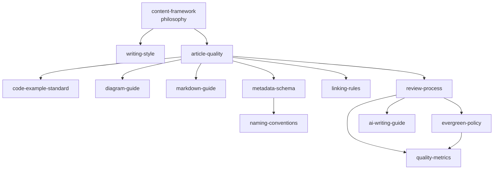

# Standards

The content system for **Frontend Engineering** — the definitive framework every document in this repository follows, whether written by a human or generated with AI. The repository's *architecture* (taxonomy, knowledge map, graph, learning paths, templates) is defined elsewhere; this directory defines its *content quality*: what a great article is, how it reads, how it's structured, how its code and diagrams are built, how it's reviewed, and how it stays true for years.

Everything here exists to make one promise keepable at 1000+ documents: **every article meets the same engineering-quality bar.**

## Start here

- **New contributor?** Read [`contributor-writing-guide.md`](./contributor-writing-guide.md).
- **Writing or reviewing an article?** [`article-quality.md`](./article-quality.md) is the mandatory checklist.
- **Want the philosophy?** [`content-framework.md`](./content-framework.md) is the constitution the rest implements.
- **Using AI to draft?** [`ai-writing-guide.md`](./ai-writing-guide.md) is not optional.

## The standards

| File | Governs | Answers |
| --- | --- | --- |
| [`content-framework.md`](./content-framework.md) | Philosophy | What makes an article great, evergreen, and honest; what must never appear; how opinionated we are; how framework advice is handled. |
| [`writing-style.md`](./writing-style.md) | Tone of voice | Wording, sentence length, headings, comments, terminology, capitalization, emphasis, admonitions — the one voice, modeled on React/TypeScript/MDN docs. |
| [`article-quality.md`](./article-quality.md) | Structure | The mandatory sections, each with acceptance criteria; the A/B/C example quality levels; the pre-merge checklist. |
| [`code-example-standard.md`](./code-example-standard.md) | Code | Baseline versions, typing, formatting, imports, folder structure, naming, error handling, accessibility, performance, no needless abstraction. |
| [`diagram-guide.md`](./diagram-guide.md) | Diagrams | Mermaid as the required default and why; per-type conventions (flow, architecture, sequence, state, decision trees); accessibility. |
| [`markdown-guide.md`](./markdown-guide.md) | Formatting | Headings, lists, tables, blockquotes, admonitions, callouts, code blocks, images, links, rules, footnotes. |
| [`metadata-schema.md`](./metadata-schema.md) | Frontmatter | The full snake_case metadata schema, allowed values, a complete example, and the graph mirror. |
| [`linking-rules.md`](./linking-rules.md) | Cross-references | The five typed relations plus recipe, example, anti-pattern, case-study, and learning-path references. |
| [`naming-conventions.md`](./naming-conventions.md) | Naming | Files, folders, images, examples, recipes, anti-patterns, case studies, decision records, branches, commits. |
| [`review-process.md`](./review-process.md) | Process | The nine-stage pipeline from research to maintenance, with each stage's owner and exit criteria. |
| [`evergreen-policy.md`](./evergreen-policy.md) | Durability | Versioning, deprecation, review frequency, breaking changes, framework updates, archiving, migration guides. |
| [`ai-writing-guide.md`](./ai-writing-guide.md) | AI generation | Allowed assumptions, required references, code generation, fact checking, hallucination prevention, consistency, self-review, output format. |
| [`quality-metrics.md`](./quality-metrics.md) | Measurement | Eight scored health metrics (completeness, accuracy, readability, cross-link, reference, freshness, code, maintenance) with scoring rules. |

## How the standards fit together

`content-framework.md` sets the intent; `article-quality.md` turns it into required structure; the format guides (code, diagram, markdown, metadata, linking, naming) say how each part is built; and the process guides (review, evergreen, AI, contributor, metrics) say how articles are produced, kept current, and measured. When any two documents conflict, `content-framework.md` wins and the conflict is a bug to fix.

## Relationship to the rest of the repository

These standards *implement* the content quality on top of the existing architecture. They reference, and do not replace, the established design docs:

- [`templates/article-template.md`](../templates/article-template.md) — the copyable template `article-quality.md` specifies.
- [`INTERNAL_LINKING.md`](../INTERNAL_LINKING.md) — the canonical five-relation graph model `linking-rules.md` extends.
- [`KNOWLEDGE_MAP.md`](../KNOWLEDGE_MAP.md), [`GRAPH.md`](../GRAPH.md), [`ARTICLE_INVENTORY.md`](../ARTICLE_INVENTORY.md) — taxonomy, graph, and backlog.
- [`CONTRIBUTING.md`](../CONTRIBUTING.md), [`GOVERNANCE.md`](../GOVERNANCE.md) — repository mechanics and decision-making.
- [`scripts/`](../scripts/) — the validation tooling (`validate-frontmatter.py`, `validate-links.py`, `build-links.py`) the standards rely on.

## The rule under all of it

Every document — human or AI, article or recipe, first or ten-thousandth — obeys the same standard: **a durable engineering decision, argued honestly, structured consistently, coded to production quality, wired into the graph, reviewed by a second person, and kept true over time.** That is the entire point of this directory.
