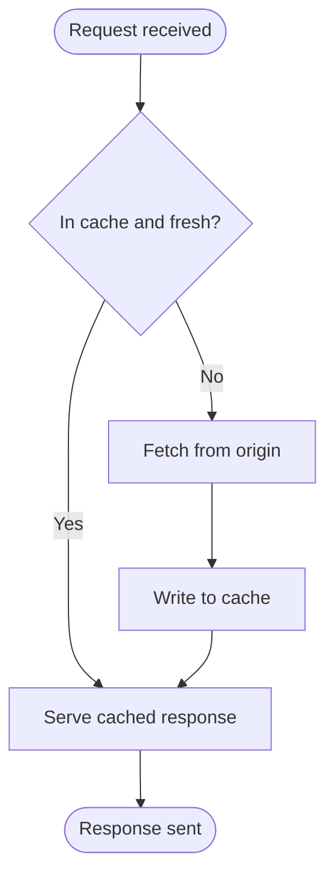
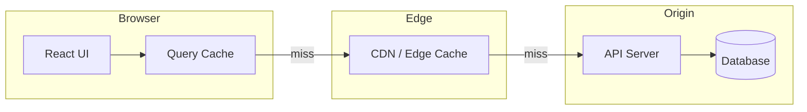
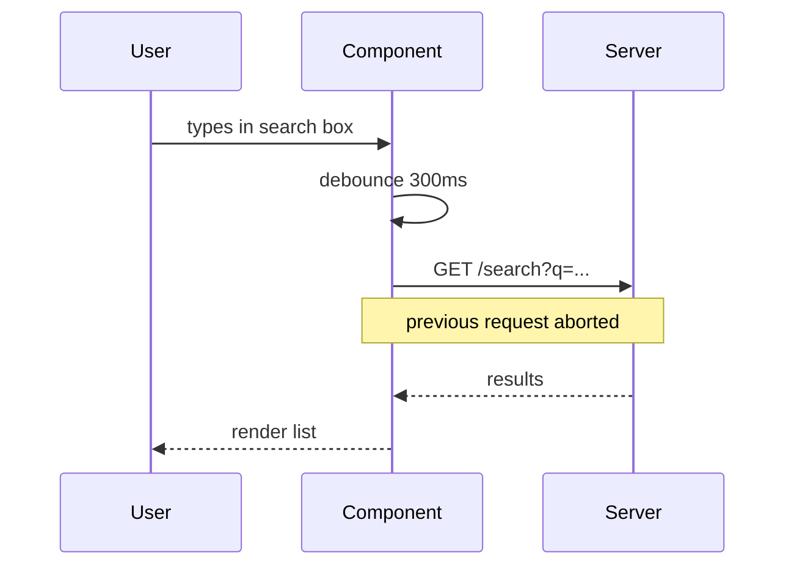
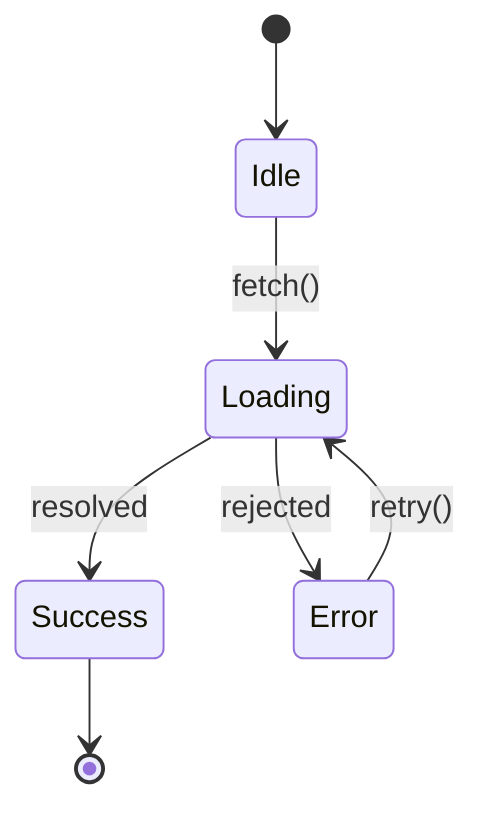
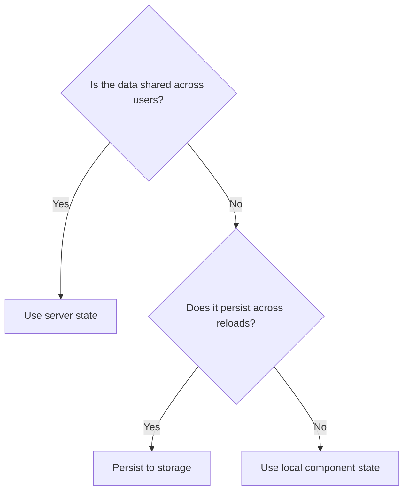

# Diagram Standard

How **Frontend Engineering** draws pictures. A diagram earns its place only when it makes a mechanism clearer than prose can — and when it does, it must be consistent, accessible, versionable, and maintainable for years. This document sets the preferred syntax, the per-type conventions, and the accessibility rules.

## Table of contents

- [Preferred syntax: Mermaid](#preferred-syntax-mermaid)
- [When to draw a diagram at all](#when-to-draw-a-diagram-at-all)
- [Universal rules](#universal-rules)
- [Flowcharts](#flowcharts)
- [Architecture diagrams](#architecture-diagrams)
- [Sequence diagrams](#sequence-diagrams)
- [State diagrams](#state-diagrams)
- [Decision trees](#decision-trees)
- [Accessibility and alt text](#accessibility-and-alt-text)
- [Storage, naming, and review](#storage-naming-and-review)

## Preferred syntax: Mermaid

**Mermaid is the required default for all diagrams**, authored inline in the Markdown as a fenced ` ```mermaid ` block. We choose it deliberately over exported images (PNG/JPG), hand-drawn SVG, or proprietary tools (Figma, Excalidraw, draw.io) for reasons that match this repository's values:

- **Diffable and reviewable.** A Mermaid diagram is text, so a reviewer sees exactly what changed in a pull request. A binary image shows up as "image changed" and cannot be reviewed line by line.
- **Version-controlled at the source.** The diagram *is* its source; there is no separate `.fig` or `.drawio` file to drift out of sync with the committed picture.
- **Maintainable by anyone.** Fixing a typo or adding a node is a text edit, not a round-trip through a design tool and a re-export. This is what lets the diagram stay evergreen.
- **Consistent by construction.** One renderer means one visual language across 1000+ articles, without a style guide for colors and arrowheads.
- **Accessible and searchable.** The labels are real text — indexable, translatable, and available to assistive technology in ways a flattened image is not.
- **Renders natively** on GitHub, in most Markdown viewers, and in docs pipelines, with no build step.

**Fallbacks, in order:** (1) Mermaid inline. (2) If a diagram genuinely exceeds Mermaid's expressiveness (rare — complex system topologies with precise layout), author a hand-written, committed **SVG** with real `<text>` elements and a `<title>`/`<desc>`, stored in `assets/`. (3) Raster images (PNG) are a last resort, allowed only for screenshots of real UI, and always carry descriptive alt text. Never paste a screenshot of a diagram you could have written in Mermaid.

## When to draw a diagram at all

A diagram is a cost (to write, to maintain, to keep accurate), so it must pay for itself. Draw one only when it clears this bar:

- The concept is **structural or temporal** — a flow, a sequence of interactions, a state machine, a component topology, a decision with branches. These resist prose.
- The picture lets the reader **reason about a new case**, not just admire the happy path.
- It belongs in **How It Works** (mechanism) or **Alternative Approaches / At a Glance** (a decision tree). Diagrams rarely belong elsewhere.

Do **not** diagram: a linear list of steps (use a list), a single relationship (use a sentence), or decoration. One good diagram per article is typical; more than two usually means the article is doing too much.

## Universal rules

Apply to every diagram type.

- **One idea per diagram.** If it needs a legend the size of the diagram, split it.
- **Label every node and edge** with real words, not `A`/`B`/`C`. Node text is the documentation.
- **Direction is meaningful and consistent:** top-to-bottom for processes and flows, left-to-right for sequences and pipelines. Pick per diagram and hold it.
- **Under ~12 nodes.** Beyond that, abstract or split — a wall of boxes teaches nothing.
- **No color as the only signal.** Color may reinforce meaning but must never carry it alone (accessibility). Shape, label, and grouping carry meaning; color is redundant.
- **Match the prose.** Terms in the diagram are the same terms used in the surrounding text — no synonyms.
- **Keep it renderable.** Valid Mermaid that renders on GitHub. Test it before committing (paste into the Mermaid live editor or a preview).

## Flowcharts

For processes, algorithms, and data flow. Use `flowchart TD` (top-down) for processes, `flowchart LR` (left-right) for pipelines.



- **Shapes carry meaning, consistently:** `([rounded])` for start/end, `[rectangle]` for a process/action, `{diamond}` for a decision, `[(cylinder)]` for storage. Do not vary shapes arbitrarily.
- **Every decision diamond has labeled edges** (`Yes`/`No`, or the actual conditions).
- **One entry, clear exits.** Avoid crossing edges; reorder nodes instead.

## Architecture diagrams

For component topologies, system boundaries, and module relationships. Use `flowchart` with `subgraph` for boundaries.



- **`subgraph` for every trust or deployment boundary** (browser, edge, server, third party) — boundaries are the whole point of an architecture diagram.
- **Arrows show direction of data or control flow**, labeled where the relationship is non-obvious (`miss`, `writes`, `subscribes`).
- **Name real roles, not products,** unless the product is the subject (`API Server`, not a vendor logo).
- Keep the layering left-to-right or outer-to-inner so the request path reads in one direction.

## Sequence diagrams

For interactions ordered in time — request/response, handshakes, lifecycles. Use `sequenceDiagram`.



- **Declare participants explicitly** with readable aliases; order them left-to-right in the order they first act.
- **Solid arrow `->>` for calls, dashed `-->>` for responses.** Be consistent.
- **`Note over` for cross-cutting facts** (cancellation, retries, timeouts) that a bare arrow can't show.
- **Show the failure path** when the article's point involves it (an `alt`/`opt` block for error or race handling).

## State diagrams

For finite state machines — component status, form lifecycle, connection state. Use `stateDiagram-v2`.



- **Start `[*]` and terminal `[*]` marked.** Every state reachable; no orphans.
- **Transitions labeled with the event/action** that causes them, not just an arrow.
- **Model the states you claim exist** — if the article argues for a discriminated union of states, the diagram shows exactly those states and no impossible combinations.

## Decision trees

For "which approach should I choose?" — the visual companion to Trade-offs and Alternative Approaches. Use `flowchart TD` with decision diamonds.



- **Questions in diamonds, recommendations in terminal boxes**, each linking (in the surrounding prose) to the article that owns that approach.
- **Every branch is exhaustive and mutually exclusive** — no dead ends, no overlaps.
- **Keep depth ≤ 4.** A deeper tree is a sign the decision needs to be split.

## Accessibility and alt text

A diagram that only some readers can perceive is a broken diagram.

- **Every diagram has a text equivalent.** For a Mermaid block, the surrounding prose must convey the same information in sentences — the diagram illustrates, it does not carry unique content. A sighted reader and a screen-reader user must both get the point.
- **For committed SVGs:** include a `<title>` (short name) and `<desc>` (full description), and reference them via `aria-labelledby`. Use real `<text>`, never text baked into a path.
- **For raster images:** descriptive `alt` text that states what the diagram *shows*, not "diagram of X" — describe the relationship, e.g. `alt="Request flows from UI to query cache; on a miss it falls through to the CDN, then the origin API, which reads the database."`
- **No color-only meaning** (repeat of the universal rule, because it matters most here).
- **Sufficient contrast** in any custom-styled SVG (WCAG AA for text).

## Storage, naming, and review

- **Mermaid lives inline** in the article — no separate file.
- **SVG/PNG assets** go in `assets/`, named for the article they support: `assets/<slug>-<what>.svg` (e.g. `assets/optimistic-updates-sequence.svg`). One diagram, one file. See [`naming-conventions.md`](./naming-conventions.md).
- **Diagrams are reviewed like code:** correct, minimal, labeled, accessible, and matching the prose. A wrong diagram is worse than none — it confidently misleads.
- **A diagram carries a `last_reviewed` obligation with its article:** when the mechanism changes, the diagram is updated in the same pull request, never left stale.

---

**Next:** [`article-quality.md`](./article-quality.md#section-by-section-acceptance-criteria) — where diagrams belong · [`markdown-guide.md`](./markdown-guide.md) — how the block is fenced · [`writing-style.md`](./writing-style.md) — labels use the same voice.
