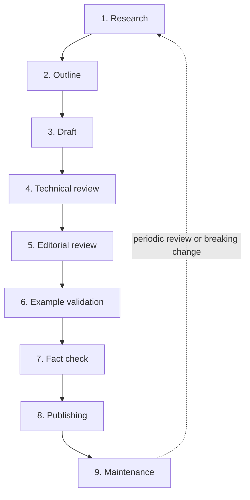

# Review Process

The pipeline every article travels from idea to published-and-maintained. A knowledge base that scales to 1000+ documents cannot rely on a single reviewer's taste; it needs **stages, each with one clear responsibility and one clear exit criterion**, so quality is a property of the process, not of who happened to review. This document defines those stages, who owns each, and what must be true to advance.

The stances to emulate: the layered review the React and TypeScript teams apply to docs — technical correctness and editorial craft checked *separately*, nothing shipping until both pass.

## Table of contents

- [The pipeline](#the-pipeline)
- [Stage 1 — Research](#stage-1--research)
- [Stage 2 — Outline](#stage-2--outline)
- [Stage 3 — Draft](#stage-3--draft)
- [Stage 4 — Technical review](#stage-4--technical-review)
- [Stage 5 — Editorial review](#stage-5--editorial-review)
- [Stage 6 — Example validation](#stage-6--example-validation)
- [Stage 7 — Fact check](#stage-7--fact-check)
- [Stage 8 — Publishing](#stage-8--publishing)
- [Stage 9 — Maintenance](#stage-9--maintenance)
- [Roles](#roles)
- [How the stages map to status](#how-the-stages-map-to-status)

## The pipeline

Each arrow is a **gate**: work does not advance until the stage's exit criteria are met. A failure at any gate sends the article back to the earliest stage that can fix the problem — a wrong claim found in fact check goes back to research, not forward. Small articles may compress stages into fewer pull-request rounds, but no gate is *skipped*; its criteria are still checked.

## Stage 1 — Research

**Responsibility:** establish the truth before writing a word. Gather the problem, the real options, the trade-offs, the failure modes, and the primary sources.

- **Owner:** the author.
- **Inputs:** the article's row in the [Article Inventory](../ARTICLE_INVENTORY.md), its place in the [Knowledge Map](../KNOWLEDGE_MAP.md), an approved proposal issue.
- **Activities:** read the primary sources (specs, official docs); reproduce the behavior; identify competing approaches and their real costs; collect versions where behavior depends on them.
- **Exit criteria:** every claim the article will make is backed by a primary source or a reproducible test; the trade-offs are understood well enough to be argued both ways; the alternatives are real, not strawmen.
- **Anti-pattern:** writing first and sourcing later. Research precedes drafting; an unsourced draft is a hypothesis, not an article.

## Stage 2 — Outline

**Responsibility:** fix the structure and the argument before prose.

- **Owner:** the author; a maintainer sanity-checks scope.
- **Activities:** map the content onto the [mandatory sections](./article-quality.md); write the one-line thesis, the conditional recommendation, and the five typed relations (prerequisites, next, related, alternatives, common mistakes); decide what the Bad and Good examples will demonstrate.
- **Exit criteria:** one decision, one topic; every required section has a one-line intent; the recommendation is stated and derivable from planned trade-offs; prerequisites form a valid acyclic edge set in the graph.
- **Why a gate:** structural problems are cheap to fix in an outline and expensive to fix in a finished draft.

## Stage 3 — Draft

**Responsibility:** write the article to standard.

- **Owner:** the author.
- **Activities:** fill every section per [`article-quality.md`](./article-quality.md), in the voice of [`writing-style.md`](./writing-style.md), with code to [`code-example-standard.md`](./code-example-standard.md) and formatting to [`markdown-guide.md`](./markdown-guide.md); complete frontmatter and mirror it into `graph.json`.
- **Exit criteria:** the [pre-merge checklist](./article-quality.md#the-pre-merge-checklist) self-passes; local tooling (`validate-frontmatter.py`, `build-links.py`, `validate-links.py`, markdownlint, cspell) is green; `status: Draft`.

## Stage 4 — Technical review

**Responsibility:** is it *correct and complete as engineering*? This is about substance, not prose.

- **Owner:** a domain-expert reviewer (a maintainer or designated expert for the Part), never the author.
- **Checks:** claims are accurate; the mental model is right; trade-offs are symmetric and honest; alternatives are fairly represented; performance/accessibility/security are addressed; version-dependent behavior is correctly pinned; the recommendation follows from the analysis.
- **Exit criteria:** the reviewer would stake their name on the technical content; every correctness concern is resolved or explicitly accepted with a reason.
- **Separation:** technical and editorial review are distinct passes so neither hides the other — a beautifully written wrong article and a correct unreadable one both fail, at different gates.

## Stage 5 — Editorial review

**Responsibility:** is it *clear, consistent, and in voice*? Craft, not correctness.

- **Owner:** an editorial reviewer (may be a different maintainer).
- **Checks:** voice matches [`writing-style.md`](./writing-style.md) (no marketing, plain wording, sentence-case headings, correct terminology); structure and admonitions per the Markdown standard; prose over slides; front-loaded reasoning; consistent capitalization and emphasis.
- **Exit criteria:** reads as one voice with the rest of the repository; no banned words; no unexplained jargon; every section earns its place.

## Stage 6 — Example validation

**Responsibility:** the code actually works and meets the bar.

- **Owner:** a reviewer who runs or type-checks the code; automated where possible.
- **Checks:** Good Example is Level A (compiles under strict TypeScript, lints clean, handles errors/cancellation/cleanup, is accessible); Bad Example is realistic and its failure is real; both are language-tagged; examples match the baseline versions.
- **Exit criteria:** examples type-check and, where runnable, run; a reviewer confirms the Bad Example genuinely exhibits the named failure and the Good Example genuinely fixes it.
- **Tooling:** extracted snippets are ideally compiled in CI; until that exists, a reviewer type-checks them locally and records that they did.

## Stage 7 — Fact check

**Responsibility:** independent verification of every checkable claim and citation.

- **Owner:** a reviewer other than the author (may combine with technical review for small articles, but the *check itself* is a distinct step).
- **Checks:** every external claim traces to a cited primary source that actually says it; version numbers are correct; benchmarks/numbers are reproducible or removed; no fabricated or drifted citations; links resolve.
- **Exit criteria:** zero unverified factual claims; every reference verified to support the sentence it backs. This gate is the specific defense against [AI hallucination](./ai-writing-guide.md) and stale sources.

## Stage 8 — Publishing

**Responsibility:** ship it cleanly and make it discoverable.

- **Owner:** a maintainer with merge rights.
- **Activities:** set `status: Published` and `last_reviewed` to today; confirm `graph.json`, `GRAPH.md` counts, and the inventory are updated; squash-merge with a Conventional Commit; the article enters the relevant learning paths if applicable.
- **Exit criteria:** CI green on `main`; the article is reachable from its domain README and its graph relations resolve both ways.

## Stage 9 — Maintenance

**Responsibility:** keep a published article true over years. Publishing is the middle of the lifecycle, not the end.

- **Owner:** maintainers on a schedule; anyone via a content-correction issue.
- **Activities:** periodic review per the [evergreen policy](./evergreen-policy.md) (re-verify claims, refresh version-pinned parts, update `last_reviewed`); respond to corrections; deprecate or supersede when a decision changes; keep examples on the current baseline.
- **Exit criteria (per review cycle):** claims re-verified, `last_reviewed` bumped, or the article routed to deprecation/rewrite (back to Stage 1) if the decision itself has changed.
- **Trigger back to research:** a breaking framework change, a superseding approach, or a failed freshness check re-enters the pipeline at Stage 1.

## Roles

- **Author** — owns research, outline, draft, and responding to review. May be human or AI-assisted; AI output enters the *same* pipeline with no shortcuts (see [`ai-writing-guide.md`](./ai-writing-guide.md)).
- **Technical reviewer** — domain expert; owns Stage 4 and (often) Stage 7.
- **Editorial reviewer** — owns Stage 5; guards the voice.
- **Maintainer** — owns Stage 8 and the Stage 9 schedule; arbitrates when reviewers disagree, per [`GOVERNANCE.md`](../GOVERNANCE.md).
- **Separation rule:** the author never signs off their own technical review, fact check, or example validation. At least two people (or one person plus automated gates the author did not write) touch every published article.

## How the stages map to status

| `status` | Pipeline position |
| --- | --- |
| `Planned` | Inventory row exists; Stage 1 not started. |
| `Draft` | Stages 1–3 done; in or awaiting review. |
| `In Review` | In Stages 4–7. |
| `Published` | Passed Stage 8; in Stage 9 maintenance. |
| `Deprecated` / `Archived` | Left active service (see [evergreen policy](./evergreen-policy.md)). |

---

**Next:** [`article-quality.md`](./article-quality.md) — the bar the gates check against · [`evergreen-policy.md`](./evergreen-policy.md) — Stage 9 in depth · [`quality-metrics.md`](./quality-metrics.md) — how the pipeline's output is measured.
